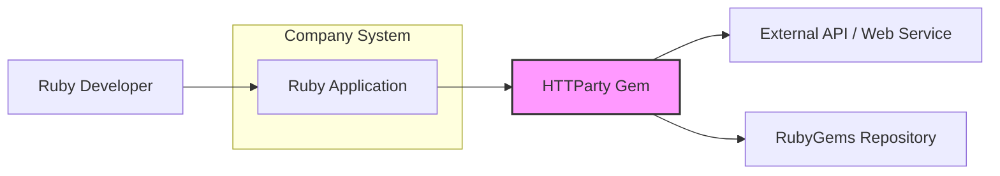
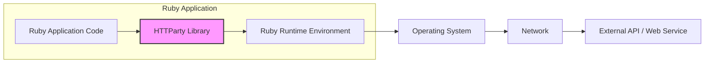
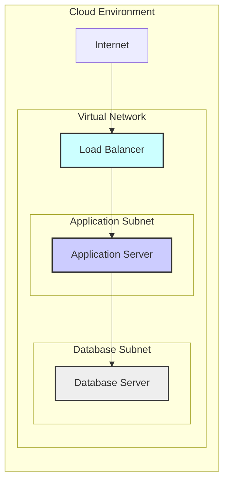
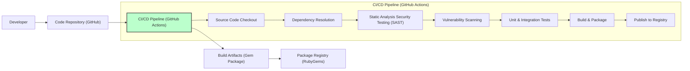

# BUSINESS POSTURE

This project, HTTParty, is a Ruby gem that simplifies making HTTP requests. It acts as an HTTP client library for Ruby applications.

Business Priorities and Goals:
- Simplify integration with external APIs and web services for Ruby developers.
- Increase developer productivity by providing a user-friendly and efficient HTTP client.
- Enable Ruby applications to consume and interact with data from various sources over the internet.
- Reduce development time and complexity associated with handling HTTP requests in Ruby.

Business Risks:
- Security vulnerabilities in HTTParty could be exploited by attackers to compromise applications using the library.
- Unreliable or poorly performing HTTP requests due to issues in HTTParty could impact application functionality and user experience.
- Compatibility issues with different Ruby versions or other libraries could lead to integration problems and application instability.
- Misuse of HTTParty by developers, such as mishandling sensitive data in requests or responses, could lead to data breaches or compliance violations.

# SECURITY POSTURE

Existing Security Controls:
- security control: HTTPS support - HTTParty supports making requests over HTTPS, ensuring encryption of data in transit. Implemented within the library's core functionality.
- security control: Dependency management - HTTParty relies on other Ruby gems. Security is partially dependent on the security of these dependencies. Described in `Gemfile.lock` and dependency update processes.
- security control: Input sanitization - HTTParty likely performs some level of input sanitization to prevent common injection attacks, although specific details would need to be reviewed in the code. Implemented within the library's request building and response parsing logic.
- accepted risk: Vulnerabilities in dependencies - HTTParty depends on other gems, which may contain vulnerabilities. Risk is accepted and mitigated by dependency updates.
- accepted risk: Misuse by developers - Developers using HTTParty might introduce security vulnerabilities in their applications by misusing the library or mishandling sensitive data. Risk is accepted as it is outside the scope of the library itself.

Recommended Security Controls:
- security control: Dependency scanning - Implement automated dependency scanning to identify and address vulnerabilities in HTTParty's dependencies.
- security control: Static Application Security Testing (SAST) - Integrate SAST tools into the development process to automatically analyze HTTParty's code for potential security vulnerabilities.
- security control: Software Composition Analysis (SCA) - Use SCA tools to gain visibility into all components of HTTParty, including dependencies, and manage associated risks.
- security control: Secure coding guidelines for users - Provide clear documentation and examples for developers on how to use HTTParty securely, including best practices for handling sensitive data and authentication.

Security Requirements:
- Authentication:
    - Requirement: HTTParty should support various authentication methods commonly used in HTTP requests, such as Basic Auth, Bearer tokens, API keys in headers or query parameters.
    - Requirement: Documentation should clearly explain how to securely implement different authentication methods with HTTParty, emphasizing secure storage and handling of credentials.
- Authorization:
    - Requirement: HTTParty itself does not handle authorization, but it should facilitate the implementation of authorization in applications using it by correctly transmitting authorization tokens or credentials provided by the application.
    - Requirement: Examples and documentation should guide developers on how to integrate HTTParty with authorization mechanisms in their applications.
- Input Validation:
    - Requirement: HTTParty should perform necessary input validation to prevent common injection attacks, such as header injection or request smuggling.
    - Requirement: HTTParty should handle various content types and encodings securely, preventing vulnerabilities related to data parsing and processing.
- Cryptography:
    - Requirement: HTTParty must enforce HTTPS by default or strongly encourage its use for all sensitive communications.
    - Requirement: HTTParty should correctly handle TLS/SSL certificates and configurations to ensure secure connections.
    - Requirement: If HTTParty provides any functionality for data encryption or decryption beyond TLS/SSL, it must use well-established and secure cryptographic libraries and algorithms.

# DESIGN

## C4 CONTEXT

Context Diagram Elements:

- Name: Ruby Application
    - Type: Software System
    - Description: A Ruby application developed by the company that needs to interact with external APIs or web services.
    - Responsibilities: Utilizing HTTParty to make HTTP requests, processing responses, and integrating external data into the application's functionality.
    - Security controls: Application-level security controls, including authentication and authorization logic, input validation for data processed from external APIs, and secure handling of sensitive data within the application.

- Name: HTTParty Gem
    - Type: Software System / Library
    - Description: The HTTParty Ruby gem, an open-source library used by the Ruby Application to simplify HTTP requests.
    - Responsibilities: Providing a user-friendly interface for making HTTP requests, handling request and response processing, and managing HTTP connections.
    - Security controls: HTTPS support, input sanitization within the library, dependency management, and adherence to secure coding practices in the library's development.

- Name: RubyGems Repository
    - Type: External System / Package Registry
    - Description: A public repository where Ruby gems, including HTTParty, are hosted and distributed.
    - Responsibilities: Hosting and distributing the HTTParty gem, ensuring availability and integrity of the package.
    - Security controls: Package signing and verification mechanisms within RubyGems to ensure the integrity of downloaded gems.

- Name: External API / Web Service
    - Type: External System
    - Description: External APIs or web services that the Ruby Application needs to interact with to retrieve data or perform actions.
    - Responsibilities: Providing data or services to the Ruby Application via HTTP requests, enforcing their own security controls such as authentication and authorization.
    - Security controls: API authentication and authorization mechanisms (e.g., API keys, OAuth), input validation, rate limiting, and protection against common web vulnerabilities.

- Name: Ruby Developer
    - Type: Person / User
    - Description: Developers within the company who use HTTParty in their Ruby applications.
    - Responsibilities: Developing and maintaining Ruby applications, using HTTParty to integrate with external APIs, and ensuring secure usage of the library.
    - Security controls: Secure coding practices, awareness of common web security vulnerabilities, and adherence to company security policies.

## C4 CONTAINER

Container Diagram Elements:

- Name: Ruby Application Code
    - Type: Container / Application Component
    - Description: The custom Ruby code developed for the specific application, which utilizes the HTTParty library.
    - Responsibilities: Implementing application logic, handling user requests, processing data, and orchestrating interactions with external APIs using HTTParty.
    - Security controls: Application-level authentication and authorization, input validation, secure data handling, and logging/monitoring.

- Name: HTTParty Library
    - Type: Container / Library
    - Description: The HTTParty Ruby gem, integrated into the Ruby Application Code.
    - Responsibilities: Providing HTTP client functionality, simplifying HTTP request creation and response handling, and managing HTTP connections.
    - Security controls: HTTPS support, input sanitization within the library, dependency management, and secure coding practices in the library's development.

- Name: Ruby Runtime Environment
    - Type: Container / Runtime Environment
    - Description: The Ruby interpreter and associated libraries required to run the Ruby Application Code and HTTParty.
    - Responsibilities: Executing Ruby code, managing memory and resources, and providing core functionalities for the application.
    - Security controls: Security patches and updates for the Ruby runtime environment, configuration of runtime settings for security, and resource management to prevent denial-of-service.

- Name: Operating System
    - Type: Container / Operating System
    - Description: The operating system on which the Ruby Runtime Environment and application are running (e.g., Linux, Windows).
    - Responsibilities: Providing system-level resources, managing processes, handling network communication, and providing security features.
    - Security controls: Operating system hardening, security patches and updates, access control mechanisms, firewalls, and intrusion detection/prevention systems.

- Name: Network
    - Type: Infrastructure / Network
    - Description: The network infrastructure connecting the Ruby Application to external APIs and web services.
    - Responsibilities: Providing network connectivity, routing traffic, and ensuring network security.
    - Security controls: Network firewalls, intrusion detection/prevention systems, network segmentation, and network monitoring.

- Name: External API / Web Service
    - Type: External System / API
    - Description: External APIs or web services that the Ruby Application interacts with over the network.
    - Responsibilities: Providing data or services to the Ruby Application via HTTP requests, enforcing their own security controls.
    - Security controls: API authentication and authorization, input validation, rate limiting, and protection against common web vulnerabilities.

## DEPLOYMENT

Deployment Solution: Cloud-based Application Deployment (e.g., AWS, Azure, GCP)

Deployment Diagram Elements:

- Name: Application Server
    - Type: Infrastructure / Virtual Machine or Container Instance
    - Description: A virtual machine or container instance running the Ruby Application Code and HTTParty library.
    - Responsibilities: Hosting and executing the Ruby Application, handling HTTP requests, and interacting with the database and external APIs.
    - Security controls: Operating system hardening, application firewalls, intrusion detection/prevention agents, regular security patching, and access control.

- Name: Database Server
    - Type: Infrastructure / Database Instance
    - Description: A database server storing application data.
    - Responsibilities: Storing and managing application data, providing data persistence, and ensuring data integrity and availability.
    - Security controls: Database access control, encryption at rest and in transit, database firewalls, regular backups, and database security hardening.

- Name: Load Balancer
    - Type: Infrastructure / Load Balancer
    - Description: A load balancer distributing incoming traffic across multiple Application Servers for scalability and availability.
    - Responsibilities: Distributing traffic, handling SSL termination, and providing high availability and scalability for the application.
    - Security controls: SSL/TLS configuration, DDoS protection, access control, and security monitoring.

- Name: Virtual Network
    - Type: Infrastructure / Virtual Network
    - Description: A logically isolated network within the cloud environment, providing network segmentation and security.
    - Responsibilities: Providing network isolation, routing traffic within the cloud environment, and enforcing network security policies.
    - Security controls: Network Access Control Lists (NACLs), Security Groups, network segmentation, and network monitoring.

- Name: Application Subnet
    - Type: Infrastructure / Subnet
    - Description: A subnet within the Virtual Network dedicated to hosting Application Servers.
    - Responsibilities: Providing network connectivity for Application Servers and isolating them from other components.
    - Security controls: Network Access Control Lists (NACLs), Security Groups, and network monitoring.

- Name: Database Subnet
    - Type: Infrastructure / Subnet
    - Description: A subnet within the Virtual Network dedicated to hosting Database Servers.
    - Responsibilities: Providing network connectivity for Database Servers and isolating them from Application Servers and the public internet.
    - Security controls: Network Access Control Lists (NACLs), Security Groups, and network monitoring.

- Name: Internet
    - Type: External Network
    - Description: The public internet from which users access the application.
    - Responsibilities: Providing connectivity for users to access the application.
    - Security controls: DDoS protection, web application firewall (WAF) in front of the Load Balancer.

## BUILD

Build Process Description:

1.  Developer commits code changes to the Code Repository (GitHub).
2.  CI/CD Pipeline (GitHub Actions) is triggered upon code commit.
3.  Source Code Checkout: The pipeline checks out the latest code from the repository.
4.  Dependency Resolution: The pipeline resolves and downloads project dependencies.
5.  Static Analysis Security Testing (SAST): SAST tools analyze the code for potential security vulnerabilities.
6.  Vulnerability Scanning: Scans dependencies for known vulnerabilities.
7.  Unit & Integration Tests: Automated tests are executed to ensure code quality and functionality.
8.  Build & Package: The project is built and packaged into a Gem package.
9.  Publish to Registry: The Gem package is published to the Package Registry (RubyGems).

Build Security Controls:

- security control: Secure Code Repository (GitHub) - Access control, branch protection, and audit logging for the code repository. Implemented by GitHub.
- security control: CI/CD Pipeline Security (GitHub Actions) - Secure pipeline configuration, secrets management, and access control for the CI/CD environment. Implemented by GitHub Actions configuration.
- security control: Static Analysis Security Testing (SAST) - Automated SAST tools integrated into the pipeline to detect code-level vulnerabilities. Implemented within CI/CD pipeline configuration.
- security control: Vulnerability Scanning - Automated scanning of dependencies for known vulnerabilities. Implemented within CI/CD pipeline configuration.
- security control: Automated Testing - Unit and integration tests to ensure code quality and reduce the likelihood of introducing vulnerabilities. Implemented within CI/CD pipeline configuration.
- security control: Secure Build Environment - Isolated and hardened build environment to prevent build-time attacks. Implemented by CI/CD environment configuration.
- security control: Code Signing - Signing the Gem package to ensure integrity and authenticity. Can be implemented as part of the CI/CD pipeline.
- security control: Access Control to Package Registry (RubyGems) - Secure credentials and access control for publishing to the package registry. Implemented by RubyGems and CI/CD pipeline configuration.

# RISK ASSESSMENT

Critical Business Processes:
- API Integrations: The primary business process enabled by HTTParty is the integration of Ruby applications with external APIs and web services. Disruption or compromise of these integrations can impact application functionality and business operations.

Data Sensitivity:
- Data sensitivity depends entirely on the APIs and web services that HTTParty is used to interact with.
    - Could range from public, non-sensitive data (e.g., weather data) to highly sensitive data (e.g., user PII, financial transactions, healthcare records).
    - The sensitivity level needs to be assessed based on the specific use cases of HTTParty within the Ruby applications.
    - If used for sensitive data, data in transit (requests and responses) and data handling within the application become critical security concerns.

# QUESTIONS & ASSUMPTIONS

Questions:
- What are the specific use cases for HTTParty within the organization's Ruby applications?
- What types of data will be handled by HTTParty in these applications? What is the sensitivity level of this data?
- What are the organization's existing security policies and standards for software development and deployment?
- Are there any specific compliance requirements that apply to the applications using HTTParty (e.g., GDPR, HIPAA, PCI DSS)?
- What is the organization's risk appetite for open-source software and dependency vulnerabilities?
- What existing security tools and processes are already in place for software development and deployment?

Assumptions:
- Assumption: HTTParty will be used in Ruby applications that interact with external APIs for various business purposes.
- Assumption: Some use cases might involve handling sensitive data, requiring attention to data security and privacy.
- Assumption: The organization values security and aims to minimize risks associated with software vulnerabilities and data breaches.
- Assumption: The organization has a standard cloud-based deployment environment for its applications.
- Assumption: The organization utilizes CI/CD pipelines for software build and deployment automation.
- Assumption: The organization is willing to invest in security controls to mitigate identified risks.