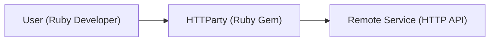
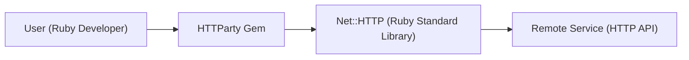
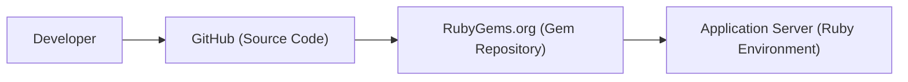
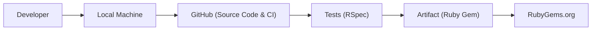

# BUSINESS POSTURE

Business Priorities and Goals:

*   Provide a simple and convenient way for Ruby developers to make HTTP requests.
*   Abstract away the complexities of dealing with different HTTP libraries and response formats.
*   Offer a user-friendly API that is easy to learn and use.
*   Maintain a high level of code quality and reliability.
*   Ensure the library is well-documented and supported.
*   Foster a community around the library to encourage contributions and feedback.

Most Important Business Risks:

*   Security vulnerabilities in the library could be exploited to compromise applications that use it.
*   Lack of maintenance or updates could lead to compatibility issues or bugs.
*   Poor performance could impact the performance of applications that rely on the library.
*   Lack of features or flexibility could limit the library's usefulness.
*   Competition from other HTTP client libraries could reduce adoption.

# SECURITY POSTURE

Existing Security Controls:

*   security control: The library uses standard Ruby libraries for handling HTTP requests (Net::HTTP), which are generally considered secure. (Described in the library's source code and documentation).
*   security control: The library provides options for configuring SSL/TLS settings, such as verifying certificates. (Described in the library's documentation).
*   security control: The library has a test suite that helps to ensure code quality and identify potential issues. (Described in the repository's test directory).

Accepted Risks:

*   accepted risk: The library relies on external dependencies (e.g., Net::HTTP), which could have their own security vulnerabilities.
*   accepted risk: The library may not be fully compliant with all relevant security standards or best practices.

Recommended Security Controls:

*   security control: Implement regular security audits and penetration testing to identify and address potential vulnerabilities.
*   security control: Integrate static analysis tools into the development process to detect potential security flaws early on.
*   security control: Provide clear guidance on secure usage of the library, including best practices for handling sensitive data and configuring security settings.
*   security control: Implement a vulnerability disclosure program to encourage responsible reporting of security issues.
*   security control: Consider adding support for more advanced security features, such as request signing or mutual TLS authentication.

Security Requirements:

*   Authentication:
    *   The library should support common authentication mechanisms, such as Basic Auth, Bearer Tokens, and API Keys.
    *   Sensitive credentials should never be hardcoded in the application code.
    *   The library should provide mechanisms for securely storing and retrieving credentials.
*   Authorization:
    *   The library itself does not handle authorization, as it is an HTTP client. Authorization is the responsibility of the server the library is communicating with.
*   Input Validation:
    *   The library should properly encode and escape user-provided input to prevent injection attacks.
    *   The library should validate response data to ensure it conforms to expected formats.
*   Cryptography:
    *   The library should use secure cryptographic protocols (e.g., TLS 1.2 or higher) for all communication.
    *   The library should verify SSL/TLS certificates by default.
    *   The library should provide options for configuring cryptographic settings, such as cipher suites and certificate authorities.

# DESIGN

## C4 CONTEXT

Element Descriptions:

*   Element:
    *   Name: User (Ruby Developer)
    *   Type: Person
    *   Description: A developer who uses the HTTParty library in their Ruby application.
    *   Responsibilities:
        *   Writes code that utilizes HTTParty to make HTTP requests.
        *   Configures HTTParty options, such as headers, timeouts, and SSL settings.
        *   Handles responses from the remote service.
    *   Security controls:
        *   Follows secure coding practices.
        *   Uses strong passwords and authentication mechanisms.
        *   Keeps their development environment secure.

*   Element:
    *   Name: HTTParty (Ruby Gem)
    *   Type: Software System
    *   Description: A Ruby gem that provides a simple and convenient way to make HTTP requests.
    *   Responsibilities:
        *   Provides an API for making HTTP requests.
        *   Handles request encoding and response parsing.
        *   Manages connections and timeouts.
        *   Provides options for configuring SSL/TLS settings.
    *   Security controls:
        *   Uses standard Ruby libraries for handling HTTP requests (Net::HTTP).
        *   Provides options for configuring SSL/TLS settings.
        *   Has a test suite.

*   Element:
    *   Name: Remote Service (HTTP API)
    *   Type: Software System
    *   Description: A remote service that provides an HTTP API.
    *   Responsibilities:
        *   Receives and processes HTTP requests.
        *   Returns responses in a defined format (e.g., JSON, XML).
        *   Handles authentication and authorization.
    *   Security controls:
        *   Implements appropriate security measures, such as input validation, authentication, and authorization.
        *   Uses secure communication protocols (e.g., HTTPS).
        *   Protects against common web vulnerabilities.

## C4 CONTAINER

Element Descriptions:

*   Element:
    *   Name: User (Ruby Developer)
    *   Type: Person
    *   Description: A developer who uses the HTTParty library in their Ruby application.
    *   Responsibilities:
        *   Writes code that utilizes HTTParty to make HTTP requests.
        *   Configures HTTParty options.
        *   Handles responses from the remote service.
    *   Security controls:
        *   Follows secure coding practices.

*   Element:
    *   Name: HTTParty Gem
    *   Type: Container (Ruby Gem)
    *   Description: The HTTParty library packaged as a Ruby gem.
    *   Responsibilities:
        *   Provides the main API for making HTTP requests.
        *   Parses and handles request options.
        *   Delegates the actual HTTP request to Net::HTTP.
    *   Security controls:
        *   Provides options for configuring SSL/TLS settings.

*   Element:
    *   Name: Net::HTTP (Ruby Standard Library)
    *   Type: Container (Ruby Library)
    *   Description: The built-in Ruby library for making HTTP requests.
    *   Responsibilities:
        *   Handles the low-level details of establishing HTTP connections.
        *   Sends requests and receives responses.
        *   Manages connection pooling and timeouts.
    *   Security controls:
        *   Provides basic security features, such as SSL/TLS support.

*   Element:
    *   Name: Remote Service (HTTP API)
    *   Type: Software System
    *   Description: A remote service that provides an HTTP API.
    *   Responsibilities:
        *   Receives and processes HTTP requests.
        *   Returns responses.
        *   Handles authentication and authorization.
    *   Security controls:
        *   Implements appropriate security measures.

## DEPLOYMENT

Possible Deployment Solutions:

1.  Bundler with Gemfile: Standard Ruby application deployment.
2.  Docker container: Containerized deployment for portability and consistency.
3.  RubyGems: Published as a gem for easy installation.

Chosen Solution (RubyGems):

Element Descriptions:

*   Element:
    *   Name: Developer
    *   Type: Person
    *   Description: The developer who maintains the HTTParty library.
    *   Responsibilities:
        *   Writes and tests code.
        *   Publishes new versions of the gem.
    *   Security controls:
        *   Uses strong passwords and authentication.
        *   Follows secure coding practices.

*   Element:
    *   Name: GitHub (Source Code)
    *   Type: System
    *   Description: The source code repository for HTTParty.
    *   Responsibilities:
        *   Stores the source code.
        *   Provides version control.
    *   Security controls:
        *   Access controls and permissions.

*   Element:
    *   Name: RubyGems.org (Gem Repository)
    *   Type: System
    *   Description: The central repository for Ruby gems.
    *   Responsibilities:
        *   Hosts the packaged HTTParty gem.
        *   Provides an API for downloading and installing gems.
    *   Security controls:
        *   Uses HTTPS for secure communication.
        *   Provides checksums for verifying gem integrity.

*   Element:
    *   Name: Application Server (Ruby Environment)
    *   Type: System
    *   Description: The server where a Ruby application that uses HTTParty is deployed.
    *   Responsibilities:
        *   Runs the Ruby application.
        *   Provides the necessary runtime environment.
    *   Security controls:
        *   Operating system security.
        *   Network security.
        *   Application-level security.

## BUILD

Build Process Description:

1.  Developer: The developer writes code and tests on their local machine.
2.  Local Machine: The developer's local environment where code is written, tested, and built.
3.  GitHub: The source code is pushed to a GitHub repository. GitHub Actions (or a similar CI/CD system) is triggered.
4.  Tests (RSpec): The CI/CD pipeline runs the test suite (likely using RSpec).
5.  Artifact (Ruby Gem): If the tests pass, the CI/CD pipeline builds the Ruby gem.
6.  RubyGems.org: The built gem is published to RubyGems.org.

Security Controls:

*   security control: GitHub Actions (or similar CI/CD) provides a controlled and automated build environment.
*   security control: Test suite (RSpec) helps ensure code quality and identify potential issues before release.
*   security control: RubyGems.org provides checksums for verifying gem integrity after download.
*   security control: Code review processes can be enforced through GitHub pull requests.
*   security control: Dependencies can be monitored for known vulnerabilities using tools like Dependabot.

# RISK ASSESSMENT

Critical Business Processes:

*   Making HTTP requests to interact with remote services. This is the core functionality of the library and is essential for any application that uses it.

Data Sensitivity:

*   The library itself does not store any data. However, it is used to transmit data between applications and remote services. The sensitivity of this data depends on the specific application and the services it interacts with. Data transmitted could range from non-sensitive public information to highly sensitive personal or financial data. Therefore, the library must be used responsibly and with appropriate security measures in place to protect the data in transit.

# QUESTIONS & ASSUMPTIONS

Questions:

*   Are there any specific compliance requirements (e.g., PCI DSS, HIPAA) that apply to applications using this library?
*   What are the expected performance requirements for applications using this library?
*   Are there any specific security concerns or threats that have been identified for this library or similar libraries?
*   What is the process for reporting and addressing security vulnerabilities in the library?

Assumptions:

*   BUSINESS POSTURE: The primary goal is to provide a user-friendly and reliable HTTP client library for Ruby developers. Security is a high priority, but usability and ease of use are also important considerations.
*   SECURITY POSTURE: The library relies on the security of the underlying Ruby standard libraries (Net::HTTP) and the remote services it interacts with. It is assumed that these components have their own security measures in place.
*   DESIGN: The library is designed to be simple and easy to use, with a focus on common HTTP use cases. It is assumed that more complex or specialized requirements can be addressed through configuration options or by using other libraries in conjunction with HTTParty.