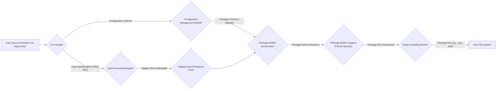

# Project Design Document: fpm (Effing Package Management) - Improved

**Document Version:** 1.1
**Date:** October 26, 2023
**Author:** AI Software Architect

## 1. Introduction

This document provides an enhanced and more detailed design overview of the `fpm` (Effing Package Management) project, a versatile tool for building software packages across various formats. This document aims to provide a clear and comprehensive articulation of the system's architecture, components, and data flow, serving as a robust foundation for subsequent threat modeling activities. A thorough understanding of the system's design is paramount for identifying potential vulnerabilities and designing effective security controls.

## 2. Goals and Scope

The primary goal of this document is to provide an in-depth architectural description of `fpm`, suitable for security analysis. The scope includes:

*   Detailed identification of the major logical and functional components of the `fpm` application.
*   A comprehensive description of the data flow within the application, including data types and transformations.
*   A clear outline of the interactions between components and external entities, specifying the nature of these interactions.
*   A more granular overview of security considerations based on the detailed design, highlighting potential attack vectors.

This document focuses on the core functionality of `fpm` as a command-line tool for package creation. While it touches upon the interaction with underlying packaging tools, it does not delve into the intricate internal workings of each specific package format or those tools.

## 3. System Overview

`fpm` is a command-line utility designed to streamline the creation of software packages in multiple formats (e.g., RPM, DEB, tar.gz, etc.). It achieves this by abstracting away the complexities of individual packaging tools, providing a unified interface for users. `fpm` takes various inputs, such as source code, directories, and scripts, and transforms them into distributable software packages.

## 4. Architectural Design

### 4.1. Components

The `fpm` application can be conceptually and functionally divided into the following key components:

*   **Command-Line Interface (CLI) Handler:** This component is responsible for receiving and parsing the command-line arguments provided by the user. It utilizes a library (likely a standard argument parsing library) to interpret options, flags, and input parameters, determining the desired package format, input sources, and other configuration settings. Error handling for invalid or missing arguments also resides here.
*   **Input Processing Engine:** This component manages the diverse input sources provided to `fpm`. It handles various input types, including directories, individual files, glob patterns, and the output of shell commands. This component performs initial validation (e.g., checking file existence, permissions) and prepares the input data for the subsequent packaging stages. It might involve copying or linking files to a staging area.
*   **Configuration Management Module:** This module is responsible for managing the configuration settings for the package creation process. This includes:
    *   Options explicitly provided on the command line.
    *   Default settings defined within `fpm`.
    *   Potentially, configuration files read from standard locations.
    This module resolves configuration conflicts and ensures all necessary parameters for the target package format are available and consistent.
*   **Package Builder Orchestrator:** This is the central component responsible for orchestrating the generation of the actual package file. It determines the appropriate underlying native packaging tool based on the specified output format (e.g., `rpmbuild` for RPM, `dpkg-deb` for DEB). It constructs the necessary command-line arguments and invokes the selected tool.
*   **Package Builder Engines (Format Specific):**  While the orchestrator is central, there are logical sub-components or modules responsible for the specifics of each package format. These handle the mapping of `fpm`'s internal representation to the specific requirements of formats like RPM, DEB, etc. This might involve generating control files, spec files, or other metadata.
*   **Output Handling Module:** This module manages the output of the package creation process. It handles:
    *   The retrieval of the generated package file from the temporary location where the builder engine placed it.
    *   The final placement of the package file in the user-specified output directory or the current working directory.
    *   Optional post-processing steps, such as calculating checksums or signing the package.
    *   Providing feedback to the user regarding the success or failure of the package creation.
*   **Plugin Interface (Optional):** `fpm` features a plugin system that allows extending its functionality. Plugins can provide support for new input types, output formats, or modify the packaging process. This interface defines how plugins interact with the core `fpm` application.

### 4.2. Data Flow

The following diagram illustrates the data flow within the `fpm` application, including the types of data being passed between components:

**Data Flow Description:**

*   The process begins with **User Input** provided through command-line arguments.
*   The **CLI Handler** parses these arguments, extracting **Configuration Options** and **Input Specifications**.
*   **Configuration Options** are passed to the **Configuration Management Module**.
*   **Input Specifications** are passed to the **Input Processing Engine**.
*   The **Input Processing Engine** gathers and processes the specified inputs, placing **Staged Files & Metadata** in the **Staging Area**.
*   The **Configuration Management Module** provides **Package Format & Settings** to the **Package Builder Orchestrator**.
*   The **Package Builder Orchestrator**, using the configuration, instructs the appropriate **Package Builder Engines** with **Package Build Instructions**.
*   The **Package Builder Engines** generate the **Package File (Temporary)**.
*   The **Output Handling Module** retrieves the temporary package file and places the final **Package File** in the **User File System**.

### 4.3. Component Interactions

The components interact with each other in a generally sequential manner, with the **Package Builder Orchestrator** acting as a central point of coordination for the actual package building. Key interactions include:

*   The **CLI Handler** provides structured data (options and input paths) to the **Configuration Management Module** and **Input Processing Engine**.
*   The **Input Processing Engine** writes processed files and metadata to the **Staging Area**, which is subsequently read by the **Package Builder Orchestrator**.
*   The **Configuration Management Module** provides crucial parameters and settings to the **Package Builder Orchestrator**, dictating the target package format and other build options.
*   The **Package Builder Orchestrator** invokes specific **Package Builder Engines** based on the desired output format, passing necessary instructions and accessing the staged files.
*   The **Package Builder Engines** interact directly with external native packaging tools, relying on the operating system's capabilities for process execution.
*   The **Output Handling Module** interacts with the file system to retrieve the generated package and write the final output file.

### 4.4. External Interactions

`fpm` interacts with several external entities to perform its function:

*   **Operating System:** `fpm` relies heavily on the underlying operating system for:
    *   File system access (reading input files, writing output packages, managing the staging area).
    *   Process execution (invoking native packaging tools like `rpmbuild`, `dpkg-deb`, `tar`).
    *   Access to system libraries and utilities.
*   **Native Packaging Tools:** `fpm` functions as a wrapper around these tools. It executes them as separate processes, passing arguments and interpreting their output. Examples include `rpmbuild`, `dpkg-deb`, `makepkg`, `pkgbuild`, and `tar`.
*   **User Environment:** `fpm` reads environment variables that might influence the build process (e.g., paths, compiler settings). It may also read user-specific configuration files if implemented.
*   **Network (Potentially):** Depending on the input sources specified by the user or the functionality of loaded plugins, `fpm` might interact with the network to download files, retrieve dependencies, or access remote resources.
*   **Plugin Ecosystem:** If plugins are utilized, `fpm` interacts with the plugin files (loading and executing them) and adheres to the defined plugin interface for communication and data exchange.

## 5. Security Considerations (Detailed)

Based on the detailed architectural design, the following security considerations are crucial for threat modeling:

*   **Command Injection Vulnerabilities:**
    *   The **CLI Handler** must rigorously sanitize and validate all user-provided input to prevent command injection when constructing arguments for internal commands or external packaging tools.
    *   Special attention should be paid to input that is directly incorporated into shell commands executed by the **Package Builder Orchestrator**.
*   **Path Traversal Vulnerabilities:**
    *   The **Input Processing Engine** needs to carefully validate file paths provided by the user to prevent path traversal attacks, ensuring that `fpm` only accesses intended files and directories.
    *   Similar validation is needed when handling paths within configuration files or plugin inputs.
*   **Arbitrary File Write/Overwrite:**
    *   The **Output Handling Module** must ensure that the output package is written to the intended location and prevent the overwriting of critical system files or other sensitive data.
    *   Permissions on the output directory should be carefully considered.
*   **Supply Chain Attacks (Dependency Handling):**
    *   If `fpm` handles dependencies (either directly or through plugins), the process of resolving and downloading dependencies must be secure. This includes verifying checksums and using trusted sources to prevent the introduction of malicious components.
*   **Plugin Security Risks:**
    *   The **Plugin Interface** needs to be designed with security in mind to prevent malicious plugins from compromising the `fpm` application or the host system.
    *   Consider implementing sandboxing or permission restrictions for plugins.
    *   A mechanism for verifying the authenticity and integrity of plugins might be necessary.
*   **Insecure Temporary File Handling:**
    *   The **Staging Area** and any other temporary files created during the packaging process should be handled securely. This includes setting appropriate permissions and ensuring that sensitive data is not left behind after the process completes.
*   **Configuration Security:**
    *   If `fpm` reads configuration files, these files should be parsed securely to prevent vulnerabilities arising from malformed or malicious configuration data.
    *   Consider the permissions and ownership of configuration files.
*   **Information Disclosure:**
    *   Error messages and logging should be carefully reviewed to avoid disclosing sensitive information about the system or the build process.
*   **Resource Exhaustion:**
    *   The **Input Processing Engine** should have safeguards to prevent processing excessively large or deeply nested input structures that could lead to resource exhaustion (e.g., denial-of-service).

## 6. Deployment Considerations

`fpm` is typically deployed as a command-line tool installed on a developer's workstation, a build server, or within a CI/CD pipeline environment. Its execution requires appropriate permissions to:

*   Read input files and directories.
*   Execute native packaging tools.
*   Write the output package file to the desired location.
*   Potentially access network resources if required by the input sources or plugins.

The security context in which `fpm` is executed is crucial. Running `fpm` with elevated privileges should be avoided unless absolutely necessary, and the principle of least privilege should be applied.

## 7. Future Considerations

Potential future enhancements or changes that could impact the architecture and security include:

*   **More Sophisticated Plugin System:**  Introducing more complex plugin capabilities (e.g., network access, system calls) would significantly increase the attack surface and require more robust security measures.
*   **Graphical User Interface (GUI) or Web Interface:**  Adding a GUI or web interface would introduce new attack vectors associated with web applications, such as cross-site scripting (XSS) and cross-site request forgery (CSRF).
*   **Remote Execution Capabilities:**  Allowing `fpm` to build packages on remote systems would necessitate secure communication channels (e.g., TLS), authentication, and authorization mechanisms.
*   **Containerization:** Packaging `fpm` itself as a container could improve isolation and reproducibility but introduces its own set of security considerations related to container security.

This enhanced document provides a more detailed and nuanced understanding of the `fpm` project's architecture. This information is essential for conducting a comprehensive threat model to identify potential security vulnerabilities and design effective mitigation strategies. The added details regarding data flow, component interactions, and specific security considerations should facilitate a more thorough and accurate threat assessment.
