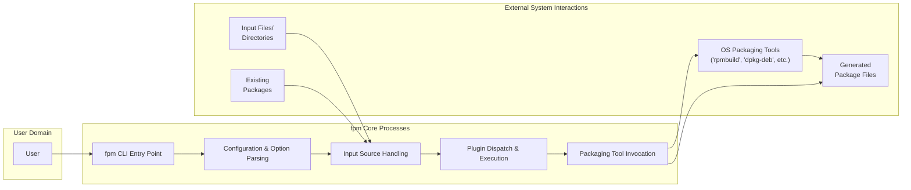

## Project Design Document: fpm - Effing Package Management

**Version:** 1.1
**Date:** October 26, 2023
**Author:** AI Software Architect

### 1. Introduction

This document provides an enhanced design overview of the `fpm` (Effing Package Management) project, a tool designed for creating software packages across various formats. This detailed design serves as a critical foundation for subsequent threat modeling activities, clearly outlining the system's architecture, core components, and the flow of data within it. The focus is on providing the necessary context for identifying potential security vulnerabilities.

### 2. Project Overview

`fpm` is a command-line utility that simplifies the conversion of software packages between numerous formats, including but not limited to RPM, DEB, and tar.gz. It aims to streamline software distribution across diverse platforms by abstracting the complexities inherent in different packaging systems. `fpm` accepts various inputs, such as individual files, directory structures, or existing package files, and generates a new package conforming to the specified output format.

### 3. Goals and Objectives

*   To significantly simplify the process of creating software packages compatible with multiple operating systems and distributions.
*   To offer a consistent and unified command-line interface for package conversion tasks.
*   To ensure broad support for a wide array of both input and output package formats.
*   To automate routine packaging procedures, such as setting package metadata and declaring dependencies.
*   To maintain ease of use and facilitate seamless integration into existing software build pipelines.

### 4. Non-Goals

*   `fpm` is not intended to replace native operating system packaging tools (e.g., `rpmbuild`, `dpkg-deb`). Instead, it leverages these tools as part of its operation.
*   Directly providing advanced package signing or repository management functionalities is outside the scope of `fpm`.
*   Acting as a comprehensive, general-purpose build system is not a goal. `fpm`'s primary focus is on the packaging stage of the software development lifecycle.

### 5. System Architecture

The fundamental architecture of `fpm` is centered around a command-line interface that orchestrates the entire package conversion process. This CLI interacts with a series of internal modules and relies on external packaging utilities to achieve its functionality.

### 6. Data Flow

The typical flow of data within `fpm` involves the following sequence of operations:

*   A user initiates the `fpm` command, providing specific arguments and options to define the desired package conversion.
*   The `fpm CLI Entry Point` receives the command and begins parsing the provided arguments and options.
*   The `Configuration & Option Parsing` module processes any configuration files (e.g., `.fpmrc`) and command-line settings, establishing the parameters for the packaging process.
*   The `Input Source Handling` module manages the input, which can consist of individual files, directory structures, or pre-existing package files. This module prepares the necessary files and extracts relevant metadata for packaging.
*   The `Plugin Dispatch & Execution` module identifies and executes relevant plugins based on the specified input and output formats. Plugins can modify the input data, customize the packaging procedure, or handle format-specific requirements.
*   The `Packaging Tool Invocation` module determines the appropriate external packaging tool based on the target output format and constructs the necessary command-line arguments.
*   The corresponding external `OS Packaging Tools` (e.g., `rpmbuild`, `dpkg-deb`) are invoked with the prepared data and instructions, leading to the generation of the output package file.
*   The `Generated Package Files` are then created in the designated output location.

### 7. Key Components

*   **fpm CLI Entry Point:** This is the primary interface through which users interact with `fpm`. It's responsible for receiving user commands, parsing arguments, and initiating the subsequent stages of the packaging process. *Security Consideration:* This component must rigorously validate user input to prevent command injection or other forms of malicious input.
*   **Configuration & Option Parsing:** This component is responsible for interpreting configuration files and command-line options. It allows users to customize various aspects of the packaging process, such as package metadata, dependencies, and file permissions. *Security Consideration:*  Improper parsing or handling of configuration files could lead to vulnerabilities if malicious content is injected.
*   **Input Source Handling:** This module manages the diverse types of input that `fpm` can process. It handles the retrieval, extraction, and preparation of files and metadata from sources like directories, individual files, and existing packages. *Security Consideration:* This component needs to be robust against path traversal vulnerabilities and ensure that it only accesses files and directories within the intended scope.
*   **Plugin Dispatch & Execution:** `fpm` utilizes a plugin architecture to support different package formats and extend its capabilities. This component is responsible for identifying, loading, and executing the appropriate plugins based on the desired input and output formats. *Security Consideration:*  The plugin system represents a significant attack surface. Malicious plugins could execute arbitrary code or compromise the integrity of the generated packages. Strict plugin validation and sandboxing (if feasible) are crucial.
*   **Packaging Tool Invocation:** This module acts as an intermediary between `fpm` and the underlying operating system packaging tools. It dynamically constructs and executes commands for tools like `rpmbuild` and `dpkg-deb`. *Security Consideration:*  Careful construction of command-line arguments is essential to prevent command injection vulnerabilities when interacting with external tools. Input sanitization before passing data to external commands is critical.

### 8. External Interfaces

`fpm` interacts with the external environment through several key interfaces:

*   **Command-Line Arguments:** Users provide instructions and configuration parameters directly through command-line arguments. *Security Consideration:*  These arguments are a primary point of interaction and require thorough validation to prevent malicious input.
*   **Configuration Files:** Users can configure `fpm`'s behavior and settings using configuration files (e.g., `.fpmrc`). *Security Consideration:* The location and permissions of these files are important to prevent unauthorized modification. The parsing logic must also be secure.
*   **Input Files and Directories:** The software intended for packaging is provided as input, either as individual files or directory structures. *Security Consideration:* `fpm` needs to handle potentially malicious files or directory structures safely, preventing issues like symlink attacks or access to unintended files.
*   **Existing Packages:** `fpm` can accept existing package files as input for conversion. *Security Consideration:*  Parsing and processing existing packages requires careful handling to avoid vulnerabilities within the package format itself.
*   **External Packaging Tools:** `fpm` relies on external tools provided by the operating system to perform the actual packaging. *Security Consideration:*  The security of the generated packages depends on the integrity of these external tools. `fpm` should be aware of potential vulnerabilities in these tools.
*   **Standard Output and Standard Error:** `fpm` provides feedback, progress updates, and error messages through standard output and standard error streams. *Security Consideration:* While less of a direct security risk, sensitive information should not be inadvertently leaked through these streams.

### 9. Security Considerations

This section outlines potential security concerns and attack vectors that should be thoroughly investigated during threat modeling:

*   **Command Injection:**  Improper sanitization of user-provided input (command-line arguments, configuration files, input file paths) could allow attackers to inject arbitrary commands that are executed by the underlying shell or external packaging tools.
*   **Path Traversal:**  If `fpm` doesn't properly validate file paths provided as input, attackers could potentially access or modify files outside the intended working directory.
*   **Malicious Input Files:**  `fpm` needs to be resilient against malicious files provided as input. This includes protection against archive bombs, files with excessive resource consumption, or files designed to exploit vulnerabilities in processing libraries.
*   **Plugin Security:**  The plugin system introduces a significant risk. Untrusted or compromised plugins could execute arbitrary code, modify the packaging process, or exfiltrate sensitive information. Mechanisms for verifying plugin integrity and potentially sandboxing plugins should be considered.
*   **Dependency Vulnerabilities (Indirect):** While `fpm` doesn't directly manage software dependencies in the same way as a package manager, it might interact with systems that do (e.g., when building from source). Vulnerabilities in those dependencies could indirectly affect the security of the packaged software.
*   **Insecure Temporary Files:** If `fpm` uses temporary files during the packaging process, these files need to be created and managed securely to prevent unauthorized access or modification.
*   **Information Disclosure:** Error messages or verbose output could inadvertently reveal sensitive information about the system or the packaging process.
*   **Supply Chain Attacks:** If `fpm` itself is compromised or if its dependencies are compromised, this could lead to the distribution of malicious software. Secure development practices and dependency management are crucial.
*   **Privilege Escalation:** If `fpm` requires elevated privileges for certain operations, vulnerabilities could be exploited to gain unauthorized access to system resources. The principle of least privilege should be applied.
*   **Configuration File Security:**  If configuration files are not stored securely or if their parsing logic is flawed, attackers could modify them to alter `fpm`'s behavior or inject malicious commands.

This enhanced design document provides a more detailed and security-focused overview of the `fpm` project. It serves as a solid foundation for conducting a comprehensive threat model to identify and mitigate potential security vulnerabilities.
