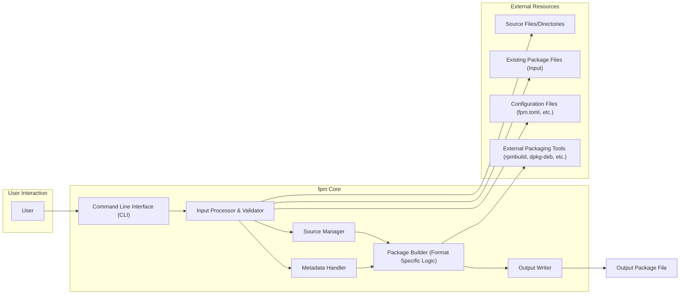

# Project Design Document: fpm (Effing Package Management)

**Version:** 1.1
**Date:** October 26, 2023
**Author:** Gemini (AI Language Model)

## 1. Introduction

This document provides a detailed design overview of the `fpm` (Effing Package Management) project, a command-line tool designed for converting software packages between various formats. This document aims to provide a comprehensive understanding of the system's architecture, components, and data flow, serving as a foundation for subsequent threat modeling activities. The focus is on clarity and detail to facilitate a thorough security analysis.

## 2. Goals and Objectives

The primary goal of `fpm` is to streamline the process of creating software packages in diverse formats. Key objectives include:

* **Versatile Format Conversion:**  Enabling seamless conversion between a wide array of package formats (e.g., RPM, DEB, tar.gz, ZIP, etc.).
* **User-Friendly Interface:** Providing an intuitive command-line interface for package creation and conversion tasks.
* **Flexible Input Handling:** Supporting various input sources, including individual files, directories, and existing package files.
* **Extensive Customization:** Allowing users to tailor package metadata, contents, and build processes.
* **Cross-Platform Operation:** Ensuring the tool functions effectively across different operating system environments.

## 3. Architecture Overview

`fpm` operates as a command-line utility that processes user-provided input and configuration to generate a software package in the desired output format. The core architecture can be conceptually divided into the following sequential stages:

* **Command Reception and Initial Parsing:** The tool receives and initially parses command-line arguments.
* **Detailed Input Processing and Validation:**  A more thorough analysis and validation of user-provided input is performed.
* **Source Material Management:** The specified source files or directories are handled and prepared.
* **Metadata Acquisition and Manipulation:** Package metadata is gathered, processed, and potentially modified.
* **Format-Specific Package Construction:** The core logic for building the target package format is executed, potentially involving external tools.
* **Final Package Output:** The resulting package file is created and written to the designated location.

## 4. Component Details

This section provides a detailed description of each component within the `fpm` architecture, outlining its responsibilities and interactions.

### 4.1. Command Line Interface (CLI)

* **Description:** The initial point of contact for user interaction with `fpm`. It is responsible for receiving and performing basic parsing of command-line arguments, options, and subcommands.
* **Functionality:**
    * Accepts user commands and their associated parameters.
    * Provides built-in help and usage information to the user.
    * Passes the initially parsed information to the Input Processor & Validator for more detailed analysis.
* **Implementation Details:** Typically implemented using a library for command-line argument parsing (e.g., `OptionParser` in Ruby, the language `fpm` is implemented in). This component focuses on the syntactic correctness of the command.

### 4.2. Input Processor & Validator

* **Description:** Responsible for a more in-depth interpretation of the command-line arguments and rigorous validation of the user-provided input. This component ensures the semantic correctness and feasibility of the requested operation.
* **Functionality:**
    * Parses command-line options (e.g., `--input-type`, `--output-type`, `--name`, file paths).
    * Validates the existence, accessibility, and integrity of specified source files and directories.
    * Validates the correctness, completeness, and consistency of provided metadata values.
    * Determines the intended input and output package formats based on user specifications.
    * Handles potential conflicts or ambiguities in user input.
* **Implementation Details:** Involves complex logic to handle various input formats and options, potentially utilizing regular expressions, schema validation, and custom validation functions. Error handling and informative error messages are crucial in this component.

### 4.3. Source Manager

* **Description:** Manages the handling and preparation of the source material that will be included in the generated package.
* **Functionality:**
    * Identifies the type of input provided (directory, individual file, existing package file).
    * Reads and extracts the contents from existing package files if they are used as input.
    * Collects the specific files and directories that are intended to be part of the new package.
    * May perform filtering, renaming, or modification of source files based on user-defined options or configuration.
    * Handles symbolic links and file permissions according to the target package format requirements.
* **Implementation Details:**  Involves extensive file system operations, archive extraction (e.g., using libraries for `tar`, `zip`, etc.), and potentially logic for handling file metadata and permissions in a platform-independent manner.

### 4.4. Metadata Handler

* **Description:** Responsible for the acquisition, processing, and validation of package metadata, which describes the software being packaged.
* **Functionality:**
    * Acquires metadata from various sources, including command-line options, configuration files (e.g., `fpm.toml`), and potentially from existing input packages.
    * Validates the completeness, correctness, and format of metadata fields (e.g., name, version, architecture, description, dependencies).
    * May allow for templating or dynamic generation of metadata based on environment variables or other factors.
    * Provides the finalized metadata to the Package Builder for inclusion in the generated package.
    * Handles potential metadata conflicts when information is provided from multiple sources.
* **Implementation Details:**  Involves string manipulation, data validation logic (e.g., checking for valid version formats), and potentially integration with templating engines or configuration file parsing libraries.

### 4.5. Package Builder (Format Specific Logic)

* **Description:** The core component responsible for the actual construction of the package in the specified target format. This is the most format-dependent part of `fpm`.
* **Functionality:**
    * Receives the prepared source files and validated metadata from other components.
    * Executes the specific steps and procedures required to build a package in the target format (e.g., creating RPM spec files, generating DEB control files, creating archive structures).
    * Frequently involves invoking external packaging tools provided by the operating system (e.g., `rpmbuild`, `dpkg-deb`, `makepkg`).
    * Manages the placement of files within the package structure according to the target format's conventions.
    * Sets appropriate file permissions and ownership within the package.
* **Implementation Details:** This component will likely be structured with separate modules or classes for each supported output format. It requires careful handling of external command execution, including proper argument quoting and error handling.

### 4.6. Output Writer

* **Description:** Responsible for writing the generated package file to the designated location on the file system.
* **Functionality:**
    * Receives the completed package data (typically as a file or stream) from the Package Builder.
    * Writes the package data to a file at the specified output path.
    * Handles the creation of necessary directories if they don't exist.
    * May perform post-processing steps such as generating checksums or signing the package.
    * Provides feedback to the user on the success or failure of the output operation.
* **Implementation Details:** Involves basic file writing operations and potentially the use of libraries for checksum generation or cryptographic signing.

## 5. Data Flow

The typical flow of data within `fpm` proceeds as follows:

1. **User Command Input:** The user enters commands and options through the `fpm` CLI.
2. **Initial Parsing:** The CLI performs initial parsing of the command line input.
3. **Detailed Processing and Validation:** The Input Processor & Validator thoroughly analyzes and validates the user's input, including file paths and metadata.
4. **Source Material Handling:** The Source Manager processes the specified source files, directories, or existing packages, preparing the content for packaging.
5. **Metadata Acquisition and Handling:** The Metadata Handler gathers and validates package metadata from various sources.
6. **Format-Specific Package Building:** The appropriate Package Builder, based on the target output format, uses the processed source files and metadata to construct the package. This often involves invoking external packaging tools.
7. **Package Output:** The Output Writer writes the generated package file to the specified location.

## 6. Security Considerations (Detailed)

This section expands on the initial security considerations, providing more specific examples of potential threats related to each component:

* **Command Injection (Package Builder):** If `fpm` invokes external commands (like `rpmbuild`, `dpkg-deb`, etc.) without meticulously sanitizing user-provided input (e.g., package names, versions, file paths), it could be vulnerable to command injection attacks. A malicious user could inject arbitrary commands into the arguments passed to these external tools.
* **Path Traversal (Input Processor & Source Manager):** If `fpm` does not rigorously validate file paths provided by the user (either directly or within configuration files), it could be exploited to access or include files from outside the intended source directory. This could lead to the inclusion of sensitive information in the generated package.
* **Dependency Vulnerabilities (All Components):** `fpm` itself relies on various libraries and potentially external tools. Vulnerabilities in these dependencies (e.g., in the command-line parsing library, archive handling libraries, or the external packaging tools) could be exploited to compromise `fpm`'s security. Regular dependency updates and security scanning are crucial.
* **Information Disclosure (Metadata Handler & Package Builder):** If metadata or source files contain sensitive information (e.g., API keys, passwords, internal paths), improper handling during metadata processing or package building could lead to unintended disclosure of this information within the generated package.
* **Insecure Defaults (All Components):** Default configurations or behaviors of `fpm` could introduce security risks if not carefully considered. For example, default file permissions within generated packages or insecure default settings for external tool invocation.
* **Insufficient Input Validation (Input Processor & Validator):**  Lack of proper validation on user-provided metadata (e.g., allowing excessively long names or special characters) could lead to issues with external packaging tools or vulnerabilities in systems that consume the generated packages.
* **Temporary File Handling (Package Builder):** If `fpm` uses temporary files during the package building process, insecure handling of these files (e.g., predictable names, insecure permissions) could create vulnerabilities.

## 7. Assumptions and Constraints

* **Assumption:** The user executing `fpm` has the necessary file system permissions to read source files and write output packages to the specified locations.
* **Assumption:** Any required external packaging tools (e.g., `rpmbuild`, `dpkg-deb`) are installed on the system and are accessible through the system's PATH environment variable.
* **Constraint:** The functionality and available options within `fpm` are inherently limited by the capabilities and constraints of the underlying packaging formats and the external tools used for building those formats.
* **Constraint:** The performance of `fpm` can be significantly affected by the size and complexity of the source material being packaged and the complexity of the target package format.
* **Constraint:**  `fpm`'s ability to handle specific edge cases or highly customized packaging scenarios may be limited by its design and the capabilities of its underlying libraries and tools.

## 8. Future Considerations

* **Plugin Architecture for Format Support:** Implementing a plugin architecture would allow for easier extension of `fpm` to support new package formats or features without requiring modifications to the core `fpm` codebase. This would improve maintainability and extensibility.
* **Enhanced Error Handling and Reporting:** Providing more detailed and informative error messages, including potential causes and solutions, would significantly improve the user experience and aid in debugging packaging issues.
* **Built-in Security Auditing and Scanning:** Integrating basic security auditing or vulnerability scanning capabilities (e.g., checking for known vulnerabilities in dependencies) could proactively identify potential security issues.
* **Improved Configuration Management:**  Providing more flexible and robust configuration options, potentially through dedicated configuration files or environment variables, would allow for greater customization and control over `fpm`'s behavior.
* **Support for Package Signing:**  Integrating functionality for signing generated packages would enhance the security and integrity of the created packages.
* **Containerization:** Providing a containerized version of `fpm` could simplify deployment and ensure consistent execution environments.

This improved design document provides a more detailed and comprehensive understanding of the architecture and functionality of the `fpm` project, with a stronger emphasis on security considerations. This enhanced document will be a more valuable resource for conducting thorough threat modeling and identifying potential security vulnerabilities.