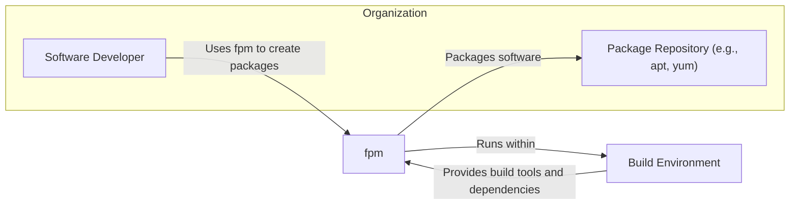

# BUSINESS POSTURE

- Business Priorities and Goals:
  - The primary goal of the fpm project is to simplify and standardize the process of creating software packages for various operating systems and package formats.
  - Business priorities include:
    - Broad format support: Supporting a wide range of input and output package formats to cater to diverse platform needs.
    - Ease of use: Providing a user-friendly command-line interface and intuitive workflow for package creation.
    - Reliability and consistency: Ensuring that packages are built reliably and consistently across different environments.
    - Extensibility: Allowing users to extend fpm's functionality through plugins or custom configurations.

- Business Risks:
  - Package integrity compromise: Risk of malicious actors injecting malware or vulnerabilities into software packages during the packaging process.
  - Supply chain vulnerability: Risk of dependencies or build tools used by fpm being compromised, leading to compromised output packages.
  - Operational disruption: Risk of fpm tool itself becoming unavailable or malfunctioning, disrupting software release pipelines.
  - Reputational damage: Distribution of compromised packages can damage the reputation of the software vendor and the fpm project itself.

# SECURITY POSTURE

- Existing Security Controls:
  - security control: Input validation - fpm likely performs some level of input validation to ensure provided files and configurations are valid for package creation. (Implemented within fpm codebase, details need to be analyzed).
  - security control: Checksum generation - Package formats often include checksums to verify package integrity after download. fpm likely generates these checksums as part of the package creation process. (Implemented within fpm codebase, part of package format standards).

- Accepted Risks:
  - accepted risk: Lack of package signing by default - fpm itself might not enforce or automate package signing, leaving it to the user to implement separately.
  - accepted risk: Reliance on user-provided build environment security - fpm operates within the user's build environment, inheriting any security vulnerabilities present there.

- Recommended Security Controls:
  - security control: Implement package signing: Integrate package signing capabilities into fpm to allow users to cryptographically sign packages, ensuring authenticity and integrity.
  - security control: Dependency scanning: Incorporate dependency scanning to identify known vulnerabilities in dependencies used during the packaging process.
  - security control: Secure build environment guidelines: Provide guidelines and best practices for setting up secure build environments for fpm, including isolation and access control.
  - security control: Software Bill of Materials (SBOM) generation: Generate SBOM for created packages to enhance transparency and allow for vulnerability tracking.

- Security Requirements:
  - Authentication:
    - Not directly applicable to fpm as a command-line tool. Authentication might be relevant in the context of a CI/CD pipeline or package repository integration where fpm is used.
  - Authorization:
    - Access control to the build environment where fpm is executed is crucial. Ensure only authorized users and processes can execute fpm and access sensitive resources like signing keys.
  - Input Validation:
    - Rigorous input validation is essential to prevent injection attacks and ensure the integrity of the generated packages. Validate all input parameters, file paths, and configuration options provided to fpm.
  - Cryptography:
    - Utilize cryptography for package signing to ensure package authenticity and integrity. Support strong cryptographic algorithms and key management practices.
    - Employ checksums and hashing algorithms to verify the integrity of packages and their components.

# DESIGN

## C4 CONTEXT



- Context Diagram Elements:
  - Element:
    - Name: Software Developer
    - Type: Person
    - Description: Developers who use fpm to create software packages for distribution.
    - Responsibilities: Uses fpm to package software, configures fpm with input files and desired package format.
    - Security controls: User authentication to access build environment, authorization to run fpm and access source code.
  - Element:
    - Name: fpm
    - Type: Software System
    - Description: The fpm packaging tool, responsible for converting input files and directories into various package formats.
    - Responsibilities: Reads input files, transforms them into specified package format, generates package metadata, creates package artifacts.
    - Security controls: Input validation, output integrity checks (checksums), logging and auditing.
  - Element:
    - Name: Package Repository (e.g., apt, yum)
    - Type: Software System
    - Description: Repositories where packaged software is stored and distributed to end-users.
    - Responsibilities: Stores and distributes software packages, provides package management functionalities to end-users.
    - Security controls: Access control, package signing verification, vulnerability scanning of hosted packages.
  - Element:
    - Name: Build Environment
    - Type: Environment
    - Description: The environment where fpm is executed, including operating system, build tools, and dependencies.
    - Responsibilities: Provides necessary tools and libraries for fpm to run, executes fpm commands.
    - Security controls: Access control, system hardening, vulnerability management, monitoring and logging.

## C4 CONTAINER

```mermaid
flowchart LR
    subgraph "Build Environment"
        subgraph "fpm Container"
            FPM_CLI["fpm CLI Application"]
        end
        FS["File System"]
        PC["Package Creation Libraries"]
    end

    FPM_CLI --> FS
    FPM_CLI --> PC

    style "fpm Container" fill:#f9f,stroke:#333,stroke-width:2px
```

- Container Diagram Elements:
  - Element:
    - Name: fpm CLI Application
    - Type: Application
    - Description: Command-line interface of fpm, the main executable that users interact with.
    - Responsibilities: Parses user commands, reads configuration, orchestrates package creation process, interacts with file system and package creation libraries.
    - Security controls: Input validation, logging, error handling, secure configuration management.
  - Element:
    - Name: File System
    - Type: Data Store
    - Description: Local file system within the build environment where input files, temporary files, and output packages are stored.
    - Responsibilities: Stores input files, provides access to files for fpm, stores generated package artifacts.
    - Security controls: Access control (file permissions), file system integrity monitoring.
  - Element:
    - Name: Package Creation Libraries
    - Type: Library
    - Description: Libraries and modules used by fpm to perform specific package format operations (e.g., deb, rpm).
    - Responsibilities: Provides functionalities for creating and manipulating specific package formats, handles format-specific metadata and structure.
    - Security controls: Library integrity checks, vulnerability scanning of libraries.

## DEPLOYMENT

- Deployment Architecture Options:
  - Developer Workstation: fpm can be directly installed and run on a developer's local machine for testing and development.
  - CI/CD Pipeline: fpm can be integrated into CI/CD pipelines to automate package creation as part of the software release process.
  - Dedicated Build Server: A dedicated server can be set up as a build environment to run fpm, providing a controlled and consistent environment.

- Detailed Deployment Architecture (CI/CD Pipeline):

```mermaid
flowchart LR
    subgraph "CI/CD Pipeline"
        subgraph "Build Stage"
            BC["Build Container"]
        end
        subgraph "Artifact Storage"
            AS["Artifact Repository"]
        end
    end
    VCS["Version Control System"]

    VCS --> BC: Source Code
    BC --> FPM_CLI: Executes fpm
    FPM_CLI --> AS: Package Artifacts

    style "Build Stage" fill:#ccf,stroke:#333,stroke-width:2px
    style "Artifact Storage" fill:#cff,stroke:#333,stroke-width:2px
```

- Deployment Diagram Elements:
  - Element:
    - Name: Version Control System (VCS)
    - Type: Infrastructure
    - Description: System like Git, hosting the source code of the software to be packaged.
    - Responsibilities: Stores and manages source code, tracks changes, provides access to source code for the build process.
    - Security controls: Access control (authentication and authorization), audit logging, branch protection.
  - Element:
    - Name: Build Container
    - Type: Infrastructure
    - Description: Containerized environment within the CI/CD pipeline where the build process, including fpm execution, takes place.
    - Responsibilities: Provides isolated and reproducible build environment, executes build scripts and fpm commands, manages dependencies.
    - Security controls: Container image scanning, least privilege container configuration, resource limits, network isolation.
  - Element:
    - Name: fpm CLI
    - Type: Software
    - Description: fpm command-line application running within the Build Container.
    - Responsibilities: Creates software packages based on source code and configuration.
    - Security controls: Input validation, secure logging, error handling.
  - Element:
    - Name: Artifact Repository
    - Type: Infrastructure
    - Description: Repository for storing build artifacts, including the generated software packages.
    - Responsibilities: Stores and manages build artifacts, provides access to artifacts for deployment and distribution.
    - Security controls: Access control, integrity checks (checksums), versioning, vulnerability scanning of stored artifacts.

## BUILD

```mermaid
flowchart LR
    subgraph "Developer Workstation"
        DEV["Developer"]
    end
    subgraph "Build System (CI/CD)"
        VCS["Version Control System"]
        BC["Build Container"]
        SAST["SAST Scanner"]
        LINTER["Linter"]
        AS["Artifact Repository"]
    end

    DEV --> VCS: Code Commit
    VCS --> BC: Source Code
    BC --> FPM_CLI: fpm Build
    BC --> SAST: SAST Scan
    BC --> LINTER: Linting
    BC --> AS: Package Artifacts

    style "Build System (CI/CD)" fill:#efe,stroke:#333,stroke-width:2px
```

- Build Process Elements:
  - Element:
    - Name: Developer
    - Type: Person
    - Description: Software developer writing and committing code.
    - Responsibilities: Writes code, performs local testing, commits code to VCS.
    - Security controls: Secure coding practices, code review, workstation security.
  - Element:
    - Name: Version Control System (VCS)
    - Type: System
    - Description: System for managing source code (e.g., GitHub).
    - Responsibilities: Stores source code, manages versions, triggers build pipelines on code changes.
    - Security controls: Access control, branch protection, audit logging.
  - Element:
    - Name: Build Container
    - Type: System
    - Description: Containerized build environment in CI/CD.
    - Responsibilities: Executes build steps, runs fpm, performs security checks.
    - Security controls: Secure base image, minimal tools, isolated environment, resource limits.
  - Element:
    - Name: fpm CLI
    - Type: Software
    - Description: fpm command-line tool used for packaging.
    - Responsibilities: Creates software packages based on configuration and input files.
    - Security controls: Input validation, secure logging.
  - Element:
    - Name: SAST Scanner
    - Type: Tool
    - Description: Static Application Security Testing tool to identify potential vulnerabilities in code.
    - Responsibilities: Scans source code for security weaknesses before packaging.
    - Security controls: Regularly updated vulnerability rules, configured to scan relevant code sections.
  - Element:
    - Name: Linter
    - Type: Tool
    - Description: Code linting tool to enforce code style and identify potential code quality issues.
    - Responsibilities: Analyzes code for style violations and potential bugs.
    - Security controls: Configured with security-focused linting rules.
  - Element:
    - Name: Artifact Repository
    - Type: System
    - Description: Repository for storing build artifacts (packages).
    - Responsibilities: Stores and manages generated packages, makes them available for distribution.
    - Security controls: Access control, integrity checks, vulnerability scanning of artifacts.

# RISK ASSESSMENT

- Critical Business Processes:
  - Software distribution to end-users.
  - Maintaining the integrity and trustworthiness of software releases.

- Data to Protect and Sensitivity:
  - Software Packages: Publicly distributed, integrity is critical to prevent malware distribution (Medium Sensitivity - Integrity focused).
  - Build Environment: Contains build scripts, dependencies, potentially secrets (Medium Sensitivity - Confidentiality and Integrity).
  - Signing Keys (if implemented): Used to sign packages, compromise would allow malicious package signing (High Sensitivity - Confidentiality, Integrity, Availability).
  - Source Code: Intellectual property, potential vulnerabilities if exposed (Medium Sensitivity - Confidentiality).

# QUESTIONS & ASSUMPTIONS

- Questions:
  - What are the specific package formats that fpm will be used to create?
  - What CI/CD system will be used to integrate fpm?
  - Are there any specific regulatory or compliance requirements for software packaging?
  - What is the process for managing and distributing package signing keys?
  - What level of security expertise is available within the team using fpm?

- Assumptions:
  - fpm will be used in a CI/CD pipeline for automated package creation.
  - Package signing is desired but not currently implemented.
  - Security is a concern, but the organization is still developing its security posture for software packaging.
  - The target deployment environment for packages is standard Linux distributions (e.g., Debian, Red Hat).