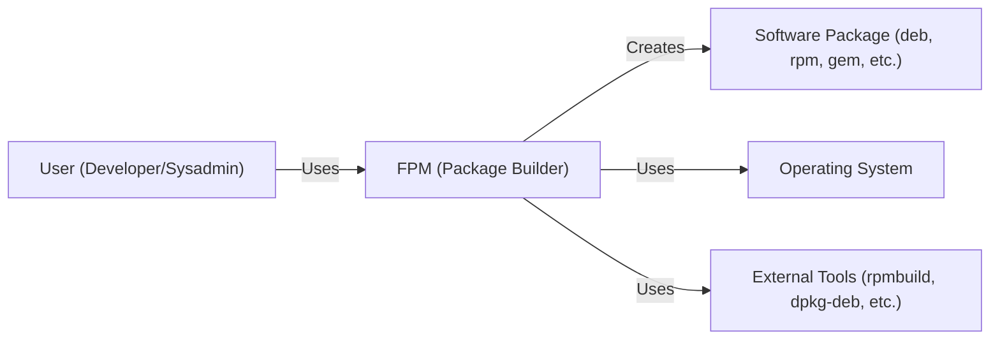
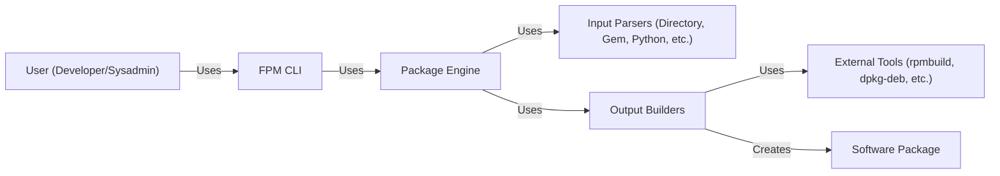
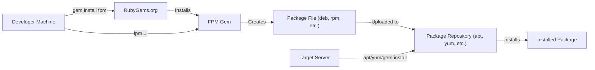
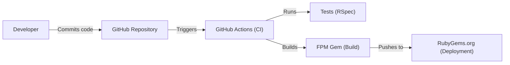

Okay, let's create a design document for the FPM (Effing Package Management) project.

# BUSINESS POSTURE

FPM aims to simplify the process of building software packages for various operating systems and distributions (deb, rpm, gem, etc.). It targets developers and system administrators who need a streamlined way to package software without deep expertise in each packaging format's intricacies.

Business Priorities:

*   Ease of Use: Reduce the barrier to entry for package creation.
*   Cross-Platform Compatibility: Support a wide range of packaging formats.
*   Time Savings: Significantly decrease the time required to build packages.
*   Automation: Enable integration into CI/CD pipelines.
*   Community Adoption: Grow a user base and foster contributions.

Business Goals:

*   Become a go-to tool for rapid package creation.
*   Reduce the complexity of software distribution.
*   Enable developers to focus on code, not packaging.

Most Important Business Risks:

*   Security Vulnerabilities in Packages: FPM could be used to create and distribute packages containing vulnerabilities, leading to security breaches on systems where these packages are installed.
*   Supply Chain Attacks: Compromise of the FPM build process or distribution channels could allow attackers to inject malicious code into packages.
*   Incorrect Package Metadata: FPM could generate packages with incorrect metadata (dependencies, versions, etc.), leading to installation failures or conflicts.
*   Lack of Maintainability: If FPM is not well-maintained, it could become obsolete or incompatible with newer versions of operating systems and packaging formats.
*   Reputational Damage: Security incidents or widespread usability issues could damage the project's reputation and hinder adoption.

# SECURITY POSTURE

Existing Security Controls:

*   security control: Code Reviews: The GitHub repository indicates the use of pull requests, suggesting that code reviews are part of the development process. (Described in GitHub pull request process)
*   security control: Community Scrutiny: As an open-source project, FPM benefits from community scrutiny, where users can report bugs and potential vulnerabilities. (Described in GitHub issues and discussions)

Accepted Risks:

*   accepted risk: User-Supplied Scripts: FPM allows users to provide custom scripts during the packaging process. This introduces the risk of malicious code execution if users are not careful.
*   accepted risk: Dependency on External Tools: FPM relies on external tools (like `rpmbuild`, `dpkg-deb`, etc.) for some of its functionality. Vulnerabilities in these tools could impact FPM.
*   accepted risk: Limited Input Validation: While FPM likely performs some input validation, the complexity of supporting various packaging formats may make comprehensive validation challenging.

Recommended Security Controls:

*   security control: Static Analysis Security Testing (SAST): Integrate SAST tools into the build process to automatically detect potential vulnerabilities in the FPM codebase.
*   security control: Software Composition Analysis (SCA): Use SCA tools to identify and track dependencies, and to alert on known vulnerabilities in those dependencies.
*   security control: Sandboxing: Execute user-provided scripts within a sandboxed environment to limit their potential impact on the system.
*   security control: Code Signing: Sign the FPM releases to ensure their integrity and authenticity.
*   security control: Regular Security Audits: Conduct periodic security audits of the FPM codebase and infrastructure.

Security Requirements:

*   Authentication: Not directly applicable to FPM itself, as it's a command-line tool. However, if FPM were to integrate with remote repositories or services, authentication would be required.
*   Authorization: Not directly applicable to FPM itself. However, if FPM were to manage package signing keys, authorization controls would be needed to restrict access to those keys.
*   Input Validation: FPM must validate user inputs to prevent command injection vulnerabilities and ensure that the generated packages are well-formed. This includes validating file paths, package names, versions, and other metadata.
*   Cryptography: If FPM handles sensitive data (e.g., package signing keys), it should use appropriate cryptographic algorithms and protocols to protect that data. FPM should support signing packages using established methods (e.g., GPG).

# DESIGN

## C4 CONTEXT

C4 Context Element List:

*   Element:
    *   Name: User (Developer/Sysadmin)
    *   Type: Person
    *   Description: A developer or system administrator who uses FPM to create software packages.
    *   Responsibilities: Provides input to FPM (source code, scripts, metadata), runs FPM commands, and deploys the resulting packages.
    *   Security controls: N/A (External to FPM)

*   Element:
    *   Name: FPM (Package Builder)
    *   Type: Software System
    *   Description: The FPM tool itself, which takes user input and generates software packages.
    *   Responsibilities: Parses user input, executes packaging commands, manages dependencies, generates package metadata, and creates the final package file.
    *   Security controls: Input validation, sandboxing (recommended), code reviews, community scrutiny.

*   Element:
    *   Name: Software Package (deb, rpm, gem, etc.)
    *   Type: Output
    *   Description: The output of FPM, a software package in a specific format (deb, rpm, gem, etc.).
    *   Responsibilities: Contains the software to be installed, along with metadata and installation scripts.
    *   Security controls: Package signing (recommended), dependency verification (recommended).

*   Element:
    *   Name: Operating System
    *   Type: Software System
    *   Description: The operating system on which FPM is run and on which the generated packages will be installed.
    *   Responsibilities: Provides the environment for FPM to execute and for the packages to be installed.
    *   Security controls: OS-level security controls (e.g., file permissions, user accounts).

*   Element:
    *   Name: External Tools (rpmbuild, dpkg-deb, etc.)
    *   Type: Software System
    *   Description: External tools that FPM uses to perform some of the packaging tasks.
    *   Responsibilities: Provide specific packaging functionality for different formats.
    *   Security controls: Rely on the security of the external tools themselves.

## C4 CONTAINER

C4 Container Element List:

*   Element:
    *   Name: User (Developer/Sysadmin)
    *   Type: Person
    *   Description: A developer or system administrator who uses FPM to create software packages.
    *   Responsibilities: Provides input to FPM (source code, scripts, metadata), runs FPM commands, and deploys the resulting packages.
    *   Security controls: N/A (External to FPM)

*   Element:
    *   Name: FPM CLI
    *   Type: Container (Command-Line Interface)
    *   Description: The command-line interface that users interact with.
    *   Responsibilities: Parses command-line arguments, validates user input, and invokes the Package Engine.
    *   Security controls: Input validation.

*   Element:
    *   Name: Package Engine
    *   Type: Container (Application Logic)
    *   Description: The core logic of FPM, which orchestrates the packaging process.
    *   Responsibilities: Manages the packaging workflow, selects appropriate input parsers and output builders, and handles errors.
    *   Security controls: Code reviews, community scrutiny.

*   Element:
    *   Name: Input Parsers (Directory, Gem, Python, etc.)
    *   Type: Container (Input Modules)
    *   Description: Modules that parse different types of input (e.g., directory structures, Gem specifications, Python setup files).
    *   Responsibilities: Extract relevant information from the input and provide it to the Package Engine.
    *   Security controls: Input validation specific to each input type.

*   Element:
    *   Name: Output Builders (deb, rpm, gem, etc.)
    *   Type: Container (Output Modules)
    *   Description: Modules that generate packages in different formats (deb, rpm, gem, etc.).
    *   Responsibilities: Create the package structure, populate it with files and metadata, and invoke external tools if necessary.
    *   Security controls: Secure use of external tools, sandboxing (recommended).

*   Element:
    *   Name: External Tools (rpmbuild, dpkg-deb, etc.)
    *   Type: Software System
    *   Description: External tools that FPM uses to perform some of the packaging tasks.
    *   Responsibilities: Provide specific packaging functionality for different formats.
    *   Security controls: Rely on the security of the external tools themselves.

*   Element:
    *   Name: Software Package
    *   Type: Output
    *   Description: The output of FPM, a software package in a specific format (deb, rpm, gem, etc.).
    *   Responsibilities: Contains the software to be installed, along with metadata and installation scripts.
    *   Security controls: Package signing (recommended), dependency verification (recommended).

## DEPLOYMENT

FPM itself is typically installed as a Ruby gem.  The packages it creates are deployed using the native package management tools of the target operating system (apt, yum, gem, etc.).

Deployment Solutions:

1.  RubyGems Installation (for FPM itself): This is the standard way to install FPM.
2.  OS Package Manager (for packages created by FPM):  Packages created by FPM are deployed using `apt`, `yum`, `gem`, etc.
3.  Containerization (for FPM or applications packaged by FPM): FPM can be run inside a container, and it can also be used to create packages that are deployed within containers.

Chosen Solution (Detailed): RubyGems Installation and OS Package Manager Deployment

Deployment Element List:

*   Element:
    *   Name: Developer Machine
    *   Type: Infrastructure Node
    *   Description: The machine where the developer runs FPM.
    *   Responsibilities: Hosts the FPM installation and the source code to be packaged.
    *   Security controls: Standard OS security controls.

*   Element:
    *   Name: RubyGems.org
    *   Type: Infrastructure Node
    *   Description: The RubyGems repository, where FPM is hosted.
    *   Responsibilities: Provides the FPM gem for download.
    *   Security controls: RubyGems.org's security measures.

*   Element:
    *   Name: FPM Gem
    *   Type: Software
    *   Description: The installed FPM gem on the developer's machine.
    *   Responsibilities: Executes FPM commands.
    *   Security controls: Gem signing (if used).

*   Element:
    *   Name: Package File (deb, rpm, etc.)
    *   Type: Artifact
    *   Description: The package file created by FPM.
    *   Responsibilities: Contains the software to be installed.
    *   Security controls: Package signing (recommended).

*   Element:
    *   Name: Package Repository (apt, yum, etc.)
    *   Type: Infrastructure Node
    *   Description: A repository for software packages (e.g., an apt repository, a yum repository, a RubyGems repository).
    *   Responsibilities: Stores and serves software packages.
    *   Security controls: Repository-specific security controls (e.g., access controls, signing).

*   Element:
    *   Name: Target Server
    *   Type: Infrastructure Node
    *   Description: The server where the package will be installed.
    *   Responsibilities: Hosts the installed software.
    *   Security controls: Standard OS security controls.

*   Element:
    *   Name: Installed Package
    *   Type: Software
    *   Description: The installed software package on the target server.
    *   Responsibilities: Runs the installed software.
    *   Security controls: Relies on the security of the package and the OS.

## BUILD

FPM's build process is primarily managed through its RubyGems packaging and the Rake build system.

Build Process Description:

1.  Developer commits code to the GitHub repository.
2.  GitHub Actions (or a similar CI system) is triggered.
3.  Tests (likely RSpec, based on the project's structure) are run.
4.  If tests pass, the FPM gem is built.  This likely involves using the `gem build` command and the `fpm.gemspec` file.
5.  The built gem is (potentially) pushed to RubyGems.org. This step might require manual intervention or be automated with credentials.

Security Controls in Build Process:

*   security control: Version Control (Git): Tracks changes to the codebase and allows for auditing.
*   security control: Automated Testing (RSpec): Ensures that code changes do not introduce regressions.
*   security control: CI/CD (GitHub Actions): Automates the build and test process, reducing the risk of manual errors.
*   security control: Dependency Management (Bundler/Gemfile): Specifies and manages dependencies, allowing for tracking of versions and potential vulnerabilities.

Recommended Security Controls:

*   security control: SAST (Static Application Security Testing): Integrate a SAST tool into the GitHub Actions workflow to scan the code for vulnerabilities.
*   security control: SCA (Software Composition Analysis): Integrate an SCA tool to identify and track dependencies and their vulnerabilities.
*   security control: Secrets Management: Securely manage any credentials required for publishing the gem (e.g., using GitHub Actions secrets).

# RISK ASSESSMENT

Critical Business Processes:

*   Software Packaging: The core process is creating software packages.  Failure here impacts the entire purpose of FPM.
*   Software Distribution:  While FPM doesn't directly distribute packages, it creates them.  Vulnerabilities in the created packages can impact downstream users.

Data to Protect:

*   Source Code (Low Sensitivity): The source code of FPM itself is public.
*   User-Provided Input (Variable Sensitivity):  This includes scripts, file paths, and metadata.  The sensitivity depends on what the user is packaging.  Malicious input could lead to vulnerabilities.
*   Package Metadata (Medium Sensitivity): Incorrect metadata can lead to installation failures or dependency conflicts.
*   Generated Packages (Variable Sensitivity): The sensitivity of the generated package depends on the software being packaged.  A compromised package could contain malware.
*   Build Credentials (High Sensitivity): If FPM's build process uses credentials (e.g., for publishing to RubyGems), these are highly sensitive and must be protected.

# QUESTIONS & ASSUMPTIONS

Questions:

*   What specific external tools are used by each output builder?  Knowing this helps assess the risk associated with those tools.
*   Are there any plans to support package signing? If so, what mechanisms will be used?
*   What level of input validation is currently implemented?
*   Are there any existing security audits or penetration test reports for FPM?
*   What is the process for handling security vulnerabilities reported by users?
*   Is there a specific threat model or risk assessment document already in place for FPM?

Assumptions:

*   BUSINESS POSTURE: Assumes that FPM is primarily used by developers and system administrators who have a reasonable level of technical expertise.
*   SECURITY POSTURE: Assumes that users are responsible for the security of their own systems and for the content they package using FPM. Assumes basic security practices are followed in the development process (e.g., code reviews).
*   DESIGN: Assumes that the core logic of FPM is written in Ruby. Assumes that the project structure on GitHub reflects the actual architecture of the tool. Assumes that GitHub Actions is the primary CI/CD system.