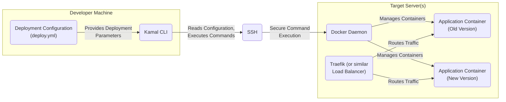
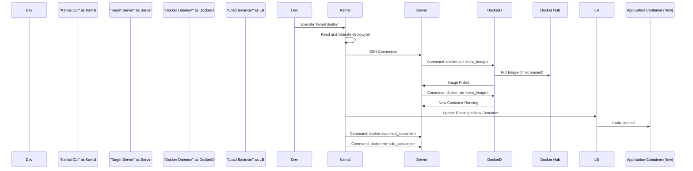

# Project Design Document: Kamal Deployment Tool

**Version:** 1.1
**Date:** October 26, 2023
**Author:** AI Software Architect

## 1. Introduction

This document provides an enhanced architectural design of Kamal, a zero-downtime deployment tool for web applications, as described in the GitHub repository: [https://github.com/basecamp/kamal](https://github.com/basecamp/kamal). This revision aims to provide greater clarity and detail regarding the system's components, interactions, and data flow, solidifying its role as a foundation for future threat modeling activities.

## 2. Goals

*   Provide a more detailed and refined architectural description of the Kamal deployment tool.
*   Elaborate on the responsibilities and functionalities of each key component.
*   Present a clearer and more comprehensive illustration of the data flow during a typical deployment process.
*   Expand on the initial security considerations, providing more specific examples.
*   Maintain a comprehensive and well-structured overview suitable for detailed threat modeling exercises.

## 3. Target Audience

This document is intended for:

*   Security engineers responsible for conducting threat modeling and security assessments.
*   Software developers actively contributing to the development and maintenance of the Kamal project.
*   Operations engineers involved in deploying, managing, and troubleshooting applications using Kamal.
*   Technical stakeholders seeking a thorough understanding of Kamal's architecture and operational mechanics.

## 4. System Overview

Kamal is a command-line interface (CLI) tool designed to streamline the deployment of web applications to one or more remote servers. It achieves zero-downtime deployments by leveraging SSH for secure remote command execution and Docker for application containerization. The core deployment strategy involves creating and launching new application containers alongside existing ones, and then seamlessly switching network traffic to the new containers once they are healthy.

## 5. Architectural Design

### 5.1. High-Level Architecture

*   **Developer Machine:** The local workstation or development environment where the developer interacts with the Kamal CLI to initiate and manage deployments.
    *   **Kamal CLI:** The primary interface for interacting with Kamal. It parses the deployment configuration, establishes secure SSH connections, and orchestrates the deployment process on the target server(s).
    *   **Deployment Configuration (`deploy.yml`):** A YAML-formatted file that defines all the necessary parameters and instructions for deploying the application, including server details, Docker image specifications, environment variables, and load balancer configurations.
*   **SSH:** The Secure Shell protocol, providing an encrypted communication channel for the Kamal CLI to securely connect to and execute commands on the remote target server(s).
*   **Target Server(s):** The remote infrastructure (physical or virtual servers) where the application will be deployed and run.
    *   **Docker Daemon:** The background service on the target server responsible for building, running, managing, and orchestrating Docker containers. It receives instructions from the Kamal CLI via SSH.
    *   **Application Container (Old Version):** The currently active version of the web application running within a Docker container, serving live traffic.
    *   **Application Container (New Version):** The newly deployed version of the web application, also running within a Docker container. This container is started and verified before traffic is switched to it.
    *   **Traefik (or similar Load Balancer):** A reverse proxy and load balancer that intelligently routes incoming network traffic to the appropriate application container. Kamal often integrates with Traefik's dynamic configuration capabilities to facilitate seamless traffic switching during deployments.

### 5.2. Component Description

*   **Kamal CLI:**
    *   **Responsibilities:**
        *   Parsing and validating the `deploy.yml` configuration file to extract deployment parameters.
        *   Establishing secure SSH connections to the designated target server(s) using provided credentials or keys.
        *   Orchestrating the deployment workflow by executing a series of Docker commands on the remote server(s).
        *   Interacting with the load balancer (e.g., Traefik API or configuration files) to update routing rules for zero-downtime switching.
        *   Monitoring the deployment process and providing feedback to the user.
        *   Supporting rollback operations to revert to previous deployments.
    *   **Key Functions:**
        *   `deploy`: Initiates a new deployment.
        *   `rollback`: Reverts to the previously deployed version.
        *   `restart`: Restarts the application containers.
        *   `stop`: Stops the application containers.
        *   `redeploy`: Performs a fresh deployment, potentially rebuilding images.
        *   `config`: Manages and validates the deployment configuration.
*   **Deployment Configuration (`deploy.yml`):**
    *   **Responsibilities:**
        *   Defining the target environment(s) for deployment, including server hostnames/IP addresses and SSH connection details.
        *   Specifying the Docker image to be used for the application, including the image name and tag.
        *   Configuring environment variables that will be passed to the application containers at runtime.
        *   Defining load balancer settings, such as entry points and routing rules.
        *   Specifying health check endpoints for verifying the readiness of new containers.
        *   Defining rollback strategies and parameters.
        *   Potentially including secrets or references to secrets management systems.
    *   **Key Information:**
        *   `servers`: List of target server hostnames or IP addresses.
        *   `ssh_user`: Username for SSH connections.
        *   `ssh_key`: Path to the SSH private key.
        *   `image`: Docker image name and tag.
        *   `env`: Dictionary of environment variables.
        *   `traefik`: Configuration settings for Traefik integration.
        *   `healthcheck_url`: URL for health checks.
*   **SSH:**
    *   **Responsibilities:**
        *   Providing a secure and encrypted communication channel between the Kamal CLI and the target server(s).
        *   Authenticating the Kamal CLI to the remote server(s) using SSH keys or passwords.
        *   Facilitating the remote execution of commands issued by the Kamal CLI.
    *   **Key Aspects:**
        *   Relies on public-key cryptography for secure authentication.
        *   Encrypts all communication to protect against eavesdropping and tampering.
        *   Requires proper configuration and management of SSH keys.
*   **Docker Daemon:**
    *   **Responsibilities:**
        *   Receiving and processing commands from the Kamal CLI (via SSH) to manage Docker images and containers.
        *   Pulling Docker images from configured registries (e.g., Docker Hub, private registries).
        *   Building Docker images (if instructed).
        *   Creating, starting, stopping, and removing Docker containers.
        *   Managing container networking, including port mappings and network configurations.
        *   Managing container volumes for persistent data storage.
    *   **Key Functions:**
        *   `docker pull`: Downloads a Docker image from a registry.
        *   `docker run`: Creates and starts a Docker container.
        *   `docker stop`: Stops a running Docker container.
        *   `docker rm`: Removes a stopped Docker container.
        *   `docker ps`: Lists running containers.
*   **Application Container:**
    *   **Responsibilities:**
        *   Hosting the running instance of the web application and its dependencies.
        *   Serving incoming requests on specified ports.
        *   Executing the application code.
        *   Potentially interacting with other services like databases, message queues, or caches.
    *   **Key Aspects:**
        *   Encapsulates the application and its runtime environment.
        *   Provides isolation from other containers and the host system.
        *   Its lifecycle is managed by the Docker daemon.
*   **Traefik (or similar Load Balancer):**
    *   **Responsibilities:**
        *   Acting as a reverse proxy, accepting incoming traffic and forwarding it to the appropriate backend application container.
        *   Load balancing traffic across multiple instances of the application for improved performance and resilience.
        *   Performing health checks on application containers to ensure they are healthy and ready to receive traffic.
        *   Dynamically updating routing configurations based on events like new container deployments, enabling zero-downtime deployments.
    *   **Key Functions:**
        *   Route incoming HTTP/HTTPS requests based on hostnames, paths, or other criteria.
        *   Perform SSL/TLS termination.
        *   Provide metrics and monitoring information.
        *   Integrate with service discovery mechanisms (like Docker's built-in service discovery).

### 5.3. Data Flow Diagram (Deployment Process)

1. **Developer initiates deployment:** A developer executes the `kamal deploy` command on their local machine.
2. **Kamal CLI processes configuration:** The Kamal CLI reads and validates the `deploy.yml` file to gather deployment instructions and parameters.
3. **Establish SSH connection:** The Kamal CLI establishes a secure SSH connection to the target server(s) specified in the configuration.
4. **Pull new Docker image:** The Kamal CLI instructs the Docker daemon on the target server to pull the specified new Docker image.
5. **Docker pulls image (if necessary):** The Docker daemon pulls the Docker image from the configured registry (e.g., Docker Hub) if it's not already present locally.
6. **Image pulled:** The Docker daemon confirms the successful download of the new image.
7. **Run new container:** The Kamal CLI instructs the Docker daemon to run a new container based on the newly pulled image, configuring it with the specified environment variables and port mappings.
8. **New container running:** The Docker daemon starts the new application container.
9. **Update load balancer routing:** The Kamal CLI interacts with the load balancer (e.g., via its API or configuration files) to update the routing rules, directing incoming traffic to the newly deployed container. This is the critical step for achieving zero-downtime deployment.
10. **Traffic routed to new container:** The load balancer begins routing new incoming requests to the newly launched application container.
11. **Stop old container:** After verifying the health and proper functioning of the new container, the Kamal CLI instructs the Docker daemon to stop the old application container.
12. **Remove old container:** Finally, the Kamal CLI instructs the Docker daemon to remove the stopped old application container, cleaning up resources.

## 6. Security Considerations (Detailed)

Building upon the initial assessment, here are more detailed security considerations for Kamal:

*   **SSH Key Management:**
    *   **Threat:** Compromised SSH private keys could grant unauthorized access to target servers, allowing attackers to execute arbitrary commands, modify configurations, or exfiltrate data.
    *   **Mitigation:**
        *   Store SSH private keys securely with appropriate file permissions (e.g., `chmod 600`).
        *   Avoid storing private keys in version control systems.
        *   Consider using SSH agents or key management tools to manage keys securely.
        *   Implement SSH certificate-based authentication for enhanced security and centralized key management.
        *   Regularly rotate SSH keys.
*   **Secrets Management in `deploy.yml`:**
    *   **Threat:** Storing sensitive information directly in `deploy.yml` exposes it to anyone with access to the file, including potential attackers.
    *   **Mitigation:**
        *   **Environment Variables:** Prefer using environment variables to inject secrets into containers at runtime.
        *   **Secrets Management Tools:** Integrate with dedicated secrets management solutions like HashiCorp Vault, AWS Secrets Manager, or Azure Key Vault.
        *   **Configuration Encryption:** Explore encrypting sensitive sections of the `deploy.yml` file.
        *   **Avoid Committing Secrets:** Ensure `.gitignore` includes `deploy.yml` if it contains sensitive information, and avoid committing secrets directly to version control.
*   **Docker Image Security:**
    *   **Threat:** Vulnerabilities in Docker images can be exploited to compromise the application or the underlying host system.
    *   **Mitigation:**
        *   **Regularly Scan Images:** Implement automated Docker image scanning as part of the CI/CD pipeline to identify vulnerabilities.
        *   **Use Trusted Base Images:** Base application images on official or well-maintained and trusted base images.
        *   **Minimize Image Layers:** Reduce the number of layers in Docker images to decrease the attack surface.
        *   **Follow Docker Security Best Practices:** Adhere to Docker security best practices during image creation.
        *   **Implement Content Trust:** Use Docker Content Trust to ensure the integrity and authenticity of pulled images.
*   **Network Security:**
    *   **Threat:** Unauthorized access to target servers via SSH or other network protocols.
    *   **Mitigation:**
        *   **Disable Password Authentication:** Disable password-based SSH authentication and rely solely on SSH keys.
        *   **Use Strong Ciphers:** Configure SSH to use strong cryptographic ciphers.
        *   **Firewall Rules:** Implement firewall rules to restrict access to the target servers, allowing only necessary ports and IP addresses.
        *   **Network Segmentation:** Segment the network to isolate the target servers from other less trusted networks.
*   **Load Balancer Security:**
    *   **Threat:** Misconfigured or vulnerable load balancers can be exploited to gain unauthorized access, disrupt service, or intercept traffic.
    *   **Mitigation:**
        *   **Secure Configuration:** Follow security best practices for configuring the load balancer (e.g., disabling unnecessary features, setting strong authentication).
        *   **Regular Updates:** Keep the load balancer software up-to-date with the latest security patches.
        *   **Access Control:** Implement access controls to restrict who can manage the load balancer configuration.
        *   **HTTPS/TLS:** Enforce HTTPS and properly configure TLS certificates.
*   **Access Control on Target Servers:**
    *   **Threat:** Unauthorized users gaining access to the target servers or the Docker daemon.
    *   **Mitigation:**
        *   **Principle of Least Privilege:** Grant only necessary permissions to user accounts on the target servers.
        *   **Secure Docker Daemon Socket:** Restrict access to the Docker daemon socket.
        *   **Regularly Review User Accounts:** Periodically review and remove unnecessary user accounts.
*   **Supply Chain Security:**
    *   **Threat:** Compromised dependencies or tools used by Kamal could introduce vulnerabilities.
    *   **Mitigation:**
        *   **Dependency Scanning:** Regularly scan Kamal's dependencies for known vulnerabilities.
        *   **Use Trusted Sources:** Obtain Kamal and its dependencies from trusted sources.
        *   **Verify Signatures:** Verify the signatures of downloaded packages.
*   **Configuration Management Security:**
    *   **Threat:** Unauthorized modification or access to the `deploy.yml` configuration file.
    *   **Mitigation:**
        *   **Restrict Access:** Limit access to the `deploy.yml` file to authorized personnel.
        *   **Version Control:** Store `deploy.yml` in a version control system with appropriate access controls and audit logging.

## 7. Deployment

Kamal is deployed by installing the Ruby gem on the developer's local machine or within a CI/CD environment. No specific server-side installation of Kamal is required, as it operates by remotely executing commands via SSH.

*   **Installation:** Install the Kamal gem using `gem install kamal`.
*   **Configuration:** Create a `deploy.yml` file in the root of the application repository.
*   **Execution:** Run Kamal commands from the command line within the application repository.

## 8. Future Considerations

*   **Enhanced Secrets Management Integration:** Deeper integration with various secrets management providers, potentially through a plugin architecture.
*   **Advanced Monitoring and Logging:** Built-in capabilities for monitoring deployment status, application health, and logging deployment activities.
*   **Support for More Deployment Strategies:** Expanding support for deployment strategies beyond basic rolling updates, such as blue/green deployments without solely relying on load balancer switching, and canary deployments.
*   **Improved Error Handling and Rollback Mechanisms:** More robust error handling and more granular control over rollback procedures.
*   **GUI or Web Interface:**  Consideration of a graphical user interface or web interface for managing deployments.
*   **Integration with Orchestration Tools:** Potential integration with other orchestration tools like Kubernetes for more complex deployments.
*   **Plugin System:**  Developing a plugin system to extend Kamal's functionality and support different infrastructure providers or deployment scenarios.

## 9. Conclusion

This enhanced design document provides a more detailed and comprehensive understanding of the Kamal deployment tool's architecture. By elaborating on the responsibilities of each component, clarifying the data flow, and expanding on security considerations, this document serves as a robust foundation for conducting thorough threat modeling exercises and ensuring the secure and reliable deployment of applications using Kamal.