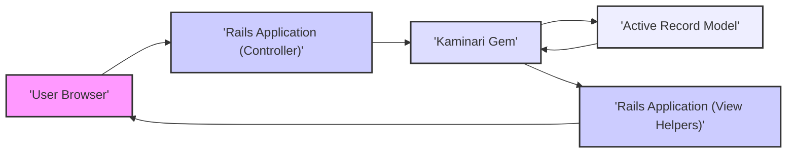
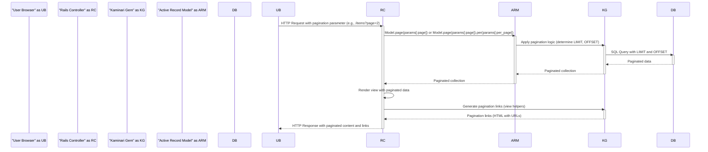

# Project Design Document: Kaminari Pagination Gem

**Version:** 1.1
**Date:** October 26, 2023
**Author:** AI Software Architect

## 1. Introduction

This document provides a detailed design overview of the Kaminari pagination gem, a widely used library for implementing pagination in Ruby on Rails applications. This document is specifically created to serve as a foundation for subsequent threat modeling activities. It meticulously outlines the architecture, components, data flow, and key functionalities of Kaminari, enabling a comprehensive understanding of its potential attack surfaces and vulnerabilities within the context of a web application.

## 2. Goals and Objectives

*   To provide a clear and comprehensive architectural description of the Kaminari gem.
*   To identify the key components of Kaminari and their interactions with the encompassing Ruby on Rails application.
*   To meticulously describe the data flow involved in a typical pagination request and response cycle.
*   To establish a solid foundation for identifying potential security threats, vulnerabilities, and attack vectors associated with the Kaminari gem.
*   To facilitate informed decision-making regarding security controls, mitigations, and secure coding practices when utilizing Kaminari.

## 3. Scope

This document focuses specifically on the design and functionality of the Kaminari gem itself and its immediate interactions within a Ruby on Rails application. It covers:

*   The internal components and modules of the Kaminari gem.
*   The interfaces and interactions between Kaminari and the Ruby on Rails application's models, controllers, and views.
*   The flow of data during a pagination request, from user interaction to data rendering.
*   Key configuration options provided by Kaminari that influence its behavior.

This document does *not* cover:

*   The overall security posture of the Ruby on Rails application that integrates Kaminari.
*   Low-level implementation details within the Kaminari gem's codebase.
*   Specific deployment environments, infrastructure, or operational security aspects.
*   Detailed threat modeling outputs, specific attack scenarios, or concrete mitigation strategies (these will be derived from this document).

## 4. High-Level Architecture

Kaminari functions as an integral middleware component within a Ruby on Rails application. It intercepts and processes requests related to pagination, manipulating data retrieval from models and influencing view rendering to present paginated results to the user.

**Component Descriptions:**

*   **User Browser:** The client application (typically a web browser) that initiates requests for paginated data from the Rails application.
*   **Rails Application (Controller):** The component responsible for handling incoming HTTP requests, interacting with models to retrieve data, and utilizing Kaminari to manage pagination logic.
*   **Kaminari Gem:** The core pagination library, responsible for slicing data collections into pages and providing view helpers for generating pagination links.
*   **Active Record Model:** The data access layer that interacts with the database to retrieve the data that needs to be paginated. Kaminari extends these models with pagination capabilities.
*   **Rails Application (View Helpers):**  Kaminari provides helper methods that are used within the Rails application's views to generate the HTML elements for pagination links, allowing users to navigate between pages.

## 5. Detailed Design

### 5.1 Core Components of Kaminari

*   **`Kaminari::Paginatable::ModelExtension` (Concern):** This module is included in Active Record models to imbue them with pagination capabilities. It introduces methods like `page` and `per` to the model.
    *   *Security Relevance:* Improperly secured models using this extension could be vulnerable to pagination parameter manipulation.
*   **Page Scope (Implicit):** When the `page` method is called on a model, Kaminari internally applies a scope to the Active Record query. This scope uses `LIMIT` and `OFFSET` clauses to retrieve only the records for the requested page.
    *   *Security Relevance:*  Understanding how Kaminari constructs these queries is crucial for identifying potential SQL injection risks (though Kaminari itself doesn't directly introduce them, misuse in conjunction with other code could).
*   **View Helpers (e.g., `paginate`, `prev_page_link`, `next_page_link`):** These helper methods are used in the Rails views to generate the HTML links for navigating between pages. They construct URLs with the appropriate pagination parameters.
    *   *Security Relevance:*  These helpers must properly escape user-provided data or parameters to prevent Cross-Site Scripting (XSS) vulnerabilities. The structure of the generated URLs is also important for preventing parameter tampering.
*   **Configuration Options:** Kaminari offers various configuration options to customize its behavior. These can be set globally or per-model.
    *   `default_per_page`: Sets the default number of items displayed per page.
        *   *Security Relevance:* A very high default value could lead to performance issues or resource exhaustion.
    *   `max_per_page`: Defines the maximum allowed number of items per page.
        *   *Security Relevance:*  Crucial for preventing users from requesting excessively large pages, which could cause DoS.
    *   `param_name`:  Specifies the name of the query parameter used to indicate the current page number (default: `page`).
        *   *Security Relevance:* While changing this doesn't inherently introduce vulnerabilities, consistent usage and understanding are important for security analysis.
    *   `window`, `outer_window`, `left`, `right`: Control the number of pagination links displayed around the current page.
        *   *Security Relevance:* Primarily related to user experience, but understanding the link generation logic is relevant for analyzing potential manipulation points.
    *   `page_method_name`: Allows changing the name of the pagination method added to models (default: `page`).
        *   *Security Relevance:*  Primarily a code organization concern, but consistency aids in security reviews.
    *   `per_page_kaminari_param_name`:  Specifies the query parameter name for setting the number of items per page.
        *   *Security Relevance:*  Similar to `param_name`, understanding its usage is important for security analysis and preventing unintended parameter injection.

### 5.2 Interaction with Rails Application

The typical flow of a pagination request using Kaminari involves these steps:

1. **User Initiates Request:** A user interacts with the application (e.g., clicks a pagination link), sending an HTTP request to the Rails application. This request typically includes a pagination parameter in the query string (e.g., `?page=2`).
2. **Controller Receives Request:** The Rails controller receives the HTTP request and extracts the pagination parameter (e.g., using `params[:page]`).
3. **Model Interaction with Kaminari:** The controller interacts with an Active Record model that has included `Kaminari::Paginatable::ModelExtension`. The controller calls the `page` method on the model, passing the extracted page number (e.g., `Model.page(params[:page])`). Optionally, the `per` method can be used to specify the number of items per page (e.g., `Model.page(params[:page]).per(params[:per_page])`).
4. **Kaminari Applies Pagination Logic:** The `page` method triggers Kaminari's logic. It determines the appropriate `LIMIT` and `OFFSET` values based on the requested page number and the configured `per_page` value.
5. **Data Retrieval from Database:** Kaminari modifies the Active Record query to include the `LIMIT` and `OFFSET` clauses, and the database retrieves only the records for the current page.
6. **Controller Passes Paginated Data to View:** The controller receives the paginated collection of data from the model.
7. **View Renders Pagination Links:** The Rails view uses Kaminari's view helpers (e.g., `paginate @items`) to generate the HTML for the pagination links. These links will contain URLs with updated `page` parameters for navigating to other pages.
8. **Response Sent to User:** The Rails application sends the rendered HTML, including the paginated content and the pagination links, back to the user's browser.

### 5.3 Data Flow Diagram

## 6. Security Considerations (For Threat Modeling)

Based on the design and data flow, the following are key areas of security concern that should be thoroughly investigated during threat modeling:

*   **Unvalidated Parameter Input (Page Parameter):**
    *   **Threat:** Attackers might manipulate the `page` parameter in the URL to inject non-integer values, negative numbers, or excessively large numbers.
    *   **Potential Vulnerabilities:** This could lead to application errors, unexpected behavior, or potentially resource exhaustion on the database server if not properly validated.
*   **Unvalidated Parameter Input (Per Page Parameter):**
    *   **Threat:** If the `per_page` parameter is exposed and not properly validated, attackers could request an extremely large number of items per page.
    *   **Potential Vulnerabilities:** This could lead to denial-of-service (DoS) attacks by overloading the database or application server with a single request.
*   **Information Disclosure through Pagination Logic:**
    *   **Threat:**  Improperly implemented authorization checks in conjunction with pagination could inadvertently expose data that the user is not authorized to see on subsequent pages.
    *   **Potential Vulnerabilities:**  Care must be taken to ensure that authorization is applied *before* pagination, not after.
*   **Cross-Site Scripting (XSS) via Pagination Links:**
    *   **Threat:** If the Kaminari view helpers do not properly escape parameters when generating pagination links, attackers could inject malicious JavaScript code into the URLs.
    *   **Potential Vulnerabilities:** This could lead to XSS attacks if a user clicks on a manipulated pagination link.
*   **SQL Injection (Indirect):**
    *   **Threat:** While Kaminari itself doesn't directly construct SQL from user input, if the pagination parameters are used in dynamically constructed SQL queries elsewhere in the application without proper sanitization, it could create an SQL injection vulnerability.
    *   **Potential Vulnerabilities:** This highlights the importance of secure coding practices throughout the application, not just within Kaminari.
*   **Mass Assignment Vulnerabilities (Indirect):**
    *   **Threat:** If the `per_page` attribute is allowed to be mass-assigned on a model without proper safeguards, attackers could potentially manipulate this value to bypass intended limits.
    *   **Potential Vulnerabilities:** This emphasizes the need for strong parameter whitelisting and input validation.
*   **Configuration Vulnerabilities:**
    *   **Threat:**  Insecure default configurations or improper handling of configuration options (e.g., allowing users to override `max_per_page` without validation) could introduce vulnerabilities.
    *   **Potential Vulnerabilities:**  Reviewing and securing Kaminari's configuration is crucial.

## 7. Future Security Considerations

*   **Integration with Security Headers:**  Consider how Kaminari's generated links might interact with security headers like Content Security Policy (CSP).
*   **Rate Limiting for Pagination Requests:**  Explore the potential benefits of implementing rate limiting on pagination requests to mitigate DoS attacks.
*   **Auditing of Pagination Parameter Usage:**  Implement logging and monitoring to track the usage of pagination parameters and identify suspicious activity.
*   **Secure Defaults for Configuration:**  Ensure that Kaminari's default configuration options are secure and encourage developers to review and adjust them appropriately.

This document provides a detailed architectural overview of the Kaminari pagination gem, specifically tailored for threat modeling purposes. It highlights the key components, data flow, and potential areas of security concern that should be further investigated to ensure the secure implementation of pagination in Ruby on Rails applications.