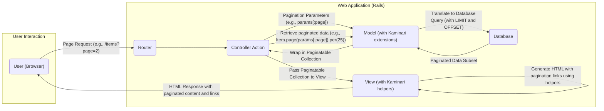

## Project Design Document: Kaminari Pagination Gem

**Version:** 1.1
**Date:** October 26, 2023
**Author:** Gemini (AI Language Model)

### 1. Introduction

This document provides an enhanced architectural design overview of the Kaminari pagination gem, a widely adopted Ruby library designed to simplify the implementation of pagination within web applications, particularly those built using Ruby on Rails. This document aims to offer a detailed understanding of Kaminari's architecture, its constituent components, and the flow of data within the system. This detailed view is specifically intended to serve as a robust foundation for subsequent threat modeling exercises.

### 2. Goals

The primary objective of this document is to deliver a clear, comprehensive, and architecturally focused description of the Kaminari gem. This includes:

*   Clearly identifying the core components that constitute the gem.
*   Detailing the interactions and dependencies between these components.
*   Visually illustrating the data flow as it traverses the system.
*   Explicitly highlighting potential areas of security vulnerability from an architectural standpoint, specifically to inform threat modeling.

This document is explicitly designed to be used as a key input for a thorough threat modeling process.

### 3. System Overview

Kaminari is a Ruby gem that provides a straightforward and adaptable method for paginating data in web applications. It offers a suite of helpers for rendering pagination navigation elements in views and provides methods for managing data pagination at the model layer. The fundamental purpose of Kaminari is to divide a potentially large collection of data into smaller, more user-friendly pages for display within a user interface.

Kaminari is designed for seamless integration with prevalent Ruby Object-Relational Mappers (ORMs) such as ActiveRecord and Mongoid, offering convenient methods for paginating database query results. Furthermore, it extends its capabilities to support the pagination of in-memory arrays and other enumerable Ruby objects.

### 4. Component Design

Kaminari's functionality can be logically divided into the following key components:

*   **View Helpers:** These are Ruby helper methods intended for use within the view layer of a web application. Their primary responsibility is to generate the HTML markup for pagination navigation links. This includes links for moving to the "Previous" and "Next" pages, as well as direct links to specific page numbers. Examples of these helpers include `paginate` and `page_entries_info`. They utilize the pagination metadata provided by Kaminari to dynamically generate these links.
*   **Controller Integration:** While Kaminari doesn't impose a strict structure on controller actions, its typical usage involves retrieving a paginated collection of data within a controller action. The controller is responsible for receiving the user's page request (often via URL parameters), invoking Kaminari's methods to paginate the data, and then passing this paginated collection to the view for rendering.
*   **Model Extensions (Paginatable Module):** Kaminari extends Ruby model classes (such as ActiveRecord models) by including a module that provides methods to facilitate pagination. Key methods provided by this extension include `page(num)` which specifies the desired page number, and `per(count)` which sets the number of items to be displayed on each page. These methods are crucial for constructing the appropriate database queries for pagination.
*   **Configuration:** Kaminari offers a set of configuration options that allow developers to customize its behavior. These options include setting the default number of items to display per page, defining the "window" size around the current page in the pagination links (e.g., how many page numbers are displayed before and after the current page), and customizing the HTML structure and styling of the generated pagination links.
*   **Adapters:** To ensure compatibility with different data sources and ORMs, Kaminari employs an adapter pattern. These adapters encapsulate the specific logic required to paginate queries based on the underlying data storage mechanism. For instance, the ActiveRecord adapter translates Kaminari's pagination parameters into SQL queries using `LIMIT` and `OFFSET` clauses. Other adapters exist for different ORMs like Mongoid.

### 5. Data Flow

The typical flow of data when utilizing Kaminari for pagination in a web application can be visualized as follows:

**Detailed Data Flow Description:**

1. **User Interaction:** A user interacts with the web application, typically by clicking on a pagination link (e.g., "Next", a specific page number) or by directly entering a URL with a `page` query parameter.
2. **Routing:** The web application's router (e.g., in a Rails application, `config/routes.rb`) receives the incoming request. Based on the URL pattern, the router directs the request to the appropriate controller action. The request often includes a `page` parameter indicating the desired page number.
3. **Controller Action:** The designated controller action receives the request. It extracts the pagination parameters, most commonly the `page` number from the request parameters (e.g., `params[:page]`).
4. **Model Interaction and Pagination:** The controller action then interacts with the application's model, leveraging Kaminari's model extensions. Methods like `.page(params[:page])` and `.per(n)` are called on the model. These methods utilize Kaminari's logic and the configured adapter to prepare for data retrieval.
5. **Database Query Construction:** Kaminari's adapter translates the pagination parameters (page number, items per page) into a database-specific query. For relational databases, this typically involves adding `LIMIT` and `OFFSET` clauses to the SQL query.
6. **Database Query Execution:** The model executes the constructed database query against the data store.
7. **Paginated Data Retrieval:** The database returns a subset of the data, representing the records for the requested page.
8. **Wrapping in Paginatable Collection:** Kaminari wraps the retrieved data subset into a `PaginatableArray` (or a similar object depending on the data source). This object holds the paginated data and also provides metadata about the pagination, such as the current page number, total number of pages, and total record count.
9. **Passing to the View:** The controller action passes this paginatable collection to the view layer.
10. **View Rendering and Helper Usage:** Within the view template, Kaminari's view helpers (e.g., `paginate`) are used. These helpers take the paginatable collection as input and generate the HTML markup for the pagination navigation links. They use the metadata within the collection to determine how many links to display, which link is currently active, and the URLs for the other pages.
11. **HTML Response Generation:** The view renders the complete HTML, incorporating the paginated data and the generated pagination links. This HTML response is then sent back to the user's browser.

### 6. Security Considerations and Potential Threats

From an architectural standpoint, several security considerations and potential threats are relevant when employing Kaminari for pagination:

*   **Unvalidated Page Parameter (Input Injection):** The `page` parameter in the URL is directly controlled by the user. Insufficient validation of this parameter can lead to various issues:
    *   **Integer Overflow/Underflow:** Maliciously crafted extremely large or negative page numbers could cause unexpected application behavior, potentially leading to errors or resource exhaustion.
    *   **Non-Integer Values:** The application should robustly handle cases where the `page` parameter is not a valid integer. Failing to do so could lead to application errors or vulnerabilities.
    *   **Database Performance Impact (Excessive Offset):**  While Kaminari and databases generally handle large offsets, extremely large page numbers could, in some scenarios, lead to inefficient database queries and performance degradation, potentially leading to a denial-of-service.
*   **Unvalidated Per Parameter (Resource Exhaustion):** If the number of items per page (`per` parameter) is user-configurable (less common but possible), inadequate validation poses risks:
    *   **Memory Exhaustion:** Allowing excessively large values for `per` could lead to the application attempting to load a very large number of records into memory at once, potentially causing memory exhaustion and application crashes.
    *   **Database Performance Impact:**  Requesting a very large number of records per page can also strain the database server, impacting overall application performance and potentially leading to denial-of-service for other users.
*   **Information Disclosure via Pagination Metadata:** The pagination information itself (e.g., total number of pages, total number of records) can inadvertently reveal sensitive information about the underlying data set. Consider whether exposing the total count of certain types of records could be exploited.
*   **Denial of Service (DoS) through Manipulation:**  While Kaminari itself isn't a direct source of DoS vulnerabilities, improper integration or lack of rate limiting can be exploited:
    *   **Rapid Page Requests:** An attacker could rapidly request a large number of different pages, potentially overwhelming the application server or the database if data retrieval is resource-intensive and not properly cached.
*   **Cross-Site Scripting (XSS) through Pagination Link Generation:** Although Kaminari's view helpers generally handle output escaping correctly when used with standard Rails practices, vulnerabilities could arise if:
    *   Custom pagination link rendering logic is implemented without proper attention to output encoding.
    *   Vulnerabilities exist in other parts of the view that interact with the pagination links.
*   **Mass Assignment Vulnerabilities (Indirect):**  While not directly a Kaminari issue, if pagination parameters are naively used to update model attributes without proper filtering, it could open doors to mass assignment vulnerabilities. This is a broader application security concern but relevant in the context of handling user input related to pagination.

### 7. Deployment Considerations

Kaminari, being a Ruby gem, is typically deployed as an integral part of a Ruby on Rails application. Deployment considerations specific to Kaminari are largely aligned with general Ruby gem and web application deployment best practices:

*   **Dependency Management:** Ensure Kaminari is correctly specified as a dependency in the application's `Gemfile` and that all dependencies are resolved during deployment.
*   **Performance Tuning:**  For applications dealing with large datasets, optimize database queries through indexing and consider caching strategies to improve pagination performance. Monitor database and application server performance under load.
*   **Scalability:**  As application traffic grows, ensure that the underlying infrastructure (database servers, application servers) can handle the increased load associated with pagination requests. Consider horizontal scaling and load balancing.

### 8. Assumptions and Dependencies

This design document operates under the following assumptions:

*   Kaminari is primarily used within the context of a Ruby on Rails web application.
*   The underlying data is typically stored in a relational database accessed through an ORM like ActiveRecord.
*   Standard web application security best practices are followed throughout the application development lifecycle.

Kaminari has the following key dependencies:

*   **Ruby:** The core programming language.
*   **Rails (or a compatible Ruby web framework):** For seamless integration within the web application environment.
*   **An Object-Relational Mapper (ORM) (e.g., ActiveRecord, Mongoid):** To facilitate interaction with the data store.

### 9. Future Considerations

Potential future enhancements and considerations for Kaminari might include:

*   **Enhanced Accessibility Features:** Further improvements to ensure pagination controls are fully accessible to users with disabilities, adhering to WCAG guidelines.
*   **Performance Optimizations for Very Large Datasets:** Exploring advanced techniques for optimizing pagination performance when dealing with extremely large datasets, potentially involving database-specific optimizations or cursor-based pagination.
*   **Improved Integration with Front-End Frameworks:**  Providing more robust and streamlined integration with modern JavaScript front-end frameworks (e.g., React, Vue.js, Angular) to facilitate dynamic and asynchronous pagination experiences.
*   **Standardized API for Customization:**  Developing a more standardized and well-defined API for customizing the behavior and appearance of pagination, making it easier for developers to extend and adapt Kaminari to their specific needs.

This enhanced design document provides a more detailed and security-focused architectural overview of the Kaminari pagination gem, specifically tailored for use in threat modeling activities. By providing a deeper understanding of its components, data flow, and potential security vulnerabilities, this document aims to empower developers and security professionals to effectively assess and mitigate risks associated with its implementation.