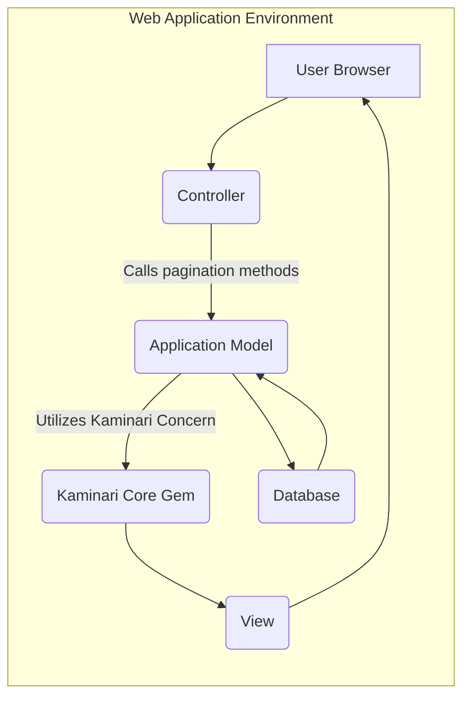
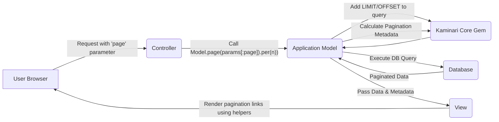

# Project Design Document: Kaminari Pagination Library - Improved

**Version:** 1.1
**Date:** October 26, 2023
**Author:** AI Software Architect

## 1. Introduction

This document provides an enhanced design overview of the Kaminari pagination library, a widely adopted gem for implementing pagination in Ruby on Rails and other Ruby web applications. This improved document aims for greater clarity and detail regarding Kaminari's architecture, components, and data flow, specifically tailored for effective threat modeling and security analysis.

Kaminari streamlines the process of dividing large datasets into discrete pages for user-friendly display within web applications. This document expands upon the previous version by providing more granular details about component interactions, data transformations, and specific security considerations with potential mitigation strategies.

## 2. Goals and Objectives

The core goals of Kaminari remain:

* **Simplified Pagination Implementation:** Offer an intuitive and straightforward API for paginating data in Ruby web applications, reducing boilerplate code.
* **Extensive Customization Capabilities:** Provide developers with the flexibility to tailor the appearance, behavior, and rendering of pagination links to match application-specific requirements.
* **Broad Framework Compatibility:** While primarily integrated with Rails, maintain a design that allows for adaptation and use within other Ruby web frameworks and contexts.
* **Optimized Performance:** Ensure efficient pagination logic to minimize database load, reduce query execution times, and maintain responsive user experiences.

This improved design document aims to:

* Provide a more detailed breakdown of Kaminari's internal components and their specific interactions within the broader web application ecosystem.
* Offer a more granular illustration of the data flow during a pagination request, including specific method calls and data transformations.
* Identify potential security vulnerabilities with greater precision and suggest concrete mitigation strategies for each identified risk.

## 3. System Architecture

Kaminari functions as a middleware component deeply integrated within a Ruby web application's request-response cycle. Its primary interactions occur with the application's model layer for data retrieval and the view layer for rendering pagination controls.

Key components and their enhanced descriptions:

* **Kaminari Core Gem:** The central library encapsulating the core pagination logic. It comprises:
    * **`Kaminari::Paginatable::Concern`:** A module designed to be included in ActiveRecord models (or other data-fetching objects). It injects pagination-related methods like `page`, `per`, `total_pages`, and `current_page`.
    * **`Kaminari::PaginatableArray` Extension:** Provides pagination capabilities for in-memory Ruby arrays, offering flexibility beyond database-backed models.
    * **View Helpers (e.g., `paginate`):**  Helpers designed for use within view templates to generate HTML markup for pagination links, including next, previous, and specific page number links. These helpers often accept configuration options for customization.
    * **Configuration Module:** Allows global and per-model customization of pagination settings, such as the default number of items per page, the number of page links displayed around the current page (window), and parameter names.
* **Application Model (e.g., ActiveRecord Model):** The data access layer responsible for interacting with the database. When the `Kaminari::Paginatable::Concern` is included, the model gains pagination capabilities.
* **Controller:** The application component that handles incoming user requests. It receives the pagination parameters (typically the `page` parameter), interacts with the model to fetch the appropriate slice of data, and prepares the data for rendering in the view.
* **View Template (e.g., ERB, Haml):** The presentation layer where Kaminari's view helpers are invoked to render the pagination links. The view receives the paginated data collection and pagination metadata from the controller.
* **User Browser:** The client application that initiates requests for specific pages of data by interacting with the pagination links.
* **Database System:** The persistent data store where the application's data resides. Kaminari influences the queries executed against the database by adding `LIMIT` and `OFFSET` clauses.

## 4. Data Flow - Enhanced Detail

The data flow for a pagination request using Kaminari, with more specific steps:

1. **User Initiates Pagination Request:** The user interacts with a pagination link (e.g., clicks "Next", selects "Page 3") or manually modifies the URL to include a specific `page` parameter.
2. **Controller Receives Request:** The web application's controller receives the HTTP request, extracting the `page` parameter (and potentially a `per_page` parameter if the application allows user-defined page sizes).
3. **Controller Interacts with Model:** The controller calls a method on the application's model to retrieve the paginated data. This typically involves invoking Kaminari's pagination methods, such as:
    * `Model.page(params[:page])`:  Specifies the desired page number.
    * `.per(25)`:  Sets the number of items to be retrieved per page (can be a constant or a value derived from user input).
4. **Kaminari Modifies Database Query:**  Kaminari's methods within the model construct a database query, adding `LIMIT` and `OFFSET` clauses based on the requested page number and the `per_page` value. For example, for page 2 with 25 items per page, the query would include `LIMIT 25 OFFSET 25`.
5. **Database Executes Query:** The database system executes the modified query, retrieving only the relevant subset of data for the current page.
6. **Data Retrieval and Metadata Calculation:** The database returns the paginated data to the model. Kaminari's methods also calculate pagination metadata, including:
    * `total_pages`: The total number of pages available.
    * `current_page`: The currently displayed page number.
    * `limit_value`: The number of items per page.
    * `offset_value`: The starting index of the current page in the entire dataset.
7. **Controller Passes Data to View:** The controller passes the retrieved paginated data collection and the calculated pagination metadata to the view template.
8. **View Renders Pagination Links:** The view template utilizes Kaminari's view helpers (e.g., `paginate @items`) to generate the HTML for the pagination links. These links typically include URLs with different `page` parameter values, allowing the user to navigate through the pages.
9. **Response Sent to User:** The server sends the HTML response, containing the paginated data and the rendered pagination links, back to the user's browser.

## 5. Security Considerations and Mitigation Strategies

This section provides a more detailed analysis of potential security concerns and suggests specific mitigation strategies:

* **Parameter Tampering (Page Number):**
    * **Threat:** Malicious users might manipulate the `page` parameter in the URL to access unintended data or cause application errors by requesting extremely high or negative page numbers.
    * **Mitigation:**
        * **Input Validation:** Implement strict validation on the `page` parameter in the controller to ensure it is a positive integer.
        * **Range Checking:** Verify that the requested `page` number is within the valid range (1 to `total_pages`). Redirect or display an error message for out-of-range values.
* **Parameter Tampering (Per-Page Value):**
    * **Threat:** If the application allows users to specify the number of items per page (e.g., via a `per_page` parameter), attackers could set excessively large values, leading to:
        * **Denial of Service (DoS):**  Overloading the database with requests for huge amounts of data, potentially crashing the database or application server.
        * **Performance Degradation:**  Slowing down the application for all users.
    * **Mitigation:**
        * **Whitelist Allowed Values:** Define a limited set of acceptable `per_page` values and only allow those.
        * **Set Maximum Limit:** Enforce a reasonable maximum value for the `per_page` parameter.
        * **Ignore or Default:** If an invalid or excessively large `per_page` value is provided, ignore it and use a safe default value.
* **Information Disclosure through Pagination:**
    * **Threat:** If authorization checks are not consistently applied before pagination, users might be able to access data on subsequent pages that they are not authorized to view on the initial page.
    * **Mitigation:**
        * **Consistent Authorization:** Ensure that authorization logic is applied at the data access layer *before* pagination is performed. Do not rely solely on hiding links in the view.
        * **Scoped Queries:**  Use database-level scoping or filtering to ensure that only authorized data is considered for pagination.
* **Denial of Service (DoS) through Resource Exhaustion:**
    * **Threat:**  Repeated requests with large `per_page` values or requests for very high page numbers (even if within the valid range) can consume significant server resources (CPU, memory, database connections).
    * **Mitigation:**
        * **Rate Limiting:** Implement rate limiting on pagination endpoints to restrict the number of requests from a single IP address within a given time frame.
        * **Resource Monitoring:** Monitor server resources to detect and respond to potential DoS attacks.
* **SQL Injection (Indirect Risk):**
    * **Threat:** While Kaminari itself doesn't directly introduce SQL injection vulnerabilities, if the application's model layer uses user input to construct parts of the database query *before* applying Kaminari's pagination, it could be vulnerable.
    * **Mitigation:**
        * **Secure Query Practices:**  Always use parameterized queries or ORM features that automatically handle input sanitization to prevent SQL injection in the model layer.
        * **Code Review:** Regularly review code that interacts with the database to identify and fix potential SQL injection vulnerabilities.
* **Cross-Site Scripting (XSS) through Pagination Links:**
    * **Threat:** If the application dynamically generates pagination links based on user input (e.g., search terms), and these links are not properly escaped in the view, they could be a vector for XSS attacks.
    * **Mitigation:**
        * **Output Escaping:** Ensure that all dynamically generated content, including URLs in pagination links, is properly escaped in the view layer before being rendered in the HTML. Use the framework's built-in escaping mechanisms.
* **Insecure Defaults:**
    * **Threat:**  Kaminari's default configuration settings might not be optimal for all applications from a security perspective (e.g., a very high default `per_page` value).
    * **Mitigation:**
        * **Review and Customize Configuration:**  Review Kaminari's default configuration options and customize them to align with the application's security and performance requirements.

## 6. Deployment Considerations

Deploying Kaminari involves integrating the gem into the Ruby application. Key aspects include:

* **Gem Installation:** Add `gem 'kaminari'` to the application's `Gemfile` and run `bundle install`.
* **Model Integration:** Include `Kaminari::Paginatable::Concern` in the relevant ActiveRecord models.
* **View Helper Usage:** Utilize Kaminari's view helpers in the templates to render pagination links.
* **Configuration:** Customize Kaminari's behavior through initializer files or environment variables to set application-specific defaults for `per_page`, window size, and other options.
* **No Dedicated Infrastructure:** Kaminari leverages the existing web application infrastructure (application servers, database servers). No specific infrastructure components are solely required for its operation.

## 7. Future Considerations

* **Enhanced Security-Focused Documentation:** Provide more comprehensive documentation specifically addressing security best practices when using Kaminari, including common pitfalls and recommended mitigation strategies.
* **CSRF Protection for Pagination Links:** Investigate the feasibility of incorporating CSRF protection mechanisms for pagination links, especially for actions that might have side effects (though standard pagination is typically read-only).
* **Integration with Security Scanning Tools:** Explore opportunities to integrate Kaminari with static and dynamic application security testing (SAST/DAST) tools to facilitate automated vulnerability detection related to pagination.
* **More Granular Control over Link Generation:** Offer more fine-grained control over the attributes and content of generated pagination links to address specific security or accessibility requirements.

This improved design document provides a more detailed and security-focused overview of the Kaminari pagination library. By understanding these enhanced architectural details, data flow specifics, and comprehensive security considerations with mitigation strategies, development and security teams can more effectively analyze and address potential risks associated with its use.