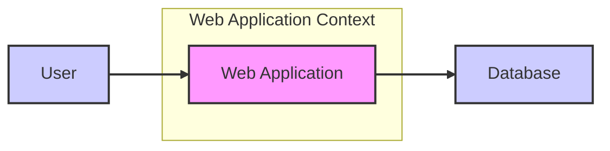
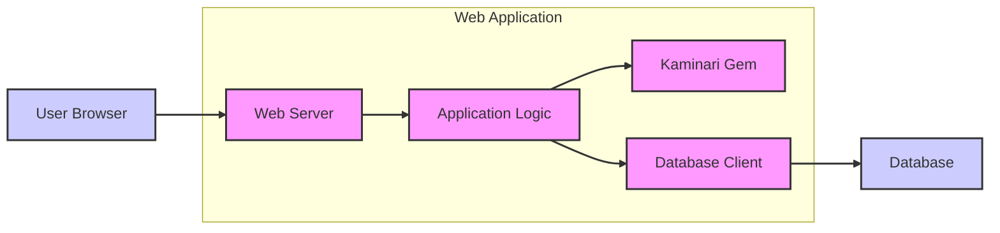
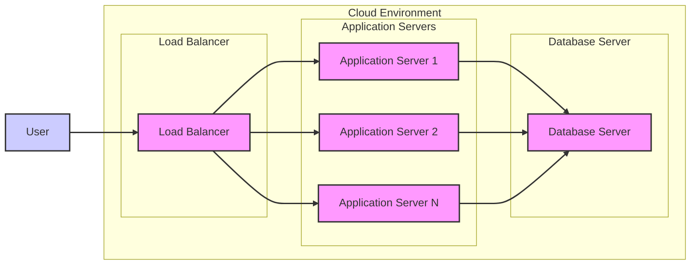

# BUSINESS POSTURE

This project, represented by the Kaminari Github repository, aims to provide efficient pagination for web applications. Pagination is crucial for user experience when dealing with large datasets, ensuring applications remain responsive and user-friendly.

- Business Priorities:
  - Enhance user experience by providing efficient data navigation.
  - Improve application performance by reducing the amount of data loaded and rendered at once.
  - Maintain application responsiveness even with large datasets.

- Business Goals:
  - Implement pagination functionality in web applications using Ruby on Rails or similar frameworks.
  - Simplify the process of adding pagination to models and views.
  - Offer customizable pagination options to suit different application needs.

- Business Risks:
  - Performance degradation if pagination is not implemented efficiently, potentially leading to slow page load times and poor user experience.
  - Denial of Service (DoS) vulnerabilities if pagination parameters are not properly validated, allowing attackers to request excessively large page numbers or page sizes, overloading the server or database.
  - Data exposure if pagination logic is flawed, potentially allowing unauthorized access to data beyond the intended page boundaries.
  - Dependency risk associated with using an open-source library. Vulnerabilities in Kaminari could impact applications using it.

# SECURITY POSTURE

The Kaminari project is a Ruby gem designed for pagination. Its security posture is inherently tied to the security of the applications that integrate and use it.

- Existing Security Controls:
  - security control: Dependency management - Bundler is used to manage gem dependencies, helping to ensure consistent and reproducible builds. (Implemented in Gemfile and Gemfile.lock)
  - security control: Open Source Security - As an open-source project, the code is publicly reviewed, increasing the likelihood of identifying and addressing security vulnerabilities. (Implemented on Github)
  - security control: Ruby on Rails Security - Applications using Kaminari often rely on the security features provided by the Ruby on Rails framework, such as protection against common web vulnerabilities. (Implemented by application using Kaminari)

- Accepted Risks:
  - accepted risk: Vulnerabilities in dependencies - Kaminari relies on other Ruby gems, and vulnerabilities in these dependencies could indirectly affect applications using Kaminari.
  - accepted risk: Vulnerabilities in Kaminari itself - Like any software, Kaminari may contain undiscovered vulnerabilities that could be exploited.
  - accepted risk: Misconfiguration - Improper use or configuration of Kaminari within an application could introduce security vulnerabilities, such as exposing more data than intended through pagination.

- Recommended Security Controls:
  - security control: Input validation - Implement robust input validation on pagination parameters (page number, per-page limit) within the application using Kaminari to prevent injection attacks and DoS attempts.
  - security control: Rate limiting - Implement rate limiting on pagination requests to mitigate potential DoS attacks by limiting the frequency of requests from a single user or IP address.
  - security control: Dependency scanning - Regularly scan Kaminari and its dependencies for known vulnerabilities using tools like Bundler Audit or Dependabot.
  - security control: Security testing - Include security testing (e.g., static analysis, dynamic analysis) in the development lifecycle of applications using Kaminari to identify and address potential security issues related to pagination logic.

- Security Requirements:
  - Authentication: Authentication is typically handled by the application using Kaminari, not by Kaminari itself. Kaminari should not introduce any bypasses to the application's authentication mechanisms.
  - Authorization: Authorization is also the responsibility of the application using Kaminari. Pagination should respect the application's authorization rules, ensuring users only see data they are authorized to access within the paginated results.
  - Input Validation: Kaminari relies on the application to provide valid input for pagination parameters. Applications must validate page numbers and per-page limits to prevent unexpected behavior, errors, and potential security issues. Input validation should be implemented in the application layer, before passing parameters to Kaminari.
  - Cryptography: Kaminari itself does not directly handle sensitive data or require cryptography. However, applications using Kaminari might handle sensitive data, and should employ appropriate cryptography measures for data at rest and in transit, independent of Kaminari.

# DESIGN

Kaminari is designed as a library to be integrated into Ruby web applications, primarily those using Ruby on Rails. It provides a simple and flexible way to add pagination to models and views.

## C4 CONTEXT

- Context Diagram Elements:
  - - Name: Web Application
    - Type: Software System
    - Description: The web application that integrates the Kaminari library to provide pagination functionality. This application handles user requests, interacts with the database, and renders paginated data to the user.
    - Responsibilities:
      - Handles user requests for data.
      - Integrates Kaminari for pagination logic.
      - Queries the database for data.
      - Renders paginated data to the user interface.
      - Implements authentication and authorization.
      - Performs input validation on user requests, including pagination parameters.
    - Security controls:
      - security control: Authentication and authorization mechanisms to control user access. (Implemented within the Web Application)
      - security control: Input validation to sanitize user inputs and pagination parameters. (Implemented within the Web Application)
      - security control: Rate limiting to prevent abuse and DoS attacks. (Implemented within the Web Application)

  - - Name: User
    - Type: Person
    - Description: End-users who interact with the web application through a web browser or other client. They request data and navigate through paginated results.
    - Responsibilities:
      - Makes requests to the web application.
      - Navigates paginated data.
      - Provides input to the web application.
    - Security controls:
      - security control: User authentication (handled by the Web Application).

  - - Name: Database
    - Type: Data Store
    - Description: The database system that stores the application's data. The web application queries this database to retrieve data for pagination.
    - Responsibilities:
      - Stores application data.
      - Provides data to the web application upon request.
      - Ensures data integrity and availability.
    - Security controls:
      - security control: Access control lists (ACLs) to restrict database access. (Implemented by Database)
      - security control: Encryption at rest and in transit. (Implemented by Database and Web Application connection)
      - security control: Regular backups and disaster recovery mechanisms. (Implemented by Database)

## C4 CONTAINER

- Container Diagram Elements:
  - - Name: Web Server
    - Type: Web Server
    - Description: Handles HTTP requests from user browsers and serves the web application. Examples include Nginx or Apache.
    - Responsibilities:
      - Receives and routes user requests.
      - Serves static content.
      - Manages SSL/TLS termination.
      - Load balancing (in scaled deployments).
    - Security controls:
      - security control: HTTPS configuration for secure communication. (Implemented by Web Server)
      - security control: Web Application Firewall (WAF) to protect against web attacks. (Implemented by Web Server or in front of it)
      - security control: Access logs and monitoring for security incident detection. (Implemented by Web Server)

  - - Name: Application Logic
    - Type: Application
    - Description: The core application code, written in Ruby (likely using Ruby on Rails), that implements the business logic, including integrating Kaminari for pagination.
    - Responsibilities:
      - Implements application business logic.
      - Integrates and uses the Kaminari gem for pagination.
      - Handles user authentication and authorization.
      - Processes user input and interacts with the database client.
      - Renders dynamic web pages.
    - Security controls:
      - security control: Secure coding practices to prevent vulnerabilities like injection flaws. (Implemented in Application Logic code)
      - security control: Input validation and sanitization. (Implemented in Application Logic code)
      - security control: Output encoding to prevent cross-site scripting (XSS). (Implemented in Application Logic code)
      - security control: Session management and protection against session hijacking. (Implemented by Application Logic and Framework)

  - - Name: Kaminari Gem
    - Type: Library
    - Description: The Kaminari Ruby gem, which provides pagination functionality to the application logic.
    - Responsibilities:
      - Provides methods for paginating data collections.
      - Simplifies the implementation of pagination in models and views.
    - Security controls:
      - security control: Open source community review and vulnerability patching. (Implemented by Kaminari project and community)
      - security control: Dependency scanning as part of application development. (Implemented by Application Development process)

  - - Name: Database Client
    - Type: Library
    - Description: A library used by the application logic to communicate with the database. For example, `pg` gem for PostgreSQL or `mysql2` gem for MySQL.
    - Responsibilities:
      - Provides an interface for the application to interact with the database.
      - Handles database connection and query execution.
    - Security controls:
      - security control: Secure connection configuration (e.g., using SSL/TLS to connect to the database). (Implemented by Database Client configuration)
      - security control: Least privilege database access for the application. (Implemented by Database configuration)

  - - Name: Database
    - Type: Database
    - Description: The database system storing the application's data.
    - Responsibilities:
      - Persists application data.
      - Provides data access to the application.
      - Ensures data integrity and availability.
    - Security controls:
      - security control: Database access control and authentication. (Implemented by Database)
      - security control: Database auditing and monitoring. (Implemented by Database)
      - security control: Encryption at rest and in transit. (Implemented by Database)

  - - Name: User Browser
    - Type: Client Application
    - Description: The web browser used by the user to access the web application.
    - Responsibilities:
      - Renders the user interface.
      - Sends HTTP requests to the web server.
      - Executes client-side JavaScript.
    - Security controls:
      - security control: Browser security features (e.g., Content Security Policy (CSP) enforcement, XSS protection). (Implemented by User Browser and enforced by Web Application)

## DEPLOYMENT

For a typical Ruby on Rails application using Kaminari, a common deployment architecture involves cloud-based infrastructure.

- Deployment Diagram Elements:
  - - Name: Load Balancer
    - Type: Infrastructure
    - Description: Distributes incoming traffic across multiple application servers to ensure high availability and scalability.
    - Responsibilities:
      - Distributes traffic to application servers.
      - Performs health checks on application servers.
      - SSL/TLS termination.
    - Security controls:
      - security control: DDoS protection. (Implemented by Load Balancer service)
      - security control: Web Application Firewall (WAF) integration. (Implemented by Load Balancer service)
      - security control: Access control to management interfaces. (Implemented by Cloud Provider)

  - - Name: Application Server 1, 2, N
    - Type: Compute Instance (VM/Container)
    - Description: Instances running the web application code, including the Ruby on Rails application and Kaminari gem.
    - Responsibilities:
      - Executes the web application code.
      - Handles user requests.
      - Interacts with the database.
    - Security controls:
      - security control: Operating system hardening and patching. (Implemented by Infrastructure Management)
      - security control: Security groups/firewalls to restrict network access. (Implemented by Cloud Provider)
      - security control: Intrusion Detection/Prevention Systems (IDS/IPS). (Implemented by Cloud Provider or Application Server)

  - - Name: Database Server
    - Type: Database Instance
    - Description: A managed database service or a dedicated database server instance.
    - Responsibilities:
      - Stores and manages application data.
      - Provides database services to application servers.
    - Security controls:
      - security control: Database access control and authentication. (Implemented by Database Service)
      - security control: Encryption at rest and in transit. (Implemented by Database Service)
      - security control: Automated backups and disaster recovery. (Implemented by Database Service)
      - security control: Database monitoring and auditing. (Implemented by Database Service)

  - - Name: User
    - Type: External User
    - Description: End-users accessing the application over the internet.
    - Responsibilities:
      - Accesses the application through a web browser.
    - Security controls:
      - security control: User authentication (handled by the Web Application).

## BUILD

The build process for a Ruby gem like Kaminari and applications using it typically involves several steps, focusing on automation and security.

```mermaid
flowchart LR
    A["Developer"] --> B["Code Repository (GitHub)"];
    B --> C["CI/CD Pipeline (GitHub Actions)"];
    C --> D["Build & Test"];
    D --> E["Security Scans (SAST, Dependency Check)"];
    E --> F["Artifact Repository (RubyGems.org)"];
    F --> G["Deployment Environment"];

    style A fill:#ccf,stroke:#333,stroke-width:2px
    style B fill:#f9f,stroke:#333,stroke-width:2px
    style C fill:#f9f,stroke:#333,stroke-width:2px
    style D fill:#f9f,stroke:#333,stroke-width:2px
    style E fill:#f9f,stroke:#333,stroke-width:2px
    style F fill:#f9f,stroke:#333,stroke-width:2px
    style G fill:#f9f,stroke:#333,stroke-width:2px

    linkStyle 0,1,2,3,4,5 stroke:#333,stroke-width:2px;
```

- Build Process Elements:
  - - Name: Developer
    - Type: Person
    - Description: Software developers who write and maintain the code for Kaminari or applications using it.
    - Responsibilities:
      - Writes and commits code.
      - Performs local testing.
      - Participates in code reviews.
    - Security controls:
      - security control: Secure coding training. (Implemented by Organization)
      - security control: Code review process. (Implemented by Development Team)
      - security control: Local development environment security. (Implemented by Developer)

  - - Name: Code Repository (GitHub)
    - Type: Version Control System
    - Description: A Git repository hosted on GitHub, used for source code management and collaboration.
    - Responsibilities:
      - Stores source code.
      - Manages code versions and branches.
      - Facilitates collaboration through pull requests.
    - Security controls:
      - security control: Access control and authentication for repository access. (Implemented by GitHub)
      - security control: Branch protection rules. (Implemented by Repository Administrators)
      - security control: Audit logs for repository activities. (Implemented by GitHub)

  - - Name: CI/CD Pipeline (GitHub Actions)
    - Type: Automation System
    - Description: A Continuous Integration and Continuous Delivery pipeline, likely implemented using GitHub Actions, to automate the build, test, and deployment process.
    - Responsibilities:
      - Automates build, test, and deployment workflows.
      - Triggers builds on code changes.
      - Runs automated tests.
      - Performs security scans.
      - Publishes build artifacts.
    - Security controls:
      - security control: Secure pipeline configuration and access control. (Implemented by CI/CD Pipeline configuration)
      - security control: Secrets management for secure storage of credentials. (Implemented by CI/CD Pipeline and Secrets Management tools)
      - security control: Pipeline integrity and immutability. (Implemented by CI/CD Pipeline platform)

  - - Name: Build & Test
    - Type: Build Stage
    - Description: The stage in the CI/CD pipeline where the code is compiled, packaged, and unit tests are executed.
    - Responsibilities:
      - Compiles code (if necessary).
      - Packages the application or gem.
      - Runs unit tests and integration tests.
    - Security controls:
      - security control: Build environment security and isolation. (Implemented by CI/CD Pipeline environment)
      - security control: Test coverage to ensure code quality and security. (Implemented by Development Team and CI/CD Pipeline)

  - - Name: Security Scans (SAST, Dependency Check)
    - Type: Security Tooling
    - Description: Automated security scanning tools integrated into the CI/CD pipeline to identify potential vulnerabilities. Includes Static Application Security Testing (SAST) and dependency vulnerability scanning.
    - Responsibilities:
      - Performs static code analysis to find security flaws.
      - Checks dependencies for known vulnerabilities.
      - Generates security scan reports.
    - Security controls:
      - security control: Regular updates of security scanning tools and vulnerability databases. (Implemented by Security Team and CI/CD Pipeline maintenance)
      - security control: Fail-build on critical vulnerability findings. (Implemented by CI/CD Pipeline configuration)

  - - Name: Artifact Repository (RubyGems.org)
    - Type: Artifact Storage
    - Description: A repository like RubyGems.org where built artifacts (Ruby gems) are stored and made available for distribution.
    - Responsibilities:
      - Stores and manages build artifacts (gems).
      - Provides access to artifacts for deployment.
    - Security controls:
      - security control: Access control and authentication for artifact repository. (Implemented by RubyGems.org)
      - security control: Integrity checks for published artifacts. (Implemented by RubyGems.org and gem signing)
      - security control: Vulnerability scanning of published artifacts. (Implemented by RubyGems.org)

  - - Name: Deployment Environment
    - Type: Target Environment
    - Description: The environment where the application or gem is deployed and run (e.g., staging, production).
    - Responsibilities:
      - Runs the application or gem.
      - Provides runtime environment.
    - Security controls:
      - security control: Infrastructure security controls as described in the Deployment section. (Implemented by Cloud Provider and Infrastructure Management)
      - security control: Runtime environment hardening and monitoring. (Implemented by Infrastructure Management and Operations)

# RISK ASSESSMENT

- Critical Business Processes:
  - Displaying paginated data to users efficiently and correctly. This is critical for user experience and application usability.
  - Maintaining application performance and responsiveness under load, which pagination helps to achieve.
  - Ensuring data integrity and preventing unauthorized data access through pagination vulnerabilities.

- Data Sensitivity:
  - The sensitivity of data being paginated depends entirely on the application using Kaminari. Kaminari itself does not handle data sensitivity. Applications might use Kaminari to paginate sensitive user data, financial information, or other confidential data.
  - Data sensitivity should be assessed in the context of the application using Kaminari. If sensitive data is paginated, then protecting this data through secure pagination implementation becomes a high priority.

# QUESTIONS & ASSUMPTIONS

- Questions:
  - What type of data will be paginated using Kaminari in the target application? (To assess data sensitivity)
  - What are the expected user traffic patterns and data volumes? (To understand performance and scalability requirements)
  - What are the specific security requirements and compliance standards for the application using Kaminari? (To tailor security controls accordingly)
  - What is the existing security infrastructure and tooling in place for the target application environment? (To integrate recommended security controls effectively)

- Assumptions:
  - Kaminari will be used within a web application context, likely a Ruby on Rails application.
  - The application using Kaminari is responsible for handling authentication and authorization.
  - Input validation for pagination parameters will be implemented in the application layer.
  - The deployment environment is a cloud-based infrastructure.
  - Standard secure software development lifecycle (SSDLC) practices are followed for the application development.