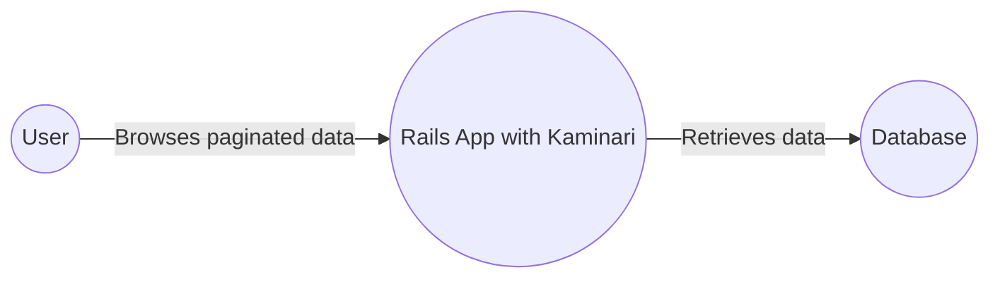
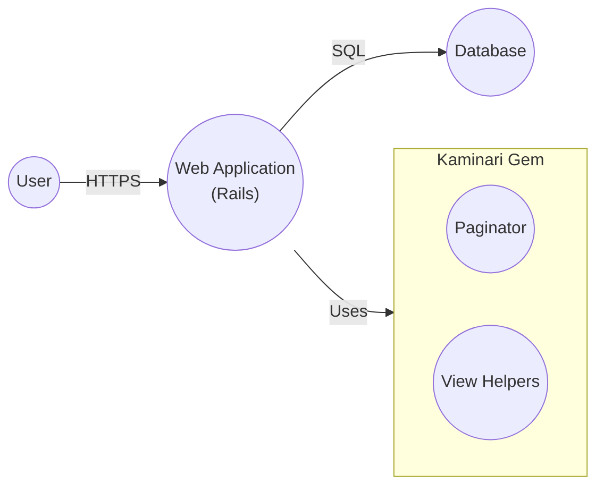
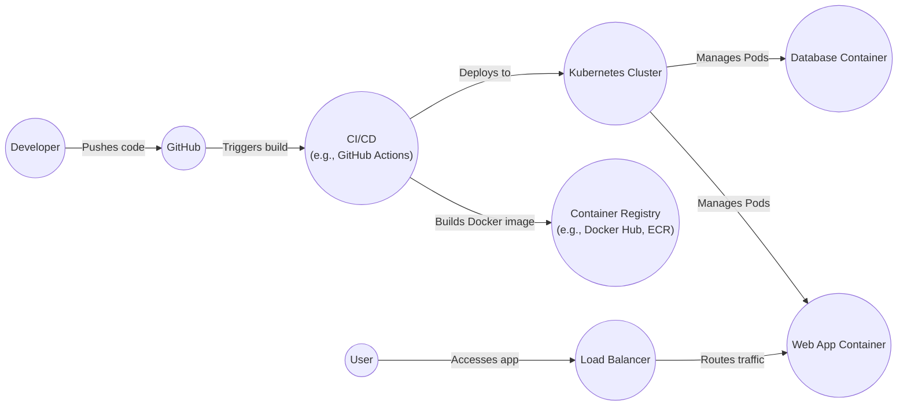
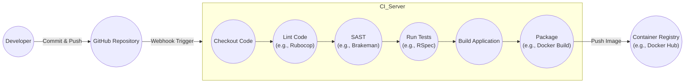

Okay, let's create a design document for the Kaminari project.

# BUSINESS POSTURE

Kaminari is a popular pagination gem for Ruby on Rails applications. It simplifies the process of displaying large datasets in a user-friendly, page-by-page manner.

Business Priorities:

*   Provide a seamless and intuitive user experience for navigating large datasets.
*   Maintain high performance and scalability even with extremely large datasets.
*   Offer extensive customization options to fit diverse application needs and designs.
*   Ensure compatibility with various Rails versions and database adapters.
*   Maintain a well-documented and easy-to-use API.
*   Foster a strong community and provide timely support.

Business Goals:

*   Become/remain the leading pagination solution for Rails applications.
*   Reduce development time for implementing pagination.
*   Improve application performance by efficiently handling data retrieval.
*   Enhance user satisfaction by providing a smooth browsing experience.

Most Important Business Risks:

*   Performance bottlenecks: Inefficient queries or data handling could lead to slow page loads and poor user experience, especially with very large datasets.
*   Security vulnerabilities:  Vulnerabilities in the gem could expose applications to attacks like SQL injection or cross-site scripting (XSS).
*   Compatibility issues:  Incompatibility with newer Rails versions or database adapters could limit adoption and force users to seek alternatives.
*   Lack of maintainability:  Complex or poorly documented code could hinder future development and bug fixes.
*   Community disengagement:  Lack of active maintenance and community support could lead to the gem becoming obsolete.

# SECURITY POSTURE

Existing Security Controls:

*   security control: Input sanitization: Kaminari likely sanitizes user-provided parameters (e.g., page number, per\_page) to prevent SQL injection vulnerabilities. Implemented in the core pagination logic.
*   security control: Secure defaults: Kaminari likely uses secure defaults for configuration options to minimize the risk of misconfiguration. Described in the documentation and implemented in the configuration handling.
*   security control: Regular updates: The Kaminari maintainers likely release updates to address security vulnerabilities and bugs. Described in the changelog and release notes.
*   security control: Community vigilance: The large user base and active community likely contribute to identifying and reporting security issues.

Accepted Risks:

*   accepted risk: Reliance on underlying database adapter security: Kaminari relies on the security of the database adapter used by the Rails application. Any vulnerabilities in the adapter could impact Kaminari.
*   accepted risk: Potential for misconfiguration: While Kaminari provides secure defaults, developers could still misconfigure the gem or the surrounding application code, leading to security issues.
*   accepted risk: Limited control over user-provided view templates: Kaminari allows developers to customize the pagination views, which could introduce XSS vulnerabilities if not handled carefully.

Recommended Security Controls:

*   security control: Implement robust input validation and sanitization for all user-provided parameters, specifically focusing on preventing SQL injection and other injection attacks.
*   security control: Conduct regular security audits and penetration testing to identify and address potential vulnerabilities.
*   security control: Provide clear and comprehensive security documentation, including best practices for secure configuration and usage.
*   security control: Implement a Content Security Policy (CSP) to mitigate the risk of XSS attacks.
*   security control: Consider using a static analysis security testing (SAST) tool to automatically scan the codebase for potential vulnerabilities.

Security Requirements:

*   Authentication: Not directly applicable to Kaminari itself, as it's a pagination library. Authentication is handled at the application level.
*   Authorization: Not directly applicable to Kaminari itself. Authorization is handled at the application level.
*   Input Validation:
    *   Validate and sanitize all user-provided parameters (page number, per\_page, etc.) to prevent SQL injection and other injection attacks.
    *   Ensure that page numbers are positive integers.
    *   Limit the maximum value for per\_page to prevent denial-of-service attacks.
*   Cryptography: Not directly applicable to Kaminari itself, as it doesn't handle sensitive data directly. Cryptography is handled at the application level if needed.

# DESIGN

## C4 CONTEXT

Element Descriptions:

*   Element:
    *   Name: User
    *   Type: Person
    *   Description: A person who interacts with the Rails application to view paginated data.
    *   Responsibilities: Browses web pages, clicks on pagination links, provides input for filtering or sorting data (if applicable).
    *   Security controls: Browser security settings, user-level authentication and authorization within the Rails application.

*   Element:
    *   Name: Rails App with Kaminari
    *   Type: Software System
    *   Description: A Ruby on Rails application that uses the Kaminari gem for pagination.
    *   Responsibilities: Handles user requests, retrieves data from the database, uses Kaminari to paginate the data, renders the paginated views.
    *   Security controls: Input validation, output encoding, authentication, authorization, session management, protection against common web vulnerabilities (e.g., CSRF, XSS).

*   Element:
    *   Name: Database
    *   Type: Software System
    *   Description: The database used by the Rails application to store the data.
    *   Responsibilities: Stores and retrieves data, enforces data integrity, provides access control mechanisms.
    *   Security controls: Database user authentication, access control lists, encryption at rest and in transit, regular security audits.

## C4 CONTAINER

Element Descriptions:

*   Element:
    *   Name: User
    *   Type: Person
    *   Description: A person who interacts with the Rails application.
    *   Responsibilities: Browses web pages, clicks on pagination links.
    *   Security controls: Browser security settings.

*   Element:
    *   Name: Web Application (Rails)
    *   Type: Container: Web Application
    *   Description: The Ruby on Rails application that handles user requests and interacts with the database.
    *   Responsibilities: Handles user requests, retrieves data from the database, uses Kaminari to paginate the data, renders views.
    *   Security controls: Input validation, output encoding, authentication, authorization, session management.

*   Element:
    *   Name: Kaminari Gem
    *   Type: Container: Library
    *   Description: The Kaminari gem, providing pagination functionality.
    *   Responsibilities: Provides methods for paginating data, generates pagination links.
    *   Security controls: Input sanitization.
        *   Sub-element:
            *   Name: Paginator
            *   Type: Component
            *   Description: Core logic for calculating pagination parameters.
            *   Responsibilities: Calculates the number of pages, offsets, and limits.
            *   Security controls: Input validation.
        *   Sub-element:
            *   Name: View Helpers
            *   Type: Component
            *   Description: Helpers for generating pagination links in views.
            *   Responsibilities: Generates HTML for pagination links.
            *   Security controls: Output encoding.

*   Element:
    *   Name: Database
    *   Type: Container: Database
    *   Description: The database used by the Rails application.
    *   Responsibilities: Stores and retrieves data.
    *   Security controls: Database user authentication, access control.

## DEPLOYMENT

Possible Deployment Solutions:

1.  Traditional Server Deployment (e.g., using Capistrano, Passenger, and a server like Nginx or Apache).
2.  Containerized Deployment (e.g., using Docker, Kubernetes, and a cloud provider like AWS, GCP, or Azure).
3.  Platform-as-a-Service (PaaS) Deployment (e.g., using Heroku).

Chosen Solution (for detailed description): Containerized Deployment using Docker and Kubernetes.

Element Descriptions:

*   Element:
    *   Name: Developer
    *   Type: Person
    *   Description: A software developer working on the Rails application.
    *   Responsibilities: Writes code, commits changes, pushes code to the repository.
    *   Security controls: Local development environment security, strong passwords, multi-factor authentication.

*   Element:
    *   Name: GitHub
    *   Type: Software System
    *   Description: The source code repository.
    *   Responsibilities: Stores the application code, tracks changes, triggers CI/CD pipelines.
    *   Security controls: Access control, branch protection rules, code review policies.

*   Element:
    *   Name: CI/CD (e.g., GitHub Actions)
    *   Type: Software System
    *   Description: The continuous integration and continuous deployment pipeline.
    *   Responsibilities: Builds the Docker image, runs tests, deploys the application to Kubernetes.
    *   Security controls: Secure access to secrets, limited permissions, audit logs.

*   Element:
    *   Name: Container Registry (e.g., Docker Hub, ECR)
    *   Type: Software System
    *   Description: Stores the built Docker images.
    *   Responsibilities: Provides a secure and reliable location to store and retrieve container images.
    *   Security controls: Access control, image scanning for vulnerabilities.

*   Element:
    *   Name: Kubernetes Cluster
    *   Type: Software System
    *   Description: The container orchestration platform.
    *   Responsibilities: Manages the deployment, scaling, and networking of the application containers.
    *   Security controls: Network policies, role-based access control (RBAC), pod security policies.

*   Element:
    *   Name: Load Balancer
    *   Type: Software System
    *   Description: Distributes incoming traffic across multiple instances of the web application.
    *   Responsibilities: Provides a single point of entry for users, improves application availability and scalability.
    *   Security controls: SSL/TLS termination, DDoS protection.

*   Element:
    *   Name: Web App Container
    *   Type: Container
    *   Description: The container running the Rails application.
    *   Responsibilities: Handles user requests, interacts with the database.
    *   Security controls: Application-level security controls, container security best practices (e.g., running as non-root user).

*   Element:
    *   Name: Database Container
    *   Type: Container
    *   Description: The container running the database.
    *   Responsibilities: Stores and retrieves data.
    *   Security controls: Database-level security controls, container security best practices.

*   Element:
    *   Name: User
    *   Type: Person
    *   Description: A person who interacts with the Rails application.
    *   Responsibilities: Browses web pages, clicks on pagination links.
    *   Security controls: Browser security settings.

## BUILD

Build Process Description:

1.  Developer commits and pushes code changes to the GitHub repository.
2.  A webhook triggers the CI server (e.g., GitHub Actions).
3.  The CI server checks out the code from the repository.
4.  Code linting is performed (e.g., using Rubocop) to enforce code style and identify potential issues.
5.  Static Application Security Testing (SAST) is performed (e.g., using Brakeman) to scan the code for security vulnerabilities.
6.  Automated tests (e.g., RSpec tests) are executed to ensure code quality and functionality.
7.  The application is built.
8.  The application is packaged into a Docker image.
9.  The Docker image is pushed to a container registry (e.g., Docker Hub or a private registry).

Security Controls in Build Process:

*   security control: Code review: All code changes are reviewed by another developer before being merged into the main branch.
*   security control: Linting: Rubocop is used to enforce code style and identify potential code quality issues.
*   security control: SAST: Brakeman is used to scan the code for security vulnerabilities.
*   security control: Automated testing: RSpec tests are run to ensure code quality and functionality.
*   security control: Dependency management: Dependencies are managed using Bundler, and their versions are locked to prevent unexpected changes.
*   security control: Secure build environment: The CI server is configured with secure access controls and limited permissions.
*   security control: Image scanning: The Docker image is scanned for vulnerabilities before being pushed to the container registry.
*   security control: Supply chain security: Use signed commits and verify the integrity of dependencies.

# RISK ASSESSMENT

Critical Business Processes to Protect:

*   User data retrieval and display: Ensuring that users can access and view the data they are authorized to see, without performance issues or security breaches.
*   Application availability: Maintaining the uptime and responsiveness of the application to provide a consistent user experience.
*   Data integrity: Preventing unauthorized modification or deletion of data.

Data to Protect and Sensitivity:

*   The data Kaminari handles directly is primarily related to pagination parameters (page number, items per page). This data is generally not sensitive.
*   However, Kaminari is used to *access* and display application data, which *can* be highly sensitive, depending on the specific application.  The sensitivity of this data is determined by the application itself, not by Kaminari. Examples include:
    *   Personally Identifiable Information (PII): Names, addresses, email addresses, phone numbers (High sensitivity).
    *   Financial data: Credit card numbers, bank account details, transaction history (High sensitivity).
    *   Health information: Medical records, diagnoses, treatment plans (High sensitivity).
    *   User-generated content: Comments, posts, messages (Variable sensitivity, depending on content).
    *   Application-specific data:  Any other data stored by the application (Variable sensitivity).

# QUESTIONS & ASSUMPTIONS

Questions:

*   Are there any specific compliance requirements (e.g., GDPR, HIPAA, PCI DSS) that the application using Kaminari must adhere to?
*   What is the expected scale of the application (number of users, data volume)?
*   What are the specific database adapters used by applications that commonly use Kaminari?
*   Are there any existing security tools or processes in place for the development and deployment of Rails applications that will use Kaminari?

Assumptions:

*   BUSINESS POSTURE: The primary concern is providing a smooth and efficient pagination experience for users, while maintaining the security and performance of the Rails application.
*   SECURITY POSTURE: The development team follows secure coding practices and is aware of common web vulnerabilities. The application using Kaminari will implement appropriate authentication and authorization mechanisms.
*   DESIGN: The application using Kaminari will be deployed using a containerized approach with Docker and Kubernetes. The build process will include automated testing and security scanning. The application will use a relational database.