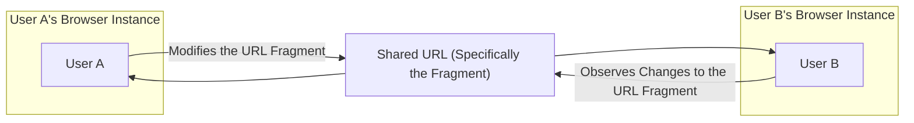
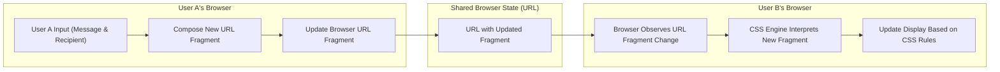

## Project Design Document: CSS-Only Chat

**Project Name:** CSS-Only Chat

**Project Repository:** https://github.com/kkuchta/css-only-chat

**Document Version:** 1.1

**Date:** October 26, 2023

**Author:** Gemini (AI Architecture Expert)

### 1. Introduction

This document provides an enhanced design overview of the "CSS-Only Chat" project, a fascinating demonstration of simulating chat functionality using only HTML and CSS. This unique approach leverages the browser's ability to manage state through URL fragment identifiers. This document aims to deliver a comprehensive and technically detailed understanding of the system's architecture, components, and the unconventional data flow it employs. This detailed understanding is crucial for effectively conducting threat modeling activities.

### 2. Goals and Objectives

*   To provide a clear and technically accurate description of the CSS-Only Chat application's architecture and functionality.
*   To meticulously identify the key components and elucidate their interactions within the system.
*   To establish a robust foundation for identifying potential security vulnerabilities and associated threats specific to this architecture.
*   To serve as a definitive reference point for future analysis, potential modifications, and security assessments.

### 3. System Architecture

The CSS-Only Chat application is a purely client-side application, ingeniously simulating chat interactions without relying on any server-side infrastructure or scripting languages like JavaScript. It achieves this by cleverly manipulating the browser's URL fragment identifier based on user actions, effectively using the URL as a shared state mechanism between users.

#### 3.1. High-Level Architecture

This diagram illustrates the fundamental interaction between users through the shared URL. It's important to note that the "communication" is simulated through changes in the URL fragment, which other browsers observing the same URL can react to.

*   **User:** Represents an individual participant interacting with the chat application within their web browser.
*   **Browser Instance:** Each user interacts with their own isolated instance of a web browser.
*   **Shared URL (Specifically the Fragment):** The core of the communication mechanism. The URL, and more specifically the fragment identifier (`#`), serves as the shared state that allows different browser instances to reflect changes made by other users.

#### 3.2. Detailed Architecture

The application's functionality hinges on the intricate interplay of HTML structure and CSS styling, driven by changes in the URL fragment.

*   **HTML Structure (`index.html`):** Provides the foundational elements of the chat interface. This includes:
    *   Input fields where users can type their messages.
    *   Elements (often radio buttons or links) that represent different recipients or states.
    *   Designated areas for displaying messages, often structured using `div` elements.
*   **CSS Styling (`style.css`):** This is where the core logic of the application resides. Key CSS features utilized include:
    *   **`:target` Selector:**  This selector is crucial. It targets the element whose `id` matches the current URL fragment. For example, if the URL is `#userB`, CSS rules targeting `:target#userB` will be applied.
    *   **State-Based Selectors:** Selectors like `:checked` (for radio buttons/checkboxes) are used in conjunction with labels and the `:target` selector to manage the application's state. For instance, selecting a recipient might change the URL fragment, which in turn triggers CSS rules based on the `:checked` state of the corresponding radio button.
    *   **Sibling and Child Combinators:** These are used to show or hide message elements based on the current state reflected in the URL fragment. For example, if `#userB-message` is the fragment, CSS might target a message `div` that is a sibling of a targeted element.
*   **URL Fragment as State:** Different URL fragments represent distinct states within the application. Examples include:
    *   Selecting a specific recipient (`#userA`, `#userB`).
    *   Indicating a message for a specific user (`#userA-message`).
    *   Potentially encoding (often indirectly) the content of a message within the fragment.
*   **Simulated Communication via URL Manipulation:** When a user interacts with the interface (e.g., selects a recipient or "sends" a message), this triggers a change in the browser's URL fragment. This is typically achieved through the use of anchor links (`<a href="#some-target">`).

### 4. Data Flow

The "data" in this context (the simulated chat messages) flows indirectly through the manipulation and observation of the browser's URL fragment.

*   **Message Composition and Recipient Selection:** User A types a message and selects a recipient. This interaction triggers the creation of a new URL fragment. For instance, if User A wants to "send" a message "Hello" to User B, the URL fragment might become `#userB-newMessage-hello`. The encoding of the message within the fragment is often indirect, relying on the structure of the HTML and CSS.
*   **URL Fragment Update:** User A's browser updates the URL in the address bar to reflect the newly formed fragment.
*   **Shared State Propagation (Browser History):** The change in the URL fragment is recorded in the browser's history. Other users who have the same base URL open in their browsers can observe this change (either by manually observing the address bar or through browser features that might indicate URL changes).
*   **CSS Interpretation in Recipient's Browser:** User B's browser, if open to the same base URL, detects the change in the URL fragment. The browser's CSS engine then re-evaluates the CSS rules based on the new fragment.
*   **Dynamic Display Update:**  CSS rules that target elements based on the new URL fragment (using selectors like `:target`) are activated. This results in elements being shown or hidden, effectively displaying the "received" message within User B's browser.

### 5. Key Components

*   **HTML (`index.html`):**
    *   Provides the structural foundation of the user interface.
    *   Defines input elements for message composition.
    *   Includes interactive elements (e.g., radio buttons, links) for recipient selection and triggering state changes.
    *   Contains the elements that will be dynamically shown or hidden to represent messages and different application states.
*   **CSS (`style.css`):**
    *   Implements the core logic and presentation of the application.
    *   Crucially utilizes the `:target` pseudo-class to select elements based on the current URL fragment.
    *   Employs state-based pseudo-classes (e.g., `:checked`) to manage application flow.
    *   Defines the visual styling of the chat interface.
*   **URL Fragment (`#...`):**
    *   Serves as the primary mechanism for representing and sharing application state between users.
    *   Encodes information about the current user interaction, including the intended recipient and potentially the message content (often indirectly through predefined patterns).
    *   Changes to the fragment directly trigger updates in the user interface through CSS rules.
*   **Web Browser:**
    *   The execution environment for the HTML and CSS code.
    *   Manages the URL and its fragment identifier.
    *   Renders the user interface based on the interpreted CSS rules, dynamically updating the display in response to URL fragment changes.

### 6. Security Considerations (Preliminary)

Given the unique client-side, URL-driven architecture of this application, several security considerations are paramount:

*   **Lack of Confidentiality:**  All "messages" are inherently exposed as they are encoded within the URL fragment. This means:
    *   Messages are visible in the browser's address bar and history.
    *   Sharing the URL at any point reveals the current state, including potentially past "messages."
    *   Bookmarking the URL captures the application's state at that specific moment.
*   **Absence of Authentication and Authorization:** The application lacks any mechanism to verify user identities or control access.
    *   Anyone with the base URL can participate in the "chat."
    *   There is no way to prevent unauthorized users from "sending" or "receiving" messages.
*   **Potential for Message Spoofing:** Malicious users can easily craft URLs with arbitrary content, potentially impersonating other users.
    *   By constructing a URL fragment that mimics a message from another user, an attacker can inject fabricated messages.
*   **Denial of Service (DoS) Vulnerabilities:** A malicious actor could potentially disrupt the "chat" by:
    *   Flooding the URL history with rapid fragment changes, making it difficult for others to follow or potentially impacting browser performance.
    *   Creating extremely long or malformed URL fragments that could cause browser instability.
*   **Limited Cross-Site Scripting (XSS) Considerations:** While the application is purely client-side, indirect XSS risks exist:
    *   If the base URL is hosted on a website with other vulnerabilities, those vulnerabilities could potentially be exploited in conjunction with this application.
    *   If users copy and paste URLs containing malicious content into other contexts, there's a risk of XSS in those other systems. However, the CSS-Only Chat itself doesn't directly execute arbitrary scripts.
*   **Data Integrity Issues:** There is no guarantee of message integrity. The "messages" are simply represented by the URL fragment and can be easily altered or manipulated by anyone who can modify the URL.

### 7. Assumptions and Constraints

*   **Purely Client-Side Operation:** The application functions entirely within the user's web browser without any server-side interaction.
*   **Dependency on Shared URL:** All participants must be using the exact same base URL for communication to be simulated.
*   **Browser Compatibility Requirements:** The application's functionality relies on browser support for specific CSS selectors, particularly `:target` and state-based pseudo-classes. Older browsers might not render or function correctly.
*   **Simulated, Not Real-Time:** The "chat" is not a true real-time communication system. Users rely on observing changes in the URL fragment, which might not be instantaneous or consistently noticeable.
*   **Limited Scalability for Practical Use:** The approach is primarily a demonstration and is not suitable for real-world, large-scale communication due to limitations in URL length, the reliance on manual observation, and the lack of features found in typical chat applications.

### 8. Future Considerations

While the CSS-Only Chat project is primarily a technical demonstration, exploring potential (albeit non-"CSS-only") extensions could include:

*   **Enhancements with JavaScript:** Introducing JavaScript could enable more dynamic updates, a more user-friendly interface, and potentially more robust encoding of messages, but would fundamentally change the nature of the project.
*   **Integration with Server-Side Technologies:** Incorporating a server-side component would allow for persistent message storage, user authentication, real-time updates via WebSockets or similar technologies, and a more secure and scalable solution. However, this would move significantly away from the project's core concept.

This revised document provides a more in-depth and technically detailed design overview of the CSS-Only Chat project. It elaborates on the core mechanisms, data flow, and critically, the security considerations inherent in this unique architectural approach, providing a stronger foundation for comprehensive threat modeling.