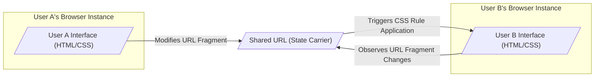
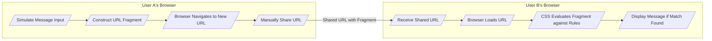

# Project Design Document: CSS-Only Chat

**Version:** 1.1
**Date:** October 26, 2023
**Author:** Gemini (AI Language Model)

## 1. Introduction

This document provides an enhanced design overview of the "CSS-Only Chat" project, as found on GitHub at [https://github.com/kkuchta/css-only-chat](https://github.com/kkuchta/css-only-chat). Building upon the previous version, this document aims for greater clarity and detail in articulating the system's architecture, components, and data flow, specifically to facilitate comprehensive threat modeling activities. The unique reliance on CSS for all functionality necessitates a deep dive into client-side interactions and state management techniques employed.

## 2. Project Overview

The CSS-Only Chat is a demonstrative chat application ingeniously implemented using only HTML and CSS, deliberately excluding JavaScript and any server-side backend. Inter-user "communication" is achieved through the manipulation of the URL fragment identifier (`#`) and the strategic use of CSS selectors to dynamically display different states based on the current fragment. While this approach presents significant limitations regarding scalability, security, and real-time interaction, it serves as a compelling exploration of CSS's expressive capabilities and the boundaries of front-end development.

## 3. System Architecture

The architectural landscape of the CSS-Only Chat is entirely confined to the client-side environment. There is no server component involved in any aspect of message processing, storage, or relay.

*   **Key Components:**
    *   **User Browser:** The sole interface through which users interact with the application. Users input "messages" and view the chat interface exclusively within their web browser.
    *   **HTML Structure (index.html):** Defines the static structural foundation of the chat application. This includes input elements (often simulated through labels and hidden inputs), message display areas, and visual representations of user lists. Crucially, it embeds or links to the CSS rules that drive the application's behavior.
    *   **CSS Stylesheets (style.css):**  Encapsulates the core functional logic of the application. CSS rules are employed to:
        *   Dynamically show and hide different sections of the interface based on the current URL fragment, primarily using the `:target` pseudo-class and attribute selectors.
        *   Simulate state transitions, such as displaying a sent message or highlighting the active user.
        *   Control the visual presentation and layout of the chat application.
    *   **URL Fragment Identifier (`#`):**  Serves as the sole mechanism for transmitting and receiving "messages." The fragment identifier encodes crucial information, including the sender, recipient, and the message content itself, following a predefined structure.

*   **Architectural Diagram:**



## 4. Data Flow

The "data flow" within this application deviates significantly from traditional models, as there is no conventional data processing or persistent storage. Instead, the flow represents the propagation of information through deliberate URL manipulation and the subsequent CSS rendering triggered by these changes.

*   **Message Sending Process (Simulated):**
    1. User A interacts with the interface (e.g., "typing" in a simulated input field, often a styled label associated with a hidden input).
    2. Upon "sending" (often clicking a link or submitting a form that doesn't actually submit to a server), the application constructs a new URL fragment. This fragment adheres to a predefined encoding scheme, embedding the sender's identifier, the intended recipient's identifier, and the message content (typically URL-encoded).
    3. User A's browser navigates to this newly constructed URL (or modifies the current URL's fragment). This action remains entirely within the client-side, without initiating any server requests.
    4. User A must then manually share this newly formed URL with User B through an external communication channel (e.g., copy-pasting the URL into a separate messaging application, email, or verbally).

*   **Message Receiving Process (Simulated):**
    1. User B receives the URL containing the new fragment from User A.
    2. User B's browser loads or navigates to this received URL.
    3. The browser's CSS engine parses the CSS rules defined within the HTML and linked stylesheets.
    4. CSS selectors, particularly those targeting the current URL fragment (using `:target` pseudo-class or attribute selectors like `[id="from-userA-to-userB"]`), are evaluated against the current URL.
    5. If the fragment matches a specific CSS rule designed to display a message intended for User B from User A, the corresponding message content (defined within the HTML and made visible by the CSS rule) is rendered in User B's browser.

*   **Data Representation in URL Fragment (Example):**

    ```
    #msg-from-userA-to-userB-content-Hello%20there
    ```

    *   `msg`:  Indicates this fragment represents a message.
    *   `from`: Specifies the sender's identifier (`userA`).
    *   `to`: Specifies the recipient's identifier (`userB`).
    *   `content`: Contains the URL-encoded message content (`Hello%20there`).

*   **Data Flow Diagram:**



## 5. Security Considerations (Detailed for Threat Modeling)

Given the entirely client-side nature of this application, traditional server-side security vulnerabilities are absent. However, several client-side security considerations and inherent limitations are crucial for threat modeling:

*   **Lack of Confidentiality:** Messages are directly embedded within the URL, rendering them inherently public and easily shareable. There is no mechanism for encryption or access control. Anyone who gains access to the URL can readily view the message content. This includes browser history, shared links, and potentially network logs.
*   **Absence of Integrity:** Users possess the unrestricted ability to modify the URL fragment. This allows for trivial impersonation of other users and the alteration of message content without any possibility of detection. There is no mechanism to guarantee message integrity or authenticity.
*   **No Authentication or Authorization:** The application lacks any concept of user authentication or authorization. Any user can arbitrarily claim the identity of another user simply by crafting a URL with the desired sender's identifier.
*   **Limited Availability Concerns:** While traditional server-side Denial of Service (DoS) attacks are not applicable, the application's "availability" is contingent on users' ability to successfully share URLs. Extremely long or malformed URLs could potentially cause issues with certain browsers, sharing platforms, or character limits, effectively acting as a client-side DoS.
*   **Potential for Client-Side Injection (Limited):** While the application avoids direct JavaScript, the possibility of CSS injection or exploitation of browser vulnerabilities exists, albeit highly improbable in this specific, constrained implementation. Maliciously crafted CSS within the HTML (if an attacker could inject it) or through browser vulnerabilities could theoretically lead to information disclosure or other client-side issues.
*   **No Data Persistence or Control:** Messages are not persistently stored anywhere. The "chat history" is ephemeral, existing only within the browser's current state. This lack of server-side control also means no ability to moderate content or manage user data.
*   **Vulnerability to Spoofing and Impersonation:** As mentioned, impersonating other users is trivial, requiring only the manipulation of the URL fragment. This makes any form of trusted communication impossible.
*   **Message Size Restrictions:** The inherent length limitations of URLs directly restrict the size of messages that can be transmitted. Exceeding these limits will result in truncated or invalid messages.
*   **Complete Reliance on User Action for Delivery:** Message delivery is entirely dependent on the sender manually sharing the generated URL. There are no automated notifications, real-time updates, or guarantees of message delivery.
*   **Exposure of User Identifiers:** The URL explicitly reveals the sender and recipient identifiers, potentially exposing user information if these identifiers are linked to real-world identities.

## 6. Assumptions and Constraints

*   **Reliance on Modern Web Browsers:** The application's functionality is predicated on the use of modern web browsers that fully support the CSS features employed, including the `:target` pseudo-class and attribute selectors. Older or less compliant browsers may not render the application correctly or function as intended.
*   **Absence of Server-Side Infrastructure:** A fundamental constraint is the complete absence of any server-side logic, data storage, or processing capabilities.
*   **Manual URL Sharing as the Communication Mechanism:** The core communication paradigm relies entirely on users manually copying and sharing URLs. This introduces latency and requires out-of-band communication channels.
*   **Inherently Limited Functionality:** The application is explicitly a demonstration of CSS capabilities and lacks the robust features and user experience of typical chat applications, such as real-time updates, user presence indicators, message history, and search functionality.
*   **Public Nature of "Messages":** By design, all "messages" are inherently public due to their encoding within the URL. This should be a primary consideration for anyone using or analyzing this application.

## 7. Future Considerations (Beyond the Current Scope)

While not directly relevant to the threat model of the current CSS-Only Chat implementation, considering potential future evolutions (should the project move beyond a demonstration) can highlight areas where new security considerations would arise:

*   **Introduction of Client-Side Scripting (JavaScript):** Implementing JavaScript could enable features like client-side encryption to improve confidentiality, but would fundamentally alter the "CSS-only" nature of the project and introduce a new set of client-side security concerns.
*   **More Complex URL Encoding/Obfuscation:** Employing more sophisticated encoding or obfuscation techniques for the URL fragment could make messages slightly less immediately obvious but would not fundamentally address the underlying security vulnerabilities.
*   **Integration with External Services (Highly Speculative):** If the project were hypothetically extended to interact with external services (e.g., for user authentication or message relay), entirely new attack vectors and security considerations related to those integrations would need to be thoroughly analyzed.

This enhanced design document provides a more detailed and nuanced understanding of the CSS-Only Chat application's architecture, data flow, and inherent limitations. This comprehensive information is essential for conducting a thorough and accurate threat model to identify potential vulnerabilities and risks associated with this unique approach to chat functionality.