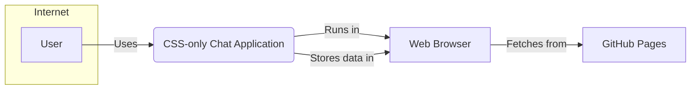
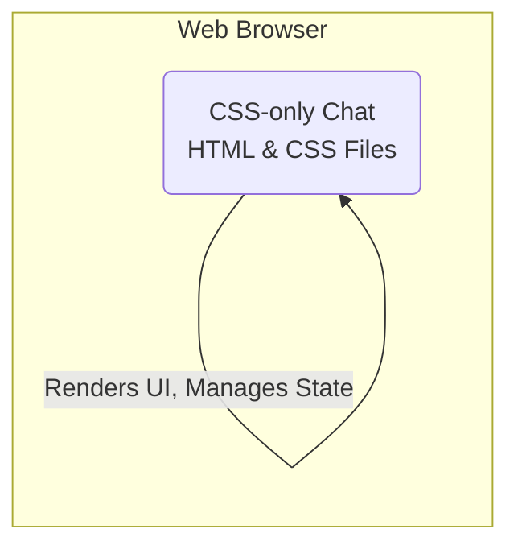
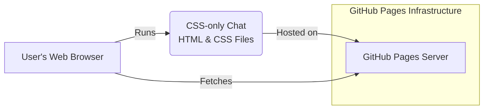
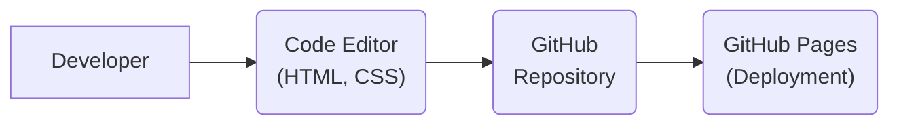

# BUSINESS POSTURE

This project is a demonstration of a chat application implemented purely using CSS, without any backend server or JavaScript. It serves as a proof of concept to showcase the capabilities of CSS and explore unconventional approaches to web development.

* Business Priorities and Goals:
 - Demonstrate the capabilities of CSS for interactive web applications.
 - Provide an educational resource for web developers interested in CSS.
 - Explore the limits of front-end technologies in creating application logic.
 - Create a fun and interesting project to share with the developer community.

* Business Risks:
 - Misinterpretation of the project's purpose as a production-ready chat solution.
 - Potential misuse of the CSS-only approach in scenarios where security and scalability are critical.
 - Lack of user expectation management regarding the limitations of a CSS-only application.
 - Security vulnerabilities if the concept is adapted without proper security considerations for real-world applications.

# SECURITY POSTURE

The project, being a CSS-only demonstration, inherently lacks many traditional security controls found in typical web applications with backend servers and databases. The security posture is largely defined by the limitations of the chosen technology and the project's demonstrative nature.

* Existing Security Controls:
 - security control: GitHub repository access control - Implemented by GitHub, manages who can access and modify the project code.
 - security control: Static content hosting - Implemented by GitHub Pages (if deployed there), provides basic security for serving static files.

* Accepted Risks:
 - accepted risk: Lack of server-side security - There is no server-side component to secure, which eliminates server-side vulnerabilities but also server-side security controls.
 - accepted risk: Client-side data storage limitations - Data is stored client-side using CSS techniques, which is inherently insecure and easily manipulated by users.
 - accepted risk: No authentication or authorization - The CSS-only nature makes implementing robust authentication and authorization mechanisms extremely challenging and impractical.
 - accepted risk: Limited input validation - Input validation is constrained by CSS capabilities and cannot provide comprehensive security against malicious input.
 - accepted risk: No data encryption - Data transmitted and stored client-side is not encrypted due to the limitations of CSS.

* Recommended Security Controls:
 - security control: Implement client-side input sanitization using JavaScript if project evolves beyond CSS-only demonstration to mitigate basic XSS risks if dynamic content is introduced.
 - security control: Clearly document security limitations and risks associated with CSS-only approach to prevent misuse in security-sensitive contexts.
 - security control: If persistent client-side storage is required, explore browser storage APIs (Local Storage, Session Storage) with appropriate security considerations and JavaScript implementation, acknowledging it moves beyond CSS-only scope.

* Security Requirements:
 - Authentication: Not applicable in the CSS-only context as there is no server-side user management. If user identity is needed in future iterations, consider external authentication providers and a backend component, moving away from CSS-only architecture.
 - Authorization: Not applicable in the CSS-only context. Access control is limited to the visibility of the static files. If authorization is needed, a backend component and session management would be required.
 - Input Validation: Limited to CSS capabilities.  For a CSS-only chat, input validation is minimal and primarily relies on CSS selectors and attribute manipulation. If more robust input validation is needed, JavaScript would be necessary to sanitize input before it's processed or displayed.
 - Cryptography: Not applicable in the CSS-only context. CSS cannot perform cryptographic operations. If data confidentiality or integrity is required, server-side encryption and secure communication protocols (HTTPS) would be necessary, requiring a backend component.

# DESIGN

The CSS-only chat project is designed as a purely front-end application, leveraging CSS for both styling and application logic. It operates entirely within the user's browser without server-side processing or data storage.

## C4 CONTEXT

* Context Diagram Elements:
 - Element:
  - Name: User
  - Type: Person
  - Description: An individual who wants to use the CSS-only chat application to communicate with others.
  - Responsibilities: Interacting with the chat interface, sending and receiving messages.
  - Security controls: User's own device and browser security settings.
 - Element:
  - Name: CSS-only Chat Application
  - Type: Software System
  - Description: The CSS-only chat application itself, consisting of HTML and CSS files. It provides the chat interface and logic using CSS techniques.
  - Responsibilities: Displaying the chat interface, handling user input (via CSS selectors and form elements), managing chat state within the browser using CSS.
  - Security controls: Limited to client-side controls, primarily relying on browser security features and the inherent limitations of CSS.
 - Element:
  - Name: Web Browser
  - Type: Software System
  - Description: The user's web browser (e.g., Chrome, Firefox, Safari) which renders the HTML and CSS code of the chat application.
  - Responsibilities: Executing the CSS and HTML, rendering the user interface, storing client-side data (using CSS techniques).
  - Security controls: Browser security features (e.g., Content Security Policy, XSS protection, sandboxing).
 - Element:
  - Name: GitHub Pages
  - Type: Software System
  - Description: A static website hosting service provided by GitHub, used to host the CSS-only chat application files.
  - Responsibilities: Serving the HTML and CSS files to users' browsers.
  - Security controls: GitHub Pages infrastructure security, HTTPS for secure delivery of content.

## C4 CONTAINER

* Container Diagram Elements:
 - Element:
  - Name: CSS-only Chat (HTML & CSS Files)
  - Type: Container
  - Description:  The core container is the set of HTML and CSS files that constitute the CSS-only chat application. All application logic and UI rendering are handled within these files using CSS.
  - Responsibilities: Defining the structure of the chat interface (HTML), styling the interface and implementing application logic using CSS, managing chat state within the browser using CSS selectors and attribute manipulation.
  - Security controls: Client-side security controls inherent to browser execution of HTML and CSS, limited input validation via CSS, reliance on browser security features.

## DEPLOYMENT

The CSS-only chat application is designed for simple deployment as static files. The most straightforward deployment option is using GitHub Pages, which is suitable for demonstration and educational purposes.

* Deployment Diagram Elements:
 - Element:
  - Name: GitHub Pages Server
  - Type: Infrastructure Node
  - Description: The server infrastructure provided by GitHub Pages for hosting static websites.
  - Responsibilities: Serving the HTML and CSS files of the chat application over HTTPS.
  - Security controls: GitHub Pages infrastructure security, HTTPS encryption for content delivery.
 - Element:
  - Name: CSS-only Chat (HTML & CSS Files)
  - Type: Software System / Container
  - Description: The packaged HTML and CSS files of the CSS-only chat application, ready for deployment.
  - Responsibilities: Containing the application code to be served and executed in users' browsers.
  - Security controls:  None specific to deployment package itself in this static context, security relies on hosting environment and browser.
 - Element:
  - Name: User's Web Browser
  - Type: Device
  - Description: The user's computer or device running a web browser, where the application is executed.
  - Responsibilities: Fetching, rendering, and executing the CSS-only chat application.
  - Security controls: User's device security settings, browser security features.

## BUILD

The build process for the CSS-only chat is minimal, as it primarily involves creating and organizing HTML and CSS files. There is no compilation or complex build pipeline in the traditional sense.

* Build Process Elements:
 - Element:
  - Name: Developer
  - Type: Person
  - Description: A software developer creating and maintaining the CSS-only chat application.
  - Responsibilities: Writing HTML and CSS code, committing changes to the GitHub repository.
  - Security controls: Developer's local machine security, secure coding practices.
 - Element:
  - Name: Code Editor (HTML, CSS)
  - Type: Tool
  - Description: The code editor used by the developer to write and edit HTML and CSS files.
  - Responsibilities: Providing an environment for code development and editing.
  - Security controls: Code editor security features, plugins for linting and basic security checks (if used).
 - Element:
  - Name: GitHub Repository
  - Type: Code Repository
  - Description: The GitHub repository hosting the source code of the CSS-only chat application.
  - Responsibilities: Version control, storing the source code, triggering GitHub Pages deployment.
  - Security controls: GitHub repository access controls, branch protection, commit signing (optional).
 - Element:
  - Name: GitHub Pages (Deployment)
  - Type: Deployment Environment
  - Description: GitHub Pages environment that automatically deploys static files from the repository.
  - Responsibilities: Hosting and serving the CSS-only chat application files.
  - Security controls: GitHub Pages infrastructure security, HTTPS.

# RISK ASSESSMENT

* Critical Business Processes:
 - For a demo project, there are no critical business processes. If this were adapted for real-world use (which is not recommended in its current CSS-only form for any security-sensitive application), the critical process would be real-time communication between users.

* Data Sensitivity:
 - In the CSS-only chat demo, chat messages are temporarily stored client-side using CSS techniques. The sensitivity of this data depends on the context of use. In a demonstration scenario, the data is likely low sensitivity. However, if used in a context where users exchange personal or confidential information (again, not recommended for this CSS-only approach), the data sensitivity would be significantly higher.  Given the lack of encryption and client-side storage, any data should be considered potentially exposed.

# QUESTIONS & ASSUMPTIONS

* BUSINESS POSTURE:
 - Question: Is this project intended for production use, or is it purely a demonstration?
  - Assumption: It is purely a demonstration and educational project, not intended for production or security-sensitive applications.
 - Question: What is the target audience for this project?
  - Assumption: Web developers, CSS enthusiasts, and individuals interested in unconventional web development techniques.

* SECURITY POSTURE:
 - Question: Are there any specific security requirements beyond the inherent limitations of the CSS-only approach?
  - Assumption: Security is not a primary concern for this demonstration project, but understanding and documenting the security limitations is important.
 - Question: Should any client-side security measures (e.g., basic input sanitization using JavaScript) be considered even for a demo?
  - Assumption: For a CSS-only demo, strict security measures are not necessary, but highlighting potential vulnerabilities and suggesting basic mitigations (like client-side sanitization if JavaScript were to be introduced) would be beneficial for educational purposes.

* DESIGN:
 - Question: Are there any plans to extend this project beyond CSS-only functionality in the future?
  - Assumption: The project is primarily intended as a CSS-only demonstration. Any significant extensions would likely require moving away from the CSS-only architecture and incorporating backend components and JavaScript.
 - Question: What are the expected performance and scalability requirements?
  - Assumption: Performance and scalability are not primary concerns for this demonstration project. The focus is on showcasing CSS capabilities, not building a high-performance or scalable chat application.