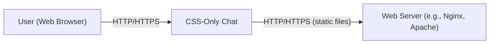
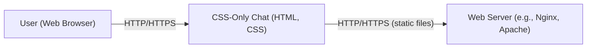
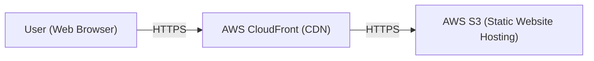
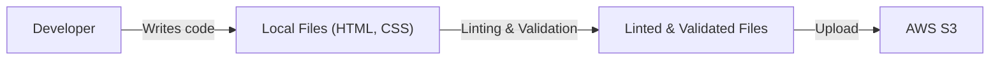

# BUSINESS POSTURE

Business Priorities and Goals:

*   Demonstrate a novel approach to building a chat application using only CSS and HTML, without JavaScript.
*   Provide a proof-of-concept for a potentially more secure and lightweight chat solution.
*   Showcase advanced CSS techniques and their capabilities.
*   Potentially reduce attack surface by eliminating JavaScript, a common vector for web vulnerabilities.
*   Offer a learning resource for developers interested in exploring CSS-only development.

Most Important Business Risks:

*   Limited Functionality: The lack of JavaScript severely restricts the features and interactivity of the chat application. This may not meet user expectations for a modern chat experience.
*   Scalability and Maintainability: The CSS-only approach may become difficult to scale and maintain as the application grows in complexity.
*   Browser Compatibility: Relying solely on CSS may lead to inconsistencies in how the application renders across different browsers and versions.
*   User Experience: The absence of dynamic updates and real-time features (without JavaScript) can result in a poor user experience.
*   Accessibility: Ensuring accessibility for users with disabilities may be challenging without JavaScript.
*   False Sense of Security: While removing JavaScript reduces some attack vectors, it doesn't eliminate all security risks. A false sense of security could lead to overlooking other potential vulnerabilities.

# SECURITY POSTURE

Existing Security Controls:

*   security control: Absence of JavaScript: Eliminates a major source of web vulnerabilities like Cross-Site Scripting (XSS) and client-side injection attacks. (Described in the project's README and inherent in the code.)
*   security control: Limited Server-Side Logic: The server's role is primarily to serve static files, reducing the server-side attack surface. (Implied by the project's architecture.)
*   security control: Use of HTTP Headers: Potentially, standard security headers like `Content-Security-Policy`, `X-Content-Type-Options`, `X-Frame-Options`, and `Strict-Transport-Security` could be implemented on the web server serving the files. (Not explicitly mentioned, but a standard practice.)

Accepted Risks:

*   accepted risk: Limited Functionality: The application's functionality is severely limited due to the absence of JavaScript.
*   accepted risk: Lack of Real-Time Updates: The chat does not update in real-time without manual user interaction (refreshing the page or clicking).
*   accepted risk: Potential for CSS Injection: While less common than XSS, CSS injection vulnerabilities are still possible, although their impact is generally lower.
*   accepted risk: Browser Compatibility Issues: The application's appearance and functionality may vary across different browsers.
*   accepted risk: Scalability limitations.

Recommended Security Controls:

*   security control: Implement robust HTTP security headers (CSP, X-Content-Type-Options, X-Frame-Options, HSTS) on the web server. This is a crucial, standard security practice for any web application.
*   security control: Regularly update the web server software to patch any security vulnerabilities.
*   security control: If a server-side component is introduced later (e.g., for storing messages), implement thorough input validation and output encoding to prevent injection attacks.
*   security control: Consider using a linter for CSS to identify potential style-related issues and maintain consistency.

Security Requirements:

*   Authentication: Not applicable in the current design (no user accounts). If user accounts were added, strong password policies, secure storage of credentials (e.g., using hashing and salting), and protection against brute-force attacks would be essential.
*   Authorization: Not applicable in the current design. If different user roles were introduced, access control mechanisms would be needed to ensure users can only access authorized resources and perform permitted actions.
*   Input Validation: If any server-side processing of user input is introduced, strict input validation is crucial to prevent injection attacks. This includes validating data types, lengths, formats, and allowed characters.
*   Cryptography: If sensitive data is transmitted or stored, appropriate cryptographic techniques should be used. For example, HTTPS should always be used to encrypt communication between the client and server. If user data is stored, it should be encrypted at rest.
*   Output Encoding: If user-supplied data is displayed, output encoding is necessary to prevent CSS injection.

# DESIGN

## C4 CONTEXT

C4 Context Element List:

*   User (Web Browser):
    *   Name: User (Web Browser)
    *   Type: Person
    *   Description: A person interacting with the CSS-Only Chat application through a web browser.
    *   Responsibilities: Sends HTTP requests to the web server, renders the HTML and CSS, and displays the chat interface.
    *   Security Controls: Relies on browser's built-in security mechanisms, including the same-origin policy and handling of HTTPS.

*   CSS-Only Chat:
    *   Name: CSS-Only Chat
    *   Type: Software System
    *   Description: The core chat application, implemented using only HTML and CSS.
    *   Responsibilities: Provides the chat interface and functionality, relying on CSS for styling and interactivity.
    *   Security Controls: Absence of JavaScript reduces client-side attack vectors.

*   Web Server:
    *   Name: Web Server
    *   Type: Software System
    *   Description: A web server (e.g., Nginx, Apache) that serves the static HTML, CSS, and potentially image files.
    *   Responsibilities: Handles HTTP requests, serves static files, and potentially applies HTTP security headers.
    *   Security Controls: Implementation of HTTP security headers (CSP, X-Content-Type-Options, X-Frame-Options, HSTS), regular software updates.

## C4 CONTAINER

C4 Container Element List:

*   User (Web Browser):
    *   Name: User (Web Browser)
    *   Type: Person
    *   Description: A person interacting with the CSS-Only Chat application through a web browser.
    *   Responsibilities: Sends HTTP requests to the web server, renders the HTML and CSS, and displays the chat interface.
    *   Security Controls: Relies on browser's built-in security mechanisms, including the same-origin policy and handling of HTTPS.

*   CSS-Only Chat (HTML, CSS):
    *   Name: CSS-Only Chat (HTML, CSS)
    *   Type: Web Application
    *   Description: The chat application, consisting of static HTML and CSS files.
    *   Responsibilities: Provides the chat interface and functionality.
    *   Security Controls: Absence of JavaScript.

*   Web Server:
    *   Name: Web Server
    *   Type: Web Server
    *   Description: A web server (e.g., Nginx, Apache) that serves the static HTML, CSS, and potentially image files.
    *   Responsibilities: Handles HTTP requests, serves static files, and potentially applies HTTP security headers.
    *   Security Controls: Implementation of HTTP security headers (CSP, X-Content-Type-Options, X-Frame-Options, HSTS), regular software updates.

## DEPLOYMENT

Possible Deployment Solutions:

1.  Static Hosting on Cloud Providers (e.g., AWS S3 + CloudFront, Azure Blob Storage + CDN, Google Cloud Storage + CDN, Netlify, Vercel): This is the most suitable and common approach for static websites.
2.  Traditional Web Server (e.g., Apache, Nginx) on a Virtual Machine (e.g., AWS EC2, Azure VM, Google Compute Engine): This offers more control but requires more configuration and maintenance.
3.  Containerized Deployment (e.g., Docker) on a Container Orchestration Platform (e.g., Kubernetes, AWS ECS, Azure Container Instances): This is overkill for a simple static site but could be considered if the application evolves to include server-side components.

Chosen Solution (Detailed Description): Static Hosting on AWS S3 + CloudFront

Deployment Element List:

*   User (Web Browser):
    *   Name: User (Web Browser)
    *   Type: Person
    *   Description: A person accessing the chat application via a web browser.
    *   Responsibilities: Initiates HTTPS requests to the application.
    *   Security Controls: Browser's built-in security features.

*   AWS CloudFront (CDN):
    *   Name: AWS CloudFront (CDN)
    *   Type: CDN
    *   Description: Amazon's Content Delivery Network, used to cache and distribute the static content closer to users.
    *   Responsibilities: Caches static content, reduces latency, and improves performance.  Can enforce HTTPS and provide WAF (Web Application Firewall) capabilities.
    *   Security Controls: HTTPS enforcement, WAF (optional), DDoS protection.

*   AWS S3 (Static Website Hosting):
    *   Name: AWS S3 (Static Website Hosting)
    *   Type: Object Storage
    *   Description: Amazon Simple Storage Service, configured for static website hosting.
    *   Responsibilities: Stores the static HTML, CSS, and image files. Serves the files to CloudFront.
    *   Security Controls: Access control lists (ACLs) and bucket policies to restrict access to the files. Server-Side Encryption (optional).

## BUILD

The build process for this project is extremely simple, as it involves only static files. There is no compilation or transformation required. However, we can still consider a "build" process in terms of preparing the files for deployment and incorporating security checks.

Build Process Description:

1.  Developer: The developer writes the HTML and CSS code.
2.  Local Files: The HTML and CSS files are stored locally on the developer's machine.
3.  Linting and Validation:
    *   A CSS linter (e.g., stylelint) is used to check for code style issues and potential errors.
    *   An HTML validator (e.g., the W3C Markup Validation Service) can be used to check for syntax errors.
4.  Linted & Validated Files: The files, after passing linting and validation, are ready for deployment.
5.  Upload: The files are uploaded to the AWS S3 bucket, either manually through the AWS console or using the AWS CLI or an automated script.

Security Controls in Build Process:

*   security control: CSS Linting: Helps identify potential style-related issues and maintain consistency, indirectly contributing to security by reducing the likelihood of unexpected behavior.
*   security control: HTML Validation: Ensures the HTML is well-formed, reducing the risk of browser parsing issues that could potentially lead to vulnerabilities.
*   security control: Automated Deployment Script (Optional): If an automated script is used for deployment, it should use secure credentials (e.g., IAM roles) and follow best practices for secure coding.
*   security control: Version Control (e.g., Git): Using version control allows tracking changes, reverting to previous versions, and collaborating securely.

# RISK ASSESSMENT

Critical Business Processes:

*   Providing a functional, albeit limited, chat interface.
*   Demonstrating the proof-of-concept of CSS-only chat.
*   Serving static content efficiently and reliably.

Data to Protect and Sensitivity:

*   In the current design, there is *no user data* being stored or transmitted, other than the content of the chat messages themselves, which are embedded within the HTML structure. The sensitivity of this data depends entirely on the content of the messages entered by the users. Since there's no server-side storage, the messages are only present in the HTML served and are not persisted. If a server-side component were added to store messages, then the message content would become sensitive data requiring protection.

# QUESTIONS & ASSUMPTIONS

Questions:

*   Are there any plans to add server-side functionality in the future (e.g., for storing messages, user accounts, etc.)? This would significantly change the security requirements.
*   What level of browser compatibility is required?
*   What is the expected traffic volume? This will influence the choice of deployment infrastructure.
*   Are there any specific regulatory or compliance requirements?

Assumptions:

*   BUSINESS POSTURE: The primary goal is to demonstrate a proof-of-concept, not to create a production-ready chat application. The business is willing to accept the limitations of a CSS-only approach.
*   SECURITY POSTURE: No sensitive user data is stored or transmitted beyond the chat messages themselves, which are not persisted. The focus is on minimizing the attack surface by eliminating JavaScript.
*   DESIGN: The application will remain purely static, with no server-side logic. The deployment will be on a static hosting platform like AWS S3 + CloudFront. The build process will involve basic linting and validation of the HTML and CSS files.