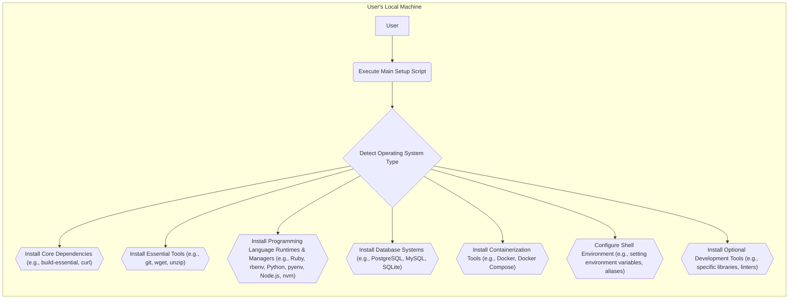
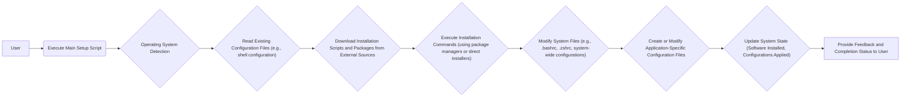

# Project Design Document: lewagon/setup

**Version:** 1.1
**Date:** October 26, 2023
**Author:** AI Software Architect

## 1. Introduction

This document provides an enhanced design overview of the `lewagon/setup` project, a widely used repository containing scripts and instructions for automating the setup of development environments. This revised document aims to offer a more granular understanding of the project's architecture, components, and data flow, thereby strengthening its utility as a foundation for subsequent threat modeling activities.

### 1.1. Purpose

The primary purpose of this document is to provide a clear, detailed, and improved articulation of the design of the `lewagon/setup` project. This enhancement will further empower stakeholders, particularly security analysts, to gain a deeper understanding of the system's operation and identify potential security vulnerabilities with greater precision.

### 1.2. Scope

This document comprehensively covers the core functionality of the `lewagon/setup` scripts, including the installation of a diverse range of development tools, libraries, and system configurations. The focus is on a detailed examination of the execution flow, interactions with the underlying operating system, and communication with external resources.

### 1.3. Goals

*   Present a highly clear and detailed description of the project's architecture.
*   Identify the key components and elucidate their specific interactions and responsibilities.
*   Illustrate the data flow within the system with greater granularity.
*   Highlight potential areas of security concern with more specific examples to facilitate future threat modeling.

## 2. System Overview

The `lewagon/setup` project comprises a collection of shell scripts meticulously designed to automate the often complex process of setting up development environments. The central objective is to install necessary software packages, configure intricate system settings, and prepare a machine efficiently for software development tasks. These scripts are typically executed by a user directly on their local machine.

**Key aspects of the system:**

*   **User-Initiated Execution:** The setup process is initiated by a user explicitly executing a shell script, granting it necessary permissions.
*   **Operating System Specificity:** The scripts are carefully tailored to function correctly across various operating systems (macOS, different Linux distributions, and potentially Windows via WSL), adapting commands and package management strategies accordingly.
*   **Reliance on Package Management:** The scripts heavily leverage system-specific package managers (e.g., `apt` on Debian/Ubuntu, `brew` on macOS, `yum` on CentOS/RHEL) for efficient software installation.
*   **Interaction with External Resources:** The scripts routinely download software packages, installers, and configuration files from external repositories and websites.
*   **System Configuration Modifications:** The scripts directly modify critical system configurations, including environment variables, shell settings, and potentially system-level service configurations.

## 3. Component Details

The `lewagon/setup` project is logically structured into several distinct components, each with a specific purpose:

*   **Main Orchestration Script (e.g., `setup.sh`):**
    *   Serves as the primary entry point for the entire setup process.
    *   Performs initial checks, such as verifying internet connectivity and necessary prerequisites.
    *   Crucially detects the user's operating system to determine the appropriate subsequent steps.
    *   Orchestrates the execution of specialized scripts for different tasks.
    *   Implements basic error handling and provides feedback to the user.
*   **Operating System Specific Handlers (e.g., `setup_ubuntu.sh`, `setup_macos.sh`, `setup_windows.sh`):**
    *   Contain commands and logic exclusively for a particular operating system.
    *   Manage the installation of base dependencies and core tools using the OS's native package manager.
    *   Handle OS-specific configuration adjustments and settings.
*   **Programming Language Setup Scripts (e.g., `install_ruby.sh`, `install_python.sh`, `install_nodejs.sh`):**
    *   Focus on installing specific programming languages and their associated version management tools (e.g., `rbenv` for Ruby, `pyenv` for Python, `nvm` for Node.js).
    *   May involve downloading installers directly from official sources or utilizing package managers.
    *   Often configure default versions and necessary environment settings for the language.
*   **Database System Installation Scripts (e.g., `install_postgres.sh`, `install_mysql.sh`):**
    *   Handle the installation of database management systems.
    *   May include steps to initialize the database, create default users, and configure basic security settings.
    *   Often rely on package managers for installation.
*   **Essential Tool Installation Scripts (e.g., `install_git.sh`, `install_curl.sh`, `install_docker.sh`):**
    *   Install other fundamental development tools required for various tasks.
    *   May involve using package managers or downloading and executing installer scripts.
*   **Environment Configuration Scripts (e.g., scripts modifying `.bashrc`, `.zshrc`):**
    *   Modify shell configuration files to set essential environment variables (e.g., `PATH`, language-specific variables).
    *   May also configure shell aliases and functions for convenience.
    *   Require careful handling to avoid corrupting existing user configurations.
*   **Dependency Management Logic:**
    *   Embedded logic within the scripts to ensure that prerequisite software is installed before attempting to install dependent components.
    *   May involve checking for the presence of specific packages or verifying the successful installation of previous steps.

## 4. Data Flow

The data flow within the `lewagon/setup` process involves a series of interconnected stages, moving from user initiation to system modification:

**Detailed Data Flow Breakdown:**

*   **User Initiation:** The user starts the process by executing the primary setup script, typically via a terminal command.
*   **Operating System Identification:** The script begins by identifying the host operating system to tailor subsequent actions.
*   **Configuration Assessment:** The script may read existing configuration files to understand the current system state, avoid redundant installations, or customize the setup process.
*   **External Resource Retrieval:** The scripts download necessary installation packages, scripts, and data from various external sources, including:
    *   Official package repositories for the detected operating system (e.g., `packages.ubuntu.com`, `repo.anaconda.com`).
    *   Direct download links from software vendors' official websites (often for specific versions or distributions).
    *   Version control repositories (e.g., GitHub releases) for certain tools and libraries.
*   **Installation Execution:** The scripts execute commands to install software, utilizing:
    *   Package managers (e.g., `apt-get install`, `brew install`, `yum install`).
    *   Direct execution of downloaded installer scripts (e.g., `.sh` or `.pkg` files).
    *   Language-specific package managers (e.g., `gem install`, `pip install`, `npm install`).
*   **System File Modification:** The scripts modify critical system files to:
    *   Set environment variables required for the installed software to function correctly.
    *   Update shell configuration files to persist environment settings and customize the user's shell environment.
    *   Potentially modify system-wide configuration files for services or daemons.
*   **Application Configuration:** The scripts may create or modify configuration files specific to the installed applications (e.g., database configuration files, web server settings).
*   **System State Transition:** The successful execution of the scripts results in a modified system state, with new software installed, configurations applied, and the development environment prepared.
*   **User Communication:** The scripts provide feedback to the user throughout the process, indicating progress, potential errors, and the final completion status.

## 5. Security Considerations (For Threat Modeling)

This section outlines specific security considerations relevant to the `lewagon/setup` project, providing concrete examples for threat modeling:

*   **Supply Chain Vulnerabilities:**
    *   **Compromised Repositories:** If official package repositories are compromised, malicious packages could be installed without the user's knowledge (e.g., a compromised `apt` mirror serving a backdoored version of `openssl`).
    *   **Malicious Download Sources:** Direct downloads from vendor websites could be intercepted or the source itself could be compromised, leading to the installation of malware (e.g., a fake download link for the Python installer).
    *   **Man-in-the-Middle Attacks:** During the download of packages or scripts, an attacker could intercept the traffic and replace legitimate files with malicious ones (e.g., injecting malicious code into a downloaded Ruby gem).
*   **Privilege Escalation Risks:**
    *   **Exploitable Script Vulnerabilities:** Bugs in the setup scripts themselves could be exploited to gain root privileges (e.g., a vulnerability allowing arbitrary command execution with `sudo`).
    *   **Insecure File Permissions:** Incorrectly setting file permissions on installed binaries or configuration files could allow unauthorized users to gain elevated privileges (e.g., world-writable sudoers file).
*   **Insecure Default Configurations:**
    *   **Weak Database Passwords:** Default database installations might use weak or default passwords, making them vulnerable to attack (e.g., a default `postgres` user password).
    *   **Unnecessary Services Enabled:** The scripts might enable services that are not strictly necessary, increasing the attack surface (e.g., enabling remote access to a database without proper authentication).
*   **Code Injection Vulnerabilities:**
    *   **Unsanitized Input:** If the scripts process user input or data from external sources without proper sanitization, attackers could inject malicious code (e.g., injecting shell commands into an environment variable).
    *   **Command Injection:** Vulnerabilities could allow attackers to execute arbitrary commands on the user's system (e.g., exploiting a flaw in how the script handles package names).
*   **Path Traversal Issues:**
    *   **Accessing Sensitive Files:** If the scripts handle file paths without proper validation, attackers could potentially read or modify sensitive system files (e.g., reading `/etc/shadow`).
    *   **Writing to Arbitrary Locations:** Vulnerabilities could allow writing files to unintended locations, potentially overwriting critical system files.
*   **Denial of Service Potential:**
    *   **Resource Exhaustion:** Maliciously crafted input or actions could cause the setup scripts to consume excessive system resources, leading to a denial of service (e.g., attempting to install an extremely large number of packages).
    *   **Script Errors and Loops:** Bugs in the scripts could cause them to enter infinite loops or crash the system.
*   **Information Disclosure Risks:**
    *   **Exposing Sensitive Data in Logs:** Error messages or logging could inadvertently reveal sensitive information, such as API keys or passwords.
    *   **Insecurely Stored Credentials:** Configuration files created by the scripts might contain sensitive credentials if not properly protected (e.g., storing database passwords in plain text).
*   **Vulnerabilities in Installed Dependencies:**
    *   **Known Vulnerabilities:** The installed software packages might contain known security vulnerabilities that could be exploited after the setup process is complete (e.g., installing an outdated version of a library with a critical security flaw).

## 6. Assumptions and Constraints

*   **User Trust and Awareness:** It is assumed that the user executing the scripts trusts the source and understands the implications of running potentially privileged commands.
*   **Reliable Internet Connection:** The setup process relies on a stable and functional internet connection to download necessary resources.
*   **Operating System Compatibility:** The scripts are designed and tested for specific operating systems; compatibility on other systems is not guaranteed.
*   **Administrative Privileges Required:** The installation of software and modification of system settings typically necessitates administrative privileges (using `sudo` or equivalent).
*   **Availability and Integrity of External Resources:** The process assumes the availability and integrity of external package repositories and download sources.
*   **Sufficient System Resources:** It is assumed the target system has sufficient resources (disk space, memory, processing power) to complete the installation process.

## 7. Future Considerations

*   **Enhanced Modularity and Maintainability:** Further breaking down the scripts into smaller, more focused modules could improve maintainability and reduce the risk of introducing vulnerabilities.
*   **Automated Verification of Downloads:** Implementing robust mechanisms to automatically verify the integrity of downloaded packages using checksums or digital signatures.
*   **Security Hardening Best Practices:** Incorporating security hardening steps into the default configurations of installed software.
*   **Comprehensive User Input Validation:** Implementing thorough validation and sanitization of any user input or external data processed by the scripts.
*   **Regular Security Audits and Penetration Testing:** Conducting periodic security assessments to identify and address potential vulnerabilities proactively.
*   **Consideration of Configuration Management Tools:** Exploring the use of configuration management tools (e.g., Ansible, Chef) for more robust and auditable system configuration.
*   **Improved Error Handling and Recovery:** Implementing more sophisticated error handling and recovery mechanisms to gracefully handle failures during the setup process.

This enhanced document provides a more detailed and nuanced design overview of the `lewagon/setup` project. This improved understanding will be invaluable for conducting comprehensive threat modeling and identifying potential security vulnerabilities within the system with greater accuracy and depth.
