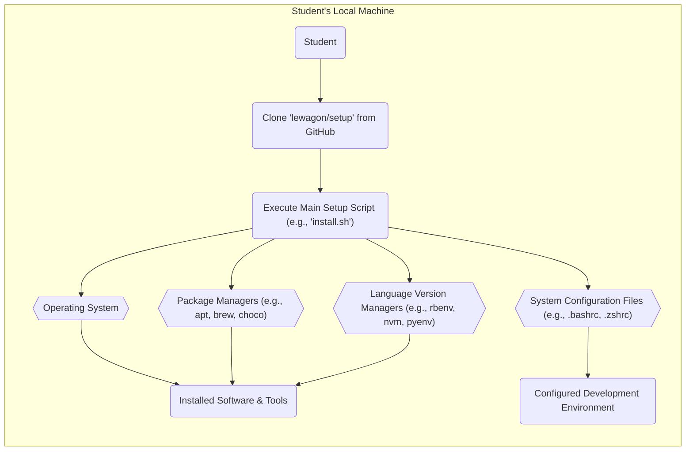
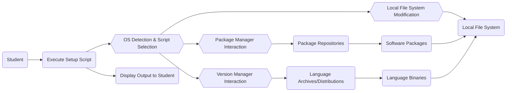

# Project Design Document: lewagon/setup

**Version:** 1.1
**Date:** October 26, 2023
**Author:** AI Software Architect

## 1. Introduction

This document provides a detailed design overview of the `lewagon/setup` project, a curated collection of shell scripts and configuration files. Its primary purpose is to automate the provisioning of consistent and functional development environments for Le Wagon bootcamp students. This document is specifically intended to serve as a foundation for subsequent threat modeling activities.

## 2. Goals and Objectives

The overarching goals of the `lewagon/setup` project are:

*   **Automated Environment Provisioning:** To completely automate the installation and configuration of all necessary software and development tools required by the Le Wagon curriculum.
*   **Standardized Development Environments:** To enforce a consistent development environment across all student machines, thereby minimizing environment-specific bugs and support issues.
*   **Accelerated Setup Process:** To significantly reduce the time and effort required for students to set up their development environments, allowing them to focus on learning.
*   **Simplified User Experience:** To provide an intuitive and straightforward setup process, regardless of the student's prior technical experience.
*   **Maintainable and Extensible System:** To create a setup system that is easy to maintain, update, and extend as the curriculum evolves.

## 3. Scope

This design document comprehensively covers the following aspects of the `lewagon/setup` project's operation:

*   The end-to-end workflow of the environment setup process.
*   The key software components and configuration elements managed by the setup scripts.
*   The flow of data and commands during the setup execution.
*   The interactions between the setup scripts and the user's operating system.
*   The categories of software and configurations managed (e.g., programming languages, databases, development tools).

This document explicitly **excludes** the following:

*   The specific pedagogical content or structure of the Le Wagon curriculum.
*   The detailed implementation logic within individual script functions beyond their general purpose.
*   The infrastructure hosting the `lewagon/setup` GitHub repository.
*   Precise version numbers of installed software packages (these are subject to change and are typically managed within the scripts).

## 4. High-Level Architecture

The `lewagon/setup` project functions as a set of locally executed shell scripts on a student's machine. The high-level process can be visualized as follows:

**Description of Architectural Components:**

*   **Student:** The individual initiating and running the setup process on their personal computer.
*   **Clone 'lewagon/setup' from GitHub:** The initial step of downloading the project's repository from GitHub to the student's local file system using `git clone`.
*   **Execute Main Setup Script:** The primary entry point for the setup process, typically a shell script named `install.sh` or similar, responsible for orchestrating the entire setup.
*   **Operating System:** The underlying operating system on which the scripts are executed (e.g., macOS, various Linux distributions, Windows Subsystem for Linux).
*   **Package Managers:** System-level utilities used to install, update, and manage software packages (e.g., `apt` on Debian/Ubuntu, `brew` on macOS, `choco` on Windows).
*   **Language Version Managers:** Tools dedicated to managing multiple versions of programming languages and their associated dependencies (e.g., `rbenv` for Ruby, `nvm` for Node.js, `pyenv` for Python).
*   **System Configuration Files:** Specific files within the user's home directory that control shell behavior and environment settings (e.g., `.bashrc`, `.zshrc`, `.profile`).
*   **Installed Software & Tools:** The collection of software packages, libraries, and command-line tools installed by the setup scripts.
*   **Configured Development Environment:** The final state of the student's machine after the setup is complete, characterized by the presence of necessary software and appropriately configured environment settings.

## 5. Detailed Design

The `lewagon/setup` process typically unfolds through these stages, managed by the main setup script:

*   **Initial Environment Checks:**
    *   Detection of the host operating system to tailor subsequent installation commands and configurations.
    *   Verification of essential pre-requisites, such as the presence of `curl`, `git`, and other fundamental utilities.
*   **Core Software Installation via Package Managers:**
    *   Invocation of platform-specific package managers (e.g., `apt-get install`, `brew install`, `choco install`) to install core dependencies like build tools, database systems (e.g., PostgreSQL, MySQL), and other system-level libraries.
*   **Programming Language and Tool Version Management:**
    *   Installation and configuration of language version managers (e.g., `rbenv`, `nvm`, `pyenv`).
    *   Using these version managers to install specific versions of programming languages (e.g., Ruby, Python, Node.js) as required by the curriculum.
    *   Setting global and project-specific language versions.
*   **Environment Configuration:**
    *   Modification of shell configuration files (e.g., `.bashrc`, `.zshrc`) to set essential environment variables (e.g., `PATH`), define aliases for frequently used commands, and configure shell behavior.
    *   Potentially configuring version managers to automatically activate the correct language versions in new shell sessions.
*   **Optional Repository Cloning:**
    *   In some cases, the setup might include cloning specific Git repositories containing starter code or necessary resources for the bootcamp.
*   **User Interaction and Feedback:**
    *   Prompting the student for confirmation before performing potentially impactful actions.
    *   Displaying informative progress messages and status updates during the installation process.
    *   Potentially requesting the student to perform manual configuration steps that cannot be fully automated.

**Key Components and their Interactions in Detail:**

*   **`install.sh` (or equivalent main script):**
    *   Acts as the central orchestrator of the setup process.
    *   Parses any command-line arguments provided by the user.
    *   Determines the operating system and calls relevant platform-specific scripts.
    *   Manages error handling and logging throughout the setup.
*   **Platform-Specific Scripts (e.g., `macos.sh`, `ubuntu.sh`, `windows.sh`):**
    *   Contain the platform-specific logic for installing software and configuring the environment.
    *   Utilize the appropriate package manager commands for the detected operating system.
    *   Handle variations in system commands and file paths.
*   **Package Manager Interaction Logic:**
    *   Scripts construct and execute commands specific to the detected package manager (e.g., `sudo apt-get update && sudo apt-get install -y <package>`, `brew install <package>`).
    *   Installation commands are typically executed with elevated privileges using `sudo`.
*   **Version Manager Interaction Logic:**
    *   Scripts utilize the command-line interfaces of version managers (e.g., `rbenv install <version>`, `nvm install <version>`, `pyenv install <version>`).
    *   Commands are used to install specific language versions and set system-wide or local defaults.
*   **Configuration File Modification Logic:**
    *   Scripts employ commands like `echo`, `sed`, `awk`, or dedicated configuration management tools to modify system configuration files.
    *   Modifications include appending or modifying lines to set environment variables, define aliases, and adjust shell settings.
*   **Git Interaction Logic:**
    *   The `git clone` command is used to download repositories from GitHub or other Git hosting platforms.
    *   Typically used for cloning public repositories, but could potentially involve handling SSH keys for private repositories (though less common in automated setup scenarios).

## 6. Data Flow

The flow of data within the `lewagon/setup` process involves:

*   **User Initiation:** The student initiates the setup by executing the main script, potentially providing initial configuration choices.
*   **Script Logic and Orchestration:** The scripts contain the core logic that dictates the sequence of installation and configuration steps based on the detected operating system and predefined configurations.
*   **Package Manager Communication:** The scripts send commands to package managers, which in turn communicate with remote package repositories to download software packages and their dependencies.
*   **Version Manager Communication:** The scripts instruct version managers to download specific language versions and associated tools from official distribution sites or archives.
*   **Local System Modification:** The scripts directly interact with the local file system to install software, modify configuration files, and set environment variables.
*   **User Feedback:** The scripts provide real-time feedback to the student through console output, displaying progress, errors, and completion messages.
*   **External Data Retrieval:** Package managers and version managers download software binaries, libraries, and metadata from external servers and repositories.

## 7. Security Considerations (Pre-Threat Modeling)

Before a formal threat modeling exercise, several key security considerations are apparent:

*   **Supply Chain Vulnerabilities:** The scripts rely on external package repositories and language archives. Compromise of these sources could lead to the installation of backdoored or vulnerable software.
*   **Script Tampering:** If the `lewagon/setup` repository or the downloaded scripts are compromised, they could execute malicious commands with elevated privileges on student machines.
*   **Privilege Escalation Risks:** The frequent use of `sudo` within the scripts presents a significant privilege escalation risk if vulnerabilities exist in the script logic or external commands being executed.
*   **Insecure Default Configurations:**  If the scripts apply insecure default settings for installed software, it could create vulnerabilities in the student's development environment.
*   **Exposure of Sensitive Information:** The scripts should not handle or store sensitive information such as API keys, passwords, or private keys.
*   **Insufficient Input Validation:** If the scripts accept user input without proper validation, it could be susceptible to command injection or other injection attacks.
*   **Vulnerabilities in Dependencies:** The installed software packages themselves may contain known vulnerabilities that could be exploited. Regularly updating dependencies is crucial.
*   **Man-in-the-Middle Attacks:** If software is downloaded over insecure connections (without HTTPS), there's a risk of man-in-the-middle attacks injecting malicious software.

## 8. Assumptions and Constraints

The design and operation of `lewagon/setup` are based on the following assumptions and constraints:

*   **Reliable Internet Access:** The setup process assumes a stable and functional internet connection is available to download necessary software and resources.
*   **Sufficient User Privileges:** It's assumed that the student running the scripts has the necessary administrative privileges (including `sudo` access) to install software and modify system settings.
*   **Availability and Integrity of External Resources:** The availability and integrity of external package repositories, language archives, and the GitHub repository are assumed.
*   **Target Operating System Compatibility:** The scripts are designed and tested to function correctly on specific operating systems (typically macOS, various Linux distributions, and potentially Windows Subsystem for Linux).
*   **Basic Command-Line Familiarity:** While aiming for ease of use, a basic understanding of command-line operations can be helpful for troubleshooting potential issues.
*   **GitHub Repository Accessibility:** Access to the `lewagon/setup` GitHub repository is required to download the initial setup scripts.

## 9. Future Considerations

Potential future enhancements and considerations for the `lewagon/setup` project include:

*   **Enhanced Modularity and Reusability:** Further breaking down the scripts into smaller, more modular functions could improve maintainability and allow for easier reuse of components.
*   **Integration with Configuration Management Tools:** Exploring the use of dedicated configuration management tools like Ansible, Chef, or Puppet could provide more robust and idempotent environment provisioning.
*   **Containerization Options:** Offering a containerized development environment using Docker or similar technologies could provide an alternative setup method with better isolation and reproducibility.
*   **Automated Testing and Validation:** Implementing a comprehensive suite of automated tests to verify the correct installation and configuration of the environment would improve reliability and reduce regressions.
*   **Improved Error Handling and Reporting:** Enhancing error handling and providing more informative error messages would aid students in troubleshooting setup issues.
*   **Progress Tracking and Visualization:** Implementing a more visually appealing progress tracker could improve the user experience during the setup process.

This document provides a detailed design overview of the `lewagon/setup` project, intended to be a solid foundation for subsequent threat modeling activities. The information contained herein should enable security professionals to effectively identify potential security vulnerabilities and recommend appropriate mitigation strategies.
