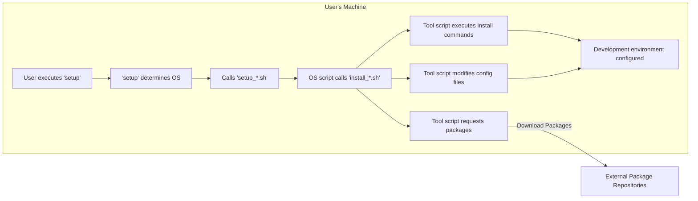

## Project Design Document: lewagon/setup

**1. Introduction**

This document provides a detailed architectural design of the `lewagon/setup` project. The primary purpose of this document is to serve as a foundation for threat modeling activities. It outlines the project's components, their interactions, and the flow of data, enabling a comprehensive understanding of the system's attack surface and potential vulnerabilities. This document will be used to identify and mitigate security risks associated with the project.

**2. Project Goals and Scope**

* **Goal:** To automate and standardize the setup of development environments for Le Wagon students across macOS, Linux, and Windows, ensuring consistency and reducing setup time.
* **Scope:** This document encompasses the design of the shell scripts and configuration files within the `lewagon/setup` repository that are responsible for:
    * Installing core development tools: Git, Ruby (and its dependencies), Python (and its dependencies), Node.js (and its dependencies), and Docker.
    * Configuring the user's shell environment using Zsh and Oh My Zsh.
    * Installing specific Ruby gems, Python packages, and Node.js modules required by the Le Wagon curriculum.
    * Performing basic operating system configuration adjustments necessary for the development environment.
* **Out of Scope:** This document explicitly excludes:
    * The specific content and structure of the Le Wagon curriculum itself.
    * In-depth configurations of individual development tools beyond what is directly managed by the setup scripts.
    * Troubleshooting steps for installation failures or environment issues not directly caused by the setup scripts.
    * The design of any web applications or services that might be developed using the set up environment.

**3. High-Level Architecture**

The `lewagon/setup` project operates as a locally executed system on the user's machine. It functions by downloading and executing a series of shell scripts. These scripts interact with the operating system's package managers and other command-line tools to install and configure the necessary software. The process involves fetching installation packages from external repositories over the internet and applying configurations to the local file system.

**4. Component Design**

The project is composed of the following key components, each with specific responsibilities:

* **`setup` Script (Orchestrator):**
    * **Responsibility:** Acts as the main entry point for the setup process. It orchestrates the execution of other scripts and manages the overall flow.
    * **Functionality:**
        * Detects the user's operating system to determine which OS-specific scripts to execute.
        * Presents initial prompts to the user for confirmation or basic configuration choices.
        * Calls the appropriate OS-specific setup script.
        * Handles top-level error management and displays general progress messages.
* **Operating System Specific Scripts (`setup_*.sh`):**
    * **Responsibility:**  Tailored to the nuances of each supported operating system (e.g., `setup_ubuntu.sh` for Ubuntu/Debian-based systems, `setup_macos.sh` for macOS, `setup_windows.sh` for Windows).
    * **Functionality:**
        * Installs core system-level dependencies and ensures the availability of necessary package managers (e.g., `apt`, `brew`, `choco`).
        * Calls tool-specific installation scripts for individual software components.
        * Performs OS-specific configuration tasks, such as setting up environment variables or installing system-level packages.
* **Tool-Specific Installation Scripts (`install_*.sh`):**
    * **Responsibility:** Dedicated to the installation and basic configuration of individual development tools.
    * **Examples:** `install_git.sh`, `install_ruby.sh`, `install_nodejs.sh`, `install_docker.sh`.
    * **Functionality:**
        * Determines the appropriate installation method for the specific tool on the current OS.
        * Downloads installation packages from official sources or utilizes package managers.
        * Executes installation commands, potentially requiring elevated privileges.
        * Performs basic configuration steps, such as setting default options or installing common extensions.
* **Configuration Files (e.g., `.zshrc`, `Brewfile`, `requirements.txt`):**
    * **Responsibility:** Contain configuration settings for the shell environment, package managers, and other tools.
    * **Functionality:**
        * `.zshrc`: Configures the Zsh shell, including aliases, environment variables, and Oh My Zsh settings.
        * `Brewfile` (macOS): Lists packages to be installed using Homebrew.
        * `requirements.txt` (Python): Lists Python packages to be installed using pip.
        * Similar configuration files exist for other tools and package managers. These files are often copied, modified, or used as input by the installation scripts.
* **External Package Repositories (e.g., `apt` repositories, Homebrew taps, npm registry, RubyGems.org, Docker Hub):**
    * **Responsibility:** Host the software packages and dependencies required for the development environment.
    * **Interaction:** The installation scripts interact with these repositories to download necessary files and install software.
* **User's Local Machine (Execution Environment):**
    * **Responsibility:** The target system where the setup scripts are executed and the development environment is installed.
    * **Components:** Includes the operating system, file system, user account with specific privileges, and network connectivity.

**5. Data Flow Diagram**

**6. Detailed Process Flow**

1. **User Initiates Setup:** The user downloads or clones the `lewagon/setup` repository and executes the main `setup` script from their terminal.
2. **Operating System Detection:** The `setup` script analyzes system information to identify the user's operating system (macOS, Linux, or Windows).
3. **OS-Specific Script Execution:** Based on the detected OS, the `setup` script executes the corresponding OS-specific script (e.g., `setup_ubuntu.sh`).
4. **Core Dependency Installation:** The OS-specific script installs essential system-level dependencies and ensures the availability of the relevant package managers (e.g., `apt` on Ubuntu, `brew` on macOS, `choco` on Windows).
5. **Tool Installation Orchestration:** The OS-specific script calls individual tool-specific installation scripts (e.g., `install_git.sh`, `install_ruby.sh`, `install_docker.sh`) in a predefined order.
6. **Package Download and Installation:** Tool-specific scripts utilize package managers or direct download links to retrieve installation packages from external repositories. They then execute the necessary commands to install the software. This may involve using package manager commands (e.g., `apt install`, `brew install`, `npm install`), running installers, or compiling from source in some cases.
7. **Configuration Application:** Scripts may modify configuration files (e.g., `.zshrc`, `Brewfile`, `requirements.txt`) by copying pre-configured files, appending settings, or using configuration management tools.
8. **Environment Finalization:** After all tools are installed and configured, the user may be prompted to restart their terminal or system for changes to take effect.
9. **Completion Notification:** The user is informed upon successful completion of the setup process.

**7. Security Considerations (For Threat Modeling)**

This section outlines potential security threats and considerations relevant to the `lewagon/setup` project. These will be further analyzed during the threat modeling process.

* **Code Injection Vulnerabilities:**
    * **Threat:** Malicious actors could inject malicious code into the setup scripts if the repository is compromised or through vulnerabilities in dependencies.
    * **Impact:** Arbitrary code execution on the user's machine with the privileges of the user running the script (potentially root/administrator if `sudo` is misused).
    * **Mitigation:** Secure the GitHub repository, implement code reviews, and use static analysis tools.
* **Supply Chain Attacks:**
    * **Threat:** Dependencies downloaded from external repositories could be compromised, leading to the installation of malicious software.
    * **Impact:** Installation of backdoors, malware, or other malicious components.
    * **Mitigation:** Use official and trusted repositories, implement checksum verification for downloaded packages where possible, and regularly update dependencies.
* **Man-in-the-Middle (MITM) Attacks:**
    * **Threat:** Attackers could intercept network traffic during package downloads and inject malicious packages.
    * **Impact:** Installation of compromised software.
    * **Mitigation:** Use HTTPS for all downloads, verify SSL/TLS certificates, and potentially use package signing verification.
* **Privilege Escalation:**
    * **Threat:** Vulnerabilities in the scripts could be exploited to gain elevated privileges on the user's system, especially if `sudo` is used improperly.
    * **Impact:** Full control over the user's machine.
    * **Mitigation:** Minimize the use of `sudo`, carefully audit any commands requiring elevated privileges, and avoid running the setup script as root unless absolutely necessary.
* **Data Exposure:**
    * **Threat:** The scripts might inadvertently collect or transmit sensitive information (e.g., API keys, credentials) if not handled carefully.
    * **Impact:** Exposure of sensitive data.
    * **Mitigation:** Avoid hardcoding sensitive information in scripts, use environment variables or secure configuration management, and ensure no unnecessary data collection occurs.
* **Denial of Service (DoS):**
    * **Threat:** Maliciously crafted scripts could consume excessive system resources, leading to a denial of service.
    * **Impact:** System instability or unresponsiveness.
    * **Mitigation:** Implement resource limits and error handling in the scripts.
* **Insecure File Permissions:**
    * **Threat:** Incorrectly set file permissions during the setup process could create security vulnerabilities.
    * **Impact:** Unauthorized access to files or the ability to modify system configurations.
    * **Mitigation:** Ensure that file permissions are set appropriately after installation and configuration.
* **Lack of Input Validation:**
    * **Threat:** If the scripts accept user input without proper validation, it could lead to command injection vulnerabilities.
    * **Impact:** Arbitrary command execution.
    * **Mitigation:** Sanitize and validate all user inputs.

**8. Future Considerations**

* **Improved Modularity and Abstraction:** Further decompose the scripts into smaller, more focused modules with clear interfaces to enhance maintainability and testability. This would also facilitate more granular security audits.
* **Idempotency and Error Handling:** Enhance the scripts to be idempotent (running them multiple times produces the same result) and implement robust error handling and rollback mechanisms.
* **Automated Testing and Security Scanning:** Implement a comprehensive suite of automated tests, including unit tests, integration tests, and security scans, to proactively identify vulnerabilities.
* **Containerization as an Alternative:** Explore providing a pre-configured development environment using Docker or other containerization technologies as an alternative or supplement to the current script-based approach. This could improve consistency and security.
* **Signature Verification for Downloads:** Implement mechanisms to verify the cryptographic signatures of downloaded packages to ensure their authenticity and integrity.
* **Centralized Configuration Management:** Investigate using configuration management tools (e.g., Ansible, Chef) to manage the setup process, potentially improving security and consistency.

This detailed design document provides a comprehensive understanding of the `lewagon/setup` project's architecture and data flow. It serves as a critical input for the subsequent threat modeling process, enabling a thorough analysis of potential security risks and the development of effective mitigation strategies.