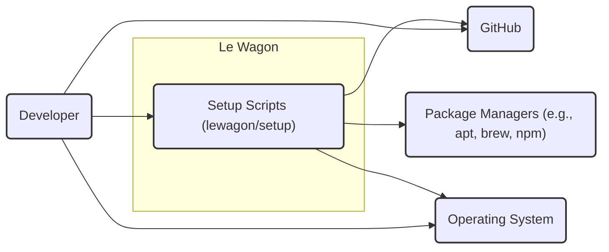
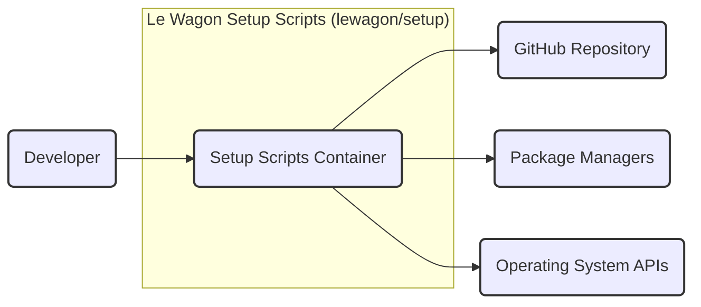
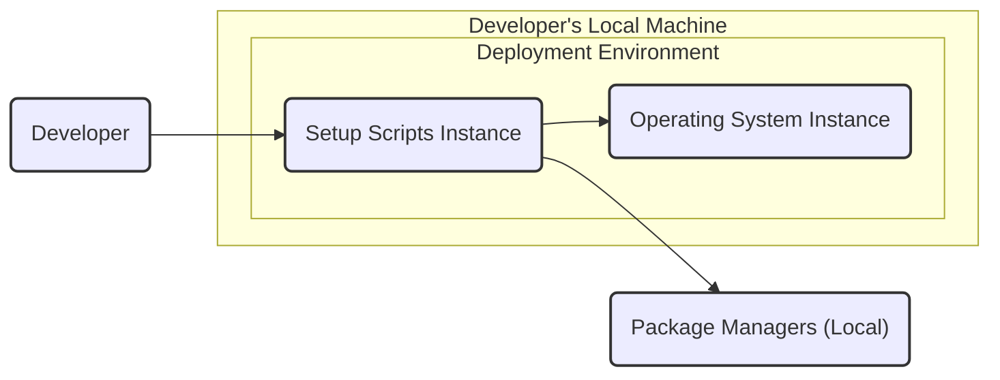
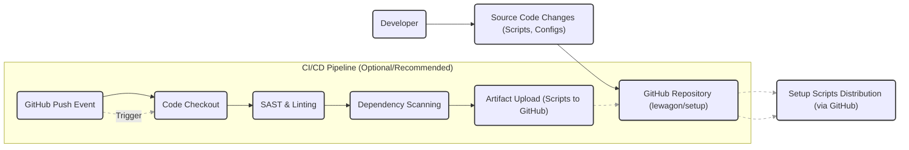

# BUSINESS POSTURE

The `lewagon/setup` repository aims to provide a streamlined and automated process for setting up development environments for Le Wagon students and potentially staff. This ensures consistency across all users, reduces onboarding time, and minimizes environment-related issues during the learning process.

- Business priorities:
  - Rapid onboarding of new students and staff.
  - Consistent and reproducible development environments.
  - Reduced technical support overhead related to environment setup.
  - Ensuring students can quickly start learning and coding.

- Business risks:
  - Inconsistent development environments leading to compatibility issues and increased support requests.
  - Security vulnerabilities introduced through the setup process, potentially compromising user machines.
  - Setup process being unreliable or failing, hindering onboarding and productivity.
  - Reliance on external dependencies that might become unavailable or insecure.

# SECURITY POSTURE

The security posture of the `lewagon/setup` project is currently basic, relying primarily on the security of the underlying platforms and user awareness.

- Existing security controls:
  - security control: GitHub repository access control (implemented in GitHub repository settings).
  - security control: Operating System security controls on user machines (implemented by user's OS).
  - security control: Code review process within the Le Wagon team (process described in Le Wagon internal guidelines).

- Accepted risks:
  - accepted risk: Users executing scripts from the internet with potentially elevated privileges.
  - accepted risk: Reliance on external package managers and repositories for software installation.
  - accepted risk: Potential for misconfigurations introduced by the setup scripts.
  - accepted risk: Lack of automated security scanning of the setup scripts.

- Recommended security controls:
  - security control: Implement automated static analysis security testing (SAST) on the setup scripts within the CI/CD pipeline.
  - security control: Implement dependency scanning to identify and manage vulnerabilities in external dependencies used by the setup scripts.
  - security control: Digitally sign setup scripts to ensure integrity and authenticity.
  - security control: Provide clear documentation and security guidelines for users executing the setup scripts.

- Security requirements:
  - Authentication: Not directly applicable as the scripts are executed locally by users who are assumed to be authenticated to their own machines. However, if scripts interact with Le Wagon internal systems, authentication might be required in those interactions.
  - Authorization: Scripts should operate with the least privilege necessary. Users executing the scripts are implicitly authorized to configure their own development environments. Scripts should not require or request excessive permissions.
  - Input validation: Scripts should validate all inputs, especially user-provided arguments and data from external sources, to prevent injection vulnerabilities.
  - Cryptography: Cryptography might be relevant if the setup process involves handling sensitive data like API keys or credentials. Secure storage and transmission of such data would require cryptographic measures. In the current context, cryptography is likely not a primary requirement but should be considered if sensitive data handling is introduced.

# DESIGN

The `lewagon/setup` project is designed to be a collection of scripts and instructions that automate the setup of a development environment. The design is relatively straightforward, focusing on ease of use and automation.

## C4 CONTEXT

- Elements of Context Diagram:
  - - Name: Developer
    - Type: Person
    - Description: Le Wagon students or staff members who need to set up their development environment.
    - Responsibilities: Execute the setup scripts, provide necessary inputs, and use the configured development environment.
    - Security controls: User authentication to their local machine, awareness of security best practices when running scripts from the internet.
  - - Name: Setup Scripts (lewagon/setup)
    - Type: Software System
    - Description: A collection of scripts and configuration files hosted on GitHub that automate the development environment setup process.
    - Responsibilities: Install necessary software, configure development tools, and ensure a consistent environment.
    - Security controls: Input validation within scripts, potentially script signing, and access control via GitHub.
  - - Name: GitHub
    - Type: Software System
    - Description: A web-based platform for version control and collaboration, hosting the `lewagon/setup` repository.
    - Responsibilities: Store and version control the setup scripts, provide access to the repository, and facilitate collaboration on script development.
    - Security controls: GitHub's access control mechanisms, repository security settings, and audit logs.
  - - Name: Package Managers (e.g., apt, brew, npm)
    - Type: Software System
    - Description: Tools used to automate the process of installing, upgrading, configuring, and removing software packages on the operating system.
    - Responsibilities: Provide software packages required for the development environment.
    - Security controls: Package manager's security mechanisms (e.g., checksum verification, repository signing), and the security of the repositories they access.
  - - Name: Operating System
    - Type: Software System
    - Description: The operating system on the developer's machine (e.g., macOS, Linux, Windows) where the development environment is being set up.
    - Responsibilities: Provide the underlying platform for running the setup scripts and the development environment.
    - Security controls: Operating system's built-in security features (e.g., user permissions, firewalls, anti-malware).

## C4 CONTAINER

In this case, the container diagram can be considered an extension of the context diagram, as the project is relatively simple. The "Setup Scripts" system can be viewed as a single container encompassing all the scripts and configuration files.

- Elements of Container Diagram:
  - - Name: Setup Scripts Container
    - Type: Container
    - Description: Represents the collection of all setup scripts (e.g., shell scripts, Python scripts, configuration files) within the `lewagon/setup` repository.
    - Responsibilities: Orchestrate the setup process, execute installation commands, configure system settings, and interact with package managers and the operating system.
    - Security controls: Input validation within scripts, script signing (recommended), and adherence to least privilege principles.
  - - Name: GitHub Repository
    - Type: External System
    - Description: The GitHub repository hosting the source code of the setup scripts.
    - Responsibilities: Version control, source code storage, and access management for the setup scripts.
    - Security controls: GitHub's security controls, including access control and repository security settings.
  - - Name: Package Managers
    - Type: External System
    - Description: System package managers (e.g., apt, brew, npm) used by the setup scripts to install software.
    - Responsibilities: Provide software packages and manage dependencies.
    - Security controls: Package manager's built-in security features and the security of the repositories they access.
  - - Name: Operating System APIs
    - Type: External System
    - Description: Operating system APIs and command-line interfaces used by the setup scripts to interact with the underlying operating system.
    - Responsibilities: Provide access to system resources and functionalities.
    - Security controls: Operating system's security controls and user permissions.
  - - Name: Developer
    - Type: Person
    - Description: User executing the setup scripts.
    - Responsibilities: Initiate the setup process and provide necessary inputs.
    - Security controls: User's machine security and awareness of security best practices.

## DEPLOYMENT

The `lewagon/setup` project is not "deployed" in a traditional server-side sense. Instead, it is distributed via GitHub and executed directly on the developer's local machine. The deployment environment is the developer's personal computer.

- Elements of Deployment Diagram:
  - - Name: Operating System Instance
    - Type: Infrastructure
    - Description: A running instance of the developer's operating system (e.g., macOS, Linux, Windows).
    - Responsibilities: Provide the runtime environment for the setup scripts and the development tools.
    - Security controls: Operating system's security features, user account controls, and installed security software.
  - - Name: Setup Scripts Instance
    - Type: Software
    - Description: A copy of the setup scripts downloaded from the GitHub repository and executed on the developer's local machine.
    - Responsibilities: Execute the setup process, install software, and configure the environment.
    - Security controls: Script integrity (potentially via signing), input validation, and adherence to least privilege.
  - - Name: Package Managers (Local)
    - Type: Software
    - Description: Package managers installed and running on the developer's local machine, used by the setup scripts.
    - Responsibilities: Install and manage software packages as requested by the setup scripts.
    - Security controls: Package manager's security features and the security of the software repositories configured.
  - - Name: Developer
    - Type: Person
    - Description: The user who initiates and oversees the setup process on their local machine.
    - Responsibilities: Execute the setup scripts and ensure the environment is correctly configured.
    - Security controls: User awareness and responsible execution of scripts from external sources.

## BUILD

The build process for `lewagon/setup` is relatively simple. It primarily involves development and committing of scripts to the GitHub repository. There isn't a traditional "build" step that produces compiled artifacts. However, we can consider the process of creating and updating the scripts as the "build" process.

- Elements of Build Diagram:
  - - Name: Developer
    - Type: Person
    - Description: Le Wagon developers who create and maintain the setup scripts.
    - Responsibilities: Write, test, and update the setup scripts, ensuring they are functional and secure.
    - Security controls: Secure development practices, code review, and awareness of potential security vulnerabilities.
  - - Name: Source Code Changes (Scripts, Configs)
    - Type: Artifact
    - Description: Modifications to the setup scripts and configuration files.
    - Responsibilities: Represent the changes being introduced to the setup process.
    - Security controls: Version control via Git, code review process.
  - - Name: GitHub Repository (lewagon/setup)
    - Type: System
    - Description: The central repository hosting the source code of the setup scripts.
    - Responsibilities: Store and version control the scripts, manage access, and trigger CI/CD pipelines.
    - Security controls: GitHub's security features, access control, and repository settings.
  - - Name: Setup Scripts Distribution (via GitHub)
    - Type: Artifact
    - Description: The scripts as distributed to users via direct download from the GitHub repository or cloning the repository.
    - Responsibilities: Provide users with access to the setup scripts.
    - Security controls: GitHub's distribution mechanisms, potentially script signing (recommended).
  - - Name: CI/CD Pipeline (Optional/Recommended)
    - Type: System
    - Description: An optional but recommended automated pipeline for building, testing, and securing the setup scripts.
    - Responsibilities: Automate security checks, ensure code quality, and streamline the release process.
    - Security controls: Automated SAST, dependency scanning, and secure artifact upload to GitHub.
    - - Name: GitHub Push Event
      - Type: Trigger
      - Description: Event triggered when code is pushed to the GitHub repository.
      - Responsibilities: Initiate the CI/CD pipeline.
      - Security controls: GitHub's event system security.
    - - Name: Code Checkout
      - Type: Build Step
      - Description: Step in the CI/CD pipeline that retrieves the latest code from the GitHub repository.
      - Responsibilities: Obtain the source code for analysis and processing.
      - Security controls: Secure access to the GitHub repository.
    - - Name: SAST & Linting
      - Type: Build Step
      - Description: Static Application Security Testing and code linting tools used to identify potential security vulnerabilities and code quality issues.
      - Responsibilities: Analyze the code for security flaws and coding standard violations.
      - Security controls: SAST tool configurations and vulnerability detection capabilities.
    - - Name: Dependency Scanning
      - Type: Build Step
      - Description: Tool used to scan dependencies for known vulnerabilities.
      - Responsibilities: Identify vulnerable dependencies used by the setup scripts.
      - Security controls: Dependency scanning tool and vulnerability database.
    - - Name: Artifact Upload (Scripts to GitHub)
      - Type: Build Step
      - Description: Step to upload the processed scripts (potentially signed) back to the GitHub repository.
      - Responsibilities: Make the updated and potentially secured scripts available for distribution.
      - Security controls: Secure upload process and access control to the GitHub repository.

# RISK ASSESSMENT

- What are critical business processes we are trying to protect?
  - Onboarding of new Le Wagon students and staff.
  - Ensuring consistent and functional development environments for learning and teaching.
  - Maintaining the reputation of Le Wagon by providing a secure and reliable learning experience.

- What data we are trying to protect and what is their sensitivity?
  - Primarily, we are protecting the integrity and security of the developer's local machines.
  - The setup scripts themselves are also data that needs to be protected from unauthorized modification.
  - Sensitivity of data: Medium. Compromising a developer's machine could lead to data breaches or disruption of their learning/work. Malicious scripts could potentially steal credentials or install malware.

# QUESTIONS & ASSUMPTIONS

- BUSINESS POSTURE:
  - Question: What is the acceptable level of risk for the development environment setup process? Is security a primary concern, or is ease of use and speed of onboarding prioritized?
  - Assumption: Ease of use and rapid onboarding are high priorities, but security should not be completely neglected. A balance between usability and security is desired.

- SECURITY POSTURE:
  - Question: Are there any existing security guidelines or policies within Le Wagon that apply to software development and deployment, including setup scripts?
  - Assumption: Basic security awareness exists within the development team, but there are no formal security policies specifically for setup scripts.
  - Question: What is the target audience's security awareness level? Are they expected to be technically proficient and security-conscious?
  - Assumption: The target audience (students) may have varying levels of technical expertise and security awareness. Security measures should be relatively transparent and easy to understand.

- DESIGN:
  - Question: Is there a plan to introduce more complex features to the setup process in the future, such as handling sensitive credentials or integrating with internal Le Wagon systems?
  - Assumption: The current scope is limited to basic development environment setup. More complex features might be considered in the future, which would necessitate a more robust security design.
  - Question: What is the update mechanism for the setup scripts? How are users notified of updates and encouraged to use the latest version?
  - Assumption: Users are expected to manually update the scripts by pulling the latest version from the GitHub repository. A more automated update mechanism might be beneficial in the future.