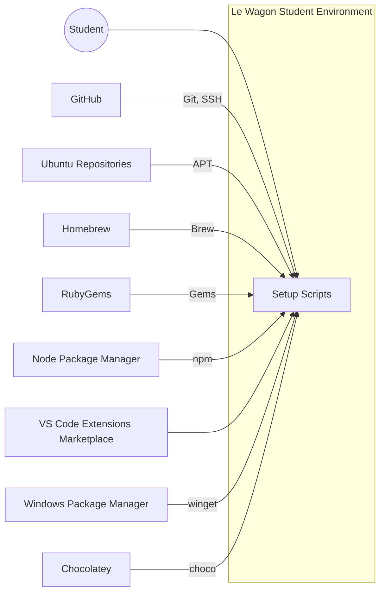
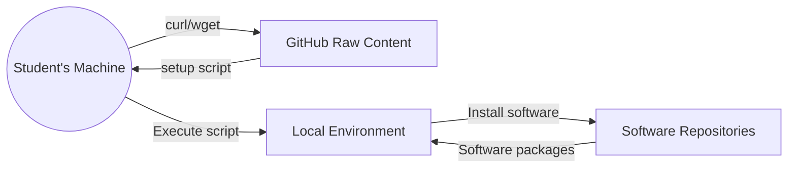
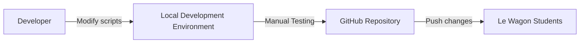

Okay, let's create a design document for the Le Wagon setup repository.

# BUSINESS POSTURE

Le Wagon is a coding bootcamp. This repository aims to standardize and simplify the software setup process for students across various operating systems (macOS, Ubuntu, Windows). The primary business goals are:

*   Efficiency: Reduce the time and effort spent by students and teaching assistants (TAs) on environment setup.
*   Consistency: Ensure all students have a uniform development environment, minimizing compatibility issues and facilitating collaboration.
*   Accessibility: Make the setup process as straightforward as possible, even for students with limited technical experience.
*   Maintainability: Create a setup process that is easy to update and maintain as software versions and course requirements evolve.

The most important business risks that need to be addressed are:

*   Setup Failure: If the setup process fails, students cannot participate in the course, leading to frustration and potential dropouts.
*   Inconsistent Environments: Variations in student environments can lead to "works on my machine" problems, hindering learning and collaboration.
*   Security Vulnerabilities: Incorrectly configured environments or outdated software could expose students to security risks.
*   Maintenance Overhead: A poorly designed setup process can become difficult and time-consuming to maintain, diverting resources from core educational activities.
*   Reputation damage: If students have a poor experience with the setup, it can negatively impact Le Wagon's reputation.

# SECURITY POSTURE

The repository primarily consists of shell scripts and configuration files. The inherent security posture is relatively low, as the scripts themselves don't handle sensitive data directly. However, the scripts do install and configure software that will be used for development, so ensuring the integrity and security of that software is crucial.

Existing security controls:

*   security control: Software Version Pinning: The scripts specify particular versions of software to be installed (e.g., a specific version of Ruby or Node.js). This helps ensure consistency and avoids unexpected issues with newer, potentially unstable releases. Implemented in setup scripts.
*   security control: Use of Official Repositories: The scripts generally use official software repositories (e.g., apt repositories for Ubuntu, Homebrew for macOS) to download and install software. This reduces the risk of installing compromised packages. Implemented in setup scripts.
*   security control: Limited Scope: The scripts focus solely on setting up the development environment. They don't handle user authentication, data storage, or other security-sensitive operations. Implemented in setup scripts.

Accepted risks:

*   accepted risk: Reliance on Third-Party Software: The setup process depends on numerous third-party tools and libraries (e.g., Git, Ruby, VS Code). Vulnerabilities in these tools could potentially impact students.
*   accepted risk: User Execution Context: The scripts are executed in the user's context. A malicious script or a compromised dependency could potentially harm the user's system.
*   accepted risk: No Input Validation: The scripts themselves do not perform extensive input validation. They assume the user is running them in a standard environment.
*   accepted risk: No Code Signing: The scripts are not digitally signed. There's no built-in mechanism to verify their integrity before execution.

Recommended security controls:

*   high priority: Implement Script Integrity Checks: Consider adding checksums (e.g., SHA-256) to verify the integrity of the downloaded scripts before execution. This would help detect if the scripts have been tampered with.
*   high priority: Review Dependencies Regularly: Periodically review the software dependencies and update them to address known vulnerabilities. Use dependency management tools to track and update versions.
*   high priority: Provide Security Guidance to Students: Include documentation or instructions advising students on basic security best practices, such as keeping their operating system and software up to date, using strong passwords, and being cautious about running untrusted code.

Security Requirements:

*   Authentication: Not directly applicable to the setup scripts themselves. However, students will likely need to authenticate to various services (e.g., GitHub) during the course. The setup process should facilitate this, but not directly handle authentication credentials.
*   Authorization: Not directly applicable to the setup scripts.
*   Input Validation: While the scripts themselves have limited input, any user-provided input (e.g., configuration options) should be validated to prevent unexpected behavior or security issues. This is currently an accepted risk.
*   Cryptography: Not directly used in the setup scripts. However, the installed software (e.g., Git, SSH) may use cryptography. The setup process should ensure that these tools are configured correctly to use secure cryptographic protocols.

# DESIGN

This project provides a set of scripts to automate the setup of a development environment for Le Wagon students. The scripts are designed to be platform-specific (macOS, Ubuntu, Windows) and install the necessary tools and configurations.

## C4 CONTEXT



Elements Description:

*   Element:
    *   Name: Le Wagon Student
    *   Type: Person
    *   Description: A student attending Le Wagon's coding bootcamp.
    *   Responsibilities: Run the setup scripts, use the configured development environment for learning and coding.
    *   Security controls: Follow security best practices, keep their system updated, use strong passwords.

*   Element:
    *   Name: Setup Scripts
    *   Type: Software System
    *   Description: The collection of shell scripts that automate the environment setup.
    *   Responsibilities: Download and install software, configure the development environment.
    *   Security controls: Software version pinning, use of official repositories, limited scope.

*   Element:
    *   Name: GitHub
    *   Type: External System
    *   Description: A web-based hosting service for version control using Git.
    *   Responsibilities: Host Le Wagon's setup repository and student projects.
    *   Security controls: Provides secure access via HTTPS and SSH, user authentication, access controls.

*   Element:
    *   Name: Ubuntu Repositories
    *   Type: External System
    *   Description: Official software repositories for Ubuntu.
    *   Responsibilities: Provide packages for installation via APT.
    *   Security controls: Package signing, repository integrity checks.

*   Element:
    *   Name: Homebrew
    *   Type: External System
    *   Description: A package manager for macOS.
    *   Responsibilities: Provide packages for installation via Brew.
    *   Security controls: Package signing (where available), community vetting.

*   Element:
    *   Name: RubyGems
    *   Type: External System
    *   Description: The Ruby package manager.
    *   Responsibilities: Provide Ruby gems for installation.
    *   Security controls: Gem signing (optional), community vetting.

*   Element:
    *   Name: Node Package Manager
    *   Type: External System
    *   Description: The package manager for Node.js.
    *   Responsibilities: Provide Node.js packages for installation.
    *   Security controls: Package signing (optional), community vetting.

*   Element:
    *   Name: VS Code Extensions Marketplace
    *   Type: External System
    *   Description: Marketplace for VS Code extensions.
    *   Responsibilities: Provide extensions for installation in VS Code.
    *   Security controls: Publisher verification, user reviews.

*   Element:
    *   Name: Windows Package Manager
    *   Type: External System
    *   Description: The Windows Package Manager (winget).
    *   Responsibilities: Provide packages for installation on Windows.
    *   Security controls: Package manifests, Microsoft Store integration.

*   Element:
    *   Name: Chocolatey
    *   Type: External System
    *   Description: A package manager for Windows.
    *   Responsibilities: Provide packages for installation on Windows.
    *   Security controls: Package checksums, community repository.

## C4 CONTAINER

In this specific case, the project is simple enough that the container diagram is essentially an extension of the context diagram. The "Setup Scripts" system decomposes into individual scripts for different operating systems and tasks.

```mermaid
graph LR
    subgraph Le Wagon Student Environment
        A[Setup Scripts]
        A1[macOS Setup] --> A
        A2[Ubuntu Setup] --> A
        A3[Windows Setup] --> A
        A4[Common Setup] --> A
    end
    B((Student)) --> A
    C[GitHub] -- Git, SSH --> A
    D[Ubuntu Repositories] -- APT --> A1, A2
    E[Homebrew] -- Brew --> A1
    F[RubyGems] -- Gems --> A1, A2, A3, A4
    G[Node Package Manager] -- npm --> A1, A2, A3, A4
    H[VS Code Extensions Marketplace] --> A1, A2, A3, A4
    I[Windows Package Manager] -- winget --> A3
    J[Chocolatey] -- choco --> A3

```

Elements Description:

*   Element:
    *   Name: macOS Setup
    *   Type: Script
    *   Description: Shell script for setting up the environment on macOS.
    *   Responsibilities: Install Homebrew, install packages via Homebrew, configure macOS-specific settings.
    *   Security controls: Relies on Homebrew's security mechanisms.

*   Element:
    *   Name: Ubuntu Setup
    *   Type: Script
    *   Description: Shell script for setting up the environment on Ubuntu.
    *   Responsibilities: Install packages via APT, configure Ubuntu-specific settings.
    *   Security controls: Relies on APT's security mechanisms.

*   Element:
    *   Name: Windows Setup
    *   Type: Script
    *   Description: Shell script for setting up the environment on Windows.
    *   Responsibilities: Install packages via winget and Chocolatey, configure Windows-specific settings.
    *   Security controls: Relies on winget and Chocolatey's security mechanisms.

*   Element:
    *   Name: Common Setup
    *   Type: Script
    *   Description: Shell script for tasks common to all operating systems.
    *   Responsibilities: Install tools like Git, configure Git, install VS Code extensions.
    *   Security controls: Relies on the security of the downloaded tools and extensions.

*   Other elements are the same as in the C4 Context diagram.

## DEPLOYMENT

The setup scripts are not "deployed" in the traditional sense. They are downloaded and executed directly by the student on their local machine. There are multiple possible deployment solutions:

1.  Manual Download and Execution: The student manually downloads the scripts from the GitHub repository and executes them.
2.  Cloning the Repository: The student clones the entire GitHub repository and executes the scripts from the cloned directory.
3.  One-Line Installer: A single command, typically using curl or wget, downloads and executes the appropriate script directly from GitHub. This is the approach used by Le Wagon.

The chosen solution is the *One-Line Installer*.



Elements Description:

*   Element:
    *   Name: Student's Machine
    *   Type: Device
    *   Description: The student's personal computer (macOS, Ubuntu, or Windows).
    *   Responsibilities: Execute the setup scripts, host the development environment.
    *   Security controls: Operating system security features, user account controls.

*   Element:
    *   Name: GitHub Raw Content
    *   Type: Web Server
    *   Description: GitHub's service for serving raw file content.
    *   Responsibilities: Provide the setup scripts for download.
    *   Security controls: HTTPS, GitHub's infrastructure security.

*   Element:
    *   Name: Local Environment
    *   Type: Operating System
    *   Description: The student's operating system and configured development environment.
    *   Responsibilities: Run the installed software, provide the development tools.
    *   Security controls: Operating system security features, software configurations.

*   Element:
    *   Name: Software Repositories
    *   Type: External Systems
    *   Description: The various software repositories (Homebrew, APT, etc.) used to download software.
    *   Responsibilities: Provide software packages for installation.
    *   Security controls: Repository-specific security mechanisms (see C4 Context).

## BUILD

There is no formal build process for the setup scripts. They are shell scripts that are executed directly. However, some level of automation and checking is desirable.

1.  Manual Testing: Developers manually test the scripts on different operating systems after making changes.
2.  Linting: Use a shell script linter (e.g., ShellCheck) to identify potential issues and enforce coding standards.
3.  Automated Testing (Future): Implement automated tests to verify the functionality of the scripts. This could involve using virtual machines or containers to simulate different environments.

Currently, Le Wagon relies primarily on *Manual Testing*.



Elements Description:

*    Element:
    *   Name: Developer
    *   Type: Person
    *   Description: A Le Wagon staff member or contributor responsible for maintaining the setup scripts.
    *   Responsibilities: Modify the scripts, test changes, push updates to the repository.
    *   Security controls: Follow secure coding practices, use strong passwords, enable two-factor authentication on GitHub.

*    Element:
    *   Name: Local Development Environment
    *   Type: Operating System
    *   Description: The developer's local machine used for modifying and testing the scripts.
    *   Responsibilities: Provide a platform for script development and testing.
    *   Security controls: Operating system security features, user account controls.

*    Element:
    *   Name: GitHub Repository
    *   Type: Version Control System
    *   Description: The Git repository hosted on GitHub that stores the setup scripts.
    *   Responsibilities: Store the scripts, track changes, facilitate collaboration.
    *   Security controls: GitHub's security features, access controls, branch protection rules.

*    Element:
    *   Name: Le Wagon Students
    *   Type: Person
    *   Description: Students who will use the updated setup scripts.
    *   Responsibilities: Download and execute the latest version of the scripts.
    *   Security controls: Follow security best practices.

# RISK ASSESSMENT

*   Critical Business Process: The critical business process is onboarding students onto the Le Wagon learning platform. This involves ensuring they have a functional and consistent development environment.

*   Data: The setup scripts themselves do not handle sensitive data directly. However, the installed software will be used by students to work with code, potentially including their own projects and data. The sensitivity of this data depends on the student's work. Le Wagon likely has access to student's personal information (name, email, etc.) but this is not handled by the setup scripts.

# QUESTIONS & ASSUMPTIONS

*   Questions:
    *   Are there any specific compliance requirements (e.g., GDPR, CCPA) that need to be considered, even if the setup scripts don't directly handle personal data?
    *   What is the process for reporting and addressing security vulnerabilities discovered in the setup scripts or the installed software?
    *   What level of support is provided to students who encounter issues with the setup process?
    *   Are there any plans to implement automated testing or other quality assurance measures for the setup scripts?
    *   How often are the setup scripts updated, and what is the process for communicating updates to students?

*   Assumptions:
    *   BUSINESS POSTURE: Le Wagon prioritizes student experience and efficiency. They are willing to accept some level of risk to provide a streamlined setup process.
    *   SECURITY POSTURE: Le Wagon relies on the security of the underlying operating systems and the chosen software repositories. They assume students will follow basic security best practices.
    *   DESIGN: The setup process is intended to be as simple as possible, even at the expense of some security features (e.g., script signing). The primary goal is to get students up and running quickly.
    *   The one-line installer method is considered acceptable, despite the inherent risks of executing code directly from a URL.
    *   Students have a basic understanding of using a terminal/command prompt.
    *   Students have a reliable internet connection.
    *   Students are using relatively recent versions of their chosen operating systems.