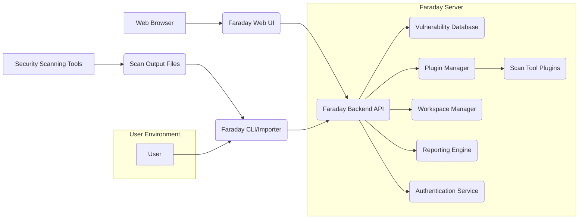
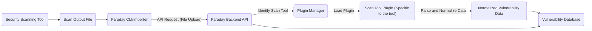
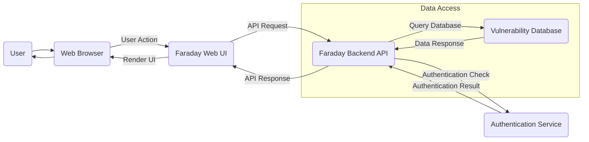

# Project Design Document: Faraday - Collaborative Penetration Testing IDE

**Version:** 1.1
**Date:** October 26, 2023
**Author:** AI Software Architect

## 1. Introduction

This document provides an enhanced and detailed design overview of the Faraday project, a collaborative penetration testing IDE. It elaborates on the system's architecture, key components, data flow, and crucial considerations for its secure and efficient operation. This document serves as a robust foundation for subsequent threat modeling activities, providing a comprehensive understanding of the system's inner workings.

## 2. Goals and Objectives

The primary goals of the Faraday project are to:

*   **Centralize and normalize vulnerability data:**  Aggregate findings from diverse security scanning tools into a unified format.
*   **Provide a collaborative platform:** Enable penetration testers to work together, share insights, and manage findings collectively.
*   **Facilitate efficient reporting and communication:** Streamline the process of generating clear and comprehensive security reports.
*   **Offer a user-friendly interface:** Provide an intuitive web-based interface for visualizing, interacting with, and managing security data.
*   **Support diverse penetration testing workflows:** Accommodate various methodologies and approaches used in penetration testing engagements.
*   **Enhance the efficiency of vulnerability analysis:**  Provide tools and features to aid in the analysis and prioritization of vulnerabilities.

## 3. High-Level Architecture

The Faraday system employs a client-server architecture, featuring a web-based user interface interacting with a backend API.

**Components:**

*   **User:** A penetration tester, security analyst, or other stakeholder interacting with the Faraday system.
*   **Web Browser:** The client application (e.g., Chrome, Firefox, Safari) used to access the Faraday Web UI.
*   **Faraday Web UI:** The front-end interface, typically a Single Page Application (SPA), providing users with access to Faraday's features and data visualization.
*   **Faraday Backend API:** The core application logic, responsible for handling requests, managing data persistence, orchestrating components, and enforcing business rules.
*   **Vulnerability Database:** A persistent storage mechanism for normalized vulnerability data, host information, service details, user accounts, and workspace configurations.
*   **Plugin Manager:** A component responsible for dynamically loading, managing, and providing access to Scan Tool Plugins.
*   **Scan Tool Plugins:** Individual modules that implement the logic for parsing and importing data from specific security scanning tools.
*   **Workspace Manager:**  Handles the creation, management, isolation, and access control of different penetration testing projects or engagements.
*   **Reporting Engine:**  Generates customizable reports in various formats based on the data stored within the system.
*   **Authentication Service:**  Responsible for user authentication (verifying identity) and authorization (granting access to resources).
*   **Security Scanning Tools:** External applications (e.g., Nmap, Nessus, Burp Suite) used to perform security assessments and generate findings.
*   **Scan Output Files:** The raw output generated by security scanning tools, often in formats like XML, JSON, or plain text.
*   **Faraday CLI/Importer:** A command-line interface or utility that allows users and automated scripts to import scan results into Faraday.

## 4. Component Details

This section provides a more in-depth description of each key component, including technology choices and considerations.

### 4.1. Faraday Web UI

*   **Responsibilities:**
    *   Presents a dynamic and interactive user interface for accessing and managing Faraday's features.
    *   Displays vulnerability data, host and service information, and generated reports in a user-friendly manner.
    *   Enables users to manage workspaces, create and customize reports, and collaborate on findings.
    *   Handles user authentication and authorization flows, interacting with the Authentication Service.
    *   Provides real-time updates and visualizations of security data through dashboards and charts.
*   **Technology:**  Likely built using a modern JavaScript framework such as React, Angular, or Vue.js, potentially with a state management library like Redux or Vuex. Communication with the Backend API is typically over HTTP/HTTPS using RESTful principles or GraphQL.
*   **Key Features:**
    *   Interactive vulnerability dashboard with filtering and sorting capabilities.
    *   Detailed views for hosts, services, and vulnerabilities with associated evidence.
    *   WYSIWYG report editor and management interface.
    *   User and role management features for access control.
    *   Real-time collaboration features like commenting and status updates on vulnerabilities.
    *   Search functionality for quickly locating specific data.

### 4.2. Faraday Backend API

*   **Responsibilities:**
    *   Implements the core business logic of the Faraday application.
    *   Provides a well-defined set of API endpoints for the Web UI and CLI to interact with.
    *   Manages data persistence and retrieval from the Vulnerability Database.
    *   Orchestrates the Plugin Manager, Reporting Engine, and interacts with the Authentication Service.
    *   Enforces authentication and authorization policies for all API requests.
    *   Handles background tasks such as report generation and data processing.
*   **Technology:**  Likely implemented using a robust Python framework such as Django REST Framework or Flask, leveraging asynchronous task queues like Celery for background processing. Data validation might be handled using libraries like Marshmallow or Pydantic.
*   **Key Features:**
    *   RESTful API endpoints adhering to best practices.
    *   Comprehensive data validation and sanitization to prevent security vulnerabilities.
    *   Asynchronous task processing for long-running operations.
    *   API documentation generated using tools like Swagger/OpenAPI for ease of integration.
    *   Rate limiting and request throttling to prevent abuse.

### 4.3. Vulnerability Database

*   **Responsibilities:**
    *   Serves as the central repository for all persistent data within the Faraday system.
    *   Maintains relationships between vulnerabilities, hosts, services, users, workspaces, and other relevant entities.
    *   Provides efficient data retrieval, querying, and indexing capabilities to support the application's needs.
    *   Ensures data integrity, consistency, and durability through appropriate database design and management practices.
*   **Technology:**  Likely a relational database such as PostgreSQL or MySQL, chosen for its reliability, scalability, and support for complex relationships. NoSQL databases like MongoDB could also be considered depending on specific data modeling requirements. Data migrations are likely managed using tools like Alembic or Django migrations.
*   **Key Features:**
    *   Well-defined schema for storing vulnerability information (CVEs, descriptions, severity scores, references, etc.).
    *   Schema for storing detailed host and service information (IP addresses, ports, protocols, operating systems, etc.).
    *   Storage for user accounts, roles, permissions, and workspace configurations.
    *   Indexing strategies for optimizing query performance.

### 4.4. Plugin Manager

*   **Responsibilities:**
    *   Dynamically discovers, loads, and manages Scan Tool Plugins.
    *   Provides a standardized interface for plugins to interact with the core Faraday system.
    *   Handles plugin configuration, updates, and potential isolation for security.
*   **Technology:**  Likely implemented within the Backend API using Python's dynamic module import capabilities (`importlib`). A plugin registration mechanism might be used to track available plugins.
*   **Key Features:**
    *   Automatic or manual plugin discovery based on predefined directories or configuration.
    *   Plugin activation and deactivation controls.
    *   API for plugins to register themselves and access core system functionalities.
    *   Potential sandboxing or isolation mechanisms to prevent malicious plugins from compromising the system.

### 4.5. Scan Tool Plugins

*   **Responsibilities:**
    *   Implement the specific logic required to parse output files from individual security scanning tools.
    *   Normalize the extracted data into Faraday's internal vulnerability data model.
    *   Handle variations in output formats and versions of different scanning tools.
    *   Potentially provide metadata about the supported tool and its output format.
*   **Technology:**  Python modules adhering to a defined interface or abstract base class provided by the Plugin Manager. They typically utilize libraries for parsing specific file formats (e.g., XML, JSON).
*   **Examples:** Plugins for popular tools like Nmap (parsing XML output), Nessus (parsing .nessus files), Burp Suite (parsing XML or JSON exports), Metasploit, and many others.

### 4.6. Workspace Manager

*   **Responsibilities:**
    *   Manages the creation, deletion, and configuration of isolated workspaces for different penetration testing engagements.
    *   Enforces access control policies, determining which users have access to specific workspaces.
    *   Provides mechanisms for organizing and separating data related to different projects.
*   **Technology:**  Implemented within the Backend API, interacting with the Vulnerability Database to manage workspace-specific data and user permissions.
*   **Key Features:**
    *   Workspace creation with customizable names and descriptions.
    *   User assignment to workspaces with different roles (e.g., admin, viewer, editor).
    *   Workspace-level permissions to control access to data and functionalities.
    *   Mechanisms for archiving or deleting workspaces.

### 4.7. Reporting Engine

*   **Responsibilities:**
    *   Generates comprehensive and customizable reports in various formats (e.g., PDF, HTML, CSV, DOCX).
    *   Allows users to define report templates, select specific data points, and customize the report's appearance.
    *   Provides options for filtering and sorting data included in reports.
*   **Technology:**  Likely implemented within the Backend API, potentially leveraging templating engines like Jinja2 or Mako for report generation. Libraries like ReportLab or WeasyPrint might be used for generating PDF reports.
*   **Key Features:**
    *   Library of pre-defined report templates for common use cases.
    *   Visual report editor for creating and modifying custom templates.
    *   Options for including specific vulnerability details, host information, and executive summaries.
    *   Scheduling capabilities for automated report generation.

### 4.8. Authentication Service

*   **Responsibilities:**
    *   Handles user authentication, verifying the identity of users attempting to access the system.
    *   Manages user accounts, passwords, and potentially other authentication factors (e.g., multi-factor authentication).
    *   Provides authorization services, determining what resources and actions a user is permitted to access.
*   **Technology:**  Could be implemented using a dedicated authentication library or framework within the Backend API (e.g., Django's built-in authentication, Flask-Security), or as a separate microservice using technologies like OAuth 2.0 and JWT (JSON Web Tokens).
*   **Key Features:**
    *   Secure password storage using hashing algorithms.
    *   Support for different authentication methods (e.g., username/password, API keys).
    *   Role-Based Access Control (RBAC) for managing user permissions.
    *   Session management and token-based authentication.

### 4.9. Faraday CLI/Importer

*   **Responsibilities:**
    *   Provides a command-line interface for interacting with the Faraday Backend API.
    *   Enables users to programmatically import scan output files into specific workspaces.
    *   Supports scripting and automation of data import processes.
*   **Technology:**  A Python-based command-line application built using libraries like `argparse` or `click` for handling command-line arguments. It interacts with the Backend API over HTTP/HTTPS.
*   **Key Features:**
    *   `faraday-cli import` command with options for specifying the scan tool, output file, and target workspace.
    *   Authentication mechanisms for securely accessing the API.
    *   Support for batch importing of multiple scan files.

## 5. Data Flow

The following diagrams illustrate the typical data flow scenarios within the Faraday system.

**Data Flow: Importing Scan Results**

**Data Flow Description:**

1. A **Security Scanning Tool** completes its assessment and generates a **Scan Output File**.
2. The **Faraday CLI/Importer** reads the contents of the **Scan Output File**.
3. The **Faraday CLI/Importer** sends an **API Request (File Upload)** containing the file data to the **Faraday Backend API**.
4. The **Faraday Backend API** analyzes the request to **Identify the Scan Tool** that generated the output.
5. The **Faraday Backend API** interacts with the **Plugin Manager** to **Load the appropriate Scan Tool Plugin**.
6. The **Scan Tool Plugin** processes the file data to **Parse and Normalize Data** into Faraday's internal model.
7. The **Normalized Vulnerability Data** is then persisted in the **Vulnerability Database**.

**Data Flow: User Interaction via Web UI**

**Data Flow Description:**

1. The **User** initiates an action within the **Faraday Web UI** through their **Web Browser**.
2. The **Faraday Web UI** sends an **API Request** to the **Faraday Backend API** based on the user's action.
3. The **Faraday Backend API** performs an **Authentication Check** by communicating with the **Authentication Service**.
4. The **Authentication Service** returns the **Authentication Result** to the **Faraday Backend API**.
5. If authenticated and authorized, the **Faraday Backend API** may **Query the Database** to retrieve or modify data.
6. The **Vulnerability Database** returns the **Data Response** to the **Faraday Backend API**.
7. The **Faraday Backend API** sends an **API Response** back to the **Faraday Web UI**.
8. The **Faraday Web UI** processes the response and **Renders the UI** to reflect the changes to the **User**.

## 6. Security Considerations (Detailed)

This section provides a more detailed overview of security considerations for the Faraday project, expanding on the initial points.

*   **Authentication and Authorization:**
    *   Implement strong password policies and encourage the use of password managers.
    *   Utilize multi-factor authentication (MFA) for enhanced security.
    *   Employ Role-Based Access Control (RBAC) to manage user permissions and restrict access to sensitive data and functionalities.
    *   Securely store user credentials using robust hashing algorithms (e.g., bcrypt, Argon2).
    *   Protect API endpoints with authentication mechanisms (e.g., JWT, OAuth 2.0).
*   **Input Validation and Sanitization:**
    *   Implement rigorous input validation on both the client-side (Web UI) and server-side (Backend API) to prevent injection attacks (e.g., SQL injection, command injection, XSS).
    *   Sanitize user-provided data before displaying it in the Web UI to prevent cross-site scripting (XSS) vulnerabilities.
    *   Validate the structure and content of imported scan output files to prevent malicious data from being ingested.
*   **Secure API Communication:**
    *   Enforce the use of HTTPS for all communication between the Web UI and the Backend API to encrypt data in transit and prevent eavesdropping.
    *   Implement proper CORS (Cross-Origin Resource Sharing) policies to restrict which domains can access the API.
*   **Database Security:**
    *   Implement strong access controls to the Vulnerability Database, limiting access to authorized users and services only.
    *   Encrypt sensitive data at rest within the database.
    *   Regularly back up the database to prevent data loss.
    *   Harden the database server by disabling unnecessary services and applying security patches.
*   **Plugin Security:**
    *   Implement a mechanism for verifying the integrity and authenticity of Scan Tool Plugins (e.g., code signing).
    *   Consider running plugins in isolated environments or sandboxes to limit their potential impact in case of vulnerabilities.
    *   Regularly review and audit plugin code for security flaws.
*   **Session Management:**
    *   Use secure session management techniques (e.g., HTTP-only and secure cookies).
    *   Implement appropriate session timeouts and idle timeouts.
    *   Rotate session identifiers regularly.
*   **Regular Security Audits and Penetration Testing:**
    *   Conduct regular security audits and penetration testing to proactively identify and address potential vulnerabilities in the system.
    *   Employ both automated scanning tools and manual testing techniques.
*   **Dependency Management:**
    *   Maintain an up-to-date inventory of all software dependencies.
    *   Regularly scan dependencies for known vulnerabilities and apply necessary updates and patches.
*   **Error Handling and Logging:**
    *   Implement secure error handling practices to avoid revealing sensitive information in error messages.
    *   Maintain comprehensive audit logs of user activity and system events for security monitoring and incident response.

## 7. Deployment

The Faraday system offers flexibility in deployment options, catering to various infrastructure needs.

*   **Self-Hosted (On-Premise):**
    *   Deployed on the user's own physical or virtual infrastructure within their data center.
    *   Provides maximum control over the environment but requires managing the underlying infrastructure.
    *   Suitable for organizations with strict compliance requirements or existing infrastructure investments.
    *   Deployment typically involves installing the Backend API, Web UI, and Vulnerability Database on dedicated servers or virtual machines.
*   **Cloud-Based (IaaS/PaaS):**
    *   Deployed on cloud platforms like AWS, Azure, or GCP, leveraging Infrastructure-as-a-Service (IaaS) or Platform-as-a-Service (PaaS) offerings.
    *   Offers scalability, flexibility, and reduced operational overhead compared to self-hosting.
    *   Deployment can involve using virtual machines (IaaS) or container orchestration services like Kubernetes (PaaS). Managed database services can be used for the Vulnerability Database.
*   **Containerized (Docker/Kubernetes):**
    *   Packaged and deployed using containerization technologies like Docker, enabling consistent and reproducible deployments across different environments.
    *   Orchestration platforms like Kubernetes can be used to manage and scale containerized deployments.
    *   Simplifies deployment and management, improves resource utilization, and enhances portability.
    *   Deployment typically involves building Docker images for the Backend API and Web UI, and deploying them along with the Vulnerability Database (potentially also containerized) using Kubernetes.

A typical deployment architecture might include:

*   A load balancer to distribute traffic across multiple instances of the Backend API and Web UI for scalability and high availability.
*   A reverse proxy (e.g., Nginx, Apache) to handle SSL termination, routing, and security.
*   Separate containers or virtual machines for the Backend API, Web UI, and Vulnerability Database.
*   A dedicated network for internal communication between components.

## 8. Future Considerations

*   **Enhanced Integration Capabilities:**
    *   Developing plugins for a wider range of security tools, including SAST, DAST, and cloud security scanners.
    *   Implementing integrations with vulnerability management platforms and ticketing systems (e.g., Jira, ServiceNow).
    *   Providing an SDK or API for third-party developers to create custom plugins and integrations.
*   **Advanced Analytics and Reporting:**
    *   Implementing machine learning algorithms for vulnerability prioritization and trend analysis.
    *   Developing interactive dashboards with customizable widgets and visualizations.
    *   Adding support for generating reports in industry-standard formats (e.g., MITRE ATT&CK).
*   **Vulnerability Management Workflow Enhancements:**
    *   Adding features for tracking vulnerability remediation progress and verification status.
    *   Implementing automated workflows for assigning vulnerabilities to team members and managing remediation tasks.
    *   Integrating with threat intelligence feeds to enrich vulnerability data.
*   **Granular Role-Based Access Control (RBAC):**
    *   Implementing more fine-grained control over user permissions, allowing for more specific access restrictions.
    *   Defining custom roles with tailored permissions based on organizational needs.
*   **Scalability and Performance Optimizations:**
    *   Optimizing database queries and indexing for improved performance with large datasets.
    *   Implementing caching mechanisms to reduce database load.
    *   Scaling the Backend API and Web UI horizontally to handle increased user load.
*   **API Extensions and SDK:**
    *   Developing a more comprehensive and well-documented API for external integrations and automation.
    *   Providing SDKs in various programming languages to simplify API interaction.

This enhanced design document provides a more detailed and comprehensive understanding of the Faraday project. It serves as a valuable resource for development, deployment, and, most importantly, for conducting thorough threat modeling activities.