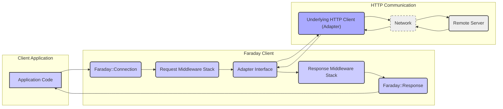

## Project Design Document: Faraday HTTP Client

**Document Version:** 1.1
**Date:** October 26, 2023
**Author:** Gemini (AI Language Model)

### 1. Introduction

This document provides an enhanced design overview of the Faraday HTTP client library, based on the project found on GitHub at [https://github.com/lostisland/faraday](https://github.com/lostisland/faraday). This revised document aims to provide a more detailed and clearer understanding of Faraday's architecture and components, specifically for the purpose of threat modeling. It elaborates on key elements, data flows, and interactions within the library, offering a more robust foundation for security analysis.

### 2. Goals and Objectives

The core goals of the Faraday library are:

- To offer a declarative and composable approach to making HTTP requests in Ruby.
- To abstract the underlying HTTP client implementation, allowing developers to switch between different HTTP libraries without significant code changes.
- To provide a flexible and extensible middleware system for manipulating requests before they are sent and responses after they are received.
- To present a consistent and user-friendly API for common HTTP client functionalities.

This design document aims to:

- Provide a clear and comprehensive description of the Faraday library's architecture.
- Precisely identify the key components and delineate their specific responsibilities.
- Detail the flow of data through the system during the lifecycle of an HTTP request.
- Highlight potential areas of security vulnerability and concern based on the library's design and functionality.

### 3. System Architecture

Faraday's architecture revolves around a central `Connection` object, which orchestrates the execution of HTTP requests. This `Connection` manages a stack of middleware and interacts with a chosen adapter for the actual HTTP communication. The key architectural components are:

- **Connection:** The primary interface for configuring and initiating HTTP requests. It encapsulates the middleware stack and the selected adapter.
- **Adapter:** An abstraction layer that implements the HTTP protocol using a specific underlying HTTP client library.
- **Middleware:** Interceptors that form a pipeline for processing requests before they are sent and responses after they are received.
- **Request:** An object representing the outgoing HTTP request, containing details like headers, body, and URL.
- **Response:** An object representing the incoming HTTP response, containing the status code, headers, and body.

### 4. Component Descriptions

- **Connection (`Faraday::Connection`):**
    - Serves as the entry point for making HTTP requests.
    - Manages the ordered collection of middleware.
    - Holds a reference to the configured adapter.
    - Provides methods corresponding to HTTP verbs (e.g., `get`, `post`, `put`, `delete`).
    - Allows configuration of global request options that apply to all requests made through this connection.
    - Handles connection-level settings such as SSL configuration and proxy settings.

- **Adapter (`Faraday::Adapter::...`):**
    - Implements the core logic for sending HTTP requests and receiving responses.
    - Adapters exist for various Ruby HTTP libraries, such as `Net::HTTP`, `Patron`, `Excon`, and `HTTPClient`.
    - Takes a prepared `Faraday::Request` object and performs the actual network request.
    - Receives the raw HTTP response from the server.
    - Transforms the raw response into a `Faraday::Response` object.
    - The choice of adapter can impact performance, features, and security characteristics.

- **Middleware (`Faraday::Middleware`):**
    - Independent, modular components that intercept and process HTTP requests and responses.
    - Organized as a stack within the `Faraday::Connection`.
    - Executed in the order they are added to the stack for requests, and in reverse order for responses.
    - Can modify the request (e.g., add authentication headers, encode the request body).
    - Can modify the response (e.g., parse JSON or XML, handle errors).
    - Examples of common middleware:
        - Request Middleware:
            - `Faraday::Request::UrlEncoded`: Encodes request parameters in the URL.
            - `Faraday::Request::Multipart`: Encodes request body as multipart form data.
            - `Faraday::Request::BasicAuthentication`: Adds basic authentication headers.
            - `Faraday::Request::TokenAuthentication`: Adds token-based authentication headers.
        - Response Middleware:
            - `Faraday::Response::Json`: Parses the response body as JSON.
            - `Faraday::Response::Xml`: Parses the response body as XML.
            - `Faraday::Response::Logger`: Logs request and response information.
            - `Faraday::Response::RaiseError`: Raises exceptions for specific HTTP error codes.

- **Request (`Faraday::Request`):**
    - A data structure representing the HTTP request being sent.
    - Contains:
        - `url`: The target URL for the request.
        - `headers`: A hash of HTTP headers.
        - `body`: The request body (e.g., for POST or PUT requests).
        - `method`: The HTTP method (e.g., GET, POST).
        - `options`: Request-specific options (e.g., timeouts).

- **Response (`Faraday::Response`):**
    - A data structure representing the HTTP response received from the server.
    - Contains:
        - `status`: The HTTP status code (e.g., 200, 404).
        - `headers`: A hash of response headers.
        - `body`: The response body (typically a string or a parsed object).
        - `env`: An environment hash providing context about the request and response cycle.

### 5. Data Flow

The following diagram illustrates the flow of data during a typical HTTP request made using Faraday:

Detailed steps of the data flow:

- The application code initiates an HTTP request by calling a method (e.g., `get`, `post`) on the `Faraday::Connection` object.
- The request is first processed by the **request middleware stack**. Each middleware in the stack can inspect and modify the outgoing `Faraday::Request` object.
- The modified request is then passed to the configured **adapter**.
- The adapter utilizes the underlying HTTP client library to send the request over the network to the remote server.
- The remote server processes the request and sends back an HTTP response.
- The adapter receives the raw HTTP response.
- The adapter creates a `Faraday::Response` object from the raw response data.
- The response is then processed by the **response middleware stack**. Each middleware in this stack can inspect and modify the incoming `Faraday::Response` object. The middleware is executed in the reverse order of their addition to the stack.
- Finally, the processed `Faraday::Response` object is returned to the application code.

### 6. Security Considerations (For Threat Modeling)

Threat modeling of applications using Faraday should consider the following potential security implications:

- **Vulnerabilities in Underlying Adapters:** Faraday's security is inherently tied to the security of the HTTP client library used by the chosen adapter. Known vulnerabilities in libraries like `Net::HTTP` or others could be exploitable through Faraday if not properly addressed in the adapter implementation or the underlying library.
- **Malicious or Compromised Middleware:** The flexibility of the middleware system introduces a risk. If a malicious or compromised middleware component is added to the connection's stack, it could:
    - Intercept and exfiltrate sensitive request or response data (e.g., authentication tokens, personal information).
    - Modify requests to perform unauthorized actions on the remote server.
    - Inject malicious content into responses.
- **Insecure Middleware Configurations:** Even well-intentioned middleware can introduce vulnerabilities if misconfigured. Examples include:
    - Logging sensitive information in plain text.
    - Implementing authentication logic with flaws.
    - Improperly handling or sanitizing data, leading to injection vulnerabilities.
- **TLS/SSL Configuration Weaknesses:** Issues with TLS/SSL configuration can compromise the confidentiality and integrity of communication:
    - **Disabled or Insufficient Certificate Verification:**  Failing to properly verify the server's SSL certificate can lead to man-in-the-middle attacks.
    - **Use of Weak or Obsolete Cipher Suites:**  Configuring Faraday or the underlying adapter to use weak cipher suites can make the connection susceptible to eavesdropping.
    - **Incorrect SSL Context Options:** Improperly setting SSL context options can bypass security measures.
- **Server-Side Request Forgery (SSRF):** If the application using Faraday constructs request URLs or headers based on user-provided input without proper validation and sanitization, it could be vulnerable to SSRF attacks. Attackers could manipulate the application to make requests to internal or external resources that they shouldn't have access to.
- **Header Injection:** If middleware improperly handles or concatenates header values, attackers might be able to inject arbitrary headers, potentially leading to security vulnerabilities like HTTP response splitting or session hijacking.
- **Exposure of Sensitive Data through Logging:** Middleware that logs request or response data needs to be carefully configured to avoid logging sensitive information like authentication credentials or API keys.
- **Dependency Vulnerabilities:**  Like any software, Faraday has its own dependencies. Vulnerabilities in these dependencies could indirectly affect applications using Faraday. Regular updates and security audits are necessary.
- **Improper Error Handling in Middleware:**  Middleware that handles errors should do so securely, avoiding the leakage of sensitive information in error messages or logs.
- **Timeout and Resource Exhaustion:**  Inadequate timeout configurations or poorly designed middleware could lead to resource exhaustion or denial-of-service conditions.

### 7. Deployment

Faraday is deployed as a Ruby gem and integrated into other Ruby applications. Its security posture is therefore heavily influenced by the security of the host application and its deployment environment. Considerations for deployment include:

- **Secure Gem Management:** Ensuring the Faraday gem and its dependencies are obtained from trusted sources and are regularly updated to patch vulnerabilities.
- **Secure Configuration:** Properly configuring Faraday's connection options, middleware stack, and adapter settings.
- **Principle of Least Privilege:**  Granting the application using Faraday only the necessary network access and permissions.
- **Monitoring and Logging:** Implementing robust monitoring and logging to detect and respond to potential security incidents.

### 8. Future Considerations

- Detailed security analysis of commonly used Faraday middleware components to identify potential vulnerabilities.
- Investigation of security best practices for configuring different Faraday adapters.
- Development of guidelines and tools to assist developers in securely using Faraday.
- Exploring options for built-in security features or mitigations within the Faraday library itself.
