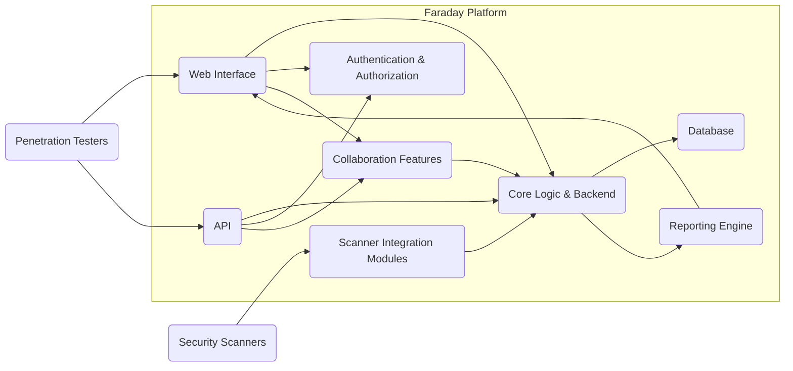
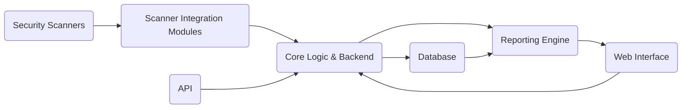

## Project Design Document: Faraday - Collaborative Penetration Testing Platform (Improved)

**1. Introduction**

This document provides an enhanced design overview of the Faraday collaborative penetration testing platform. It aims to offer a clear and detailed understanding of the system's architecture, components, data flow, and key interactions, specifically for use in subsequent threat modeling activities.

**1.1. Purpose**

The primary goals of this document are to:

* Clearly articulate the architecture and individual components of the Faraday platform.
* Detail the interactions and dependencies between different parts of the system.
* Precisely define key data flows and the mechanisms used for data storage.
* Establish a solid foundation for understanding the system's security posture and identifying potential vulnerabilities.

**1.2. Scope**

This document encompasses the core functionalities of the Faraday platform, including but not limited to:

* Ingestion and normalization of vulnerability scan results from a variety of security tools.
* Centralized, secure storage and efficient management of vulnerability data.
* Collaborative features designed to facilitate teamwork among penetration testing teams.
* Comprehensive reporting and insightful visualization of identified security findings.
* Robust user authentication and fine-grained authorization mechanisms.

**1.3. Audience**

This document is primarily intended for:

* Security architects and engineers responsible for conducting threat modeling exercises.
* Development team members actively involved in the design, development, and maintenance of the Faraday project.
* Security auditors tasked with assessing the platform's security controls and overall security posture.

**2. High-Level Overview**

Faraday serves as a centralized platform for managing and fostering collaboration during penetration testing engagements. It ingests and standardizes data from various security scanners, presenting a unified view of identified vulnerabilities. The platform enables teams to collaborate on findings, assign responsibilities, and generate comprehensive reports.

**3. Detailed Design**

**3.1. Components**

* **Web Interface:**
    * Provides a user-friendly graphical interface for interacting with the platform's features.
    * Enables users to view, search, filter, and manage vulnerability data effectively.
    * Supports collaborative workflows through features like commenting on findings and assigning tasks to team members.
    * Manages user authentication, session management, and authorization controls.
    * Presents reports and interactive visualizations of security assessment data.

* **API:**
    * Offers a programmatic interface (likely RESTful) for interacting with the platform's functionalities.
    * Facilitates seamless integration with other security tools and automation pipelines.
    * Supports a range of operations, including data ingestion, retrieval, modification, and deletion.
    * Enforces strict authentication and authorization for all API requests to ensure security.

* **Core Logic & Backend:**
    * Encompasses the central business logic and processing engine of the application.
    * Responsible for processing, normalizing, and validating data ingested from various scanners.
    * Manages the underlying vulnerability database and ensures data integrity.
    * Implements and orchestrates collaboration features, enabling team interaction.
    * Coordinates report generation tasks based on user requests and predefined templates.

* **Database:**
    * Serves as the persistent storage layer for all critical platform data, including:
        * Detailed vulnerability findings (e.g., name, description, severity, evidence).
        * Comprehensive host and service information gathered during scans.
        * User account details, roles, and associated permissions.
        * Workspace configurations and project-specific settings.
        * Audit logs tracking user actions and system events.
        * Report templates and the data used to generate reports.

* **Scanner Integration Modules:**
    * Act as specialized adapters for parsing and ingesting data from different security scanners.
    * Each module is tailored to handle the specific output format of a particular scanner.
    * Performs data transformation and normalization to ensure consistency within the platform.

* **Reporting Engine:**
    * Generates reports in various formats (e.g., PDF, CSV, HTML, JSON) to suit different needs.
    * Allows users to customize report templates, filter data, and select specific information to include.
    * Retrieves data from the Database to populate reports based on user-defined criteria.

* **Authentication & Authorization:**
    * Manages user identities and authentication processes (e.g., username/password, multi-factor authentication, API keys).
    * Enforces authorization policies to control user access to specific features, data, and functionalities based on their roles and permissions.
    * May integrate with external identity providers (e.g., LDAP, Active Directory, OAuth 2.0).

* **Collaboration Features:**
    * Provides tools and functionalities to facilitate teamwork and communication among penetration testers, including:
        * Commenting and discussion threads associated with individual vulnerabilities.
        * Task assignment and tracking mechanisms to manage remediation efforts.
        * Shared workspaces for organizing and managing project-specific data.
        * Real-time updates and notifications to keep team members informed.

**3.2. Data Flow**

The typical flow of data within the Faraday platform involves the following stages:

1. **Scan Execution:** Penetration testers initiate and execute security scans using a variety of specialized tools.
2. **Data Export:** Scan results are exported from the scanning tools, typically in tool-specific formats.
3. **Data Ingestion:**
    * Users upload exported scan reports through the Web Interface or submit data via the API.
    * The appropriate Scanner Integration Module is invoked based on the identified scanner type.
    * The module parses the report, extracts relevant information, and normalizes the data into Faraday's internal data model.
4. **Data Storage:** The normalized vulnerability data, along with associated host, service, and evidence details, is securely stored in the Database.
5. **Data Access and Manipulation:**
    * Users access and interact with the stored data through the Web Interface, utilizing features for filtering, searching, and analysis.
    * Users can add contextual information, comments, assign tasks, and update the status of individual findings.
    * The API provides programmatic access to the data, enabling integrations and automated workflows.
6. **Reporting:**
    * Users initiate report generation through the Web Interface or via API calls.
    * The Reporting Engine retrieves the necessary data from the Database based on the selected report template and specified filters.
    * Reports are generated in the desired format and made available for download or viewing through the Web Interface.

**3.3. Key Interactions**

* **User Interaction:** Penetration testers primarily interact with the platform through the Web Interface for day-to-day tasks, including managing scans, analyzing vulnerabilities, and collaborating with team members. The API provides an alternative interface for automation and integration.
* **Scanner Integration:** Scanner Integration Modules act as crucial intermediaries, bridging the gap between diverse scanner output formats and the platform's internal data structure.
* **Data Persistence:** The Database serves as the central and authoritative repository for all persistent data within the Faraday platform, ensuring data integrity and availability.
* **API Communication:** The API facilitates communication between different internal components and enables secure interaction with external systems and services.
* **Reporting Generation:** The Reporting Engine interacts directly with the Database to retrieve and format data for generating comprehensive reports.
* **Authentication and Authorization Enforcement:** The Authentication & Authorization component plays a critical role in securing all interactions, ensuring that only authenticated and authorized users can access specific resources and functionalities.

**4. Security Considerations (For Threat Modeling)**

This section outlines key security considerations that are crucial for effective threat modeling of the Faraday platform:

* **Authentication and Authorization:**
    * **Threats:** Brute-force attacks against login forms, credential stuffing, weak password policies, session hijacking, privilege escalation, insecure API key management, vulnerabilities in multi-factor authentication implementation.
    * **Considerations:** Strength of hashing algorithms for passwords, enforcement of strong password policies, use of rate limiting for login attempts, secure session management (e.g., HTTPOnly and Secure flags), principle of least privilege for authorization, secure storage and rotation of API keys.

* **Input Validation:**
    * **Threats:** Cross-site scripting (XSS), SQL injection, command injection, path traversal, XML External Entity (XXE) injection, Server-Side Request Forgery (SSRF) through manipulation of input fields in the Web Interface and API.
    * **Considerations:** Implementing robust input validation and sanitization on all user-supplied data, using parameterized queries to prevent SQL injection, avoiding direct execution of user-provided commands, validating file uploads, encoding output to prevent XSS.

* **Data Storage Security:**
    * **Threats:** Unauthorized access to the database, data breaches, data tampering, insufficient encryption of sensitive data at rest, insecure database configurations, lack of proper access controls.
    * **Considerations:** Encryption of sensitive data at rest (e.g., using database encryption features or full-disk encryption), implementing strong access controls to the database, regular security audits of database configurations, secure backup and recovery procedures, data masking or anonymization where appropriate.

* **Communication Security:**
    * **Threats:** Man-in-the-middle (MITM) attacks, eavesdropping on network traffic, data interception, insecure API communication.
    * **Considerations:** Enforcing HTTPS/TLS for all communication between clients and the server, using strong cipher suites, proper certificate management, securing API communication using appropriate authentication and authorization mechanisms (e.g., OAuth 2.0).

* **API Security:**
    * **Threats:** Broken authentication and authorization, excessive data exposure, lack of rate limiting, injection vulnerabilities, improper error handling leading to information disclosure, security misconfiguration.
    * **Considerations:** Implementing robust authentication and authorization mechanisms for all API endpoints, adhering to the principle of least privilege for API access, implementing rate limiting to prevent abuse, thorough input validation for all API requests, secure error handling to avoid leaking sensitive information.

* **Scanner Integration Security:**
    * **Threats:** Ingestion of malicious data from compromised scanners, vulnerabilities in parsing logic leading to code execution, denial-of-service attacks through specially crafted scan reports.
    * **Considerations:** Thoroughly validating and sanitizing data ingested from scanners, implementing secure parsing libraries, sandboxing or isolating scanner integration modules, regularly updating integration modules to address potential vulnerabilities.

* **Collaboration Feature Security:**
    * **Threats:** Unauthorized access to shared workspaces, information disclosure through comments or task assignments, cross-site scripting vulnerabilities within collaboration features.
    * **Considerations:** Implementing granular access controls for shared workspaces, sanitizing user-generated content within collaboration features, ensuring secure communication channels for collaboration.

* **Reporting Security:**
    * **Threats:** Unauthorized access to generated reports, information disclosure through reports, vulnerabilities in report generation logic.
    * **Considerations:** Implementing access controls for generated reports, ensuring that reports only contain necessary information, sanitizing data included in reports to prevent injection vulnerabilities.

* **Logging and Monitoring:**
    * **Threats:** Insufficient logging of security events, inadequate monitoring for suspicious activity, insecure storage of logs, tampering with audit logs.
    * **Considerations:** Implementing comprehensive logging of security-relevant events (e.g., authentication attempts, authorization failures, data modifications), setting up monitoring and alerting mechanisms for suspicious activity, securely storing and managing logs, protecting logs from unauthorized modification.

**5. Deployment Considerations**

* **Deployment Environment:** Faraday can be deployed in various environments, including on-premises infrastructure, cloud platforms (e.g., AWS, Azure, GCP), and containerized environments (e.g., Docker, Kubernetes). The chosen deployment environment significantly impacts the security controls that need to be implemented and the potential attack surface.
* **Network Architecture:** Proper network segmentation and firewall configurations are crucial to limit the impact of potential security breaches. Considerations include isolating the Faraday platform within a secure network zone and restricting access to necessary ports and services.
* **Dependencies:** The security of Faraday is also dependent on the security of its underlying dependencies, including the operating system, programming language runtime, libraries, and frameworks. Regular patching and updates of these dependencies are essential.
* **Containerization:** When deployed in containerized environments, security considerations include securing the container images, implementing proper container orchestration security policies, and managing container vulnerabilities.

**6. Future Considerations**

* **Enhanced Role-Based Access Control (RBAC):** Implementing more granular and customizable role-based access control to better manage user permissions and access to specific features and data.
* **Integration with Security Orchestration, Automation, and Response (SOAR) Platforms:** Enabling automated responses to security events detected within Faraday.
* **Advanced Threat Intelligence Integration:** Incorporating threat intelligence feeds to enrich vulnerability data and improve detection capabilities.
* **Improved Audit Logging and Reporting:** Providing more detailed and customizable audit logs for enhanced security monitoring and compliance.
* **Vulnerability Management Workflow Enhancements:** Streamlining the process of vulnerability verification, remediation tracking, and reporting.

This improved design document provides a more detailed and comprehensive overview of the Faraday platform, specifically tailored for effective threat modeling. By understanding the intricacies of the system's architecture, data flows, and interactions, security professionals can more effectively identify potential vulnerabilities and develop appropriate mitigation strategies to enhance the platform's overall security posture.