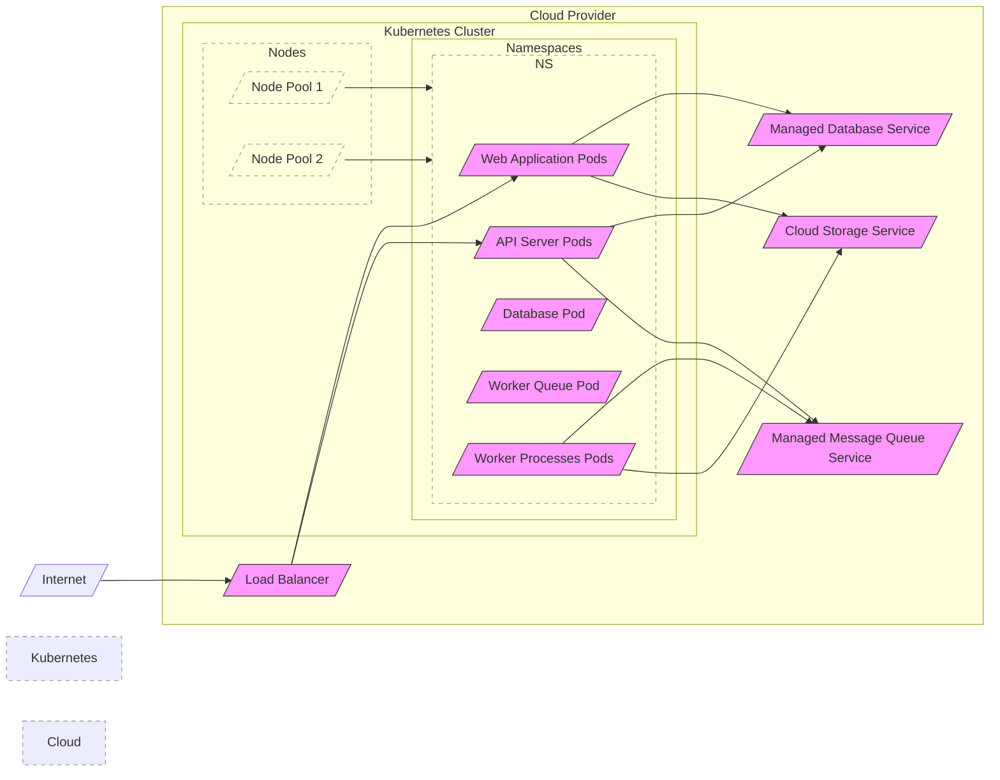
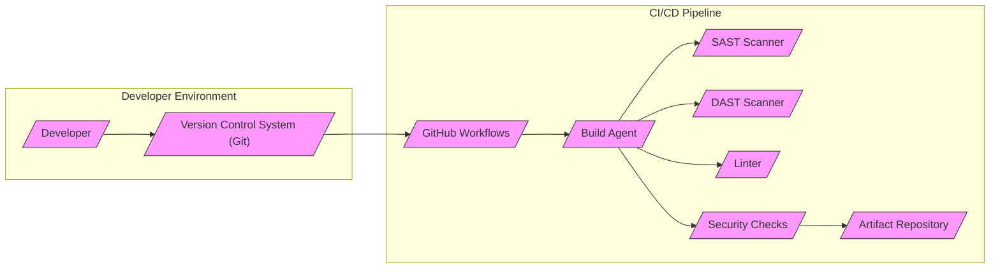

# BUSINESS POSTURE

This project, based on the Faraday GitHub repository, aims to provide a collaborative penetration testing and vulnerability management platform.

- Business Priorities and Goals:
  - Goal 1: Enhance efficiency and collaboration among penetration testers.
  - Goal 2: Centralize vulnerability data for better analysis and reporting.
  - Goal 3: Improve the overall vulnerability management lifecycle.
  - Priority 1: Ensuring data integrity and confidentiality of vulnerability findings.
  - Priority 2: Providing a user-friendly and efficient platform for penetration testing teams.
  - Priority 3: Enabling seamless integration with existing security tools and workflows.

- Business Risks:
  - Risk 1: Data breach of sensitive vulnerability information leading to reputational damage and potential exploitation of vulnerabilities before remediation.
  - Risk 2: Loss of productivity due to platform instability or usability issues, hindering penetration testing efforts.
  - Risk 3: Inaccurate or incomplete vulnerability data leading to ineffective remediation and persistent security weaknesses.
  - Risk 4: Unauthorized access to the platform, allowing malicious actors to view or manipulate vulnerability data.
  - Risk 5: Compliance violations if sensitive data is not handled according to relevant regulations (e.g., GDPR, HIPAA).

# SECURITY POSTURE

- Existing Security Controls:
  - security control: Authentication mechanism for user login (location: application code).
  - security control: Authorization model to control access to different features and data (location: application code).
  - security control: Input validation to prevent common web application vulnerabilities (location: application code).
  - security control: Secure coding practices followed by developers (location: assumed based on open-source nature and community contributions).
  - security control: Use of HTTPS for communication encryption (location: deployment configuration).
  - accepted risk: Potential vulnerabilities in third-party libraries and dependencies.
  - accepted risk: Security misconfigurations in deployment environments.
  - accepted risk: Lack of formal security testing and code reviews in the development process.

- Recommended Security Controls:
  - recommended security control: Implement multi-factor authentication (MFA) for enhanced user login security.
  - recommended security control: Integrate with a centralized logging and monitoring system for security event detection and incident response.
  - recommended security control: Implement regular security scanning (SAST/DAST) in the development pipeline.
  - recommended security control: Conduct periodic penetration testing and vulnerability assessments.
  - recommended security control: Establish a formal security incident response plan.
  - recommended security control: Implement data encryption at rest for sensitive vulnerability data.
  - recommended security control: Implement robust role-based access control (RBAC) to manage user permissions effectively.

- Security Requirements:
  - Authentication:
    - requirement: Secure user authentication mechanism to verify user identity.
    - requirement: Support for strong passwords and password complexity policies.
    - requirement: Consider integration with existing identity providers (e.g., LDAP, Active Directory, SAML, OAuth 2.0).
    - requirement: Implement session management to control user session duration and prevent session hijacking.
    - requirement: Implement account lockout and brute-force protection mechanisms.
  - Authorization:
    - requirement: Role-based access control (RBAC) to manage user permissions based on roles (e.g., administrator, penetration tester, viewer).
    - requirement: Granular access control to different features, projects, and vulnerability data.
    - requirement: Principle of least privilege should be applied to user access.
    - requirement: Audit logging of authorization decisions and access attempts.
  - Input Validation:
    - requirement: Validate all user inputs to prevent injection vulnerabilities (e.g., SQL injection, cross-site scripting).
    - requirement: Input validation should be performed on both client-side and server-side.
    - requirement: Use parameterized queries or ORM frameworks to prevent SQL injection.
    - requirement: Encode outputs to prevent cross-site scripting (XSS) vulnerabilities.
    - requirement: Implement input sanitization and whitelisting where appropriate.
  - Cryptography:
    - requirement: Use HTTPS for all communication to encrypt data in transit.
    - requirement: Encrypt sensitive data at rest (e.g., vulnerability descriptions, credentials).
    - requirement: Securely store and manage cryptographic keys.
    - requirement: Use strong and up-to-date cryptographic algorithms and libraries.
    - requirement: Implement proper handling of sensitive data in memory and logs.

# DESIGN

## C4 CONTEXT

```mermaid
flowchart LR
  subgraph "Organization Context"
    style "Organization Context" fill:transparent,stroke:#999,stroke-dasharray:5 5
    U[/"Penetration Testers"/]
    ST[/"Security Teams"/]
    TS[/"Target Systems"/]
    VD[/"Vulnerability Databases"/]
    RT[/"Reporting Tools"/]
  end
  P[/"Faraday Platform"/]

  U -->|Uses| P
  ST -->|Uses| P
  P -->|Scans, Reports Vulnerabilities| TS
  P -->|Imports Vulnerability Data| VD
  P -->|Exports Reports| RT
  style P fill:#f9f,stroke:#333,stroke-width:2px
```

- Context Diagram Elements:
  - - Name: Penetration Testers
    - Type: User
    - Description: Security professionals who use Faraday to conduct penetration tests and manage vulnerabilities.
    - Responsibilities: Conduct penetration tests, input vulnerability findings into Faraday, collaborate with team members, generate reports.
    - Security controls: User authentication, role-based access control, session management.
  - - Name: Security Teams
    - Type: User
    - Description: Security teams who use Faraday to review vulnerability data, track remediation efforts, and generate security reports.
    - Responsibilities: Review vulnerability findings, track remediation progress, generate security reports, manage vulnerability lifecycle.
    - Security controls: User authentication, role-based access control, audit logging.
  - - Name: Faraday Platform
    - Type: Software System
    - Description: A collaborative penetration testing and vulnerability management platform.
    - Responsibilities: Centralize vulnerability data, facilitate collaboration among penetration testers, generate reports, integrate with other security tools.
    - Security controls: Authentication, authorization, input validation, data encryption, secure communication, security logging and monitoring.
  - - Name: Target Systems
    - Type: External System
    - Description: Systems and applications that are the targets of penetration tests.
    - Responsibilities: Provide access for penetration testing, host applications and data being tested.
    - Security controls: Access control, network segmentation, intrusion detection systems (IDS), web application firewalls (WAF). (Security controls are external to Faraday but relevant in the context of penetration testing).
  - - Name: Vulnerability Databases
    - Type: External System
    - Description: External databases or services that provide vulnerability information (e.g., CVE databases, commercial vulnerability feeds).
    - Responsibilities: Provide up-to-date vulnerability information, allow Faraday to import and enrich vulnerability data.
    - Security controls: API authentication, secure data transfer protocols. (Security controls are external to Faraday but relevant for data integration).
  - - Name: Reporting Tools
    - Type: External System
    - Description: External tools or systems used for generating security reports and dashboards (e.g., SIEM, reporting platforms).
    - Responsibilities: Consume vulnerability data from Faraday, generate reports and dashboards, integrate with security workflows.
    - Security controls: API authentication, secure data transfer protocols. (Security controls are external to Faraday but relevant for data export).

## C4 CONTAINER

```mermaid
flowchart LR
  subgraph "Faraday Platform"
    style "Faraday Platform" fill:transparent,stroke:#999,stroke-dasharray:5 5
    WA[/"Web Application"/]
    API[/"API Server"/]
    DB[/"Database"/]
    WQ[/"Worker Queue"/]
    WP[/"Worker Processes"/]
  end
  U[/"Penetration Testers"/]
  ST[/"Security Teams"/]

  U -->|HTTPS, Browser| WA
  ST -->|HTTPS, Browser| WA
  WA -->|HTTPS, REST API| API
  API -->|gRPC, Message Queue| WQ
  WQ -->|Message Queue| WP
  WP -->|Database Connection| DB
  API -->|Database Connection| DB
  DB -->|Data Storage| FS[/"File Storage"/]

  style WA fill:#f9f,stroke:#333
  style API fill:#f9f,stroke:#333
  style DB fill:#f9f,stroke:#333
  style WQ fill:#f9f,stroke:#333
  style WP fill:#f9f,stroke:#333
  style FS fill:#f9f,stroke:#333
```

- Container Diagram Elements:
  - - Name: Web Application
    - Type: Web Application
    - Description: Provides the user interface for penetration testers and security teams to interact with Faraday. Implemented using a web framework (e.g., Django, Flask).
    - Responsibilities: User authentication and authorization, presentation of vulnerability data, user input handling, interaction with API Server.
    - Security controls: Input validation, output encoding, session management, authentication and authorization mechanisms, HTTPS enforcement, Content Security Policy (CSP), protection against common web application vulnerabilities (OWASP Top 10).
  - - Name: API Server
    - Type: API Application
    - Description: Provides a REST API for the Web Application and potentially other integrations to access and manipulate vulnerability data.
    - Responsibilities: API endpoint management, data validation, business logic execution, interaction with Database and Worker Queue, authorization of API requests.
    - Security controls: API authentication and authorization (e.g., API keys, OAuth 2.0), input validation, rate limiting, secure API design, protection against API-specific vulnerabilities, logging and monitoring of API requests.
  - - Name: Database
    - Type: Database
    - Description: Persistent storage for vulnerability data, user accounts, configurations, and other application data. Likely a relational database (e.g., PostgreSQL, MySQL) or NoSQL database.
    - Responsibilities: Data persistence, data integrity, data retrieval, data indexing, transaction management.
    - Security controls: Database access control, data encryption at rest, regular backups, database hardening, vulnerability scanning of database software, audit logging of database access.
  - - Name: Worker Queue
    - Type: Message Queue
    - Description: A message queue (e.g., RabbitMQ, Redis) used for asynchronous task processing, such as vulnerability scanning, report generation, and data import/export.
    - Responsibilities: Queue message delivery, task scheduling, decoupling of API Server and Worker Processes.
    - Security controls: Access control to the message queue, message encryption (if sensitive data is queued), secure configuration of message queue broker.
  - - Name: Worker Processes
    - Type: Background Processes
    - Description: Background processes that consume tasks from the Worker Queue and perform long-running or resource-intensive operations.
    - Responsibilities: Vulnerability scanning, report generation, data import/export, integration with external tools.
    - Security controls: Secure coding practices, input validation for task data, resource management, logging of task execution, secure handling of credentials for external tool integrations.
  - - Name: File Storage
    - Type: File System
    - Description: Storage for files associated with vulnerabilities, reports, and other data (e.g., attachments, evidence files). Could be local file system or cloud storage (e.g., AWS S3).
    - Responsibilities: File storage and retrieval, data persistence for files.
    - Security controls: Access control to file storage, data encryption at rest, regular backups, integrity checks, virus scanning of uploaded files.

## DEPLOYMENT

Deployment Solution: Cloud-based Containerized Deployment (using Kubernetes)



- Deployment Diagram Elements:
  - - Name: Internet
    - Type: Network
    - Description: Public internet network.
    - Responsibilities: Provides external access to the Faraday platform.
    - Security controls: DDoS protection, network firewalls (external to Faraday but relevant for overall security).
  - - Name: Load Balancer
    - Type: Network Component
    - Description: Distributes incoming traffic to Web Application Pods and API Server Pods. Provides high availability and scalability.
    - Responsibilities: Traffic distribution, SSL termination, health checks.
    - Security controls: HTTPS enforcement, SSL/TLS configuration, Web Application Firewall (WAF) integration, rate limiting, access control lists (ACLs).
  - - Name: Web Application Pods
    - Type: Container Instance
    - Description: Instances of the Web Application container running within Kubernetes pods. Scaled horizontally for performance and availability.
    - Responsibilities: Serve user interface, handle user requests, interact with API Server.
    - Security controls: Container security hardening, least privilege container configurations, network policies within Kubernetes, application-level security controls (as described in Container Diagram).
  - - Name: API Server Pods
    - Type: Container Instance
    - Description: Instances of the API Server container running within Kubernetes pods. Scaled horizontally for performance and availability.
    - Responsibilities: Serve API requests, business logic execution, interact with Database, Worker Queue, and Cloud Storage.
    - Security controls: Container security hardening, least privilege container configurations, network policies within Kubernetes, API security controls (as described in Container Diagram).
  - - Name: Database Pod / Managed Database Service
    - Type: Database Instance / Managed Service
    - Description: Database instance, potentially using a managed database service provided by the cloud provider for scalability, reliability, and ease of management.
    - Responsibilities: Data persistence, data management, database operations.
    - Security controls: Database access control, data encryption at rest (managed by cloud provider), regular backups (managed by cloud provider), database hardening (managed by cloud provider or configured), network isolation within cloud environment.
  - - Name: Worker Queue Pod / Managed Message Queue Service
    - Type: Message Queue Instance / Managed Service
    - Description: Message queue instance, potentially using a managed message queue service for scalability and reliability.
    - Responsibilities: Message queuing and delivery for asynchronous tasks.
    - Security controls: Access control to message queue (managed by cloud provider), message encryption in transit (if supported by managed service), secure configuration of message queue (managed by cloud provider or configured), network isolation within cloud environment.
  - - Name: Worker Processes Pods
    - Type: Container Instance
    - Description: Instances of the Worker Processes container running within Kubernetes pods. Scaled horizontally for task processing capacity.
    - Responsibilities: Execute background tasks, vulnerability scanning, report generation, data processing.
    - Security controls: Container security hardening, least privilege container configurations, network policies within Kubernetes, secure task processing logic, secure handling of credentials for external integrations.
  - - Name: Cloud Storage Service
    - Type: Storage Service
    - Description: Cloud-based object storage service (e.g., AWS S3, Azure Blob Storage, Google Cloud Storage) for storing files.
    - Responsibilities: File storage and retrieval, scalability, durability.
    - Security controls: Access control to storage buckets, data encryption at rest (managed by cloud provider), versioning, logging of access, secure API access to storage service.
  - - Name: Kubernetes Cluster
    - Type: Container Orchestration Platform
    - Description: Kubernetes cluster managed by the cloud provider, providing container orchestration and management capabilities.
    - Responsibilities: Container deployment, scaling, management, networking, service discovery.
    - Security controls: Kubernetes security hardening, RBAC for Kubernetes API access, network policies, pod security policies/admission controllers, regular security updates for Kubernetes components, monitoring of Kubernetes cluster security events.
  - - Name: Node Pool 1 & Node Pool 2
    - Type: Compute Instances
    - Description: Groups of virtual machines (nodes) within the Kubernetes cluster where containers are deployed. Node pools can be configured with different instance types and scaling configurations.
    - Responsibilities: Provide compute resources for running containers.
    - Security controls: Operating system hardening on nodes, security updates for operating system and runtime environment, node-level security monitoring, network security groups/firewalls for nodes.
  - - Name: Faraday Namespace
    - Type: Kubernetes Namespace
    - Description: A namespace within the Kubernetes cluster dedicated to deploying Faraday components, providing logical isolation and resource management.
    - Responsibilities: Resource isolation, access control within the namespace.
    - Security controls: Kubernetes RBAC for namespace access, network policies to control traffic within and between namespaces, resource quotas and limits.

## BUILD



- Build Process Elements:
  - - Name: Developer
    - Type: Human
    - Description: Software developer writing and modifying code for the Faraday platform.
    - Responsibilities: Writing code, committing code changes, creating pull requests, performing local testing.
    - Security controls: Secure coding practices training, code review process, local development environment security.
  - - Name: Version Control System (Git)
    - Type: Code Repository
    - Description: Git repository (e.g., GitHub) used to store and manage the source code of Faraday.
    - Responsibilities: Source code management, version control, collaboration, code history tracking.
    - Security controls: Access control to the repository, branch protection rules, commit signing, audit logging of repository access and changes.
  - - Name: GitHub Workflows
    - Type: CI/CD System
    - Description: GitHub Workflows (or similar CI/CD platform like Jenkins, GitLab CI) used to automate the build, test, and deployment pipeline.
    - Responsibilities: Build automation, test execution, security scanning, artifact publishing, deployment automation.
    - Security controls: Secure CI/CD pipeline configuration, access control to CI/CD system, secret management for credentials used in pipeline, audit logging of pipeline execution.
  - - Name: Build Agent
    - Type: Build Server
    - Description: Server or virtual machine that executes the build steps defined in the CI/CD pipeline.
    - Responsibilities: Code compilation, dependency management, test execution, security scanning, artifact creation.
    - Security controls: Build agent hardening, regular security updates, access control to build agent, secure build environment.
  - - Name: SAST Scanner
    - Type: Security Tool
    - Description: Static Application Security Testing (SAST) scanner used to analyze source code for potential security vulnerabilities.
    - Responsibilities: Static code analysis, vulnerability detection, reporting of potential security issues.
    - Security controls: Configuration of SAST scanner, integration into build pipeline, vulnerability reporting and tracking.
  - - Name: DAST Scanner
    - Type: Security Tool
    - Description: Dynamic Application Security Testing (DAST) scanner used to test the running application for security vulnerabilities.
    - Responsibilities: Dynamic application testing, vulnerability detection in running application, reporting of potential security issues.
    - Security controls: Configuration of DAST scanner, integration into build pipeline (e.g., deployment to staging environment for DAST scan), vulnerability reporting and tracking, secure configuration of DAST scanner to prevent unintended actions.
  - - Name: Linter
    - Type: Code Quality Tool
    - Description: Code linter used to enforce coding standards and identify potential code quality issues and stylistic errors.
    - Responsibilities: Code style checking, code quality analysis, identification of potential code defects.
    - Security controls: Configuration of linter rules, integration into build pipeline, code quality reporting.
  - - Name: Security Checks
    - Type: Security Tool Aggregator
    - Description: Represents a stage in the CI/CD pipeline that aggregates results from SAST, DAST, linters, and potentially other security checks (e.g., dependency scanning).
    - Responsibilities: Aggregation of security scan results, policy enforcement, build failure on critical security issues.
    - Security controls: Policy configuration for security checks, reporting and tracking of security findings, integration with vulnerability management workflows.
  - - Name: Artifact Repository
    - Type: Artifact Storage
    - Description: Repository (e.g., container registry, package repository) used to store build artifacts (e.g., container images, packages).
    - Responsibilities: Artifact storage, versioning, distribution of build artifacts.
    - Security controls: Access control to artifact repository, vulnerability scanning of artifacts, integrity checks of artifacts, secure artifact storage, audit logging of artifact access.

# RISK ASSESSMENT

- Critical Business Processes:
  - Vulnerability Management Lifecycle: Identifying, tracking, and managing vulnerabilities from discovery to remediation.
  - Penetration Testing Collaboration: Facilitating efficient and secure collaboration among penetration testers.
  - Vulnerability Reporting: Generating accurate and timely reports for security teams and stakeholders.
  - Data Confidentiality and Integrity: Protecting the confidentiality and integrity of sensitive vulnerability data.

- Data Sensitivity:
  - Vulnerability Details: High sensitivity. Includes detailed descriptions of vulnerabilities, affected systems, and potential impact. Confidentiality and integrity are critical. Unauthorized disclosure could lead to exploitation.
  - Target System Information: Medium to High sensitivity. Information about target systems being tested. Confidentiality is important to protect client information.
  - User Credentials: High sensitivity. Credentials for accessing the Faraday platform. Confidentiality and integrity are paramount.
  - Reports: Medium sensitivity. Security reports generated by Faraday. Confidentiality is important to control access to security findings.
  - Configuration Data: Medium sensitivity. Configuration settings for the Faraday platform. Integrity is important for proper functioning.

# QUESTIONS & ASSUMPTIONS

- Questions:
  - What type of database is intended to be used for Faraday? (e.g., PostgreSQL, MySQL, NoSQL).
  - What message queue system is preferred for asynchronous task processing? (e.g., RabbitMQ, Redis, Kafka).
  - What cloud provider or on-premise infrastructure is the target deployment environment?
  - Are there any specific compliance requirements that Faraday needs to adhere to (e.g., GDPR, HIPAA, PCI DSS)?
  - What are the expected user roles and permissions within the Faraday platform?
  - Are there any existing security tools or systems that Faraday needs to integrate with?
  - What is the expected scale of deployment (number of users, number of vulnerabilities, data volume)?

- Assumptions:
  - Assumption 1: Faraday will be deployed in a cloud environment using containers and Kubernetes for orchestration.
  - Assumption 2: A relational database (e.g., PostgreSQL) will be used for persistent data storage.
  - Assumption 3: A message queue system (e.g., RabbitMQ) will be used for asynchronous task processing.
  - Assumption 4: HTTPS will be enforced for all communication to and from the Faraday platform.
  - Assumption 5: User authentication will be implemented using username/password and potentially multi-factor authentication.
  - Assumption 6: Role-based access control (RBAC) will be used to manage user permissions.
  - Assumption 7: Regular security scanning (SAST/DAST) will be integrated into the development pipeline.
  - Assumption 8: Data at rest will be encrypted, especially sensitive vulnerability data.