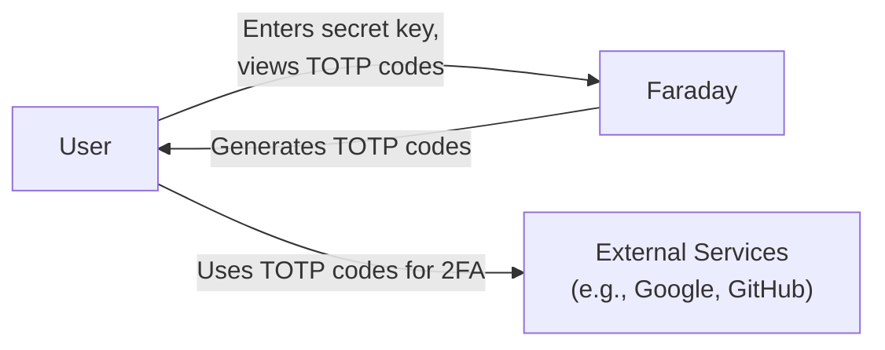
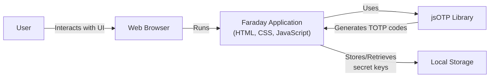
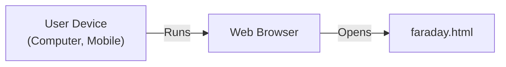
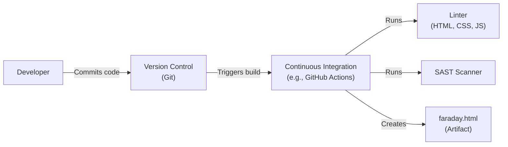

# BUSINESS POSTURE

Business Priorities and Goals:

The Faraday project aims to provide a simple, user-friendly interface for generating TOTP (Time-Based One-Time Password) codes, enhancing the security of user accounts by enabling two-factor authentication (2FA). The project prioritizes ease of use, portability (being a single HTML file), and offline functionality. It targets users who need a straightforward, secure, and readily available TOTP generator without relying on external services or complex setups.

Business Risks:

-   Data Breach: Unauthorized access to the secret keys used for TOTP generation could compromise the security of user accounts protected by Faraday.
-   Usability Issues: If the application is not user-friendly or has bugs, users may abandon it, leading to reduced security if they revert to less secure authentication methods.
-   Lack of Updates: Failure to update the application with security patches or improvements could expose users to vulnerabilities over time.
-   Platform Compatibility: Limited browser or platform compatibility could restrict the user base and reduce the project's effectiveness.
-   Loss of Trust: Any security incident or perceived lack of security could damage the project's reputation and user trust.

# SECURITY POSTURE

Existing Security Controls:

-   security control: The application is designed to be fully offline, minimizing external attack vectors. (README.md)
-   security control: The project uses well-established cryptographic libraries (jsOTP) for TOTP generation, reducing the risk of implementation errors. (README.md)
-   security control: The application is self-contained within a single HTML file, simplifying deployment and reducing the attack surface. (README.md)
-   security control: The project is open-source, allowing for community review and contributions to identify and address potential security issues. (GitHub repository)
-   security control: Basic input validation is likely present to ensure the correct format of secret keys, although this should be explicitly verified and strengthened. (Implicit in functionality, needs verification in code)

Accepted Risks:

-   accepted risk: The application stores secret keys in the browser's local storage, which could be vulnerable to access if the user's device is compromised.
-   accepted risk: The project's simplicity may limit its ability to implement more advanced security features, such as hardware-backed key storage.
-   accepted risk: The reliance on user-provided secret keys means that incorrect or weak keys could compromise security.

Recommended Security Controls:

-   security control: Implement robust input validation to ensure secret keys adhere to the expected format and length, preventing potential injection attacks or errors.
-   security control: Consider adding an option for users to encrypt their secret keys with a password before storing them in local storage, providing an additional layer of protection.
-   security control: Provide clear documentation and guidance on securely generating and managing secret keys.
-   security control: Regularly update dependencies (jsOTP) to address any potential security vulnerabilities.
-   security control: Implement a Content Security Policy (CSP) to mitigate the risk of cross-site scripting (XSS) attacks.

Security Requirements:

-   Authentication:
    -   The application itself does not require user authentication, as it operates locally. However, it facilitates 2FA for other services.
-   Authorization:
    -   No specific authorization mechanisms are needed within the application, as it only generates TOTP codes based on user-provided input.
-   Input Validation:
    -   The application must validate the format and length of the secret keys entered by the user.
    -   The application should handle invalid input gracefully, providing clear error messages without exposing sensitive information.
-   Cryptography:
    -   The application must use a cryptographically secure implementation of the TOTP algorithm (jsOTP).
    -   The application should use a secure random number generator when generating new secrets (if this feature is added).
-   Data Storage
    -   Secret keys stored in browser's local storage should be protected with user-defined password.

# DESIGN

## C4 CONTEXT

Element Descriptions:

-   Element:
    -   Name: User
    -   Type: Person
    -   Description: The person who uses Faraday to generate TOTP codes.
    -   Responsibilities:
        -   Provides the secret key to Faraday.
        -   Views and uses the generated TOTP codes for two-factor authentication.
        -   Manages their secret keys securely.
    -   Security controls:
        -   Responsible for the physical security of their device.
        -   Responsible for the secure generation and storage of their secret keys.

-   Element:
    -   Name: Faraday
    -   Type: Software System
    -   Description: The Faraday application, a single-page HTML application for generating TOTP codes.
    -   Responsibilities:
        -   Accepts secret keys from the user.
        -   Generates TOTP codes based on the provided secret keys and the current time.
        -   Displays the TOTP codes to the user.
        -   Stores secret keys in the browser's local storage (if the user chooses to save them).
    -   Security controls:
        -   Uses a well-established cryptographic library (jsOTP) for TOTP generation.
        -   Operates entirely offline, minimizing external attack vectors.
        -   Input validation for secret keys.
        -   (Recommended) Encryption of secret keys in local storage.
        -   (Recommended) Content Security Policy (CSP).

-   Element:
    -   Name: External Services
    -   Type: External Systems
    -   Description: The online services (e.g., Google, GitHub, etc.) that the user authenticates to using TOTP codes generated by Faraday.
    -   Responsibilities:
        -   Provide services that require two-factor authentication.
        -   Verify the TOTP codes provided by the user.
    -   Security controls:
        -   Implementation of TOTP verification.
        -   Standard security measures for online services (e.g., HTTPS, account security policies).

## C4 CONTAINER

Element Descriptions:

-   Element:
    -   Name: User
    -   Type: Person
    -   Description: The person interacting with the Faraday application.
    -   Responsibilities: Same as in the Context diagram.
    -   Security controls: Same as in the Context diagram.

-   Element:
    -   Name: Web Browser
    -   Type: Software System
    -   Description: The user's web browser (e.g., Chrome, Firefox, Safari).
    -   Responsibilities:
        -   Renders the Faraday application's UI.
        -   Executes the application's JavaScript code.
        -   Provides access to local storage.
    -   Security controls:
        -   Browser security features (e.g., sandboxing, same-origin policy).
        -   User-configured security settings.

-   Element:
    -   Name: Faraday Application (HTML, CSS, JavaScript)
    -   Type: Application
    -   Description: The core Faraday application code, consisting of HTML, CSS, and JavaScript.
    -   Responsibilities:
        -   Provides the user interface for entering secret keys and viewing TOTP codes.
        -   Handles user input.
        -   Calls the jsOTP library to generate TOTP codes.
        -   Manages the storage and retrieval of secret keys in local storage.
    -   Security controls:
        -   Input validation.
        -   (Recommended) Encryption of secret keys in local storage.
        -   (Recommended) Content Security Policy (CSP).

-   Element:
    -   Name: jsOTP Library
    -   Type: Library
    -   Description: The JavaScript library used for TOTP code generation.
    -   Responsibilities:
        -   Implements the TOTP algorithm.
        -   Generates TOTP codes based on the provided secret key and current time.
    -   Security controls:
        -   Uses established cryptographic algorithms.
        -   Regularly updated to address potential vulnerabilities.

-   Element:
    -   Name: Local Storage
    -   Type: Data Store
    -   Description: The browser's local storage, used to persist secret keys.
    -   Responsibilities:
        -   Stores secret keys provided by the user.
        -   Retrieves secret keys when requested by the application.
    -   Security controls:
        -   Browser's built-in security mechanisms for local storage (sandboxing, same-origin policy).
        -   (Recommended) Encryption of secret keys by the Faraday application.

## DEPLOYMENT

Deployment Options:

1.  Local File: User downloads the single HTML file and opens it directly in their browser.
2.  Web Server: The HTML file is hosted on a web server (e.g., Apache, Nginx, GitHub Pages).
3.  Browser Extension: The application could be packaged as a browser extension.

Chosen Deployment (Local File):

Element Descriptions:

-   Element:
    -   Name: User Device
    -   Type: Device
    -   Description: The user's computer or mobile device.
    -   Responsibilities:
        -   Runs the web browser.
        -   Stores the `faraday.html` file locally.
    -   Security controls:
        -   Operating system security features.
        -   User-configured security settings (e.g., firewall, antivirus).

-   Element:
    -   Name: Web Browser
    -   Type: Software System
    -   Description: The user's web browser.
    -   Responsibilities:
        -   Opens and renders the `faraday.html` file.
        -   Executes the application's JavaScript code.
    -   Security controls:
        -   Browser security features (e.g., sandboxing, same-origin policy).

-   Element:
    -   Name: faraday.html
    -   Type: File
    -   Description: The single HTML file containing the Faraday application.
    -   Responsibilities:
        -   Contains the application's code (HTML, CSS, JavaScript).
    -   Security controls:
        -   (Recommended) Content Security Policy (CSP) within the HTML file.

## BUILD

The Faraday project, in its current form, is a single HTML file and does not have a formal build process. However, we can outline a potential build process that could be implemented to enhance security and maintainability.

Build Process:

1.  Developer writes code (HTML, CSS, JavaScript).
2.  Code is committed to a version control system (e.g., Git).
3.  A Continuous Integration (CI) system (e.g., GitHub Actions, Travis CI, Jenkins) is triggered.
4.  The CI system performs the following steps:
    -   Lints the code (HTML, CSS, JavaScript) to identify potential errors and style issues.
    -   Runs unit tests (if implemented).
    -   Runs a static analysis security tool (SAST) to identify potential security vulnerabilities.
    -   Minifies and bundles the code (if necessary) to reduce file size.
    -   Creates a new version of the `faraday.html` file.
5.  The new `faraday.html` file is deployed (e.g., to a web server, or made available for download).

Security Controls in Build Process:

-   security control: Version control (Git) allows for tracking changes and reverting to previous versions if necessary.
-   security control: Linting helps to identify and prevent potential coding errors that could lead to security vulnerabilities.
-   security control: SAST scanning helps to identify potential security vulnerabilities in the code before deployment.
-   security control: CI automation ensures that security checks are performed consistently on every code change.

# RISK ASSESSMENT

Critical Business Processes:

-   Providing users with a secure and reliable way to generate TOTP codes for two-factor authentication.
-   Maintaining user trust in the application's security and privacy.

Data Protection:

-   Data: Secret keys used for TOTP generation.
-   Sensitivity: High. Compromise of secret keys would allow attackers to bypass two-factor authentication and gain unauthorized access to user accounts.

# QUESTIONS & ASSUMPTIONS

Questions:

-   Are there any specific compliance requirements (e.g., GDPR, HIPAA) that the project needs to adhere to?
-   What is the expected user base and usage patterns?
-   Are there any plans to add features in the future, such as support for different TOTP algorithms or hardware security keys?
-   What level of support and maintenance is expected for the project?
-   Is there a budget for security tools or audits?

Assumptions:

-   BUSINESS POSTURE: The primary goal is to provide a simple, secure, and offline TOTP generator.
-   BUSINESS POSTURE: The project has a relatively high risk tolerance due to its simplicity and offline nature, but user data (secret keys) must be protected.
-   SECURITY POSTURE: Users are responsible for the secure generation and storage of their secret keys outside of the application.
-   SECURITY POSTURE: The application will be used in environments where internet connectivity may be limited or unavailable.
-   DESIGN: The application will remain a single HTML file for ease of deployment and portability.
-   DESIGN: The jsOTP library is considered a trusted dependency and will be kept up-to-date.
-   DESIGN: No sensitive data will be transmitted over the network.