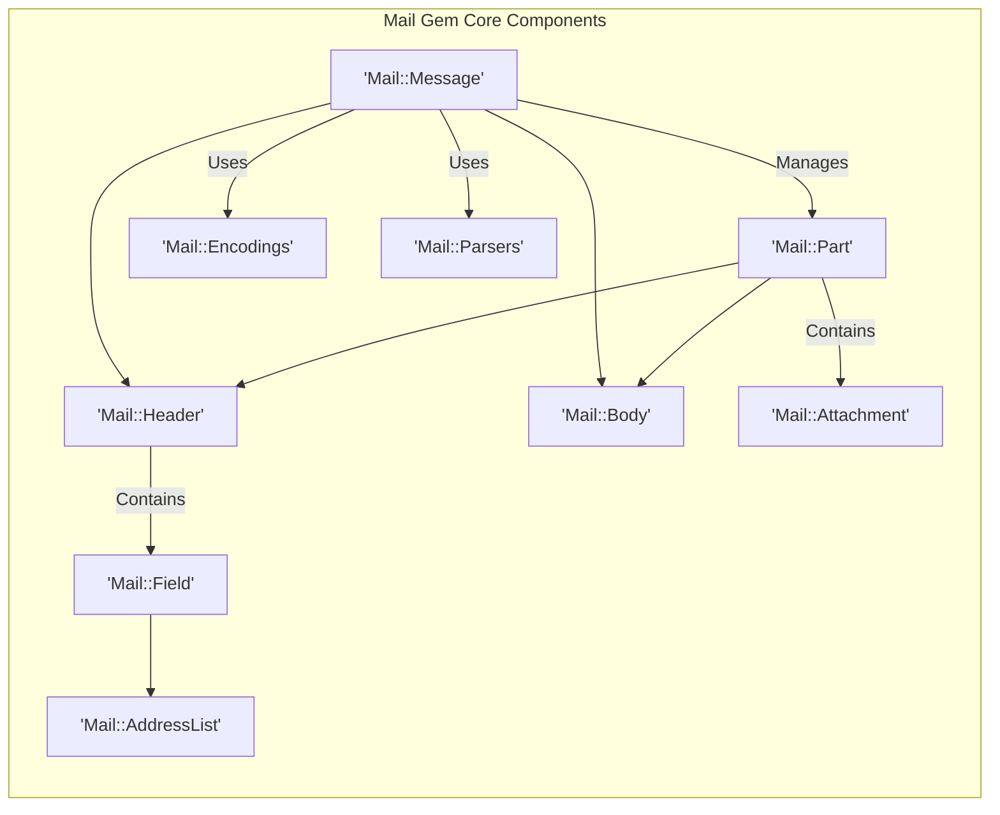
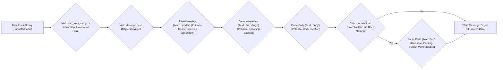
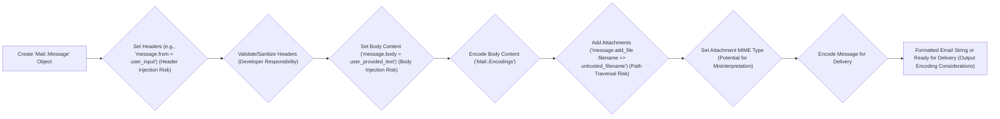

# Project Design Document: mail Ruby Gem

**Version:** 1.1
**Date:** October 26, 2023
**Author:** AI Software Architect

## 1. Introduction

This document provides an enhanced design overview of the `mail` Ruby gem, a library critical for handling email messages within Ruby applications. This detailed description of the gem's architecture, components, and data flow is specifically designed to facilitate thorough threat modeling.

The `mail` gem is a widely adopted library in the Ruby ecosystem, enabling applications to parse, generate, and process email messages. Its support for diverse email formats, encodings, and protocols makes it a versatile and essential tool for any Ruby application interacting with email.

## 2. Goals and Non-Goals

**Goals:**

* Provide a robust and flexible Application Programming Interface (API) for parsing and generating email messages.
* Comprehensive support for various email formats, including plain text, HTML, and complex multipart messages.
* Seamless handling of different character encodings (e.g., UTF-8, ISO-8859-1) and MIME types.
* Offer a convenient and secure way to access and manipulate email headers and body parts.
* Facilitate the programmatic creation and sending of email messages (through abstraction layers).
* Robust mechanisms for handling email attachments, including inline attachments.

**Non-Goals:**

* Direct implementation of Simple Mail Transfer Protocol (SMTP), Internet Message Access Protocol (IMAP), or Post Office Protocol version 3 (POP3) client or server functionalities. The gem focuses on message structure and manipulation, typically relying on external libraries for network communication.
* Development of a complete end-user email client application.
* Implementation of advanced spam filtering or anti-malware capabilities. These are considered separate concerns.
* Handling the complexities of email delivery, routing, or server-side message queuing.

## 3. Architectural Overview

The `mail` gem employs a modular architecture, clearly separating the concerns of parsing, building, and representing email messages. The central element is the `Mail::Message` object, which encapsulates an email message and offers methods for accessing and manipulating its constituent parts.

**Key Components (Detailed):**

* **`Mail::Message`:** The core class representing a complete email message. It holds instances of `Mail::Header` and `Mail::Body`. For multipart emails, it manages a collection of `Mail::Part` objects. This is the primary interface for interacting with email data.
* **`Mail::Header`:** Represents the email headers section. It contains an ordered collection of `Mail::Field` objects, preserving the order of headers as they appear in the raw email.
* **`Mail::Body`:** Represents the main body content of the email message. For multipart messages, each `Mail::Part` will have its own `Mail::Body`. It handles decoding of the body content based on encoding headers.
* **`Mail::Part`:** Represents a distinct part within a multipart email message. This can be another nested message part or an attachment. Each part has its own headers and body.
* **`Mail::Field`:** Represents a single email header field (e.g., "From", "To", "Subject", "Content-Type"). It encapsulates the field name and its parsed value.
* **`Mail::AddressList`:** Specifically designed for parsing and representing lists of email addresses found in header fields like "To", "Cc", and "Bcc". It handles various address formats and edge cases.
* **`Mail::Attachment`:** Represents a file attached to an email message. It stores the filename, content, and content type of the attachment.
* **`Mail::Encodings`:**  A module responsible for handling various email encodings (e.g., Base64, Quoted-Printable, 7bit, 8bit). It provides methods for encoding and decoding email content and headers. This is a critical area for security considerations related to data integrity and potential injection attacks.
* **`Mail::Parsers`:** Contains the logic for parsing raw email strings into the structured `Mail::Message` object. This involves complex state management and handling of various RFC specifications. Vulnerabilities in the parsers can lead to significant security issues.

**Core Functionality Areas (Elaborated for Security Context):**

* **Parsing (Security Focus):** The gem's parsing functionality is a key attack surface. It involves:
    * Taking a raw email string as input and converting it into a structured object.
    * Robustly handling malformed or intentionally crafted email messages that might exploit parsing vulnerabilities.
    * Decoding headers and body content, which requires careful handling to prevent injection attacks through encoded data.
    * Identifying and separating headers and body, a process that if flawed, could lead to header injection vulnerabilities.
    * Parsing multipart messages, where incorrect boundary handling or excessive nesting could lead to denial-of-service.
* **Building (Security Focus):** Programmatically creating emails requires careful attention to security:
    * Constructing `Mail::Message` objects and setting headers. Insufficient validation of header values can lead to header injection attacks.
    * Setting the body content. Encoding the body correctly is crucial to prevent issues with rendering and interpretation by the recipient.
    * Adding attachments. Filename sanitization is essential to prevent path traversal vulnerabilities when the receiving application saves attachments. Incorrectly setting MIME types could lead to unexpected execution of attachment content.
* **Representation (Security Focus):** The `Mail::Message` object provides access to email data:
    * Accessing individual headers. Applications using the gem must be aware of potential encoding issues when displaying or processing header values.
    * Accessing body parts and attachments. Care must be taken to handle different content types securely and avoid automatically executing attachment content.
* **Delivery (Abstraction and Security):** While not directly handling transport, the abstraction layer for sending emails has security implications:
    * Interfacing with other libraries (e.g., for SMTP). The security of these underlying libraries is also a concern.
    * Potential for exposing sensitive information (e.g., SMTP credentials) if not configured securely.

## 4. Data Flow

The following diagrams illustrate the typical data flow within the `mail` gem for parsing and building email messages, with a focus on potential security touchpoints.

**Parsing Email Message (Security Emphasis):**

**Building Email Message (Security Emphasis):**

**Detailed Data Flow Points (Security Context):**

* **Parsing:**
    * The raw email string is the primary untrusted input. The parsing process must be resilient to malicious input.
    * Header parsing is a critical point for potential header injection vulnerabilities if the parser doesn't strictly adhere to email standards or if header values are not properly decoded and validated.
    * Body parsing needs to handle various encodings correctly to prevent exploits related to encoding mismatches or malicious encoded content.
    * Multipart parsing requires careful handling of boundaries to prevent information leakage or denial-of-service attacks through excessively large or deeply nested messages.
* **Building:**
    * Any user-provided data used to construct email messages (headers, body, attachment filenames) is a potential source of injection vulnerabilities.
    * Proper validation and sanitization of header values are crucial before setting them on the `Mail::Message` object.
    * Encoding the body content correctly is essential to ensure it is displayed as intended by the recipient and to prevent cross-site scripting (XSS) attacks in HTML emails.
    * When adding attachments, the filename provided should be carefully sanitized to prevent path traversal vulnerabilities on the receiving end. The correct MIME type should be set to avoid misinterpretation of the attachment content.
    * Encoding the final message for delivery involves formatting according to email standards, and any errors in this process could lead to delivery issues or security vulnerabilities.

## 5. Security Considerations (Detailed)

This section expands on the high-level security considerations, providing more specific details relevant to threat modeling:

* **Header Injection:**  A primary concern when building emails. If untrusted data is directly used in header values without proper sanitization, attackers can inject arbitrary headers, potentially leading to:
    * **Email Spoofing:**  Forging the "From" address to impersonate another user or domain.
    * **Bypassing Security Measures:** Injecting headers that bypass spam filters or authentication mechanisms.
    * **Modifying Email Routing:**  Injecting "Bcc" or "Reply-To" headers to redirect email flow.
* **MIME Parsing Vulnerabilities:** The complexity of MIME parsing can introduce vulnerabilities if the `Mail::Parsers` component has flaws:
    * **Buffer Overflows:**  Processing overly long or malformed headers or body parts could potentially lead to buffer overflows (though less common in managed languages like Ruby, underlying C libraries could be affected).
    * **Denial of Service (DoS):**  Crafted multipart messages with excessive nesting or large numbers of parts could exhaust server resources.
    * **Information Disclosure:**  Incorrect handling of MIME boundaries could lead to the disclosure of parts of the email that should be separated.
* **Attachment Handling (Security Risks):**
    * **Path Traversal:** If filenames for attachments are not sanitized, attackers could potentially overwrite arbitrary files on the server when the receiving application saves the attachment.
    * **Malicious Content Execution:**  If the receiving application automatically processes attachments based on the `Content-Type` header, a misconfigured or malicious `Content-Type` could lead to the execution of harmful code.
* **Encoding Issues (Exploitation Vectors):**
    * **Cross-Site Scripting (XSS):**  In HTML emails, incorrect encoding of user-provided content in the body could allow attackers to inject malicious scripts that execute in the recipient's email client.
    * **Command Injection:**  In rare cases, if email content is used in system commands (which is generally bad practice), encoding issues could potentially facilitate command injection.
* **Dependencies (Supply Chain Risks):**  Vulnerabilities in the `mail` gem's dependencies can directly impact the security of applications using it:
    * **`mime-types`:**  If `mime-types` has incorrect or incomplete MIME type mappings, it could lead to security issues when handling attachments.
    * **`treetop`:**  Vulnerabilities in the parsing logic of `treetop` could be exploited through crafted email headers.
    * **Other Optional Dependencies:**  Any vulnerabilities in gems used for specific encoding support or delivery methods could also pose a risk.
* **Denial of Service (DoS):**  Beyond MIME parsing, other potential DoS vectors include:
    * **Processing Extremely Large Emails:**  Handling very large emails could consume excessive memory or CPU resources.
    * **Recursive Parsing Issues:**  Flaws in the recursive parsing logic for multipart messages could be exploited to cause stack overflows or other resource exhaustion issues.

## 6. Dependencies

The `mail` gem relies on the following key dependencies, which should be considered during threat modeling:

* **Ruby Standard Library:**  While not a separate installable dependency, vulnerabilities in Ruby itself could affect the gem. Specific modules used by `mail` should be reviewed.
* **`mime-types`:**  Provides a library for looking up MIME types. Potential vulnerabilities could involve incorrect or missing MIME type definitions leading to security bypasses.
* **`treetop`:**  A parsing library used for defining and running parsers. Security vulnerabilities in `treetop`'s parsing engine could be exploited through crafted email headers.
* **Optional Dependencies (Examples):**
    * **`net-smtp`:** Used for sending emails via SMTP. Security considerations include secure handling of credentials and TLS/SSL configuration.
    * **`mail-iso-2022-jp`:** For handling the ISO-2022-JP encoding. Vulnerabilities in this gem could affect the handling of emails with this encoding.

## 7. Deployment Considerations (Security Implications)

The security of applications using the `mail` gem is heavily influenced by the deployment context:

* **Web Applications:**
    * **Input Validation:**  Crucial to validate all user-provided data that is used to build emails (e.g., recipient addresses, subject, body).
    * **Output Encoding:**  When displaying email content (especially HTML emails), proper output encoding is essential to prevent XSS vulnerabilities.
    * **Secure Configuration:**  Ensure secure configuration of any underlying email sending mechanisms (e.g., SMTP with TLS).
* **Background Jobs/Workers:**
    * **Secure Credential Management:**  If background jobs send emails, SMTP credentials must be stored and managed securely.
    * **Rate Limiting:**  Implement rate limiting to prevent abuse if background jobs are used for sending large volumes of emails.
* **Command-Line Tools:**
    * **Careful Handling of Arguments:**  When building emails based on command-line arguments, sanitize input to prevent injection attacks.
    * **Protection of Sensitive Information:**  Avoid displaying sensitive email content or credentials in command-line output or logs.

## 8. Future Considerations (Security Enhancements)

* **Regular Security Audits:**  Conduct periodic security audits of the `mail` gem's codebase, including its parsing logic and encoding handling.
* **Formal Threat Modeling:**  Perform a structured threat modeling exercise based on this design document to identify potential vulnerabilities and mitigation strategies.
* **Input Sanitization and Validation within the Gem:**  Explore opportunities to build more robust input sanitization and validation directly into the gem's API to reduce the burden on developers.
* **Dependency Updates and Monitoring:**  Maintain up-to-date versions of all dependencies and actively monitor for security vulnerabilities in those dependencies.
* **Security-Focused Documentation:**  Provide clear and comprehensive documentation on security best practices for using the `mail` gem, including guidance on preventing header injection, handling attachments securely, and encoding email content properly.

This improved design document provides a more detailed and security-focused overview of the `mail` Ruby gem, serving as a strong foundation for comprehensive threat modeling activities.
