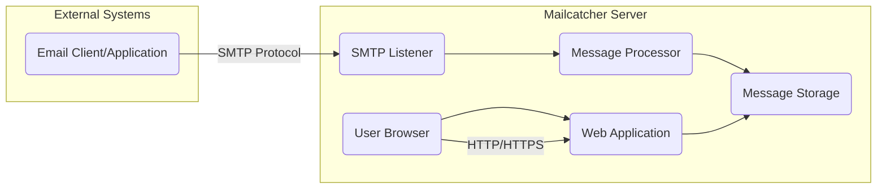
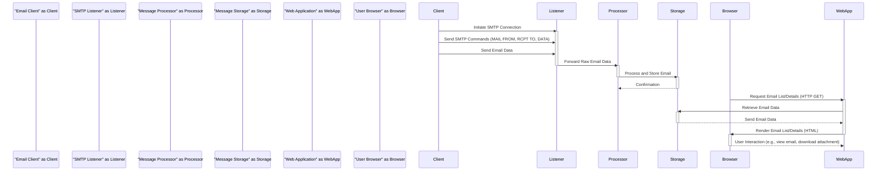

# Project Design Document: Mailcatcher

**Version:** 1.1
**Date:** October 26, 2023
**Author:** AI Software Architect

## 1. Introduction

This document provides an enhanced and detailed design overview of the Mailcatcher project, an invaluable open-source tool designed to simulate an SMTP server for development and testing environments. Instead of delivering emails to their intended recipients, Mailcatcher intercepts all outgoing emails, allowing developers to meticulously inspect their content and structure through a user-friendly web interface. This document elaborates on the system's architecture, individual components, the flow of data within the system, and various deployment considerations. The information presented herein will serve as a foundational resource for subsequent threat modeling activities, enabling a comprehensive assessment of potential security vulnerabilities.

## 2. Goals

*   To establish a local, isolated SMTP server that reliably captures all outgoing emails generated by applications under development or testing.
*   To offer an intuitive and accessible web interface for developers to examine the captured emails.
*   To facilitate detailed inspection of email attributes, including headers, the message body (both plain text and HTML versions), and any attached files.
*   To provide a straightforward and user-centric interface, minimizing the learning curve for developers.
*   To maintain a lightweight footprint and require minimal configuration effort for quick setup and integration.

## 3. Non-Goals

*   To function as a production-grade email server capable of handling real-world email delivery at scale.
*   To implement advanced email routing functionalities, complex filtering rules, or sophisticated delivery mechanisms.
*   To provide robust user authentication or authorization mechanisms for the web interface beyond basic network access control. The primary focus is on development environments where security constraints are typically relaxed.
*   To incorporate email sending capabilities or the ability to forward captured emails to external recipients.
*   To implement comprehensive security features designed to withstand malicious attacks in production environments. The focus is on preventing accidental exposure within controlled development settings.

## 4. System Architecture

### 4.1. High-Level Architecture

This diagram illustrates the primary actors and components within the Mailcatcher ecosystem. External email clients or applications communicate with the Mailcatcher server via the SMTP protocol. Users interact with the Mailcatcher server through a web browser using HTTP or HTTPS.

### 4.2. Detailed Architecture

The Mailcatcher system is logically divided into the following interconnected components, each responsible for a specific aspect of email capture and presentation:

*   **SMTP Listener:** This component forms the entry point for incoming emails. It actively listens on a designated TCP port (by default, port 1025) for new SMTP connection requests. Upon establishing a connection, it engages in the initial SMTP handshake process and subsequently receives the complete email data stream.
*   **Message Processor:** Once the SMTP Listener has received an email, it forwards the raw email data to the Message Processor. This component is responsible for parsing the email according to email standards, dissecting it into its constituent parts: headers, the plain text body, the HTML body (if present), and any attached files.
*   **Message Storage:** This component serves as the repository for the received and processed email messages. The default implementation utilizes an in-memory data store, providing a transient storage mechanism. However, the architecture could potentially be extended to support alternative persistent storage solutions.
*   **Web Application:** This component provides the user interface for interacting with the captured emails. Built upon a lightweight web framework, it exposes endpoints for accessing and displaying the stored email data. It retrieves email information from the Message Storage and renders it in a human-readable format within the user's web browser.
*   **User Browser:** This represents the client-side application, typically a standard web browser, used by developers to access and navigate the Mailcatcher web interface, allowing them to view and manage the captured emails.

## 5. Components

*   **SMTP Listener (Ruby Implementation):**
    *   Leverages Ruby's core networking capabilities, specifically the `TCPServer` class, to establish a listening socket on the configured SMTP port.
    *   Implements a subset of the Simple Mail Transfer Protocol (SMTP) as defined in relevant RFCs, sufficient for receiving email transmissions.
    *   Handles essential SMTP commands such as `HELO`/`EHLO`, `MAIL FROM`, `RCPT TO`, and `DATA`.
    *   Upon successful reception of the email data (terminated by the `.` sequence), it passes the raw email content as a string to the Message Processor.
*   **Message Processor (Ruby Implementation, potentially using `mail` gem):**
    *   Employs Ruby's robust email parsing libraries, such as the `mail` gem, to interpret the structure of the raw email data.
    *   Identifies and extracts individual email headers, such as `From`, `To`, `Subject`, `Date`, and various MIME headers.
    *   Decodes the email body, handling different content types (e.g., `text/plain`, `text/html`, `multipart/mixed`).
    *   Separates the plain text and HTML parts of the email body.
    *   Identifies and extracts attachments, decoding their content and preserving their filenames and MIME types.
    *   Organizes the extracted information into a structured format suitable for storage.
*   **Message Storage (Ruby Implementation - In-Memory by default):**
    *   Utilizes Ruby's built-in data structures, such as arrays or hashes, to maintain a collection of processed email messages. Each message is typically represented as an object or hash containing the extracted header information, body content, and attachment details.
    *   Provides methods for adding newly processed messages to the store.
    *   Offers mechanisms for retrieving stored messages, potentially based on criteria like message ID or timestamp.
    *   May include functionality for deleting individual or all stored messages.
    *   The in-memory nature implies that messages are lost when the Mailcatcher process terminates.
*   **Web Application (Ruby Implementation - Likely using Sinatra or a similar micro-framework):**
    *   Built using a lightweight Ruby web framework like Sinatra, which simplifies the creation of web applications with minimal overhead.
    *   Defines routes (URL patterns) that correspond to specific actions, such as viewing the list of emails (`/`), viewing a specific email (`/messages/:id`), or deleting emails (`/messages/:id/delete`).
    *   Handles HTTP requests from the User Browser, interpreting the requested route and parameters.
    *   Retrieves email data from the Message Storage based on the request.
    *   Utilizes templating engines (e.g., ERB or Haml) to dynamically generate HTML content for display in the browser.
    *   Presents the list of captured emails with summaries (e.g., sender, subject, date).
    *   Displays the full details of a selected email, including headers, body (with syntax highlighting), and attachment lists.
    *   Provides functionality for downloading attachments.
*   **User Browser (Standard Web Browser):**
    *   Employs standard web technologies (HTTP/HTTPS, HTML, CSS, JavaScript) to interact with the Mailcatcher Web Application.
    *   Sends HTTP requests to the Mailcatcher server to retrieve email data and trigger actions.
    *   Renders the HTML received from the server, displaying the email information in a user-friendly manner.
    *   May execute client-side JavaScript for enhanced interactivity (though typically minimal in Mailcatcher).

## 6. Data Flow

The journey of an email through the Mailcatcher system, from its origin to its display in the web interface, follows these steps:

Detailed breakdown of the data flow:

*   An **Email Client** (e.g., a web application sending a password reset email) initiates an SMTP connection with the **SMTP Listener** on the designated port.
*   The **Email Client** sends SMTP commands to specify the sender, recipient, and the beginning of the email data.
*   The **Email Client** transmits the actual email content (headers and body) to the **SMTP Listener**.
*   The **SMTP Listener**, upon receiving the complete email data, forwards the raw email content to the **Message Processor**.
*   The **Message Processor** parses the raw email, extracting relevant information like headers, body parts, and attachments.
*   The **Message Processor** stores the structured email data in the **Message Storage**.
*   A **User Browser** sends an HTTP GET request to the **Web Application** to retrieve either a list of captured emails or the details of a specific email.
*   The **Web Application** queries the **Message Storage** to fetch the requested email data.
*   The **Message Storage** returns the corresponding email data to the **Web Application**.
*   The **Web Application** generates an HTML response containing the email information and sends it back to the **User Browser**.
*   The **User Browser** renders the received HTML, allowing the developer to view the captured email's content and attachments. Further interactions, like downloading attachments, initiate new requests from the **User Browser** to the **Web Application**.

## 7. Deployment

Mailcatcher's simplicity allows for flexible deployment in various development and testing scenarios:

*   **Local Machine Deployment:** This is the most common and straightforward deployment method.
    *   Developers install Ruby and potentially required gems (e.g., using `gem install mailcatcher`).
    *   Mailcatcher is launched via the command line (e.g., `mailcatcher`).
    *   By default, the SMTP listener binds to `localhost:1025`, and the web interface is accessible at `http://localhost:1080`.
    *   This provides an isolated environment for testing email functionality without affecting real email delivery.
*   **Development Server Deployment:** Deploying Mailcatcher on a shared development server can be beneficial for team collaboration.
    *   Requires installing Ruby and dependencies on the server.
    *   The server's firewall might need configuration to allow access to the SMTP and web interface ports.
    *   The web interface might be accessible via the server's hostname or IP address and the designated port (e.g., `http://dev.example.com:1080`).
    *   Care must be taken to ensure the development server is adequately secured, as the captured emails could contain sensitive information.
*   **Containerized Deployment (using Docker):** Containerization offers a consistent and isolated environment for running Mailcatcher.
    *   A Docker image for Mailcatcher can be easily created or pulled from a registry (e.g., Docker Hub).
    *   Running Mailcatcher in a Docker container simplifies deployment and management, ensuring consistent behavior across different environments.
    *   Port mapping is used to expose the SMTP and web interface ports from the container to the host system (e.g., `docker run -p 1025:1025 -p 1080:1080 <mailcatcher_image>`).
    *   Docker Compose can be used to orchestrate Mailcatcher alongside other development services.

## 8. Security Considerations (Detailed for Threat Modeling)

While Mailcatcher is primarily intended for non-production environments, understanding potential security implications is crucial for responsible usage and effective threat modeling:

*   **Exposure of Captured Email Content:** If the web interface is accessible beyond the intended development environment (e.g., due to misconfiguration or open firewall rules), sensitive information contained within captured emails could be exposed to unauthorized individuals. This is particularly concerning if the emails contain personal data, API keys, or other confidential information.
*   **Lack of Robust Authentication and Authorization:** The default Mailcatcher setup typically lacks strong authentication mechanisms. Anyone with network access to the web interface port can potentially view all captured emails. This absence of authorization controls means there's no way to restrict access based on user roles or permissions.
*   **Cross-Site Scripting (XSS) Vulnerabilities:** If the Web Application doesn't properly sanitize and escape email content before rendering it in the browser, malicious JavaScript code embedded within a captured email could be executed in the context of a user's browser session. This could lead to session hijacking, data theft, or other malicious actions. For example, a crafted email subject or body could contain ``.
*   **Cross-Site Request Forgery (CSRF) Vulnerabilities:** Although the functionality of the Mailcatcher web interface is limited, the absence of CSRF protection could allow an attacker to trick a logged-in user into performing unintended actions, such as deleting all captured emails. This would require the attacker to craft a malicious request that the user's browser unknowingly submits to the Mailcatcher server.
*   **Information Disclosure through Error Messages:** Verbose error messages or debugging information exposed by the application could reveal sensitive details about the system's internal workings, file paths, or dependencies, which could be exploited by attackers.
*   **Denial of Service (DoS) Attacks on the SMTP Listener:** An attacker could flood the SMTP listener with a large volume of emails, potentially overwhelming the server's resources and causing it to become unresponsive, thus denying service to legitimate users.
*   **Security of Persistent Storage (if implemented):** If the default in-memory storage is replaced with a persistent storage mechanism (e.g., a database), the security of that storage becomes a critical concern. This includes ensuring proper authentication, authorization, and encryption of data at rest.
*   **Path Traversal Vulnerabilities (related to attachment downloads):** If the mechanism for downloading attachments is not carefully implemented, an attacker might be able to manipulate file paths to access files outside of the intended attachment directory.

## 9. Future Considerations (Beyond the Scope of Current Threat Model)

These are potential enhancements or modifications that could be considered for future development but are not within the scope of the current design and threat model:

*   Implementation of pluggable storage backends to support various database systems or file storage mechanisms.
*   Integration of basic authentication (e.g., HTTP Basic Auth) for the web interface to restrict access.
*   Advanced filtering and searching capabilities within the web interface to facilitate easier management of captured emails.
*   API endpoints for programmatic access to captured emails, enabling integration with other development tools or automated testing frameworks.
*   Support for secure SMTP connections (TLS/SSL).

This revised document provides a more in-depth and comprehensive design overview of the Mailcatcher project, offering a solid foundation for conducting a thorough and effective threat modeling exercise. The detailed descriptions of components, data flow, and potential security considerations will aid in identifying and mitigating potential vulnerabilities.
