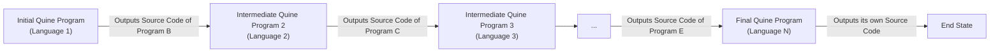

# Project Design Document: Quine Relay

**Project URL:** https://github.com/mame/quine-relay

**Version:** 1.1
**Date:** October 26, 2023
**Author:** AI Software Architect

## 1. Introduction

This document provides a detailed design overview of the "quine-relay" project available on GitHub (https://github.com/mame/quine-relay). This project elegantly demonstrates the concept of a quine relay, a sequence of programs each written in a different programming language, where each program's execution produces the source code of the subsequent program in the sequence. This document aims to provide a comprehensive understanding of the project's architecture, data flow, and technology stack, specifically tailored to serve as a robust foundation for subsequent threat modeling activities.

## 2. Goals

The primary goals of this project are:

*   To effectively demonstrate the computational concept of a quine relay across a diverse set of programming languages.
*   To highlight the syntactic and semantic differences between various programming paradigms through a practical example.
*   To serve as an educational tool for understanding self-replicating code patterns and the conceptual transitions between programming languages.
*   To present an intriguing challenge for individuals interested in analyzing and potentially debugging code spanning multiple language environments.

## 3. Non-Goals

This project explicitly does not aim to:

*   Function as a production-ready or practical software application.
*   Provide a secure or reliable mechanism for inter-process communication or data exchange.
*   Offer a viable or efficient solution for standard software development or deployment workflows.
*   Guarantee the absolute correctness, robustness, or security of the individual quine implementations within the relay.
*   Be easily extensible, maintainable, or scalable due to the inherent complexity and language-specific nature of its components.

## 4. System Architecture

The "quine-relay" project is fundamentally structured as a linear pipeline of independent, yet interconnected, programs. Each program within the sequence has a singular responsibility: to generate and output the exact source code of the next program in the defined order. The execution flow is strictly sequential, with the textual output (source code) of one program serving as the effective "input" for the subsequent program's execution.

The core architectural elements are the individual quine programs, each meticulously crafted in a distinct programming language.

*   **Component: Initial Quine Program (The Seed):** This program acts as the initiator of the relay. Upon execution, it produces the source code of the next program in the sequence. This program doesn't typically take any input.
*   **Component: Intermediate Quine Programs (The Chain):** These programs form the core of the relay. Each intermediate program, when executed, generates and outputs the source code of the subsequent program in the chain. Conceptually, they "receive" the previous program's source code as the blueprint for what they need to output.
*   **Component: Final Quine Program (The Termination):** This program marks the end of the relay. When executed, it outputs its own source code, effectively completing the cycle of source code generation (or potentially performing a final, defined action depending on the specific relay implementation).

The relationships between these components are strictly ordered and unidirectional, forming a chain of execution and source code propagation.

## 5. Data Flow

The primary "data" that traverses through the system is the textual representation of the source code of each program. The execution of each program acts as a transformation process, converting the source code from one programming language's syntax to the next.

**Detailed Data Flow Description:**

1. The process begins with a user initiating the execution of the **Initial Quine Program**.
2. The **Initial Quine Program** executes its defined logic and writes its output to the standard output stream. This output is the complete and valid source code of the **Intermediate Quine Program 2**.
3. The user (or an automated script) then takes the textual output from step 2. This text is then treated as the source code for the **Intermediate Quine Program 2**, which is subsequently executed.
4. The **Intermediate Quine Program 2** executes, performing its quine logic, and writes its output to the standard output stream. This output is the complete and valid source code of the **Intermediate Quine Program 3**.
5. This pattern of execution and source code propagation continues sequentially for each program in the relay, with the output of the current program serving as the source code for the next.
6. Finally, the **Final Quine Program** executes and outputs its own source code, thus completing the relay sequence.

**Important Note on "Input":** The "input" between programs is not typically handled through standard input in a conventional sense. Instead, the standard output of one program is manually or programmatically captured and then used as the *textual content* of the next program's source code file before its execution.

## 6. Technology Stack

The core of the technology stack is defined by the diverse set of programming languages used to implement each individual quine within the relay. The specific languages included in the linked GitHub repository can vary, but a representative example might involve:

*   Python (interpreted)
*   JavaScript (Node.js runtime)
*   Ruby (interpreted)
*   C (compiled)
*   Go (compiled)
*   Perl (interpreted)
*   Bash (shell scripting)
*   Potentially other languages.

Each programming language necessitates the presence of its corresponding interpreter or compiler within the execution environment to successfully run its respective quine program.

**Implicit Supporting Technologies:**

*   **Operating System:** A compatible operating system (e.g., Linux, macOS, Windows) that supports the execution of the chosen interpreters and compilers.
*   **Command-Line Interface (Shell/Terminal):**  A command-line environment is the primary interface for executing the individual programs in the relay.
*   **Text Editor:**  A text editor is essential for viewing, and potentially modifying, the source code of the quine programs.
*   **Build Tools (for compiled languages):** For languages like C or Go, build tools (e.g., `gcc`, `go build`) are required to compile the source code into executable binaries.

## 7. Deployment Model

The "deployment" model for the "quine-relay" project is typically localized and manual. It does not follow a traditional application deployment process involving servers or automated deployments.

**Typical Execution Steps:**

1. **Repository Cloning:** The user begins by cloning the GitHub repository containing the source code files for the quine relay onto their local machine.
2. **Interpreter/Compiler Installation:** The user must ensure that the necessary interpreters or compilers for *all* the programming languages used in the relay are correctly installed and configured on their system. This often involves adding the relevant executable paths to the system's PATH environment variable.
3. **Sequential Program Execution:** The user then proceeds to manually execute each program in the relay in the correct predefined sequence. This generally involves the following steps for each program (except the first):
    *   Executing the current program.
    *   Capturing the standard output of the current program, which is the source code of the next program.
    *   Saving this captured output as a new file or overwriting the existing source code file for the next program in the sequence.
    *   Executing the next program using its interpreter or compiler.

Alternatively, a shell script or other automation tool might be employed to streamline the execution and output redirection between the programs, automating the manual steps described above.

## 8. Assumptions

The correct functioning of the "quine-relay" project relies on several underlying assumptions:

*   **Correctness of Quine Implementations:** It is assumed that each individual program within the relay is a valid quine in its respective programming language and that it accurately outputs the complete and correct source code of the subsequent program in the sequence.
*   **Availability of Language Tools:** The project assumes that the necessary interpreters or compilers for each programming language used in the relay are installed, correctly configured, and accessible within the system's execution environment (e.g., through the PATH variable).
*   **Sequential and Controlled Execution:** The execution model assumes a controlled environment where programs are executed sequentially, and the output of one program can be reliably captured and utilized as the source code for the next.
*   **User Understanding of Fundamentals:**  The project implicitly assumes that the user possesses a basic understanding of the concept of a quine, how to execute programs in different programming languages from the command line, and how to manage files and output redirection.
*   **No External Dependencies (Beyond Language Runtimes):**  The individual quine programs are generally assumed to be self-contained and not reliant on external libraries or dependencies beyond the standard libraries provided by their respective language runtimes.

## 9. Security Considerations (High-Level)

While the primary purpose of the "quine-relay" is educational and demonstrative, several high-level security considerations arise from its inherent nature:

*   **Potential for Malicious Code Injection/Execution:** If any of the quine programs within the relay are maliciously crafted or compromised, they could potentially output arbitrary and harmful code that would then be executed in the subsequent step of the relay. This poses a significant risk as the output of one program directly becomes the code of the next.
*   **Resource Exhaustion (Denial of Service):** A poorly designed or malicious quine could intentionally generate an extremely large volume of output, potentially leading to resource exhaustion (e.g., disk space, memory) if not handled with appropriate safeguards.
*   **Vulnerabilities in Interpreters/Compilers:** The security of the relay is also dependent on the security of the underlying interpreters and compilers used to execute the programs. Known vulnerabilities in these tools could be exploited if the execution environment is not adequately secured and updated.
*   **Supply Chain Security Risks:** If the source code for the quine relay is obtained from an untrusted source, there is a risk of malicious modifications being present in one or more of the quine programs.
*   **Code Injection through Output Manipulation:** If an attacker can intercept and modify the output of one of the quine programs, they could inject arbitrary code into the subsequent program in the relay.

**Note:** This section provides a high-level overview of potential security considerations. A dedicated threat modeling exercise, based on this design document, will be necessary to systematically identify, analyze, and prioritize specific vulnerabilities and potential attack vectors.

## 10. Future Considerations

Potential future enhancements and variations of this project could include:

*   **Visual Representation:** Developing a visual tool or interface to illustrate the relay's structure and the transformation of source code between languages.
*   **Automated Execution Framework:** Creating robust scripts or tools to fully automate the execution of the entire relay, including error handling and output management.
*   **Enhanced Error Detection and Handling:** Implementing mechanisms within the automation framework to detect and gracefully handle errors that might occur during the execution of individual quines.
*   **Expansion of Language Coverage:** Extending the relay to incorporate a broader range of programming languages, potentially including more esoteric or domain-specific languages.
*   **Interactive Relay Concepts:** Exploring the possibility of making the relay interactive, allowing user input or external factors to influence the flow or the languages involved.
*   **Security Hardening Research:** Investigating techniques to make the quine relay more resilient to potential security threats, perhaps through sandboxing or code analysis.

This detailed design document provides a comprehensive understanding of the "quine-relay" project's architecture, data flow, and technology stack, serving as a valuable resource for conducting a thorough and effective threat modeling exercise.
