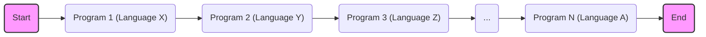

# Project Design Document: Quine Relay

**Project Link:** https://github.com/mame/quine-relay

**Document Version:** 1.1
**Date:** October 26, 2023
**Author:** AI Software Architect

## 1. Introduction

This document provides an enhanced and more detailed design overview of the "quine-relay" project hosted on GitHub under the username "mame". The project demonstrates a fascinating concept in computer science: a sequence of programs, each written in a different programming language, where executing one program produces the exact source code of the next program in the predefined sequence. The final program in the chain outputs the source code of the initial program, completing the relay. This document aims to provide a comprehensive and refined understanding of the project's architecture, components, and data flow, specifically tailored to serve as a robust foundation for subsequent threat modeling activities.

## 2. Goals and Objectives

The primary goal of this document is to provide a clear, detailed, and accurate description of the architecture and functionality of the quine-relay project, optimized for threat modeling. The specific objectives are:

*   To precisely identify and describe the individual components of the system.
*   To clearly illustrate the flow of data (source code) and the execution sequence between these components.
*   To explicitly outline the technologies (programming languages and execution environments) involved.
*   To provide a solid and detailed basis for identifying potential security vulnerabilities, threats, and attack vectors.

## 3. System Overview

The quine-relay project embodies a sequential chain of independent, executable programs. Each program, when successfully executed, generates as its output the precise source code of the subsequent program in the meticulously defined order. The concluding program in this sequence is designed to output the source code of the very first program, thereby closing the "relay" loop.

The fundamental principle hinges on the concept of quines – self-replicating programs – but extends this idea across a series of distinct programming languages. The execution progresses linearly, with the output (source code) of one program serving as the definition of the next. The interaction between programs is primarily through the standard output stream and the subsequent handling of that output as a file.

## 4. System Architecture

The system architecture is best represented as a linear progression of self-contained executable programs.

### 4.1. Components

The core building blocks of the system are the individual program files, each representing a distinct and independent unit.

*   **Program 1 (Language X):** This is the initiating program in the relay sequence. Upon execution, it generates the complete source code for Program 2 as its standard output.
*   **Program 2 (Language Y):** The second program in the sequence. Its source code is the exact output produced by Program 1. When executed, it outputs the source code of Program 3.
*   **Program 3 (Language Z):** A subsequent program in the sequence, adhering to the established pattern of outputting the source code of the next program.
*   **...:** Represents the series of intermediate programs within the relay, each following the same principle.
*   **Program N (Language A):** The final program in the sequence. Its execution is designed to output the source code of Program 1, thus completing the cyclical nature of the relay.

### 4.2. Interactions

The interaction between these components is characterized by sequential execution and the transfer of source code data via the standard output stream, typically managed by a user or an automated script.

*   **Execution:** Each program is executed independently, requiring the appropriate interpreter or runtime environment corresponding to its programming language. This execution is typically initiated manually by a user or through an automated script.
*   **Data Transfer (Source Code):** The output generated by one program (its source code) serves as the definition and content of the subsequent program in the sequence. This transfer usually involves the user or a script capturing the standard output of the currently executed program and saving it as a file, which then becomes the next program to be executed.

## 5. Data Flow

The data flow within the quine-relay project is the directed movement of source code from one program to the next in the sequence.

1. **Initiation:** A user or an automated script starts the process by executing the first program, "Program 1".
2. **Program 1 Execution & Output:** "Program 1" executes using the interpreter or runtime for "Language X". Upon successful execution, it writes its output to the standard output stream. This output is the complete and correct source code of "Program 2".
3. **Source Code Capture & Storage:** The user or an automated script intercepts the standard output of "Program 1" and saves it as a file. This file now represents "Program 2" and is named accordingly (e.g., `program2.y`).
4. **Program 2 Execution & Output:** The user or script then executes "Program 2" using the interpreter or runtime for "Language Y". "Program 2" executes and writes its output to standard output, which is the source code of "Program 3".
5. **Iteration:** Steps 3 and 4 are repeated for each subsequent program in the defined sequence. The output of the current program becomes the source code file for the next.
6. **Final Program Execution & Loop Closure:**  The final program, "Program N", is executed. Its output is the source code of "Program 1", effectively closing the loop of the relay.

```mermaid
graph LR
    A["User/Script executes Program 1"] --> B("Program 1 (Language X) execution");
    B --> C("Outputs source code of Program 2 to stdout");
    C --> D["User/Script saves stdout as Program 2 file"];
    D --> E["User/Script executes Program 2"];
    E --> F("Program 2 (Language Y) execution");
    F --> G("Outputs source code of Program 3 to stdout");
    G --> H["..."];
    H --> I["User/Script executes Program N"];
    I --> J("Program N (Language A) execution");
    J --> K("Outputs source code of Program 1 to stdout");
    style A fill:#ccf,stroke:#333,stroke-width:2px
    style D fill:#ccf,stroke:#333,stroke-width:2px
    style E fill:#ccf,stroke:#333,stroke-width:2px
    style I fill:#ccf,stroke:#333,stroke-width:2px
```

## 6. Technology Stack

The defining characteristic of the quine-relay project is its utilization of a diverse set of programming languages. The specific languages employed will vary depending on the particular implementation. Common examples include:

*   Python
*   JavaScript (Node.js)
*   C/C++
*   Java
*   Ruby
*   Perl
*   Haskell
*   Go
*   Many other programming languages

Each program necessitates the presence of the corresponding interpreter or compiler within the execution environment to run successfully.

## 7. Deployment Environment

The quine-relay project is typically executed within a local development environment or a controlled environment where the necessary language runtimes are available. The essential requirements for the deployment environment are:

*   **Language Runtimes:** A system with the appropriate interpreters or compilers installed for each programming language used in the specific quine-relay implementation.
*   **Command-Line Interface:** Access to a command-line interface (terminal or shell) is generally required to execute the programs.
*   **File System Access:** The environment must allow for file system operations, enabling the saving of output (source code) to files and the execution of those files.
*   **Potentially Scripting Tools:**  Tools like `bash`, `python`, or other scripting languages might be used to automate the execution sequence.

## 8. Security Considerations (Detailed)

While the quine-relay project is primarily an academic and demonstrative exercise, it presents several interesting security considerations, particularly when thinking about potential variations or malicious implementations:

*   **Code Injection Vulnerabilities:**
    *   If the logic within any program responsible for generating the next program's source code contains flaws, it could inadvertently or maliciously inject arbitrary code into the subsequent program's source. This injected code could then be executed when that program runs.
*   **Supply Chain Risks:**
    *   If the source code of any program within the relay is obtained from an untrusted or compromised source, it could already contain malicious code. This highlights the importance of verifying the integrity of each program in the sequence.
*   **Resource Exhaustion Attacks:**
    *   Although less likely in basic implementations, a deliberately crafted quine-relay could be designed to generate increasingly large source code files, potentially leading to disk space exhaustion or memory issues when the generated code is loaded and executed.
*   **Interpreter/Compiler Exploits:**
    *   The security of the relay is inherently tied to the security of the interpreters and compilers used to execute the individual programs. Known vulnerabilities within these tools could be exploited if a malicious program generates code that triggers such vulnerabilities.
*   **Information Disclosure:**
    *   Carelessly written programs might inadvertently include sensitive information (e.g., API keys, internal paths) in the generated source code of the next program, leading to potential information disclosure.
*   **Denial of Service (Local):**
    *   A poorly designed or malicious program in the relay could consume excessive CPU or memory resources during its execution, potentially causing a denial of service on the local machine.

## 9. Assumptions and Constraints

*   **Ordered Execution:** The correct and intended behavior of the quine-relay depends critically on the programs being executed in the predefined sequence. Deviation from this order will break the relay.
*   **Availability of Runtimes:** It is assumed that the necessary interpreters or compilers for each programming language used in the relay are correctly installed and configured within the execution environment.
*   **File System Permissions:** The user or the automated script executing the relay must have the necessary permissions to read and write files within the file system to store and execute the intermediate source code files.
*   **Minimal External Dependencies:** The core concept of the quine-relay typically avoids reliance on external libraries or services to maintain simplicity and focus on the self-referential nature. However, specific implementations might introduce dependencies.

## 10. Potential Attack Vectors

Building upon the security considerations, here are some potential attack vectors to consider during threat modeling:

*   **Malicious Source Code Insertion:** An attacker could attempt to modify the source code of one of the programs to inject malicious code that will be present in subsequent programs.
*   **Compromised Program Source:** If the source code repository or distribution mechanism for any of the programs is compromised, an attacker could replace a legitimate program with a malicious one.
*   **Exploiting Interpreter Vulnerabilities:** An attacker could craft a program whose generated source code exploits a known vulnerability in the interpreter of the next language in the sequence.
*   **Resource Exhaustion via Code Generation:** A malicious program could be designed to generate an extremely large source code file for the next program, leading to resource exhaustion when the next program attempts to load or execute it.
*   **Information Leakage through Generated Code:** An attacker could manipulate a program to include sensitive information in the source code it generates for the next program.

## 11. Future Considerations

This design document reflects the current understanding of the quine-relay project. Future developments or considerations might include:

*   **Automated Execution Frameworks:** Development of tools or scripts to fully automate the execution of the entire relay sequence, potentially including error handling and dependency management.
*   **Web-Based Quine Relays:** Exploring the feasibility and security implications of implementing quine-relay concepts within a web browser environment.
*   **Enhanced Security Measures:** Investigating techniques to make quine-relay implementations more robust against potential security threats, such as code signing or sandboxing.
*   **Educational Applications:** Further exploring the use of quine-relays as an educational tool to demonstrate programming language concepts and security principles.

This enhanced design document provides a more detailed and structured understanding of the quine-relay project, specifically tailored to facilitate comprehensive threat modeling activities.