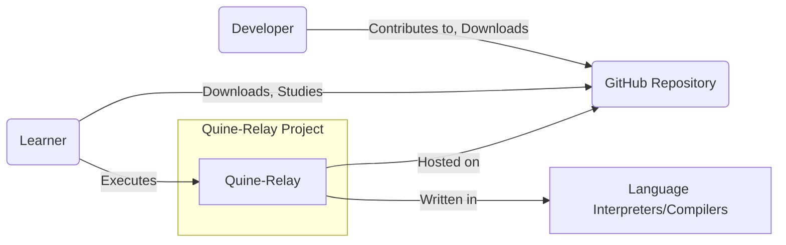
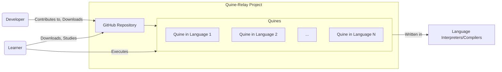
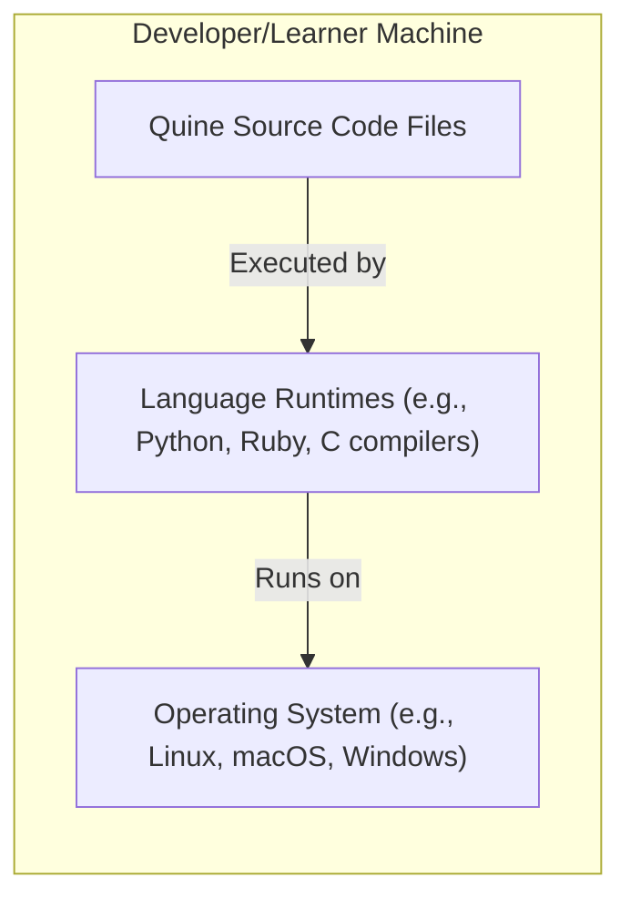
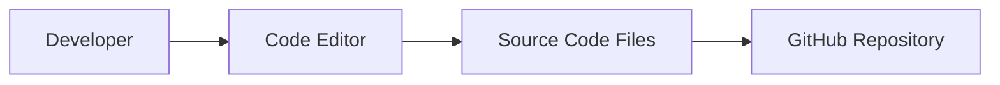

# BUSINESS POSTURE

This project, 'quine-relay', appears to be a demonstration of a programming concept, specifically the creation of a quine (a program that outputs its own source code) and relaying it through multiple programming languages. It is likely intended as an educational tool, a programming challenge, or a showcase of polyglot programming.

* Business Priorities and Goals:
  - Demonstrate the concept of quines and polyglot programming.
  - Provide an educational resource for programmers interested in these topics.
  - Showcase the capabilities of different programming languages.
  - Potentially serve as a fun or interesting project for the developer's portfolio.

* Business Risks:
  - Minimal direct business risks as it is likely not a business-critical application.
  - Reputational risk if the project is poorly implemented or contains vulnerabilities, although this is low for a project of this nature.
  - Risk of misinterpretation or misuse of the code, although unlikely given its educational nature.

# SECURITY POSTURE

This project is likely developed and maintained by individual developers in a non-commercial context. Security considerations are probably minimal, focusing on basic good practices rather than strict security controls.

* Existing Security Controls:
  - security control: Source code hosted on GitHub, providing version control and some level of transparency. (Implemented: GitHub repository)
  - security control: Publicly accessible repository, allowing community review and contributions. (Implemented: GitHub repository settings)

* Accepted Risks:
  - accepted risk: Lack of formal security testing or code review processes beyond public scrutiny.
  - accepted risk: Potential vulnerabilities in the code, although the project's nature reduces the likelihood of critical security flaws.
  - accepted risk: Dependency on external language interpreters and compilers, which may have their own vulnerabilities.

* Recommended Security Controls:
  - security control: Implement basic input validation if the project were to take user input (currently it does not appear to).
  - security control: Regularly update dependencies if the project were to rely on external libraries (currently it appears self-contained).
  - security control: Consider using static analysis tools to scan the code for potential issues, even for educational projects.

* Security Requirements:
  - Authentication: Not applicable as the project is a demonstration and does not require user accounts.
  - Authorization: Not applicable as there are no access controls needed for this project.
  - Input Validation: Minimal relevance as the project primarily outputs code and does not take significant user input. If input were to be added, validation would be necessary to prevent code injection or other issues.
  - Cryptography: Not applicable as the project does not handle sensitive data or require encryption.

# DESIGN

This project is conceptually simple. It involves a collection of quine programs, each written in a different programming language, designed to output the source code of the next quine in the sequence.

## C4 CONTEXT

* Context Diagram Elements:
  - Element:
    - Name: Quine-Relay
    - Type: Software Project
    - Description: A collection of quine programs in different programming languages that relay their source code to the next program in the sequence.
    - Responsibilities: Generate and output the source code of the next quine in the relay sequence when executed.
    - Security controls: Minimal, relies on the security of the underlying language interpreters and the GitHub platform.
  - Element:
    - Name: Developer
    - Type: Person
    - Description: Individuals who contribute to the project by writing, testing, and maintaining the quine programs.
    - Responsibilities: Develop and maintain the quine programs, ensure correctness and functionality.
    - Security controls: Responsible for writing secure and correct code, using secure development practices.
  - Element:
    - Name: Learner
    - Type: Person
    - Description: Individuals who study, download, and execute the quine-relay project to understand quines and polyglot programming.
    - Responsibilities: Use the project for educational purposes, understand the code and concepts.
    - Security controls: Responsible for executing code in a safe environment, understanding the risks of running untrusted code.
  - Element:
    - Name: GitHub Repository
    - Type: Code Hosting Platform
    - Description: The online repository where the source code of the Quine-Relay project is hosted and managed.
    - Responsibilities: Store and version control the source code, provide access to developers and learners.
    - Security controls: GitHub's built-in security features, such as access control, vulnerability scanning, and audit logs.
  - Element:
    - Name: Language Interpreters/Compilers
    - Type: Software
    - Description: The software used to execute the quine programs, specific to each programming language used in the relay.
    - Responsibilities: Execute the quine programs, provide the runtime environment.
    - Security controls: Security controls are dependent on the specific language interpreters/compilers used, and are external to the Quine-Relay project itself.

## C4 CONTAINER

For this project, the container diagram is very similar to the context diagram, as the project is essentially a collection of source code files. We can consider each programming language's quine as a logical container.

* Container Diagram Elements:
  - Element:
    - Name: GitHub Repository
    - Type: Code Repository
    - Description: Stores all source code files for the Quine-Relay project, organized by programming language.
    - Responsibilities: Version control, code storage, access management.
    - Security controls: GitHub's security features, access controls, branch protection.
  - Element:
    - Name: Quine in Language 1, Quine in Language 2, ..., Quine in Language N
    - Type: Source Code File
    - Description: Individual source code files, each containing a quine program written in a specific programming language.
    - Responsibilities: Implement the quine logic in their respective languages, output the source code of the next quine.
    - Security controls: Code review (informal, community-based), basic coding best practices.
  - Element:
    - Name: Language Interpreters/Compilers
    - Type: Runtime Environment
    - Description: Software required to execute the quine programs, specific to each programming language.
    - Responsibilities: Execute the source code, provide necessary libraries and runtime environment.
    - Security controls: Dependent on the security of the chosen language interpreters/compilers, external to the project.

## DEPLOYMENT

The "deployment" for this project is essentially running the source code files using the appropriate language interpreters on a local machine or in an online environment like an online interpreter. There isn't a traditional deployment architecture in the sense of servers and infrastructure.

We can consider two deployment scenarios:

1.  Local Execution: Developer or learner downloads the code and runs it on their local machine.
2.  Online Execution: Developer or learner uses an online interpreter or coding environment to run the code directly from the repository or after copying it.

Let's focus on Local Execution for the deployment diagram.

* Deployment Diagram Elements (Local Execution):
  - Element:
    - Name: Developer/Learner Machine
    - Type: Physical or Virtual Machine
    - Description: The personal computer or virtual machine used by a developer or learner to execute the quine programs.
    - Responsibilities: Provide the environment for running the code, including operating system and language runtimes.
    - Security controls: Security of the user's local machine, including operating system security, antivirus, and safe coding practices.
  - Element:
    - Name: Operating System (e.g., Linux, macOS, Windows)
    - Type: System Software
    - Description: The operating system installed on the developer/learner machine.
    - Responsibilities: Manage system resources, provide a platform for running applications.
    - Security controls: Operating system security features, user account controls, security updates.
  - Element:
    - Name: Language Runtimes (e.g., Python, Ruby, C compilers)
    - Type: Software Runtimes
    - Description: The specific language interpreters or compilers installed on the machine, required to execute the quine programs.
    - Responsibilities: Interpret or compile and execute the source code of the quines.
    - Security controls: Security of the language runtimes themselves, ensuring they are up-to-date and free from vulnerabilities.
  - Element:
    - Name: Quine Source Code Files
    - Type: Files
    - Description: The downloaded source code files of the Quine-Relay project.
    - Responsibilities: Contain the executable code of the quines.
    - Security controls: File system permissions, integrity checks (if needed).

## BUILD

For this project, the "build" process is very simple. It mainly involves writing the source code files. There isn't a complex automated build system.  However, we can describe a conceptual build process.

* Build Diagram Elements:
  - Element:
    - Name: Developer
    - Type: Person
    - Description: The programmer who writes and modifies the quine source code.
    - Responsibilities: Writing correct and functional quine code in different languages.
    - Security controls: Secure coding practices, code review (informal).
  - Element:
    - Name: Code Editor
    - Type: Software Application
    - Description: The text editor or IDE used by the developer to write the code.
    - Responsibilities: Provide a platform for writing and editing code.
    - Security controls: Security of the developer's workstation and the code editor software itself.
  - Element:
    - Name: Source Code Files
    - Type: Files
    - Description: The text files containing the quine programs in various languages.
    - Responsibilities: Store the source code of the project.
    - Security controls: File system permissions, version control in GitHub.
  - Element:
    - Name: GitHub Repository
    - Type: Code Hosting Platform
    - Description: The central repository where the source code is stored and version controlled.
    - Responsibilities: Store and manage the source code, track changes, facilitate collaboration.
    - Security controls: GitHub's security features, access controls, audit logs.

# RISK ASSESSMENT

* Critical Business Processes:
  - There are no direct critical business processes associated with this project as it is likely educational or demonstrative.

* Data to Protect and Sensitivity:
  - Source Code: Publicly available, low sensitivity. The integrity of the source code is important for the project's purpose (demonstration and education).
  - Execution Environment: The security of the environments where the code is executed (developer/learner machines) is relevant to the users, but not directly to the project itself. Sensitivity depends on the user's overall security posture.

# QUESTIONS & ASSUMPTIONS

* Questions:
  - What is the primary target audience for this project (e.g., programming students, experienced developers)?
  - Are there any specific goals for the project beyond demonstrating quines and polyglot programming?
  - Is there any intention to expand this project beyond its current scope?
  - Are there any specific security concerns that the project maintainers have considered?

* Assumptions:
  - BUSINESS POSTURE:
    - The project is primarily for educational or demonstrative purposes, not for commercial use.
    - Business risks are minimal due to the project's nature.
  - SECURITY POSTURE:
    - Security is not a primary focus, but basic good practices are assumed.
    - The project relies on the security of external platforms (GitHub) and language runtimes.
    - Formal security testing is not expected.
  - DESIGN:
    - The project is intentionally simple in design.
    - Deployment is primarily local execution or online interpreters.
    - The build process is manual and straightforward.