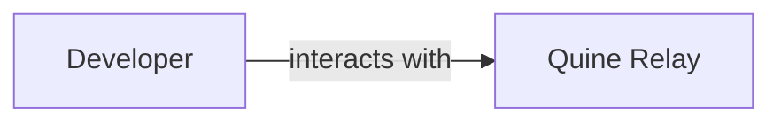
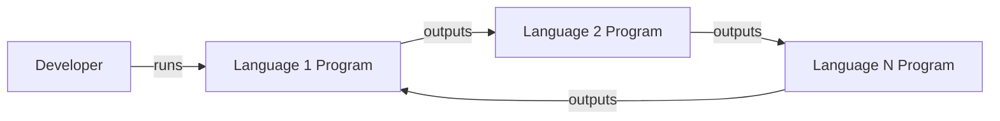
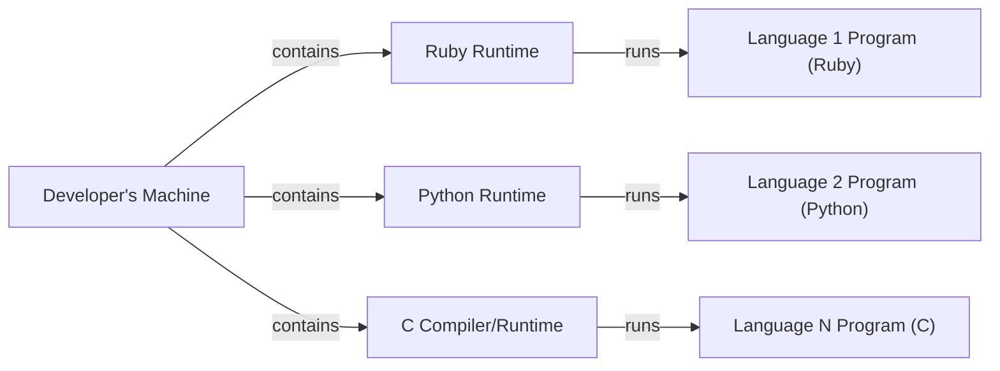
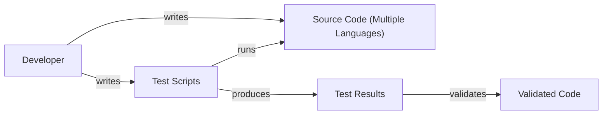

Okay, let's create a design document for the Quine Relay project.

# BUSINESS POSTURE

Business Priorities and Goals:

*   Provide a fun, challenging programming puzzle for developers.
*   Showcase the concept of a quine (a program that produces its own source code as output) in a novel and engaging way.
*   Potentially serve as an educational tool for understanding self-referential code and language intricacies.
*   Potentially attract developers to a community or platform associated with the project (though this is not explicitly stated, it's a common implicit goal of such projects).

Most Important Business Risks:

*   The code could contain vulnerabilities that could be exploited, leading to reputational damage if the project is associated with a specific company or individual.
*   The project may not be maintainable in the long run due to its inherent complexity, leading to wasted effort.
*   The project may not be accessible to developers of all skill levels, limiting its reach and impact.
*   If presented as a challenge or competition, unclear rules or judging criteria could lead to user frustration.

# SECURITY POSTURE

Existing Security Controls:

*   security control: The project is open-source, allowing for community review and identification of potential vulnerabilities. (Described in: GitHub repository)
*   security control: The project uses multiple programming languages, potentially making it harder to exploit vulnerabilities that may be specific to a single language. (Described in: GitHub repository, code structure)
*   security control: Limited external dependencies. Project is self contained. (Described in: GitHub repository, code structure)

Accepted Risks:

*   accepted risk: The core concept of a quine relay inherently involves self-modifying or self-replicating code, which is often flagged by security tools as potentially malicious. This risk is accepted as it's fundamental to the project's nature.
*   accepted risk: The complexity of the code may make it difficult to fully audit for all potential vulnerabilities.

Recommended Security Controls:

*   security control: Implement a robust testing strategy, including unit tests and integration tests, to ensure that the code behaves as expected and to catch potential errors early.
*   security control: Use static analysis tools (linters, code analyzers) for each language involved to identify potential code quality and security issues.
*   security control: Consider using a containerization technology like Docker to isolate the execution environment and limit the potential impact of any vulnerabilities.
*   security control: Document any known limitations or potential security concerns in the project's README or other documentation.

Security Requirements:

*   Authentication: Not applicable, as the project doesn't involve user accounts or authentication.
*   Authorization: Not applicable, as there are no access control requirements.
*   Input Validation: The project takes no external input in the traditional sense. The "input" is the code itself, and the "validation" is inherent in the quine relay mechanism (each program must produce the next valid program in the sequence).
*   Cryptography: Not applicable, as the project doesn't involve sensitive data or encryption needs.

# DESIGN

## C4 CONTEXT

Element Description:

*   Element:
    *   Name: Developer
    *   Type: Person
    *   Description: A software developer who interacts with the Quine Relay project.
    *   Responsibilities:
        *   Writes code in various programming languages.
        *   Understands the concept of quines.
        *   Runs the code and observes the output.
        *   Potentially contributes to the project.
    *   Security controls:
        *   None directly implemented by the developer role itself. Security relies on the developer's own secure coding practices and the security of their development environment.

*   Element:
    *   Name: Quine Relay
    *   Type: Software System
    *   Description: The Quine Relay project, a sequence of programs in different languages where each program outputs the source code of the next.
    *   Responsibilities:
        *   Provides the code for the quine relay.
        *   Defines the rules and constraints of the relay.
    *   Security controls:
        *   Open-source code for community review.
        *   Use of multiple programming languages.
        *   Limited external dependencies.

## C4 CONTAINER

Element Description:

*   Element:
    *   Name: Developer
    *   Type: Person
    *   Description: A software developer.
    *   Responsibilities: Runs the initial program in the relay.
    *   Security controls: None directly implemented.

*   Element:
    *   Name: Language 1 Program
    *   Type: Container (Program)
    *   Description: The first program in the quine relay, written in a specific programming language (e.g., Ruby).
    *   Responsibilities: Outputs the source code of the Language 2 Program.
    *   Security controls: Relies on the security of the language runtime and any libraries used.

*   Element:
    *   Name: Language 2 Program
    *   Type: Container (Program)
    *   Description: The second program in the quine relay, written in a different programming language (e.g., Python).
    *   Responsibilities: Outputs the source code of the Language N Program.
    *   Security controls: Relies on the security of the language runtime and any libraries used.

*   Element:
    *   Name: Language N Program
    *   Type: Container (Program)
    *   Description: The Nth program in the quine relay, written in a different programming language (e.g., C).
    *   Responsibilities: Outputs the source code of the Language 1 Program (closing the loop).
    *   Security controls: Relies on the security of the language runtime and any libraries used.

## DEPLOYMENT

Possible Deployment Solutions:

1.  Local Execution: Developers download the code and run it directly on their machines using the appropriate language runtimes.
2.  Online Interpreter: Provide a web-based interface where users can run the code in a sandboxed environment without needing to install anything locally.
3.  Containerized Deployment: Package each language's program in a separate Docker container, allowing for easy execution and isolation.

Chosen Solution (Local Execution):

Element Description:

*    Element:
    *   Name: Developer's Machine
    *   Type: Deployment Node (Physical or Virtual Machine)
    *   Description: The developer's local computer or a virtual machine where they run the code.
    *   Responsibilities: Provides the environment for executing the programs.
    *   Security controls: Relies on the security of the developer's operating system and any security software installed.

*    Element:
    *   Name: Ruby Runtime
    *   Type: Software (Language Runtime)
    *   Description: The Ruby interpreter and runtime environment.
    *   Responsibilities: Executes the Ruby program.
    *   Security controls: Relies on the security of the Ruby runtime itself and any installed gems.

*    Element:
    *   Name: Python Runtime
    *   Type: Software (Language Runtime)
    *   Description: The Python interpreter and runtime environment.
    *   Responsibilities: Executes the Python program.
    *   Security controls: Relies on the security of the Python runtime itself and any installed packages.

*    Element:
    *   Name: C Compiler/Runtime
    *   Type: Software (Compiler and Runtime)
    *   Description: The C compiler (e.g., GCC) and runtime environment.
    *   Responsibilities: Compiles and executes the C program.
    *   Security controls: Relies on the security of the compiler and the C standard library.

*    Element:
    *   Name: Language 1 Program (Ruby)
    *   Type: Software (Program)
    *   Description: Instance of program written in Ruby.
    *   Responsibilities: Executes the Ruby program.
    *   Security controls: Relies on the security of the Ruby runtime itself and any installed gems.

*    Element:
    *   Name: Language 2 Program (Python)
    *   Type: Software (Program)
    *   Description: Instance of program written in Python.
    *   Responsibilities: Executes the Python program.
    *   Security controls: Relies on the security of the Python runtime itself and any installed packages.

*    Element:
    *   Name: Language N Program (C)
    *   Type: Software (Program)
    *   Description: Instance of program written in C.
    *   Responsibilities: Executes the C program.
    *   Security controls: Relies on the security of the compiler and the C standard library.

## BUILD

The Quine Relay project, as presented, doesn't have a traditional "build" process in the sense of compiling code into an executable.  Each program is self-contained and executed directly by its respective language runtime.  However, we can consider the process of verifying the correctness of the relay as a form of "build" process.

Element Description:

*   Element:
    *   Name: Developer
    *   Type: Person
    *   Description: The developer who writes and tests the code.
    *   Responsibilities: Writing the quine relay programs, creating test scripts, and verifying the results.
    *   Security controls: None directly implemented.

*   Element:
    *   Name: Source Code (Multiple Languages)
    *   Type: Data (Source Code)
    *   Description: The source code of the quine relay programs in various languages.
    *   Responsibilities: Contains the logic of the quine relay.
    *   Security controls: Open-source for review, multiple languages.

*   Element:
    *   Name: Test Scripts
    *   Type: Software (Scripts)
    *   Description: Scripts that automate the execution of the quine relay and verify that each program produces the correct output.
    *   Responsibilities: Automates the testing process.
    *   Security controls: None directly implemented, but the scripts themselves should be reviewed for correctness.

*   Element:
    *   Name: Test Results
    *   Type: Data (Output)
    *   Description: The output of the test scripts, indicating whether the quine relay is functioning correctly.
    *   Responsibilities: Provides feedback on the correctness of the code.
    *   Security controls: None directly implemented.

*   Element:
    *   Name: Validated Code
    *   Type: Data (Source Code)
    *   Description: The source code of the quine relay, after it has been verified by the test scripts.
    *   Responsibilities: Represents the "built" artifact, ready for execution.
    *   Security controls: Validated by testing.

Security Controls in the Build Process:

*   security control: Test Scripts: Automating the execution and verification of the quine relay helps ensure its correctness and reduces the risk of manual errors.
*   security control: Manual Review: Given the complexity of quines, manual review of the code by multiple developers is crucial to identify subtle errors or potential vulnerabilities.

# RISK ASSESSMENT

Critical Business Processes:

*   Maintaining the integrity and correctness of the quine relay.
*   Providing a fun and challenging experience for developers.

Data to Protect:

*   Source Code: The source code of the quine relay programs is the primary data to protect.
    *   Sensitivity: Low to Medium. While the code is publicly available, its integrity is important for the project to function correctly.  Unintentional or malicious modifications could break the relay or introduce vulnerabilities.

# QUESTIONS & ASSUMPTIONS

Questions:

*   Is there any intention to monetize this project or associate it with a specific brand or company? This would significantly impact the risk assessment and security considerations.
*   Are there any plans to expand the project beyond its current scope (e.g., adding more languages, creating a community forum)?
*   What is the expected lifespan of the project? Is it a one-off challenge or something that will be maintained long-term?
*   Are there any specific performance requirements or constraints?

Assumptions:

*   BUSINESS POSTURE: The project is primarily intended for educational and recreational purposes, with no direct commercial goals.
*   SECURITY POSTURE: The project owner accepts the inherent risks associated with self-replicating code and prioritizes developer engagement and learning over strict security measures.
*   DESIGN: The primary deployment method is local execution on developers' machines. There is no centralized infrastructure or user data to manage. The "build" process is primarily manual, involving code review and testing.