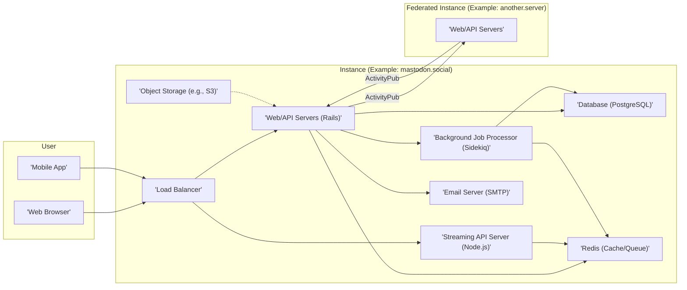

## Project Design Document: Mastodon (Improved)

**1. Introduction**

This document provides a detailed architectural design of the Mastodon social networking platform. It aims to clearly outline the system's components, their interactions, and key data flows. This document will serve as the foundation for subsequent threat modeling activities. The design is based on the open-source Mastodon project available at [https://github.com/mastodon/mastodon](https://github.com/mastodon/mastodon). This revision aims to enhance clarity and provide more specific details relevant to security considerations.

**2. Goals**

*   Provide a comprehensive and easily understandable overview of the Mastodon architecture.
*   Clearly identify key components, their specific responsibilities, and potential security implications.
*   Illustrate the interactions between different parts of the system with a focus on data flow and security boundaries.
*   Describe the flow of data through the platform, highlighting sensitive data paths.
*   Emphasize areas critical for security considerations and threat modeling, providing more context for potential threats.

**3. Target Audience**

This document is intended for:

*   Security engineers and architects responsible for threat modeling and security assessments.
*   Software developers working on the Mastodon platform or integrating with its APIs.
*   System administrators involved in deploying, configuring, and maintaining Mastodon instances.
*   Anyone seeking a deeper understanding of Mastodon's internal architecture from a security perspective.

**4. High-Level Architecture**

Mastodon is a decentralized social network composed of interconnected independent servers called "instances". Each instance operates autonomously but can communicate with other instances, forming a federated network using the ActivityPub protocol.

**5. Detailed Component Description**

*   **User:**
    *   **Web Browser:** The primary interface for users to interact with Mastodon through a web application, rendering HTML, CSS, and executing JavaScript. This is a key attack surface for client-side vulnerabilities.
    *   **Mobile App:** Native applications for iOS and Android providing access to Mastodon functionalities. These apps interact with the Web/API servers and introduce platform-specific security considerations.

*   **Instance Components:**
    *   **Load Balancer:** Distributes incoming traffic across multiple Web/API servers to ensure high availability and scalability. It can also perform basic security functions like SSL termination and basic DDoS mitigation.
    *   **Web/API Servers (Ruby on Rails):** The core of the Mastodon application, handling user requests, implementing business logic, and exposing the REST API. Key responsibilities include:
        *   Authentication and authorization of user requests.
        *   Processing and validating user input to prevent injection attacks.
        *   Generating and serving web pages and API responses.
        *   Implementing the ActivityPub protocol for federated interactions.
        *   Managing user timelines, posts ("toots"), and relationships.
    *   **Streaming API Server (Node.js):** Provides real-time updates to connected clients using WebSockets. This server handles authentication and authorization for streaming connections and broadcasts events.
    *   **Background Job Processor (Sidekiq):** Executes asynchronous tasks, preventing blocking of the main application threads. Security-relevant tasks include:
        *   Federation: Sending and receiving ActivityPub messages, requiring secure handling of remote data.
        *   Email notifications: Sending emails, which can be a vector for phishing or spam if not properly secured.
        *   Media processing: Handling uploaded media, which needs to be scanned for malware and processed securely.
        *   Scheduled tasks: Performing maintenance and administrative tasks.
    *   **Database (PostgreSQL):** The primary persistent storage for all application data. Security considerations include access control, encryption at rest, and protection against SQL injection. Stores:
        *   User credentials (hashed passwords).
        *   Post content, metadata, and relationships.
        *   User profiles and settings.
        *   Instance configuration.
    *   **Redis (Cache/Queue):** Used for caching frequently accessed data to improve performance and as a message queue for Sidekiq. Security considerations include protecting access to the Redis instance. Stores:
        *   Cached timeline data.
        *   Session information.
        *   Background job queues.
        *   Real-time data for the streaming API.
    *   **Object Storage (e.g., S3, DigitalOcean Spaces):** Stores uploaded media files. Security considerations include access control policies, preventing unauthorized access, and potentially scanning for malicious content.
    *   **Email Server (SMTP):** Used for sending transactional emails. Security considerations include preventing unauthorized relaying and ensuring secure communication with the SMTP server.

*   **Federated Instance:** Represents another independent Mastodon instance participating in the federated network. These instances have similar components and interact via the ActivityPub protocol. Trust relationships and secure communication are critical in this context.

**6. Key Interactions and Data Flows**

*   **User Posting a Toot:**
    1. User composes and submits a toot via the "'Web Browser'" or "'Mobile App'".
    2. The request is routed through the "'Load Balancer'" to a "'Web/API Server (Rails)'".
    3. The "'Web/API Server (Rails)'" authenticates the user and validates the toot content (e.g., length, media types, mentions). This is a crucial point for input validation to prevent XSS and other injection attacks.
    4. The toot content and metadata are stored in the "'Database (PostgreSQL)'".
    5. Media attachments are uploaded to "'Object Storage (e.g., S3)'" with appropriate access controls.
    6. A background job is enqueued in "'Redis (Cache/Queue)'" for federation.
    7. The "'Background Job Processor (Sidekiq)'" processes the job, creating and signing an ActivityPub `Create` activity.
    8. This activity is sent to followers on the local instance and to relevant remote instances via HTTPS to their "'Web/API Servers'" following the ActivityPub protocol. Signature verification is performed by the receiving instance.
    9. The "'Streaming API Server (Node.js)'" broadcasts the new toot to connected clients for real-time updates.

*   **User Viewing a Timeline:**
    1. User requests their timeline via the "'Web Browser'" or "'Mobile App'".
    2. The request is routed through the "'Load Balancer'" to a "'Web/API Server (Rails)'".
    3. The "'Web/API Server (Rails)'" authenticates the user and determines the appropriate timeline (e.g., home, local, federated).
    4. The server retrieves relevant toots from the "'Database (PostgreSQL)'", potentially using "'Redis (Cache/Queue)'" for caching frequently accessed data.
    5. The toots are rendered into HTML (for web) or JSON (for apps), ensuring proper output encoding to prevent XSS.
    6. The rendered timeline is sent back to the user's client.
    7. The "'Streaming API Server (Node.js)'" pushes new toots to the client in real-time via WebSockets.

*   **Federation (ActivityPub):**
    1. When a user on one instance interacts with a user on another instance (e.g., follows, boosts, replies), the local instance's "'Web/API Servers (Rails)'" construct an ActivityPub activity (e.g., `Follow`, `Announce`, `Create`).
    2. This activity is signed using the instance's private key for authentication and integrity.
    3. The activity is sent via HTTPS to the target instance's "'Web/API Servers'".
    4. The receiving instance verifies the signature using the sending instance's public key (obtained through WebFinger or other mechanisms).
    5. The receiving instance processes the activity, updating its local data accordingly. This involves validating the received data and ensuring it aligns with security policies.

**7. Data Storage**

*   **'Database (PostgreSQL)'**: Stores sensitive and structured data:
    *   User credentials (bcrypt hashed passwords, email addresses).
    *   Post content, timestamps, author information, and relationships.
    *   User profile information and settings.
    *   Follower and following relationships.
    *   Instance configuration and moderation settings.
*   **'Redis (Cache/Queue)'**: Stores transient and less sensitive data for performance and queuing:
    *   Cached timeline fragments and API responses.
    *   User session data.
    *   Queued background jobs and their parameters.
    *   Real-time data for the streaming API (e.g., active users, recent events).
*   **'Object Storage (e.g., S3)'**: Stores unstructured user-generated content:
    *   Uploaded media files (images, videos, audio). Access control policies are crucial here to prevent unauthorized access.

**8. Security Considerations (Detailed)**

*   **Authentication and Authorization:**
    *   Secure password hashing (bcrypt).
    *   OAuth 2.0 for API access.
    *   Session management with appropriate timeouts and security flags (HttpOnly, Secure).
    *   Two-factor authentication (2FA) support.
    *   Robust authorization checks at the application level to control access to resources and actions.
*   **Input Validation:**
    *   Strict validation of all user-provided data on the server-side to prevent injection attacks (SQL injection, XSS, command injection).
    *   Sanitization of user-generated content where necessary.
    *   Protection against common web vulnerabilities like cross-site request forgery (CSRF) using anti-CSRF tokens.
*   **Output Encoding:**
    *   Properly encoding data before rendering it in HTML to prevent XSS vulnerabilities. Context-aware encoding should be used.
*   **Rate Limiting:**
    *   Implementing rate limits on API endpoints to prevent abuse and denial-of-service attacks. Different rate limits may be applied to different endpoints and user roles.
*   **Content Security Policy (CSP):**
    *   Using CSP headers to control the sources from which the browser is allowed to load resources, mitigating XSS attacks.
*   **HTTPS:**
    *   Enforcing HTTPS for all communication between clients and servers to encrypt data in transit and prevent eavesdropping. HSTS headers should be used to enforce HTTPS.
*   **Federation Security (ActivityPub):**
    *   Verifying the authenticity and integrity of messages exchanged between instances using digital signatures.
    *   Implementing policies for handling content from remote instances, including content filtering and moderation.
    *   Protection against relay attacks and other federation-specific vulnerabilities.
*   **Media Handling:**
    *   Scanning uploaded media files for malware and viruses.
    *   Implementing appropriate access controls for stored media files in object storage.
    *   Processing media securely to prevent vulnerabilities in media processing libraries.
*   **Dependency Management:**
    *   Regularly updating dependencies to patch known security vulnerabilities.
    *   Using tools to scan for and manage vulnerable dependencies.
*   **Infrastructure Security:**
    *   Securing the underlying operating systems, networks, and cloud infrastructure.
    *   Implementing firewalls and intrusion detection/prevention systems.
    *   Regular security audits and penetration testing.
*   **Email Security:**
    *   Using secure SMTP connections (TLS).
    *   Implementing SPF, DKIM, and DMARC to prevent email spoofing and phishing.
    *   Careful handling of email content to avoid including sensitive information.

**9. Deployment Considerations**

*   Mastodon instances are commonly deployed on cloud infrastructure providers or on dedicated servers.
*   Containerization using Docker simplifies deployment and management, providing isolation and reproducibility.
*   Orchestration tools like Kubernetes can manage scaling and deployment of containerized instances.
*   Configuration management tools (e.g., Ansible, Chef, Puppet) automate the setup and configuration of servers and applications.
*   Comprehensive monitoring and logging are essential for detecting security incidents and performance issues. Log aggregation and analysis tools should be used.

**10. Future Considerations**

*   **Enhanced Scalability and Performance:**  Exploring architectural improvements to handle increasing user loads and data volumes, potentially involving database sharding or read replicas.
*   **Improved Federation Security:**  Investigating and implementing more robust mechanisms for trust and security within the federated network.
*   **Advanced Moderation Tools:**  Developing more sophisticated tools for instance administrators to manage content and user behavior.
*   **Regular Security Audits and Penetration Testing:**  Proactively identifying and addressing potential vulnerabilities.

This improved document provides a more detailed and security-focused overview of the Mastodon architecture. It highlights key components, their interactions, and critical security considerations, making it a valuable resource for threat modeling and security analysis.