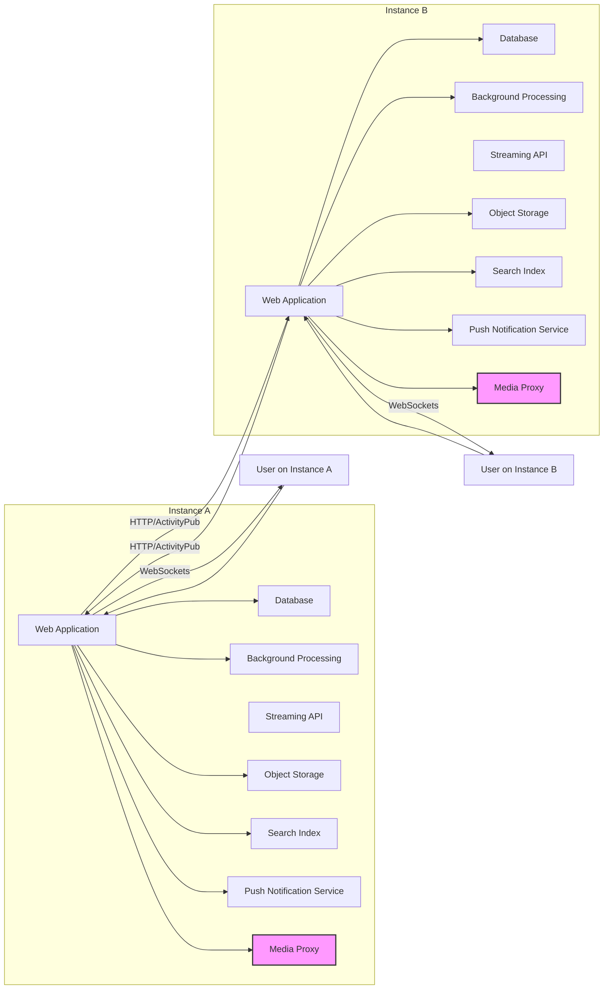

## Project Design Document: Mastodon (Improved)

**1. Introduction**

This document provides an enhanced architectural overview of the Mastodon project, a free, open-source, and decentralized social networking platform. It is intended to serve as a robust foundation for subsequent threat modeling activities by providing a clear understanding of the system's components, data flows, and interactions. This document builds upon the initial design by providing more granular detail and clarifying key aspects of the architecture.

**2. Goals and Objectives**

The core goals and objectives of Mastodon are:

*   To offer a decentralized and federated alternative to traditional, centralized social media platforms, empowering users with greater control.
*   To enable rich communication and content sharing through text (toots), images, videos, and links.
*   To provide a highly customizable social networking experience through instance-level moderation and feature variations.
*   To prioritize user privacy and data ownership within a decentralized framework.
*   To foster a collaborative and transparent development process through its open-source nature.

**3. Architectural Overview**

Mastodon employs a federated architecture where independent server instances communicate and share information. Users belong to a specific instance but can interact seamlessly with users across the entire network.

*   **Key Architectural Components:**
    *   "Web Application (Ruby on Rails)"
    *   "Database (PostgreSQL)"
    *   "Background Processing (Sidekiq)"
    *   "Streaming API (WebSockets)"
    *   "Object Storage" (e.g., AWS S3, local filesystem)
    *   "Federation Handler (ActivityPub)"
    *   "Search Index (Elasticsearch, optional)"
    *   "Push Notification Service (optional)"
    *   "Media Proxy (optional)"

**4. Component Details**

*   **"Web Application (Ruby on Rails)":**
    *   Manages user authentication (local and potentially OAuth).
    *   Provides the primary user interface (web frontend) for interacting with Mastodon.
    *   Handles user input and processes user actions (posting, following, etc.).
    *   Implements the core logic for displaying timelines, profiles, and notifications.
    *   Acts as the central point for interacting with other components.
    *   Exposes a RESTful API for clients (web, mobile applications).
    *   Enforces authorization rules to control access to resources.

*   **"Database (PostgreSQL)":**
    *   Persistently stores all critical data:
        *   User account information (usernames, email addresses, passwords - hashed).
        *   User profiles and settings.
        *   Toots (status updates) and associated metadata (timestamps, visibility).
        *   Relationships between users (followers, following, blocks, mutes, lists).
        *   Instance configuration and metadata.
        *   Media attachments and their metadata.
        *   Notification records.
        *   Information about remote instances.

*   **"Background Processing (Sidekiq)":**
    *   Executes asynchronous tasks to improve performance and responsiveness:
        *   Processing incoming and outgoing federation requests (ActivityPub).
        *   Handling media uploads and generating thumbnails.
        *   Delivering notifications (email, push).
        *   Performing database maintenance tasks (e.g., cleanup).
        *   Generating previews for linked content (link unfurling).

*   **"Streaming API (WebSockets)":**
    *   Provides real-time, bidirectional communication for live updates:
        *   Pushing new toots to users' timelines.
        *   Delivering notifications in real-time.
        *   Broadcasting updates on user activity (e.g., new followers).

*   **"Object Storage":**
    *   Stores media files uploaded by users:
        *   Images, videos, audio files.
        *   Can be configured to use local storage or cloud-based services like AWS S3.
        *   Security considerations include access control and preventing unauthorized access to stored media.

*   **"Federation Handler (ActivityPub)":**
    *   Implements the ActivityPub protocol for communicating with other Mastodon instances and compatible platforms:
        *   Sending and receiving activities (Create, Update, Delete, Follow, etc.).
        *   Verifying signatures of incoming activities for authenticity.
        *   Managing the federated timeline and delivering content to local users.
        *   Resolving actor URIs to discover remote users and instances.

*   **"Search Index (Elasticsearch, optional)":**
    *   Provides advanced search capabilities for toots and user profiles:
        *   Full-text search functionality.
        *   Improves search performance compared to database queries.
        *   Requires synchronization of data from the database.

*   **"Push Notification Service (optional)":**
    *   Enables sending push notifications to users' mobile devices:
        *   Requires integration with platform-specific services (e.g., Firebase Cloud Messaging, APNs).
        *   Involves managing device tokens and sending notifications based on user activity.

*   **"Media Proxy (optional)":**
    *   Acts as an intermediary for fetching and caching media from remote instances:
        *   Can improve performance and privacy by preventing direct requests to remote servers for every media load.
        *   Can be used to filter or sanitize media content.

**5. Data Flow**

*   **User Posts a Toot:**
    1. The "User" composes a toot via the "Web Application".
    2. The "Web Application" sends the toot content to the backend.
    3. The "Web Application" stores the toot in the "Database".
    4. The "Web Application" queues a background job in "Background Processing" to distribute the toot to local followers.
    5. "Background Processing", via the "Federation Handler", sends the toot to remote instances where followers exist using the ActivityPub protocol.
    6. The "Streaming API" pushes the new toot to connected clients.
    7. If media is attached, it is uploaded to "Object Storage" by the "Web Application".

*   **User Follows a Remote User:**
    1. The "User" initiates a follow request in the "Web Application".
    2. The "Web Application", via the "Federation Handler", sends an ActivityPub `Follow` activity to the remote instance.
    3. The remote instance's "Web Application" processes the request and, if accepted, sends an `Accept` activity back.
    4. Both instances update their respective "Databases" to reflect the new follow relationship.
    5. Future toots from the followed user on the remote instance will be delivered to the local instance via the "Federation Handler".

*   **Receiving a Toot from a Remote Instance:**
    1. The local instance's "Web Application", via the "Federation Handler", receives an ActivityPub `Create` activity containing a new toot from a remote instance.
    2. The "Federation Handler" validates the signature and authenticity of the activity.
    3. The "Web Application" stores the toot in the local "Database".
    4. "Background Processing" distributes the toot to local followers.
    5. The "Streaming API" pushes the new toot to relevant connected clients.
    6. If the toot contains media, the "Web Application" might use the "Media Proxy" to fetch and cache it.

**6. Key Interactions**

*   "User" <-> "Web Application":  HTTPS for web UI and API requests, WebSockets for real-time updates.
*   "Web Application" <-> "Database":  SQL queries for data persistence and retrieval.
*   "Web Application" <-> "Background Processing":  Job queuing and management.
*   "Web Application" <-> "Object Storage":  API calls for uploading, retrieving, and managing media files.
*   "Web Application" <-> "Search Index":  API calls for indexing and searching data.
*   "Web Application" <-> "Push Notification Service":  API calls for sending push notifications.
*   "Web Application" <-> "Federation Handler":  Internal calls for managing federation activities.
*   "Instance A" <-> "Instance B":  HTTPS using the ActivityPub protocol for federated communication.
*   "Web Application" <-> "Media Proxy": HTTP requests for fetching remote media.

**7. Security Considerations (Detailed)**

This section outlines potential security considerations relevant for threat modeling:

*   **Authentication and Authorization:**
    *   Weak password policies could lead to brute-force attacks.
    *   Vulnerabilities in the authentication mechanism (e.g., session management, OAuth implementation) could allow unauthorized access.
    *   Insufficient authorization checks could allow users to access or modify resources they shouldn't.

*   **Federation Security:**
    *   Spoofed ActivityPub activities could be used to inject malicious content or impersonate users/instances.
    *   Vulnerabilities in the signature verification process could allow unauthenticated data to be processed.
    *   Denial-of-service attacks targeting the federation endpoint could disrupt instance functionality.

*   **Input Validation:**
    *   Lack of proper sanitization of user-generated content could lead to cross-site scripting (XSS) attacks.
    *   Insufficient validation of input fields could lead to SQL injection or other injection vulnerabilities.
    *   Malformed media files could potentially exploit vulnerabilities in media processing libraries.

*   **Data Privacy:**
    *   Exposure of sensitive user data due to insecure storage or transmission.
    *   Lack of proper access controls on database records.
    *   Insufficient anonymization of data used for analytics or other purposes.

*   **Media Handling:**
    *   Unrestricted file uploads could lead to storage exhaustion or the hosting of malicious content.
    *   Insecure access controls on "Object Storage" could allow unauthorized access to media files.
    *   Vulnerabilities in media processing libraries could be exploited.

*   **Rate Limiting:**
    *   Absence of or insufficient rate limiting could allow attackers to perform brute-force attacks or denial-of-service attacks.

*   **Database Security:**
    *   Weak database credentials could lead to unauthorized access.
    *   SQL injection vulnerabilities in the "Web Application" could allow attackers to manipulate the database.
    *   Lack of encryption for sensitive data at rest.

*   **API Security:**
    *   Lack of authentication or authorization on API endpoints could allow unauthorized access.
    *   API vulnerabilities could be exploited to perform actions on behalf of other users.

*   **WebSockets Security:**
    *   Lack of secure WebSocket implementation could lead to eavesdropping or manipulation of real-time communication.
    *   Vulnerabilities in the WebSocket handling logic could be exploited.

*   **Push Notification Security:**
    *   Compromised push notification tokens could allow attackers to send unauthorized notifications.
    *   Lack of encryption for push notification payloads.

*   **Media Proxy Security:**
    *   Open proxies could be abused for malicious purposes.
    *   Vulnerabilities in the proxy implementation could be exploited.

**8. Deployment Considerations**

*   Mastodon instances are commonly deployed on cloud platforms (e.g., AWS, Google Cloud, Azure), virtual private servers (VPS), or dedicated hardware.
*   Deployment typically involves setting up the "Web Application", "Database", "Background Processing", and other components.
*   Configuration management tools (e.g., Ansible, Chef, Puppet) can automate deployment and configuration.
*   Containerization technologies (e.g., Docker, Kubernetes) simplify deployment and management.
*   Load balancers distribute traffic across multiple "Web Application" instances for scalability and high availability.
*   Regular security updates and patching of dependencies are crucial for maintaining a secure deployment.

**9. Technologies Used**

*   **Programming Languages:** Ruby, JavaScript
*   **Framework:** Ruby on Rails
*   **Database:** PostgreSQL
*   **Background Processing:** Sidekiq
*   **Real-time Communication:** WebSockets
*   **Federation Protocol:** ActivityPub
*   **Search Engine (Optional):** Elasticsearch
*   **Object Storage (Optional):** AWS S3, Google Cloud Storage, Azure Blob Storage, local filesystem (various options)
*   **Web Server:** Puma (default), Nginx, Apache
*   **Operating System:** Linux (most common)
*   **Push Notification Services (Optional):** Firebase Cloud Messaging (FCM), Apple Push Notification service (APNs)

This improved design document provides a more detailed and nuanced understanding of the Mastodon architecture, enhancing its value for subsequent threat modeling activities. The added details and clarifications aim to provide a comprehensive view of the system's inner workings and potential security considerations.
