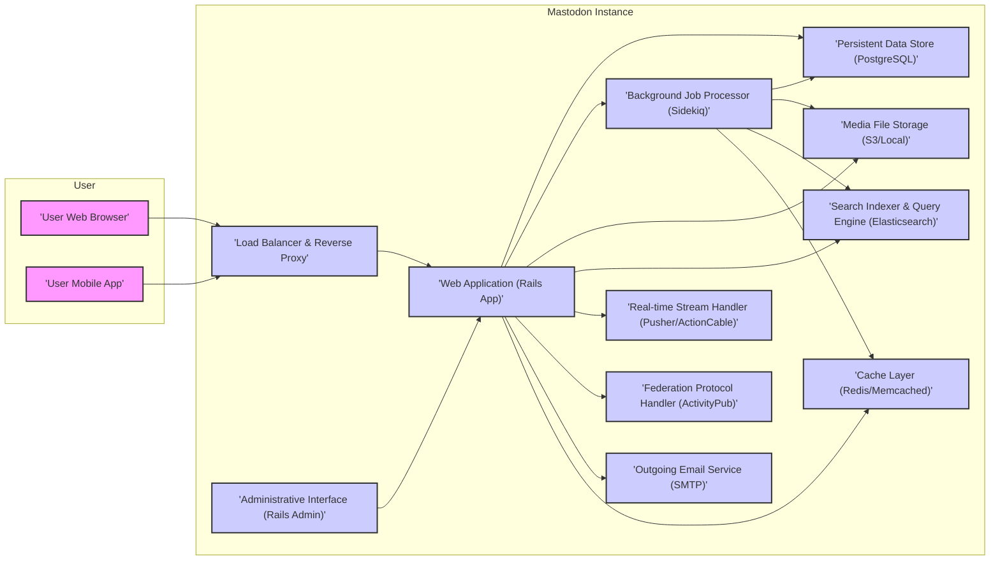

# Project Design Document: Mastodon

**Version:** 1.1
**Date:** October 26, 2023
**Prepared By:** AI Software Architect

## 1. Introduction

This document provides an enhanced architectural design of the Mastodon social networking platform. It aims to offer a more detailed understanding of the system's components, their interactions, and the overall data flow, specifically tailored for threat modeling purposes.

### 1.1. Purpose

The primary purpose of this document is to provide a comprehensive and detailed architectural overview of Mastodon, enabling effective and targeted threat modeling. It identifies key components, data flows, and potential attack surfaces with greater specificity.

### 1.2. Scope

This document covers the core components of a single Mastodon instance, including its web application, database, background processing, media storage, search functionality, and real-time streaming. It provides a more in-depth look at the federation aspects, which are fundamental to Mastodon's distributed nature and security posture.

### 1.3. Audience

This document is intended for security engineers, threat modelers, developers, and operations personnel involved in the security assessment, development, and maintenance of Mastodon instances. The enhanced detail aims to provide a more actionable resource for these roles.

## 2. System Overview

Mastodon is a free, open-source, decentralized microblogging social network. It operates as a network of independent servers (instances) that can communicate with each other using the ActivityPub protocol. Users create accounts on specific instances and can interact with users on their own instance as well as users on other federated instances. This decentralized nature introduces unique security considerations.

## 3. Architectural Design

The following diagram illustrates the high-level architecture of a single Mastodon instance with more descriptive component names:

### 3.1. Components

*   **User:** Represents end-users interacting with the Mastodon instance.
    *   **User Web Browser:** Users access Mastodon through a standard web interface, interacting with the frontend application.
    *   **User Mobile App:** Native mobile applications interact with the Mastodon API endpoints.
*   **Mastodon Instance:** Represents a single deployment of the Mastodon software.
    *   **Load Balancer & Reverse Proxy:** Distributes incoming traffic across multiple web application instances, handles SSL termination, and provides a single point of entry.
    *   **Web Application (Rails App):** The core of the Mastodon instance, responsible for:
        *   Handling user authentication and authorization.
        *   Processing user requests and rendering web pages.
        *   Providing API endpoints for mobile apps and other clients.
        *   Orchestrating interactions with other components.
    *   **Background Job Processor (Sidekiq):** Executes asynchronous tasks, including:
        *   Sending emails (notifications, password resets).
        *   Processing uploaded media (thumbnails, transcoding).
        *   Handling federation tasks (fetching and delivering activities).
        *   Updating search indexes.
    *   **Persistent Data Store (PostgreSQL):** Stores all persistent data, including:
        *   User accounts and profiles.
        *   Posts ("toots") and their metadata.
        *   Relationships between users (follows, blocks).
        *   Instance configurations and settings.
    *   **Media File Storage (S3/Local):** Stores uploaded media files:
        *   Images, videos, and audio files associated with posts.
        *   User avatars and banners.
        *   Can be a cloud storage service like AWS S3, Google Cloud Storage, or local storage.
    *   **Search Indexer & Query Engine (Elasticsearch):** Provides full-text search capabilities for:
        *   Searching for posts based on keywords.
        *   Searching for users by username or display name.
    *   **Real-time Stream Handler (Pusher/ActionCable):** Manages real-time communication using WebSockets for:
        *   Pushing new posts to user timelines.
        *   Delivering notifications to users.
        *   Providing live updates for conversations.
    *   **Federation Protocol Handler (ActivityPub):** Implements the ActivityPub protocol to:
        *   Send and receive posts and other activities to and from other Mastodon instances.
        *   Manage following and follower relationships across instances.
        *   Handle updates to user profiles and other data.
    *   **Administrative Interface (Rails Admin):** Provides a web interface for administrators to:
        *   Manage users and instances.
        *   Configure instance settings.
        *   Moderate content and handle reports.
    *   **Outgoing Email Service (SMTP):** Used for sending transactional emails:
        *   Account verification emails.
        *   Password reset emails.
        *   Notifications (optional).
    *   **Cache Layer (Redis/Memcached):** Provides a caching mechanism to improve performance by storing frequently accessed data:
        *   Cached database queries.
        *   Session data.
        *   Rate limiting information.

## 4. Data Flow

The following diagram illustrates a more detailed data flow for a user posting a new "toot" and its federation:

```mermaid
graph LR
    subgraph "User"
        A["'User Web Browser/App'"]
    end
    subgraph "Local Mastodon Instance"
        B["'Web Application'"]
        C["'Background Jobs'"]
        D["'Database'"]
        E["'Federation Service'"]
    end
    subgraph "Remote Mastodon Instance"
        F["'Remote Federation Service'"]
        G["'Remote Database'"]
        H["'Remote User'"]
    end

    A -- "1. Submit Toot via API" --> B
    B -- "2. Authenticate & Authorize" --> B
    B -- "3. Validate Toot Content" --> B
    B -- "4. Store Toot in DB" --> D
    B -- "5. Queue Federation Job" --> C
    C -- "6. Fetch Toot from DB" --> D
    C -- "7. Prepare ActivityPub Object" --> E
    E -- "8. Sign & Send ActivityPub 'Create' Activity" --> F
    F -- "9. Verify Signature & Authenticate" --> F
    F -- "10. Process & Store Activity in Remote DB" --> G
    F -- "11. Notify Remote Followers" --> F
    G -- "12. Display Toot to Remote User" --> H

    style A fill:#f9f,stroke:#333,stroke-width:2px
    style B fill:#ccf,stroke:#333,stroke-width:2px
    style C fill:#ccf,stroke:#333,stroke-width:2px
    style D fill:#ccf,stroke:#333,stroke-width:2px
    style E fill:#ccf,stroke:#333,stroke-width:2px
    style F fill:#ccf,stroke:#333,stroke-width:2px
    style G fill:#ccf,stroke:#333,stroke-width:2px
    style H fill:#ccf,stroke:#333,stroke-width:2px
```

**Detailed Data Flow for Posting and Federating a Toot:**

1. **Submit Toot via API:** The user composes a new post (toot) and submits it through the web browser or mobile app, which sends an API request to the Web Application.
2. **Authenticate & Authorize:** The Web Application authenticates the user and authorizes the action.
3. **Validate Toot Content:** The Web Application validates the input (e.g., content length, media types, mentions, hashtags).
4. **Store Toot in DB:** The validated toot is stored in the local Database.
5. **Queue Federation Job:** The Web Application queues a background job for federating the new toot.
6. **Fetch Toot from DB:** The Background Jobs worker retrieves the toot from the Database.
7. **Prepare ActivityPub Object:** The Federation Service prepares an ActivityPub "Create" activity representing the toot. This includes signing the activity with the instance's private key.
8. **Sign & Send ActivityPub 'Create' Activity:** The Federation Service sends the signed ActivityPub object to the inboxes of followers on remote instances.
9. **Verify Signature & Authenticate:** The Remote Federation Service receives the activity, verifies the signature to ensure authenticity and non-repudiation, and authenticates the sending instance.
10. **Process & Store Activity in Remote DB:** The Remote Federation Service processes the activity and stores the toot in its local Database.
11. **Notify Remote Followers:** The Remote Federation Service notifies its local users who follow the originating user.
12. **Display Toot to Remote User:** The remote user sees the new toot in their timeline.

**Other Key Data Flows:**

*   **User Registration:** User submits registration details, Web Application validates, stores in Database, and sends verification email via SMTP.
*   **Following a Remote User:** Local user initiates follow, Web Application sends ActivityPub "Follow" activity to the remote instance, remote instance handles the request and updates its data.
*   **Fetching Timelines:** User requests timeline, Web Application queries local Database for relevant toots, potentially including federated toots.
*   **Media Upload:** User uploads media, Web Application stores in Media File Storage, Database is updated with media metadata.
*   **Real-time Updates:** Web Application pushes new activities to connected clients via the Real-time Stream Handler.

## 5. Security Considerations

This section outlines potential security considerations based on the architectural design, categorized for clarity. These will be further explored during the threat modeling process.

*   **Web Application Security:**
    *   **Authentication and Session Management:** Vulnerabilities in login mechanisms, session fixation, insecure cookie handling.
    *   **Authorization and Access Control:** Privilege escalation, bypassing access restrictions.
    *   **Input Validation and Output Encoding:** Cross-Site Scripting (XSS), SQL Injection, Command Injection, other injection attacks.
    *   **Cross-Site Request Forgery (CSRF):** Exploiting trust in authenticated users.
    *   **Rate Limiting and Abuse Prevention:** Denial of Service (DoS), brute-force attacks.
    *   **API Security:** Authentication and authorization for API endpoints, protection against API abuse.
*   **Database Security:**
    *   **Access Control:** Unauthorized access to sensitive data.
    *   **Data Encryption at Rest and in Transit:** Protecting sensitive information.
    *   **SQL Injection:** Exploiting vulnerabilities in database queries.
    *   **Backup and Recovery:** Ensuring data integrity and availability.
*   **Media Storage Security:**
    *   **Access Control:** Unauthorized access to uploaded media.
    *   **Content Security:** Hosting of malicious or inappropriate content.
    *   **Data Integrity:** Ensuring media files are not tampered with.
*   **Federation Security:**
    *   **ActivityPub Protocol Vulnerabilities:** Exploiting weaknesses in the protocol implementation.
    *   **Spoofing and Impersonation:** Malicious instances impersonating legitimate ones.
    *   **Content Poisoning:** Spreading misinformation or malicious content through federation.
    *   **Denial of Service (DoS) via Federation:** Overwhelming an instance with federation requests.
    *   **Signature Verification Bypass:** Weaknesses in verifying ActivityPub signatures.
*   **Background Job Security:**
    *   **Job Queue Poisoning:** Injecting malicious jobs into the queue.
    *   **Insecure Job Processing:** Vulnerabilities in the code executed by background jobs.
    *   **Exposure of Sensitive Information:** Leaking secrets or credentials through job logs or processing.
*   **Administrative Interface Security:**
    *   **Weak Authentication:** Brute-force attacks against admin accounts.
    *   **Lack of Authorization:** Unauthorized access to administrative functions.
    *   **Session Hijacking:** Compromising admin sessions.
*   **Real-time Stream Security:**
    *   **Unauthorized Access to Streams:** Listening to private conversations or notifications.
    *   **Message Injection:** Injecting malicious messages into streams.
*   **Email Security:**
    *   **Spoofing:** Sending emails that appear to come from the instance.
    *   **Exposure of Information:** Leaking sensitive data in emails.
*   **Cache Security:**
    *   **Cache Poisoning:** Injecting malicious data into the cache.
    *   **Information Disclosure:** Exposing sensitive data stored in the cache.

## 6. Deployment Considerations

Mastodon instances can be deployed in various configurations, each with its own security implications:

*   **Single Server Deployment:** All components on one server. Simpler to manage but a single point of failure.
*   **Multi-Server Deployment:** Components are separated for scalability and resilience. Requires more complex configuration and security management.
*   **Containerized Deployment (Docker/Kubernetes):** Provides isolation and simplifies deployment but introduces container-specific security considerations.
*   **Cloud-Based Deployment:** Leveraging cloud services for infrastructure, storage, and databases. Security relies on the cloud provider's security measures and proper configuration.

## 7. Technologies Used

*   **Programming Language:** Ruby
*   **Framework:** Ruby on Rails
*   **Database:** PostgreSQL
*   **Background Processing:** Sidekiq
*   **Search Index:** Elasticsearch
*   **Real-time Updates:** Pusher or ActionCable (WebSockets)
*   **Federation Protocol:** ActivityPub
*   **Web Server:** Puma
*   **Frontend:** JavaScript (React)
*   **Media Storage:** AWS S3, Google Cloud Storage, or local filesystem
*   **Caching:** Redis or Memcached

## 8. Future Considerations

*   **Enhanced Federation Security Mechanisms:** Exploring more robust methods for verifying instance identities and content integrity.
*   **Improved Content Moderation Tools:** Developing more sophisticated tools for detecting and managing harmful content.
*   **Decentralized Identity Solutions:** Investigating alternatives to traditional username/password authentication.
*   **Auditing and Logging Enhancements:** Implementing more comprehensive logging for security monitoring and incident response.

This enhanced document provides a more detailed and structured understanding of the Mastodon architecture, specifically designed to facilitate thorough and effective threat modeling. The increased granularity in component descriptions, data flow diagrams, and security considerations aims to provide actionable insights for securing Mastodon instances.