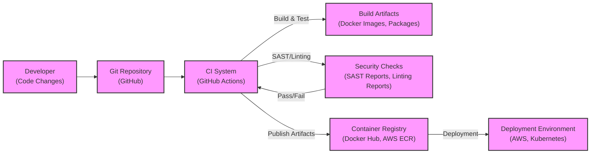

# BUSINESS POSTURE

Mastodon is a free, open-source, decentralized social network. Its primary business priority is to provide a privacy-focused and user-controlled alternative to centralized social media platforms. The goal is to empower users with data sovereignty and foster a federated social network where communities can operate independently while still being interconnected.

Most important business risks that need to be addressed:
- Platform abuse and content moderation challenges in a decentralized environment.
- Data privacy and security of user data across distributed instances.
- Ensuring platform stability and availability across numerous independent instances.
- Maintaining user trust and attracting new users to a decentralized platform.

# SECURITY POSTURE

Existing security controls:
- security control: HTTPS for web traffic encryption. Implemented at web server and load balancer level.
- security control: Regular software updates and patching. Described in project's release and maintenance documentation.
- security control: Code review process for contributions. Implemented as part of GitHub pull request workflow.
- security control: Database security measures (e.g., access control, encryption at rest). Implemented at database server level.
- security control: Input validation and output encoding to prevent common web vulnerabilities. Implemented in application code.
- accepted risk: Reliance on individual instance administrators for security configurations and practices.

Recommended security controls:
- security control: Implement automated security scanning (SAST/DAST) in the CI/CD pipeline.
- security control: Conduct regular penetration testing and vulnerability assessments.
- security control: Implement rate limiting and abuse prevention mechanisms at the application level.
- security control: Enhance monitoring and logging for security incident detection and response.

Security requirements:
- Authentication:
  - Requirement: Secure user authentication mechanisms (e.g., password-based, OAuth).
  - Requirement: Support for multi-factor authentication (MFA) to enhance account security.
  - Requirement: Secure password storage using strong hashing algorithms.
- Authorization:
  - Requirement: Role-based access control (RBAC) to manage user permissions within instances.
  - Requirement: Fine-grained authorization to control access to resources and actions.
  - Requirement: Instance administrators should have appropriate administrative privileges.
- Input validation:
  - Requirement: Comprehensive input validation on all user-provided data to prevent injection attacks.
  - Requirement: Server-side validation to ensure data integrity and security.
  - Requirement: Protection against cross-site scripting (XSS) and other injection vulnerabilities.
- Cryptography:
  - Requirement: Use of strong encryption algorithms for data in transit and at rest where applicable.
  - Requirement: Secure key management practices for cryptographic keys.
  - Requirement: Protection of sensitive data such as passwords and API keys using encryption.

# DESIGN

## C4 CONTEXT

```mermaid
flowchart LR
    subgraph "Mastodon Ecosystem"
        center "Mastodon Instance"
    end
    User -- Uses --> center
    center -- Sends/Receives --> "Other Mastodon Instances"
    center -- Sends --> "Email Server"
    center -- Stores --> "Media Storage"
    "Other Mastodon Instances" -- Interacts --> center
    "Email Server" -- Sends --> User
    "Media Storage" -- Stores/Retrieves --> center
    style center fill:#f9f,stroke:#333,stroke-width:2px
```

Context Diagram Elements:

- Element:
  - Name: User
  - Type: Person
  - Description: Individuals who use the Mastodon instance to interact with the social network, create content, and communicate with others.
  - Responsibilities:  Consume content, create content, interact with other users, manage their profile.
  - Security controls: User authentication, password management, MFA (optional), personal data privacy settings.

- Element:
  - Name: Mastodon Instance
  - Type: Software System
  - Description: A single deployment of the Mastodon server software, managed by an administrator or organization. It provides the core functionality of the social network.
  - Responsibilities: Host user accounts, manage content, federate with other instances, provide API access, handle user authentication and authorization.
  - Security controls: HTTPS, input validation, authorization, authentication, database security, security monitoring, regular updates, rate limiting, content moderation tools.

- Element:
  - Name: Other Mastodon Instances
  - Type: Software System
  - Description: Other independent Mastodon instances that are part of the federated network. They interact with the central Mastodon Instance to exchange content and user information.
  - Responsibilities: Host their own user base, federate content with other instances, enforce their own moderation policies.
  - Security controls: Instance-level security configurations, federation protocols security, content filtering (optional).

- Element:
  - Name: Email Server
  - Type: External System
  - Description: An external email server used by the Mastodon Instance to send emails to users, such as password reset emails, notification emails, and invitation emails.
  - Responsibilities: Send emails on behalf of the Mastodon Instance.
  - Security controls: SMTP security (TLS), email authentication (SPF, DKIM, DMARC).

- Element:
  - Name: Media Storage
  - Type: External System
  - Description: External storage service (could be local file system, cloud storage, or CDN) used by the Mastodon Instance to store uploaded media files (images, videos, etc.).
  - Responsibilities: Store and serve media files.
  - Security controls: Access control, encryption at rest (optional), data backup, CDN security (if applicable).

## C4 CONTAINER

```mermaid
flowchart LR
    subgraph "Mastodon Instance"
        WebUI[/"Web UI"\n(Container)\n(Web Application)\n]
        API[/"API"\n(Container)\n(API Application)\n]
        StreamingAPI[/"Streaming API"\n(Container)\n(WebSocket Server)\n]
        BackgroundJobs[/"Background Jobs"\n(Container)\n(Job Processor)\n]
        Database[/"Database"\n(Container)\n(PostgreSQL)\n]
        MediaStorage[/"Media Storage"\n(Container)\n(Object Storage)\n]
    end
    User -- Uses --> WebUI
    WebUI -- Uses API --> API
    WebUI -- Uses StreamingAPI --> StreamingAPI
    API -- Reads/Writes --> Database
    BackgroundJobs -- Reads/Writes --> Database
    API -- Stores/Retrieves --> MediaStorage
    StreamingAPI -- Publishes/Subscribes --> BackgroundJobs
    style WebUI fill:#f9f,stroke:#333,stroke-width:2px
    style API fill:#f9f,stroke:#333,stroke-width:2px
    style StreamingAPI fill:#f9f,stroke:#333,stroke-width:2px
    style BackgroundJobs fill:#f9f,stroke:#333,stroke-width:2px
    style Database fill:#f9f,stroke:#333,stroke-width:2px
    style MediaStorage fill:#f9f,stroke:#333,stroke-width:2px
```

Container Diagram Elements:

- Element:
  - Name: Web UI
  - Type: Container
  - Description:  The web application providing the user interface for Mastodon, built using Ruby on Rails and JavaScript. It handles user interactions, rendering views, and communicating with the API.
  - Responsibilities: Present user interface, handle user input, display content, interact with API and Streaming API.
  - Security controls: XSS protection, CSRF protection, input validation, session management, authentication and authorization via API.

- Element:
  - Name: API
  - Type: Container
  - Description: The RESTful API application, built using Ruby on Rails, that handles core business logic, data access, and federation. It's the backend for the Web UI and other clients.
  - Responsibilities:  Handle API requests, implement business logic, manage data access to the database, handle federation with other instances, user authentication and authorization.
  - Security controls: API authentication (OAuth 2.0), authorization, input validation, rate limiting, output encoding, secure data handling, logging and monitoring.

- Element:
  - Name: Streaming API
  - Type: Container
  - Description: A WebSocket server, likely built using Ruby on Rails ActionCable, that provides real-time updates to users, such as new posts and notifications.
  - Responsibilities:  Establish WebSocket connections, push real-time updates to connected clients, manage subscriptions.
  - Security controls: WebSocket security, authentication and authorization, rate limiting, input validation for messages, connection management.

- Element:
  - Name: Background Jobs
  - Type: Container
  - Description: A background job processing system, likely using Sidekiq with Redis, that handles asynchronous tasks such as sending emails, processing media, and federation tasks.
  - Responsibilities: Process background tasks, manage job queues, ensure reliable execution of asynchronous operations.
  - Security controls: Secure job processing, input validation for job data, access control to job queues, monitoring of job execution.

- Element:
  - Name: Database
  - Type: Container
  - Description: A PostgreSQL database used for persistent storage of application data, including user accounts, posts, relationships, and instance configuration.
  - Responsibilities: Store and retrieve application data, ensure data integrity and availability.
  - Security controls: Database access control, encryption at rest (optional), regular backups, database hardening, monitoring and auditing.

- Element:
  - Name: Media Storage
  - Type: Container
  - Description: Object storage (e.g., AWS S3, local file system) used to store user-uploaded media files.
  - Responsibilities: Store and serve media files, manage storage space.
  - Security controls: Access control, encryption at rest (optional), data backup, CDN integration (optional) for secure and efficient delivery.

## DEPLOYMENT

Deployment Solution: Cloud-based Deployment (Example using AWS)

```mermaid
flowchart LR
    subgraph "AWS Cloud"
        subgraph "VPC"
            subgraph "Public Subnet"
                LoadBalancer[/"Load Balancer"\n(AWS ELB)\n]
                WebServer[/"Web Server"\n(EC2 Instances)\n(Web UI, API, Streaming API)\n]
            end
            subgraph "Private Subnet"
                AppServer[/"Application Server"\n(EC2 Instances)\n(Background Jobs)\n]
                DatabaseServer[/"Database Server"\n(RDS PostgreSQL)\n]
                RedisServer[/"Redis Server"\n(ElastiCache Redis)\n]
            end
            subgraph "Storage"
                ObjectStorage[/"Object Storage"\n(AWS S3)\n(Media Storage)\n]
            end
        end
        Internet -- Internet Traffic --> LoadBalancer
        LoadBalancer -- Traffic Routing --> WebServer
        WebServer -- API Calls --> AppServer
        WebServer -- Database Access --> DatabaseServer
        AppServer -- Database Access --> DatabaseServer
        WebServer -- Media Storage Access --> ObjectStorage
        AppServer -- Redis Access --> RedisServer
    end
    style LoadBalancer fill:#f9f,stroke:#333,stroke-width:2px
    style WebServer fill:#f9f,stroke:#333,stroke-width:2px
    style AppServer fill:#f9f,stroke:#333,stroke-width:2px
    style DatabaseServer fill:#f9f,stroke:#333,stroke-width:2px
    style RedisServer fill:#f9f,stroke:#333,stroke-width:2px
    style ObjectStorage fill:#f9f,stroke:#333,stroke-width:2px
```

Deployment Diagram Elements:

- Element:
  - Name: Load Balancer
  - Type: Infrastructure
  - Description: AWS Elastic Load Balancer (ELB) distributes incoming internet traffic across multiple Web Server instances for high availability and scalability.
  - Responsibilities: Traffic distribution, SSL termination, health checks.
  - Security controls: HTTPS termination, DDoS protection (AWS Shield), security groups to control inbound traffic.

- Element:
  - Name: Web Server
  - Type: Infrastructure (EC2 Instances)
  - Description: EC2 instances running the Web UI, API, and Streaming API containers. Deployed in a public subnet to be accessible via the load balancer.
  - Responsibilities: Host web applications, handle user requests, serve content.
  - Security controls: Security groups to restrict inbound and outbound traffic, regular OS and application patching, intrusion detection system (IDS) (optional), hardening of EC2 instances.

- Element:
  - Name: Application Server
  - Type: Infrastructure (EC2 Instances)
  - Description: EC2 instances running the Background Jobs container. Deployed in a private subnet for security.
  - Responsibilities: Process background jobs, interact with the database and Redis.
  - Security controls: Security groups to restrict inbound and outbound traffic, regular OS and application patching, intrusion detection system (IDS) (optional), hardening of EC2 instances, access only from within VPC.

- Element:
  - Name: Database Server
  - Type: Infrastructure (RDS PostgreSQL)
  - Description: AWS RDS PostgreSQL instance for managed database service. Deployed in a private subnet for security.
  - Responsibilities: Persistent data storage, database management.
  - Security controls: Database access control lists (ACLs), encryption at rest and in transit, regular backups, database monitoring, security patching by AWS.

- Element:
  - Name: Redis Server
  - Type: Infrastructure (ElastiCache Redis)
  - Description: AWS ElastiCache Redis instance for caching and background job queue management. Deployed in a private subnet for security.
  - Responsibilities: Caching, job queue management for background jobs.
  - Security controls: Access control lists (ACLs), encryption in transit (optional), regular backups, security patching by AWS, access only from within VPC.

- Element:
  - Name: Object Storage
  - Type: Infrastructure (AWS S3)
  - Description: AWS S3 for storing media files.
  - Responsibilities: Scalable and durable storage for media files.
  - Security controls: S3 bucket policies for access control, encryption at rest, versioning, access logging.

## BUILD



Build Process Description:

1. Developer makes code changes and commits them to the Git Repository (GitHub).
2. The CI System (e.g., GitHub Actions) is triggered by code changes.
3. CI System performs build and test steps: compiling code, running unit and integration tests, building Docker images and packages.
4. CI System executes security checks: Static Application Security Testing (SAST) to identify potential vulnerabilities in the code, and code linters to enforce code quality and style.
5. Security Checks provide pass/fail status to the CI System. Build process fails if security checks fail.
6. If build and security checks pass, the CI System publishes Build Artifacts (Docker images, packages) to a Container Registry (e.g., Docker Hub, AWS ECR).
7. Deployment process pulls artifacts from the Container Registry and deploys them to the Deployment Environment (e.g., AWS, Kubernetes).

Build Security Controls:

- security control: Automated build process using CI/CD pipelines.
- security control: Source code version control using Git.
- security control: Static Application Security Testing (SAST) integrated into the CI pipeline.
- security control: Code linting and style checks to improve code quality and reduce potential vulnerabilities.
- security control: Unit and integration tests to ensure code functionality and prevent regressions.
- security control: Container image scanning for vulnerabilities (optional, can be added to CI pipeline or container registry).
- security control: Secure storage and access control for build artifacts in the container registry.
- security control: Audit logging of build and deployment activities.

# RISK ASSESSMENT

Critical business processes we are trying to protect:
- User registration and account management.
- Content creation and publishing (toots, media).
- Federation and content distribution across instances.
- User interactions (following, notifications, messaging).
- Instance administration and configuration.

Data we are trying to protect and their sensitivity:
- User credentials (passwords, API keys): Highly sensitive, require strong encryption and secure storage.
- User profile information (name, bio, etc.): Sensitive, requires privacy protection and access control.
- User content (toots, media): Sensitive, requires content moderation and data integrity.
- Private messages: Highly sensitive, require end-to-end encryption (if implemented) and secure storage.
- Instance configuration data: Sensitive, requires access control to prevent unauthorized modifications.
- Audit logs: Sensitive, require secure storage and access control for security monitoring and incident response.

# QUESTIONS & ASSUMPTIONS

Questions:
- What specific regulations and compliance standards (e.g., GDPR, CCPA) are relevant to Mastodon instances?
- What are the specific content moderation policies and mechanisms implemented in Mastodon?
- What is the threat model considered by Mastodon developers and instance administrators?
- Are there specific security incident response plans and procedures in place for Mastodon instances?
- What are the data retention policies for user data and content on Mastodon instances?

Assumptions:
- Mastodon instances are generally deployed in cloud environments or on dedicated servers.
- Instance administrators are responsible for the security configuration and management of their instances.
- Users are concerned about data privacy and control over their personal information.
- Federation is a core feature and security of federation protocols is important.
- Open-source nature implies community involvement in security and vulnerability reporting.