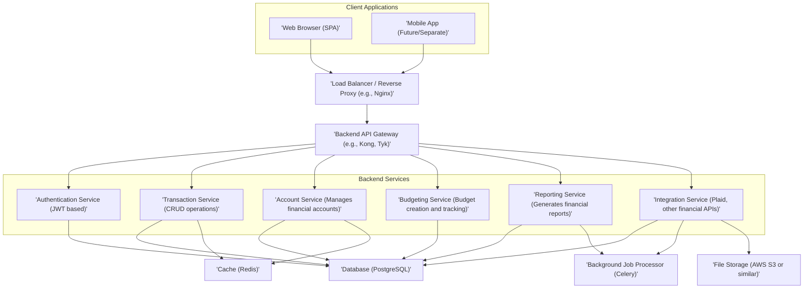
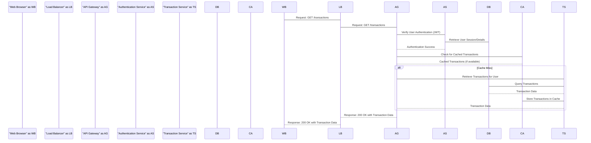
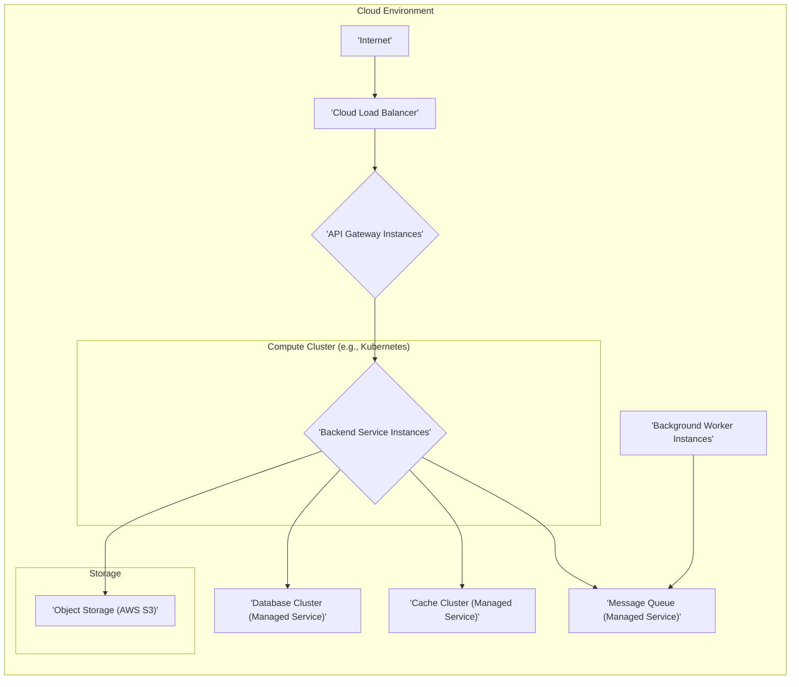

# Project Design Document: Maybe Finance

**Project Repository:** https://github.com/maybe-finance/maybe

**Version:** 1.1
**Date:** October 26, 2023
**Author:** AI Cloud & Security Architect

## 1. Introduction

This document outlines the design of the Maybe Finance project, an open-source personal finance application. The purpose of this document is to provide a comprehensive and detailed overview of the system's architecture, components, data flow, and technologies utilized. This document will serve as the foundational artifact for subsequent threat modeling activities, enabling a structured approach to identifying and mitigating potential security risks.

## 2. Goals and Objectives

The primary goals of the Maybe Finance project are to:

* Empower users with a platform to comprehensively track their income, expenses, and investments across various financial accounts.
* Offer robust budgeting and financial planning tools to facilitate informed financial decision-making.
* Enable users to visualize their financial data through insightful reports and dashboards, promoting better understanding and control.
* Foster an open-source and community-driven environment, encouraging contributions and transparency.

## 3. High-Level Architecture

The Maybe Finance project employs a multi-tier web application architecture, separating concerns and promoting scalability. It consists of distinct frontend clients, a backend API gateway, specialized backend services, and persistent data storage.

## 4. Component Details

This section provides a detailed description of each component identified in the high-level architecture, including their responsibilities and potential technologies.

### 4.1 Client Applications

* **Web Browser (SPA):** The primary user interface, likely implemented as a Single Page Application (SPA) using a modern JavaScript framework.
    * **Responsibilities:** Rendering the user interface, handling user interactions (input, navigation), communicating with the backend API via HTTP requests (likely RESTful).
    * **Potential Technologies:** React, Vue.js, Angular, TypeScript, JavaScript.
* **Mobile App (Future/Separate):**  While not explicitly present in the initial repository, the project's scope suggests potential future development of native (iOS/Android) or cross-platform mobile applications. These might communicate with the same backend API.
    * **Responsibilities:** Providing a mobile-optimized user experience, leveraging device-specific features, communicating with the backend API.
    * **Potential Technologies:** Swift (iOS), Kotlin (Android), React Native, Flutter.

### 4.2 Load Balancer / Reverse Proxy

* **Description:**  A crucial component for handling incoming traffic, distributing requests across multiple instances of the Backend API Gateway to ensure high availability and scalability. It often performs SSL termination and can provide basic security features.
    * **Responsibilities:** Load balancing requests, SSL/TLS termination, routing, potential web application firewall (WAF) integration, basic DDoS protection.
    * **Potential Technologies:** Nginx, HAProxy, AWS Elastic Load Balancing (ELB), Google Cloud Load Balancing.

### 4.3 Backend API Gateway

* **Description:**  Acts as a central entry point for all client requests to the backend services. It decouples the frontend from the specific backend service implementations, enabling easier maintenance and evolution. It also handles cross-cutting concerns like authentication and authorization.
    * **Responsibilities:** Request routing to appropriate backend services, authentication and authorization enforcement (e.g., verifying JWT tokens), API composition (aggregating responses from multiple services), rate limiting to prevent abuse, request logging and monitoring.
    * **Potential Technologies:** Kong, Tyk, API Gateway (AWS, Azure, Google Cloud).

### 4.4 Backend Services

These are independent, specialized services responsible for specific business functionalities.

* **Authentication Service (JWT based):** Manages user identities, registration, login, and session management using JSON Web Tokens (JWT) for stateless authentication.
    * **Responsibilities:** User registration and account creation, user authentication (username/password, potentially social logins), JWT generation and verification, password management (hashing and salting), handling password resets, potentially multi-factor authentication (MFA).
    * **Potential Technologies:**  Implementation within the chosen backend framework (e.g., Django REST Framework, Node.js with Passport.js), libraries for JWT handling.
* **Transaction Service (CRUD operations):** Handles the creation, retrieval, updating, and deletion of financial transactions.
    * **Responsibilities:** Storing and managing transaction details (date, amount, description, category, account), providing APIs for CRUD operations on transactions, potentially supporting transaction categorization and reconciliation logic.
    * **Potential Technologies:** Implementation within the chosen backend framework, interaction with the database ORM.
* **Account Service (Manages financial accounts):** Manages user financial accounts, including bank accounts, credit cards, and investment accounts.
    * **Responsibilities:** Creating and managing user accounts, linking external financial accounts (potentially via the Integration Service), tracking account balances, providing APIs for retrieving account information.
    * **Potential Technologies:** Implementation within the chosen backend framework, interaction with the database ORM.
* **Budgeting Service (Budget creation and tracking):** Provides functionality for users to create and manage budgets, track spending against those budgets, and receive alerts.
    * **Responsibilities:** Allowing users to define budgets for different categories and time periods, tracking spending against defined budgets, generating budget reports and visualizations, potentially sending notifications for budget overruns.
    * **Potential Technologies:** Implementation within the chosen backend framework, potentially utilizing scheduled tasks or background jobs for budget tracking and notifications.
* **Reporting Service (Generates financial reports):** Generates various financial reports and visualizations based on user data, providing insights into their financial health.
    * **Responsibilities:** Aggregating and processing financial data, generating reports (e.g., income vs. expenses, net worth, cash flow), creating charts and visualizations, potentially allowing users to customize reports.
    * **Potential Technologies:** Implementation within the chosen backend framework, libraries for data analysis and visualization (e.g., Pandas, Matplotlib in Python).
* **Integration Service (Plaid, other financial APIs):** Handles integrations with third-party financial institutions to automatically import transaction data and potentially retrieve account balances.
    * **Responsibilities:** Communicating with external APIs (e.g., Plaid, Finicity), securely handling API keys and secrets, transforming data received from external APIs into the application's data model, handling errors and retries for external API calls, potentially managing user authentication with external providers (OAuth).
    * **Potential Technologies:** Libraries specific to the integrated APIs (e.g., Plaid SDK), secure secrets management solutions (e.g., HashiCorp Vault, AWS Secrets Manager).

### 4.5 Data Storage and Processing

* **Database (PostgreSQL):**  The primary relational database used for persistent storage of application data.
    * **Responsibilities:** Storing user accounts, transactions, budgets, account information, and other application data, ensuring data integrity and consistency, providing efficient data querying and retrieval.
    * **Potential Technologies:** PostgreSQL, potentially with extensions for specific needs.
* **Cache (Redis):**  An in-memory data store used for caching frequently accessed data to improve application performance and reduce database load.
    * **Responsibilities:** Caching API responses, user session data, frequently accessed financial data, reducing latency for read operations.
    * **Potential Technologies:** Redis.
* **Background Job Processor (Celery):**  A distributed task queue used for executing asynchronous tasks outside the main request-response cycle.
    * **Responsibilities:** Handling time-consuming tasks like processing large datasets, syncing data with external services, sending emails or notifications, generating complex reports.
    * **Potential Technologies:** Celery (with a message broker like Redis or RabbitMQ).
* **File Storage (AWS S3 or similar):**  Used for storing files such as user-uploaded documents (e.g., bank statements) or generated reports.
    * **Responsibilities:** Securely storing and retrieving files, providing scalability and durability for file storage.
    * **Potential Technologies:** AWS S3, Google Cloud Storage, Azure Blob Storage.

## 5. Data Flow

Illustrating a common user interaction, such as retrieving a list of recent transactions, clarifies the data flow within the system.

## 6. Technology Stack (Detailed)

This section provides a more concrete view of the potential technologies used in the Maybe Finance project.

* **Frontend:**
    * **JavaScript Framework:** React with a focus on component-based architecture and a virtual DOM for efficient updates.
    * **State Management:** Redux or Zustand for managing application state.
    * **Styling:** CSS Modules or Styled Components for encapsulated styling.
    * **Build Tooling:** Webpack or Parcel for bundling and optimizing assets.
    * **Testing:** Jest and React Testing Library for unit and integration testing.
* **Backend:**
    * **Programming Language:** Python, leveraging its extensive libraries for web development and data processing.
    * **Web Framework:** Django REST Framework for building robust and well-documented APIs.
    * **Asynchronous Tasks:** Celery for handling background jobs.
    * **Database ORM:** Django ORM for interacting with the PostgreSQL database.
    * **Testing:** Pytest for unit and integration testing.
* **Database:**
    * **Relational Database:** PostgreSQL, chosen for its reliability, features, and open-source nature.
* **Caching:**
    * **In-Memory Data Store:** Redis for caching frequently accessed data and session management.
* **Background Jobs:**
    * **Task Queue:** Celery, utilizing Redis as the message broker.
* **Message Queue:**
    * **Broker:** Redis for Celery.
* **Containerization:**
    * **Container Platform:** Docker for packaging applications and their dependencies into containers.
* **Orchestration:**
    * **Local Development:** Docker Compose for managing multi-container applications.
    * **Production Deployment (Potentially):** Kubernetes for orchestrating and scaling containerized applications.
* **Integration:**
    * **Financial Institution Integration:** Plaid API for securely connecting to user's bank accounts and retrieving transaction data.
* **Cloud Provider (Potentially):**
    * **Infrastructure:** AWS, Google Cloud Platform, or Azure for hosting the application and its components.

## 7. Deployment Architecture (Conceptual)

The application is envisioned to be deployed in a cloud environment using containerization and potentially Kubernetes for orchestration, ensuring scalability and resilience.

## 8. Security Considerations (Detailed)

This section elaborates on key security considerations for the Maybe Finance project, providing specific examples of security measures.

* **Authentication and Authorization:** Ensuring only authorized users can access specific resources and functionalities.
    * **Implementation:** JWT-based authentication for stateless session management. Secure storage of user credentials using bcrypt or Argon2 for password hashing with appropriate salting. Role-Based Access Control (RBAC) to manage user permissions. Consideration of Multi-Factor Authentication (MFA) for enhanced security.
* **Data Encryption:** Protecting sensitive data both in transit and at rest.
    * **Implementation:** Enforcing HTTPS for all communication using TLS certificates. Encrypting sensitive data at rest in the database using database-level encryption or application-level encryption. Encrypting data stored in object storage.
* **Input Validation:** Preventing injection attacks and data integrity issues by validating all user inputs.
    * **Implementation:** Server-side validation of all data received from clients. Using parameterized queries or ORM features to prevent SQL injection. Encoding output to prevent Cross-Site Scripting (XSS) attacks. Implementing proper input sanitization.
* **API Security:** Securing the backend API endpoints from unauthorized access and abuse.
    * **Implementation:** Rate limiting to prevent denial-of-service attacks and abuse. Implementing authentication and authorization checks for all API endpoints. Using secure coding practices to prevent common API vulnerabilities (e.g., mass assignment, insecure direct object references).
* **Third-Party Integrations:** Securely integrating with external services like Plaid.
    * **Implementation:** Securely storing API keys and secrets using a secrets management solution. Following the principle of least privilege when granting access to third-party services. Carefully validating and sanitizing data received from third-party APIs. Implementing secure OAuth flows for user authorization.
* **Dependency Management:** Regularly updating dependencies to patch known vulnerabilities.
    * **Implementation:** Using dependency management tools to track and update dependencies. Implementing automated vulnerability scanning of dependencies. Having a process for reviewing and addressing security vulnerabilities in dependencies.
* **Logging and Monitoring:** Implementing comprehensive logging and monitoring to detect and respond to security incidents.
    * **Implementation:** Logging all significant events, including authentication attempts, API requests, and errors. Implementing security monitoring tools to detect suspicious activity. Setting up alerts for security-related events.
* **Secrets Management:** Securely managing sensitive information like API keys, database credentials, and encryption keys.
    * **Implementation:** Utilizing a dedicated secrets management solution (e.g., HashiCorp Vault, AWS Secrets Manager) to store and manage secrets. Avoiding storing secrets in code or configuration files. Implementing access controls for secrets.

## 9. Future Considerations

* **Mobile Application Development:** Developing dedicated native or cross-platform mobile applications for iOS and Android.
* **Advanced Reporting and Analytics:** Implementing more sophisticated reporting features, including custom report generation and predictive analytics.
* **Machine Learning Integration:** Exploring the use of machine learning for features like automated transaction categorization, spending pattern analysis, and financial forecasting.
* **Improved User Interface/User Experience:** Continuously improving the user interface and user experience based on user feedback and best practices.

## 10. Conclusion

This document provides a comprehensive and detailed design for the Maybe Finance project, outlining its architecture, components, data flow, technologies, and security considerations. This document serves as a vital resource for understanding the system and will be instrumental in the upcoming threat modeling process. Continuous review and updates to this document will be necessary as the project evolves and new requirements emerge.