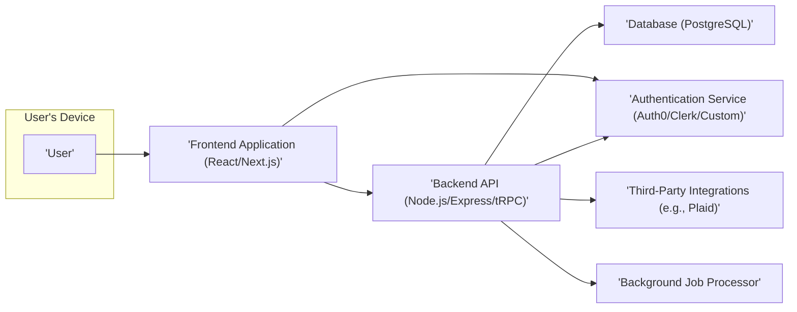
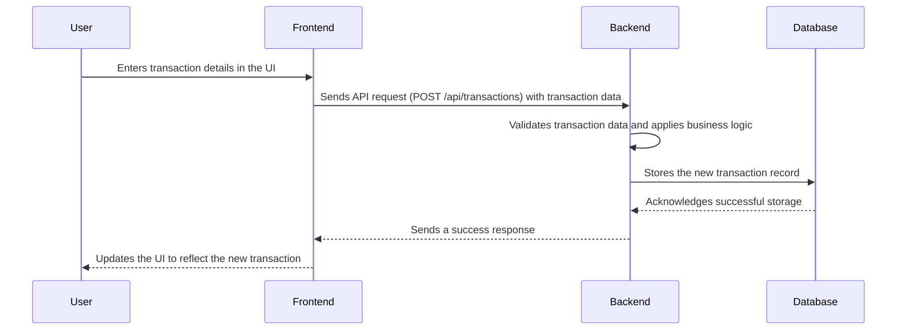
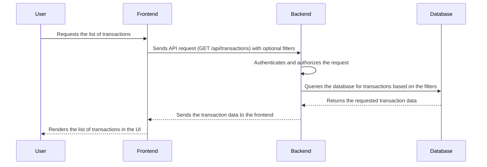
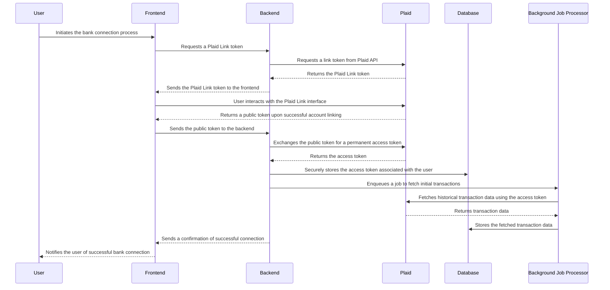
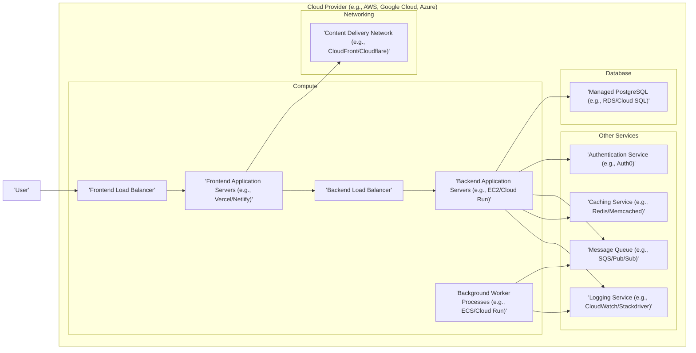

# Project Design Document: Maybe Finance

**Version:** 1.1
**Date:** October 26, 2023
**Author:** AI Software Architect

## 1. Introduction

This document outlines the refined design of the Maybe Finance project, a personal finance management application. This document serves as a blueprint for understanding the system's architecture, components, and data flow, and will be used as the basis for subsequent threat modeling activities. The project aims to provide users with comprehensive tools for budgeting, tracking expenses, and financial forecasting. This design is based on the publicly available codebase found at [https://github.com/maybe-finance/maybe](https://github.com/maybe-finance/maybe). This revision incorporates more detail and clarifies certain aspects of the initial design.

## 2. Goals and Objectives

*   Provide users with a secure and reliable platform for managing their personal finances.
*   Enable users to track income and expenses effectively through manual entry and automated bank integrations.
*   Offer sophisticated budgeting tools allowing for granular control over spending categories.
*   Provide accurate financial forecasting capabilities based on historical data and user-defined projections.
*   Ensure the highest standards of data privacy and security, adhering to relevant regulations.
*   Maintain a scalable and maintainable architecture to accommodate future growth and feature additions.
*   Offer a user-friendly and intuitive interface across different devices.

## 3. High-Level Architecture

The Maybe Finance application employs a robust multi-tier architecture, separating concerns for enhanced maintainability and scalability.

**Components:**

*   **User:** The individual interacting with the Maybe Finance application through a web browser or potentially a mobile application.
*   **Frontend Application:** A reactive, client-side application built using technologies like React and Next.js, providing server-side rendering and a rich user experience. Responsible for presenting data and handling user interactions.
*   **Backend API:** A stateless, server-side application built using Node.js, likely with frameworks like Express.js or tRPC, exposing RESTful or gRPC endpoints. Handles business logic, data processing, and orchestrates interactions between other services.
*   **Database:** A persistent, relational storage solution, likely PostgreSQL, optimized for transactional data and complex queries. Stores all application data.
*   **Authentication Service:** A dedicated, independent service responsible for user identity management, including registration, login, and token issuance. This could be a third-party service or a self-hosted solution.
*   **Third-Party Integrations:** Connections to external services, such as Plaid for secure bank account linking and transaction retrieval, enhancing the application's functionality.
*   **Background Job Processor:** A service responsible for executing asynchronous tasks, such as data synchronization with third-party services, report generation, and scheduled tasks.

## 4. Detailed Component Design

### 4.1. Frontend Application

*   **Technology:** React, Next.js, TypeScript, potentially state management libraries like Zustand or Redux, UI component libraries (e.g., Material UI, Chakra UI).
*   **Responsibilities:**
    *   Rendering dynamic user interfaces based on data received from the backend.
    *   Handling user input through forms, buttons, and other interactive elements.
    *   Managing application state, including user sessions and data fetched from the API.
    *   Making asynchronous API calls to the backend to retrieve and manipulate data.
    *   Implementing client-side input validation and user experience enhancements.
    *   Managing user authentication flows, including redirects and token handling.
*   **Key Modules:**
    *   **User Interface Components:** Reusable and composable components for displaying data, creating forms, and providing navigation. Examples include transaction lists, budget overviews, and settings panels.
    *   **Routing:** Implemented using Next.js's built-in router, handling navigation between different application views and managing URL parameters.
    *   **State Management:**  Manages the application's data and state, ensuring data consistency across components. This might involve global state or component-level state.
    *   **API Client:**  A module responsible for making HTTP requests to the backend API, handling request formatting, and response parsing (e.g., using `fetch` or `axios` with interceptors).
    *   **Authentication Context/Provider:** Manages the user's authentication state, storing and providing access to authentication tokens, and handling login/logout logic.

### 4.2. Backend API

*   **Technology:** Node.js, Express.js or tRPC, TypeScript, potentially an ORM like Prisma or TypeORM, logging libraries (e.g., Winston, Morgan).
*   **Responsibilities:**
    *   Receiving and processing API requests from the frontend application.
    *   Implementing core business logic for financial calculations, budgeting rules, and forecasting algorithms.
    *   Interacting with the database to persist and retrieve data, abstracting database interactions from the core logic.
    *   Authenticating and authorizing incoming requests to ensure only authorized users can access specific resources.
    *   Integrating with third-party services like Plaid, securely managing API keys and handling data transformations.
    *   Performing data validation and sanitization to prevent malicious input from reaching the database.
    *   Orchestrating background jobs for asynchronous tasks.
*   **Key Modules:**
    *   **API Endpoints/Controllers:** Defines the available API routes and their corresponding handlers, responsible for receiving requests, processing them, and returning responses (e.g., `/api/transactions`, `/api/budgets`).
    *   **Business Logic Layer (Services):** Contains the core application logic, encapsulating business rules and algorithms related to finance management.
    *   **Data Access Layer (Repositories/DAOs):**  Handles interactions with the database, providing an abstraction layer for data persistence and retrieval.
    *   **Authentication and Authorization Middleware:**  Verifies user credentials (e.g., JWT tokens) and checks user permissions before allowing access to protected resources.
    *   **Third-Party Integration Handlers:**  Manages communication and data exchange with external services, including error handling and data mapping.
    *   **Job Queues/Processors:**  Handles the creation and processing of background jobs (e.g., using libraries like BullMQ or Redis Queue).

### 4.3. Database

*   **Technology:** PostgreSQL, potentially with extensions like `pgcrypto` for enhanced security.
*   **Responsibilities:**
    *   Providing persistent and reliable storage for all application data.
    *   Ensuring data integrity through constraints, transactions, and backups.
    *   Offering efficient data retrieval and querying capabilities through indexing and query optimization.
    *   Maintaining data consistency and atomicity.
*   **Key Tables (Examples):**
    *   `users`: Stores user profile information (ID, email, password hash, registration date, etc.).
    *   `accounts`: Stores details of user's financial accounts (ID, user ID, bank name, account type, masked account number, current balance, currency).
    *   `transactions`: Stores detailed records of financial transactions (ID, account ID, date, amount, description, category, merchant, notes, import source).
    *   `budgets`: Stores user-defined budget categories, spending limits, and time periods.
    *   `forecasts`: Stores generated financial forecasts, including projections for income, expenses, and net worth.
    *   `plaid_items`: Stores information related to Plaid connections (user ID, access token, item ID).

### 4.4. Authentication Service

*   **Technology:** Potentially Auth0, Clerk, Firebase Authentication, or a custom implementation using libraries like Passport.js.
*   **Responsibilities:**
    *   Securely registering new users and managing user accounts.
    *   Authenticating users based on their credentials (username/password, social logins, etc.).
    *   Managing password resets and recovery processes.
    *   Issuing and verifying authentication tokens (e.g., JWTs).
    *   Providing mechanisms for authorization and role-based access control (RBAC).
*   **Integration:** The frontend interacts with the authentication service for login and registration. The backend verifies the authenticity of tokens issued by this service to authorize API requests.

### 4.5. Third-Party Integrations

*   **Technology:**  Involves making secure API calls to external services, often using dedicated SDKs or HTTP client libraries.
*   **Example: Plaid:**
    *   **Purpose:** Enables users to securely connect their bank accounts to automatically import transaction data.
    *   **Integration:** The backend API interacts with the Plaid API to:
        *   Generate link tokens for initiating the Plaid Link flow on the frontend.
        *   Exchange public tokens received from the frontend for access tokens.
        *   Retrieve transaction data using access tokens.
        *   Handle webhooks for real-time transaction updates.
    *   **Security Considerations:** Securely storing and managing Plaid API keys and access tokens is paramount. Following Plaid's security best practices is essential.

### 4.6. Background Job Processor

*   **Technology:**  Could utilize libraries like BullMQ, Redis Queue, or cloud-based solutions like AWS SQS or Google Cloud Tasks.
*   **Responsibilities:**
    *   Executing long-running or resource-intensive tasks asynchronously, preventing blocking of the main application flow.
    *   Handling scheduled tasks, such as periodic data synchronization or report generation.
    *   Processing tasks triggered by events, such as webhook notifications from third-party services.
    *   Ensuring reliable task execution, including retries and error handling.
*   **Examples of Jobs:**
    *   Synchronizing transactions from Plaid.
    *   Generating monthly financial reports.
    *   Sending email notifications.

## 5. Data Flow

The data flow diagrams illustrate key interactions within the system.

**Adding a Manual Transaction:**

**Fetching Transactions:**

**Connecting a Bank Account via Plaid:**

## 6. Security Considerations (Detailed)

*   **Authentication and Authorization:**
    *   Utilize strong password hashing algorithms (e.g., bcrypt) for storing user passwords.
    *   Implement secure session management using HTTP-only and secure cookies or JWTs with appropriate expiration times.
    *   Enforce role-based access control (RBAC) to restrict access to sensitive data and functionalities based on user roles.
    *   Protect API endpoints with authentication middleware to verify user identity before processing requests.
*   **Data Encryption:**
    *   Encrypt sensitive data at rest in the database using database-level encryption or application-level encryption.
    *   Enforce HTTPS for all communication between the client and the server to encrypt data in transit.
    *   Securely manage encryption keys using key management services or secure storage mechanisms.
*   **Input Validation and Sanitization:**
    *   Implement robust input validation on both the frontend and backend to prevent injection attacks (e.g., SQL injection, cross-site scripting (XSS)).
    *   Sanitize user-provided data before storing it in the database or displaying it to other users.
    *   Use parameterized queries or ORM features to prevent SQL injection vulnerabilities.
*   **Protection Against Common Web Vulnerabilities:**
    *   Implement CSRF (Cross-Site Request Forgery) protection using techniques like synchronizer tokens.
    *   Set appropriate HTTP headers (e.g., `X-Frame-Options`, `Content-Security-Policy`) to mitigate clickjacking and other browser-based attacks.
    *   Regularly update dependencies to patch known security vulnerabilities.
*   **Secure Third-Party Integrations:**
    *   Securely store API keys and secrets for third-party services, avoiding hardcoding them in the codebase. Utilize environment variables or secure configuration management.
    *   Follow the security best practices recommended by third-party service providers.
    *   Implement proper error handling and logging for API interactions with external services.
*   **Regular Security Audits and Penetration Testing:**
    *   Conduct periodic security audits and penetration testing to identify potential vulnerabilities in the application.
    *   Address identified vulnerabilities promptly.
*   **Rate Limiting and Abuse Prevention:**
    *   Implement rate limiting on API endpoints to prevent abuse and denial-of-service attacks.
    *   Monitor API usage for suspicious activity and implement mechanisms to block malicious requests.
*   **Data Privacy and Compliance:**
    *   Comply with relevant data privacy regulations (e.g., GDPR, CCPA).
    *   Implement mechanisms for users to access, modify, and delete their data.
    *   Have a clear privacy policy outlining how user data is collected, used, and protected.

## 7. Deployment Architecture (Detailed)

The application is envisioned to be deployed on a scalable and resilient cloud infrastructure.

*   **Frontend Load Balancer:** Distributes incoming user traffic across multiple frontend application servers.
*   **Frontend Application Servers:**  Serve the static frontend application, potentially using serverless deployment platforms for scalability.
*   **Backend Load Balancer:** Distributes API requests across multiple backend application servers.
*   **Backend Application Servers:** Run the backend API, potentially containerized and orchestrated using Kubernetes or serverless functions.
*   **Background Worker Processes:**  Execute asynchronous tasks, consuming messages from the message queue.
*   **Managed PostgreSQL:** A fully managed database service providing scalability, reliability, and automated backups.
*   **Content Delivery Network (CDN):** Caches static assets globally for faster content delivery to users.
*   **Authentication Service:** A third-party service handles user authentication and authorization.
*   **Message Queue:**  Facilitates asynchronous communication between the backend API and background worker processes.
*   **Caching Service:**  Improves performance by caching frequently accessed data.
*   **Logging Service:**  Aggregates and stores application logs for monitoring and debugging.

## 8. Technology Stack

*   **Frontend:**
    *   JavaScript/TypeScript
    *   React
    *   Next.js
    *   HTML
    *   CSS (and potentially CSS-in-JS libraries)
    *   State Management (e.g., Zustand, Redux)
    *   UI Component Library (e.g., Material UI, Chakra UI)
*   **Backend:**
    *   Node.js
    *   Express.js or tRPC
    *   TypeScript
    *   ORM (e.g., Prisma, TypeORM)
    *   Logging Libraries (e.g., Winston, Morgan)
    *   Job Queue Libraries (e.g., BullMQ, Redis Queue)
*   **Database:**
    *   PostgreSQL
*   **Authentication:**
    *   Auth0, Clerk, Firebase Authentication, or custom implementation with Passport.js
*   **Third-Party Integrations:**
    *   Plaid (for bank account connections)
*   **Deployment:**
    *   Cloud Provider (AWS, Google Cloud, Azure)
    *   Docker
    *   Kubernetes (potential)
    *   Vercel/Netlify (for frontend)
*   **Testing:**
    *   Jest, Mocha, Cypress, React Testing Library

## 9. Non-Functional Requirements

*   **Performance:** The application should provide a responsive user experience with minimal latency.
*   **Scalability:** The architecture should be able to handle increasing user loads and data volumes.
*   **Reliability:** The application should be highly available and fault-tolerant.
*   **Security:** The application must protect user data and prevent unauthorized access.
*   **Maintainability:** The codebase should be well-structured, modular, and easy to understand and modify.
*   **Testability:** The application should be designed to facilitate unit, integration, and end-to-end testing.

## 10. Future Considerations

*   **Mobile Application:** Development of native iOS and Android applications using React Native or other cross-platform frameworks.
*   **Advanced Reporting and Analytics:**  Enhanced features for visualizing financial data, generating custom reports, and providing insights into spending patterns.
*   **AI-Powered Insights:**  Integration of machine learning algorithms for personalized financial advice, predictive forecasting, and anomaly detection.
*   **Investment Tracking:**  Features for tracking investments, portfolio performance, and integrating with brokerage APIs.
*   **Financial Goal Setting:**  Tools to help users set and track progress towards financial goals (e.g., saving for a down payment, retirement planning).

This revised document provides a more detailed and comprehensive design for the Maybe Finance project, incorporating further considerations for security, deployment, and future enhancements. It serves as a robust foundation for subsequent threat modeling activities and further development.