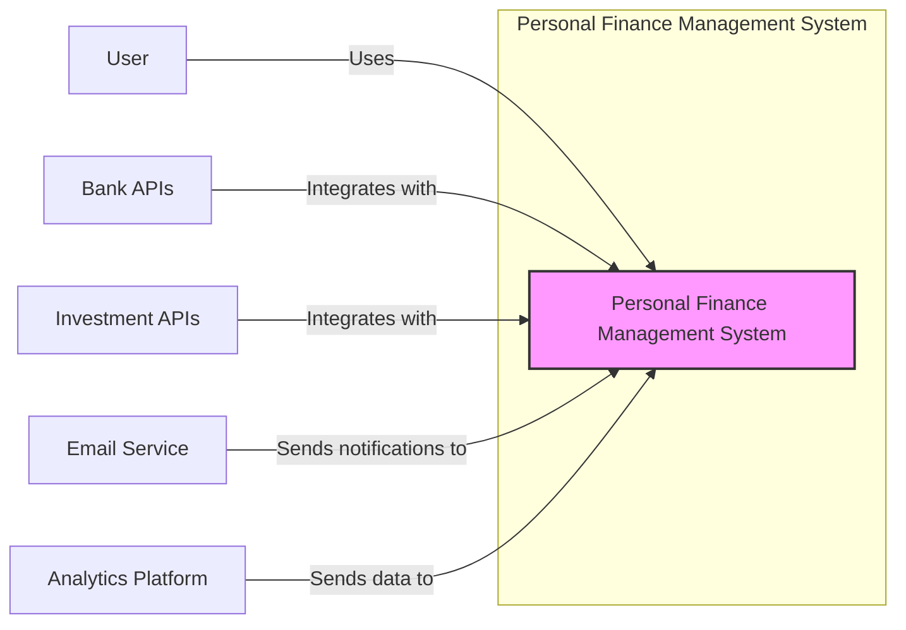
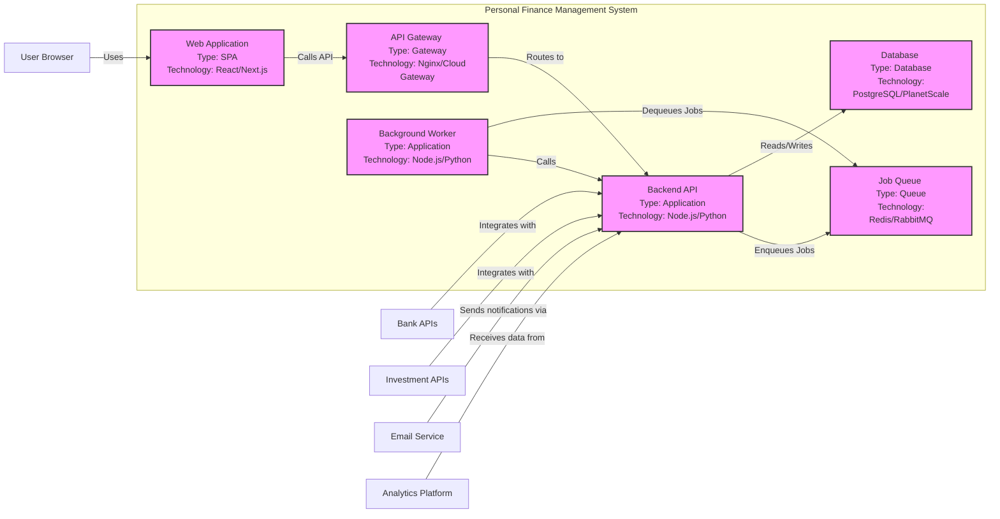
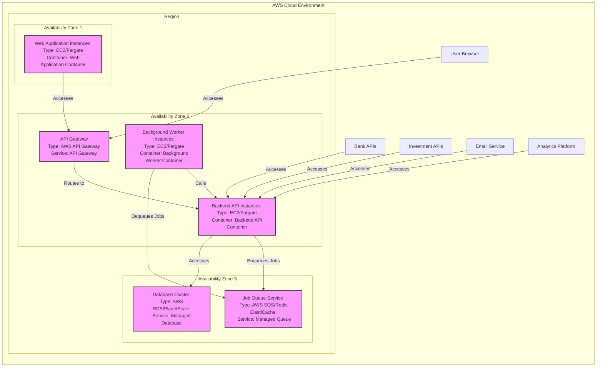

# BUSINESS POSTURE

- Business Priorities and Goals:
  - Primary goal: To provide users with a comprehensive platform for managing their personal finances.
  - Key priorities:
    - User data security and privacy.
    - Accuracy and reliability of financial data.
    - User experience and ease of use.
    - Scalability to accommodate a growing user base.
    - Compliance with relevant financial regulations and data protection laws.

- Business Risks:
  - Data breaches leading to exposure of sensitive financial and personal information, resulting in financial loss and reputational damage.
  - Financial fraud due to vulnerabilities in the application logic or security controls, leading to user losses and legal liabilities.
  - Regulatory non-compliance resulting in fines and legal repercussions.
  - Service unavailability impacting user trust and business continuity.
  - Loss of user trust and adoption due to security incidents or perceived lack of security.

# SECURITY POSTURE

- Existing Security Controls:
  - security control: Secure Software Development Lifecycle (SSDLC) - Assumed to be in place, but details are not provided in the input. Location: Not specified.
  - security control: Access Control - User authentication and authorization mechanisms are expected to be implemented to protect user data. Location: Application code.
  - security control: Input Validation - Input validation is expected to be implemented to prevent common web application vulnerabilities like SQL injection and cross-site scripting (XSS). Location: Application code, API endpoints.
  - security control: Encryption in Transit (HTTPS) - Expected to be enforced for all communication between users and the application. Location: Web server configuration, CDN.
  - security control: Regular Security Audits and Penetration Testing - Assumed to be conducted periodically to identify and remediate vulnerabilities. Location: Not specified, but part of security operations.
  - security control: Dependency Management - Utilizing dependency management tools to track and update software dependencies, mitigating risks from known vulnerabilities. Location: Build process, development environment.
  - security control: Code Reviews - Implementation of code review processes to identify potential security flaws before code deployment. Location: Development process.
  - accepted risk: Reliance on third-party services - The application likely integrates with third-party financial institutions and services, inheriting their security posture and potential vulnerabilities. Location: Third-party integrations.
  - accepted risk: Cloud Provider Security -  Assuming cloud deployment, the application relies on the security controls provided by the cloud provider. Location: Cloud infrastructure provider.

- Recommended Security Controls:
  - security control: Implement a Web Application Firewall (WAF) to protect against common web attacks. Location: In front of the application servers, CDN.
  - security control: Implement a robust Security Information and Event Management (SIEM) system for monitoring and alerting on security events. Location: Security operations infrastructure.
  - security control: Conduct regular vulnerability scanning and penetration testing, both automated and manual. Location: Security operations, DevSecOps pipeline.
  - security control: Implement static and dynamic application security testing (SAST/DAST) tools in the CI/CD pipeline. Location: CI/CD pipeline.
  - security control: Implement rate limiting and API security best practices to protect against abuse and denial-of-service attacks. Location: API Gateway, application code.
  - security control: Implement database encryption at rest to protect sensitive data stored in the database. Location: Database server configuration.

- Security Requirements:
  - Authentication:
    - Requirement: Secure user authentication mechanism to verify user identity.
    - Requirement: Multi-factor authentication (MFA) should be offered to enhance account security.
    - Requirement: Password policy enforcement (complexity, rotation, etc.).
    - Requirement: Protection against brute-force attacks on authentication endpoints.
  - Authorization:
    - Requirement: Role-based access control (RBAC) to manage user permissions and access to resources.
    - Requirement: Principle of least privilege should be applied to all user and system accounts.
    - Requirement: Secure API authorization to ensure only authorized users and applications can access API endpoints.
  - Input Validation:
    - Requirement: Comprehensive input validation on all user inputs to prevent injection attacks (SQL injection, XSS, etc.).
    - Requirement: Input sanitization and encoding to neutralize malicious input.
    - Requirement: Validation should be performed both on the client-side and server-side.
  - Cryptography:
    - Requirement: Encryption of sensitive data at rest and in transit.
    - Requirement: Use of strong and up-to-date cryptographic algorithms and protocols.
    - Requirement: Secure key management practices for encryption keys.
    - Requirement: Hashing of passwords using strong one-way hashing algorithms with salt.

# DESIGN

## C4 CONTEXT



- Context Diagram Elements:
  - - Name: Personal Finance Management System
    - Type: Software System
    - Description: The core application that provides personal finance management features to users.
    - Responsibilities:
      - User account management.
      - Financial data aggregation and processing.
      - Budgeting and spending tracking.
      - Financial planning and reporting.
      - Secure storage and retrieval of user data.
    - Security controls:
      - Authentication and authorization.
      - Input validation.
      - Data encryption at rest and in transit.
      - Security logging and monitoring.
  - - Name: User
    - Type: Person
    - Description: Individual users who utilize the personal finance management system to manage their finances.
    - Responsibilities:
      - Provide accurate financial information.
      - Protect their account credentials.
      - Use the system responsibly and ethically.
    - Security controls:
      - Strong passwords.
      - Multi-factor authentication (optional, but recommended).
      - Awareness of phishing and social engineering attacks.
  - - Name: Bank APIs
    - Type: External System
    - Description: APIs provided by various banks to access user's financial account information (transactions, balances, etc.).
    - Responsibilities:
      - Provide secure and reliable access to financial data.
      - Adhere to financial industry security standards.
      - Maintain data privacy and confidentiality.
    - Security controls:
      - API authentication and authorization (OAuth, API Keys).
      - Data encryption in transit (HTTPS).
      - Rate limiting and API security best practices.
  - - Name: Investment APIs
    - Type: External System
    - Description: APIs provided by investment platforms to access user's investment account information (portfolio holdings, transactions, etc.).
    - Responsibilities:
      - Provide secure and reliable access to investment data.
      - Adhere to financial industry security standards.
      - Maintain data privacy and confidentiality.
    - Security controls:
      - API authentication and authorization (OAuth, API Keys).
      - Data encryption in transit (HTTPS).
      - Rate limiting and API security best practices.
  - - Name: Email Service
    - Type: External System
    - Description: Third-party email service used to send notifications to users (e.g., account alerts, reports, marketing emails).
    - Responsibilities:
      - Reliable email delivery.
      - Secure handling of email addresses.
      - Compliance with email marketing regulations (e.g., GDPR, CAN-SPAM).
    - Security controls:
      - SPF, DKIM, and DMARC email authentication.
      - Data encryption in transit (TLS).
      - Compliance with data privacy regulations.
  - - Name: Analytics Platform
    - Type: External System
    - Description: Third-party analytics platform used to collect and analyze application usage data for performance monitoring and business intelligence.
    - Responsibilities:
      - Secure collection and storage of analytics data.
      - Data anonymization and aggregation to protect user privacy.
      - Compliance with data privacy regulations.
    - Security controls:
      - Data encryption in transit (HTTPS).
      - Data anonymization and pseudonymization.
      - Access control to analytics data.

## C4 CONTAINER



- Container Diagram Elements:
  - - Name: Web Application
    - Type: Single Page Application (SPA)
    - Description: Frontend application built using React/Next.js, served to user browsers. Provides user interface for interacting with the personal finance management system.
    - Responsibilities:
      - User interface rendering and interaction.
      - Client-side input validation and data formatting.
      - Communication with the Backend API via API Gateway.
      - User session management (client-side).
    - Security controls:
      - Client-side input validation.
      - Protection against XSS vulnerabilities.
      - Secure handling of user sessions (cookies, tokens).
      - HTTPS communication.
  - - Name: API Gateway
    - Type: Gateway
    - Description: Entry point for all API requests from the Web Application. Routes requests to the Backend API and handles cross-cutting concerns like authentication, authorization, rate limiting, and logging. Could be implemented using Nginx or a cloud-managed API Gateway service.
    - Responsibilities:
      - Request routing and load balancing.
      - API authentication and authorization.
      - Rate limiting and traffic management.
      - API request and response logging.
      - SSL termination.
    - Security controls:
      - API authentication and authorization mechanisms (e.g., JWT validation).
      - Rate limiting and DDoS protection.
      - WAF (Web Application Firewall) integration.
      - Security logging and monitoring.
  - - Name: Backend API
    - Type: Application
    - Description: Backend application built using Node.js or Python, responsible for business logic, data processing, and integration with external systems. Exposes RESTful APIs consumed by the Web Application and Background Worker.
    - Responsibilities:
      - User authentication and authorization.
      - Business logic implementation for financial management features.
      - Data validation and processing.
      - Database interactions.
      - Integration with Bank APIs and Investment APIs.
      - Enqueueing background jobs.
      - Sending notifications via Email Service.
      - Sending data to Analytics Platform.
    - Security controls:
      - Server-side input validation.
      - Authorization checks for all API endpoints.
      - Secure database access and data handling.
      - Secure integration with external APIs (authentication, authorization, data encryption).
      - Security logging and monitoring.
  - - Name: Database
    - Type: Database
    - Description: Persistent storage for application data, likely a relational database like PostgreSQL or a cloud-managed database service like PlanetScale. Stores user data, financial transactions, budgets, and other application data.
    - Responsibilities:
      - Data persistence and retrieval.
      - Data integrity and consistency.
      - Data backup and recovery.
      - Performance and scalability.
    - Security controls:
      - Database access control and authentication.
      - Data encryption at rest and in transit.
      - Regular database backups.
      - Database security hardening.
      - Monitoring and auditing of database access.
  - - Name: Job Queue
    - Type: Queue
    - Description: Message queue system like Redis or RabbitMQ used for asynchronous task processing. Decouples long-running or resource-intensive tasks from the main API request-response cycle.
    - Responsibilities:
      - Reliable message queuing and delivery.
      - Task scheduling and prioritization.
      - Scalability and fault tolerance.
    - Security controls:
      - Access control to the queue system.
      - Message encryption (if sensitive data is queued).
      - Monitoring of queue health and performance.
  - - Name: Background Worker
    - Type: Application
    - Description: Application that processes tasks from the Job Queue. Performs background tasks such as data aggregation, report generation, and integration with external APIs.
    - Responsibilities:
      - Processing tasks from the Job Queue.
      - Performing data aggregation and processing.
      - Generating reports.
      - Interacting with the Backend API and external systems.
    - Security controls:
      - Secure retrieval of tasks from the Job Queue.
      - Secure processing of tasks and data.
      - Logging and monitoring of background task execution.
      - Proper error handling and retries.

## DEPLOYMENT

- Deployment Options:
  - Option 1: Cloud-based deployment using a major cloud provider (AWS, GCP, Azure) leveraging managed services.
  - Option 2: Hybrid deployment, potentially using a mix of cloud and on-premises infrastructure (less likely for a startup).
  - Option 3: Fully on-premises deployment (least likely for a modern SaaS application).

- Selected Deployment Architecture: Cloud-based deployment (Option 1) using AWS.



- Deployment Diagram Elements:
  - - Name: Web Application Instances
    - Type: Compute Instance (EC2/Fargate)
    - Description: Instances running the Web Application container, deployed across multiple Availability Zones for high availability. Could be EC2 instances or containerized using Fargate.
    - Responsibilities:
      - Serving the Web Application to users.
      - Handling user traffic and requests.
      - Auto-scaling to handle varying load.
    - Security controls:
      - Security groups to restrict inbound and outbound traffic.
      - Regular patching and updates of underlying OS and runtime.
      - Hardened OS configuration.
  - - Name: API Gateway
    - Type: AWS API Gateway (Managed Service)
    - Description: AWS managed API Gateway service, providing routing, authentication, authorization, and other API management features.
    - Responsibilities:
      - API request routing and management.
      - Authentication and authorization enforcement.
      - Rate limiting and DDoS protection.
      - SSL termination.
    - Security controls:
      - AWS IAM roles and policies for access control.
      - WAF integration.
      - AWS Shield for DDoS protection.
      - Security logging and monitoring provided by AWS.
  - - Name: Backend API Instances
    - Type: Compute Instance (EC2/Fargate)
    - Description: Instances running the Backend API container, deployed across multiple Availability Zones for high availability. Could be EC2 instances or containerized using Fargate.
    - Responsibilities:
      - Running the Backend API application.
      - Processing API requests from the API Gateway.
      - Interacting with the Database and Job Queue.
      - Integrating with external APIs.
    - Security controls:
      - Security groups to restrict inbound and outbound traffic.
      - Regular patching and updates of underlying OS and runtime.
      - Hardened OS configuration.
  - - Name: Background Worker Instances
    - Type: Compute Instance (EC2/Fargate)
    - Description: Instances running the Background Worker container, deployed across multiple Availability Zones for high availability. Could be EC2 instances or containerized using Fargate.
    - Responsibilities:
      - Running the Background Worker application.
      - Processing jobs from the Job Queue.
      - Performing background tasks.
    - Security controls:
      - Security groups to restrict inbound and outbound traffic.
      - Regular patching and updates of underlying OS and runtime.
      - Hardened OS configuration.
  - - Name: Database Cluster
    - Type: AWS RDS/PlanetScale (Managed Service)
    - Description: Managed database service, either AWS RDS or PlanetScale, providing a highly available and scalable database cluster.
    - Responsibilities:
      - Persistent data storage.
      - Database management and maintenance.
      - High availability and fault tolerance.
      - Automated backups and recovery.
    - Security controls:
      - Database access control and authentication provided by the managed service.
      - Data encryption at rest and in transit provided by the managed service.
      - Regular security patching and updates managed by the service provider.
  - - Name: Job Queue Service
    - Type: AWS SQS/Redis ElastiCache (Managed Service)
    - Description: Managed message queue service, either AWS SQS or Redis ElastiCache, providing a reliable and scalable job queue.
    - Responsibilities:
      - Message queuing and delivery.
      - Queue management and scaling.
      - High availability and fault tolerance.
    - Security controls:
      - Access control to the queue service provided by the managed service.
      - Encryption of messages in transit (depending on service).
      - Security monitoring provided by the managed service.

## BUILD

```mermaid
flowchart LR
    A["Developer"] -- Code Changes --> B["Version Control System (GitHub)"]
    B -- Triggers --> C["CI/CD Pipeline (GitHub Actions)"]
    subgraph "CI/CD Pipeline"
        D["Source Code Checkout"]
        E["Build Stage" <br> - Compile Code <br> - Run Unit Tests]
        F["Security Scans" <br> - SAST <br> - Dependency Check <br> - Linting]
        G["Containerization" <br> - Build Docker Images]
        H["Artifact Repository" <br> - Store Docker Images <br> - Store Build Artifacts"]
        I["Deployment Stage" <br> - Deploy to AWS Environment]
        D --> E --> F --> G --> H --> I
    end
    C -- Manages --> D
    H -- Provides Artifacts to --> I
    style C fill:#f9f,stroke:#333,stroke-width:2px
    style H fill:#f9f,stroke:#333,stroke-width:2px
```

- Build Process Elements:
  - - Name: Developer
    - Type: Person
    - Description: Software developers who write and modify the application code.
    - Responsibilities:
      - Writing secure and high-quality code.
      - Performing local testing and code reviews.
      - Committing code changes to the Version Control System.
    - Security controls:
      - Secure development practices training.
      - Code review process.
      - Local development environment security.
      - Access control to development resources.
  - - Name: Version Control System (GitHub)
    - Type: Code Repository
    - Description: GitHub repository used for storing and managing the application source code.
    - Responsibilities:
      - Source code version control and history tracking.
      - Collaboration and code sharing among developers.
      - Triggering CI/CD pipeline on code changes.
    - Security controls:
      - Access control to the repository (authentication and authorization).
      - Branch protection policies.
      - Audit logging of repository activities.
      - Vulnerability scanning of repository dependencies (GitHub Dependabot).
  - - Name: CI/CD Pipeline (GitHub Actions)
    - Type: Automation System
    - Description: GitHub Actions used to automate the build, test, security scan, and deployment processes.
    - Responsibilities:
      - Automated build and testing of code changes.
      - Running security scans (SAST, dependency checks, linting).
      - Containerization of applications (building Docker images).
      - Publishing build artifacts to the Artifact Repository.
      - Automated deployment to the AWS environment.
    - Security controls:
      - Secure configuration of CI/CD pipeline workflows.
      - Secrets management for sensitive credentials (API keys, passwords).
      - Isolation of build environments.
      - Security scanning tools integration (SAST, dependency check).
      - Audit logging of pipeline execution.
  - - Name: Artifact Repository
    - Type: Storage System
    - Description: Repository for storing build artifacts, such as Docker images and application binaries. Could be GitHub Container Registry, AWS ECR, or other artifact repositories.
    - Responsibilities:
      - Secure storage of build artifacts.
      - Versioning and management of artifacts.
      - Access control to artifacts.
      - Distribution of artifacts to deployment environments.
    - Security controls:
      - Access control to the artifact repository (authentication and authorization).
      - Vulnerability scanning of stored artifacts (e.g., Docker image scanning).
      - Data encryption at rest for stored artifacts.

# RISK ASSESSMENT

- Critical Business Processes:
  - User registration and account management.
  - Financial data aggregation from bank and investment APIs.
  - Processing and storage of financial transactions and user data.
  - Budgeting and financial planning calculations.
  - Report generation and data visualization.
  - User authentication and authorization to access their financial data.

- Data Sensitivity:
  - Highly Sensitive Data:
    - User Personally Identifiable Information (PII): Name, email address, contact information, etc.
    - Financial Account Credentials (encrypted): Bank login details, investment account credentials.
    - Financial Transaction Data: Transaction history, account balances, investment holdings, income, expenses.
    - Budgeting and Financial Planning Data: User's financial goals, budget settings, financial plans.
  - Sensitive Data:
    - Application Usage Data: User activity logs, feature usage, performance data.
  - Public Data:
    - Publicly available financial information (if any).

# QUESTIONS & ASSUMPTIONS

- BUSINESS POSTURE:
  - Question: What is the risk appetite of the company? Is it a startup with a higher risk tolerance or an established company with a more conservative approach?
  - Question: What are the specific regulatory compliance requirements for the target market (e.g., GDPR, CCPA, PCI DSS, regional financial regulations)?
  - Assumption: The primary business goal is user growth and market adoption, balanced with a strong emphasis on data security and user trust.

- SECURITY POSTURE:
  - Question: What existing security policies and procedures are in place within the organization?
  - Question: What is the current level of security awareness and training among development and operations teams?
  - Assumption: A basic level of security awareness and standard web application security practices are assumed to be in place, but require further enhancement.

- DESIGN:
  - Question: What specific technologies are chosen for the Backend API (Node.js, Python, framework)? Database (PostgreSQL, PlanetScale, other)? Job Queue (Redis, RabbitMQ, cloud service)?
  - Question: What is the expected scale and performance requirements for the application?
  - Assumption: A cloud-native, microservices-oriented architecture is assumed, leveraging managed cloud services for scalability and resilience.
  - Assumption: The application is designed to handle sensitive financial data and requires robust security controls at all layers.