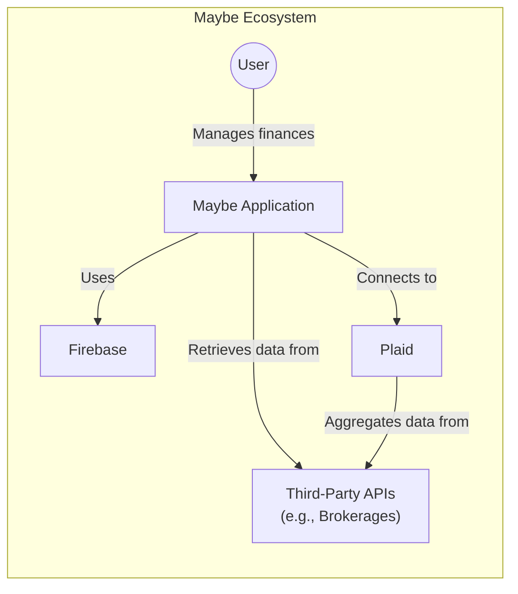
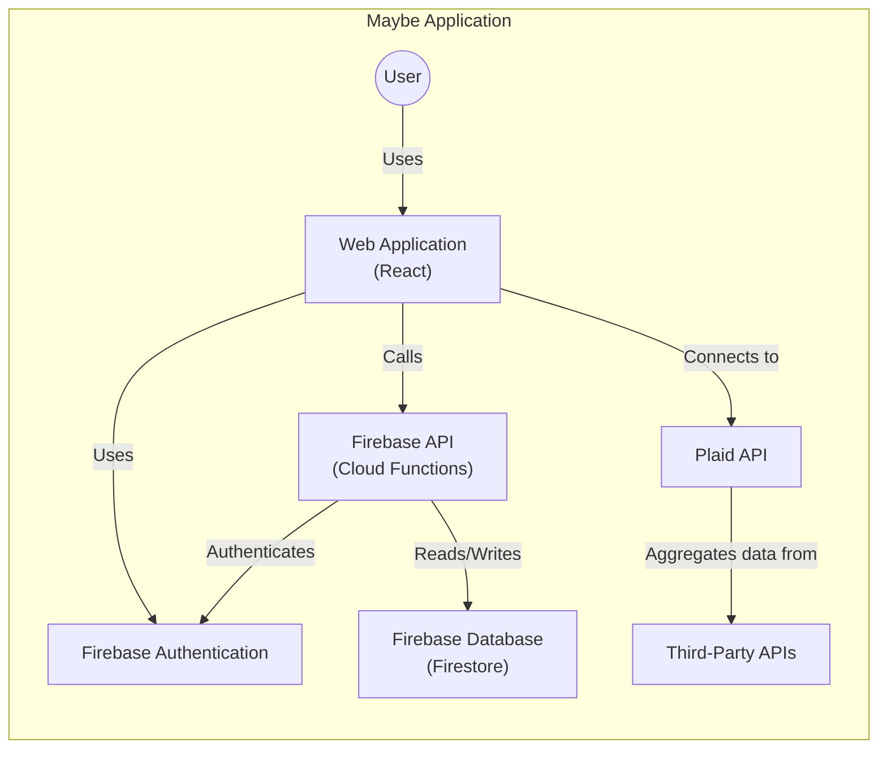
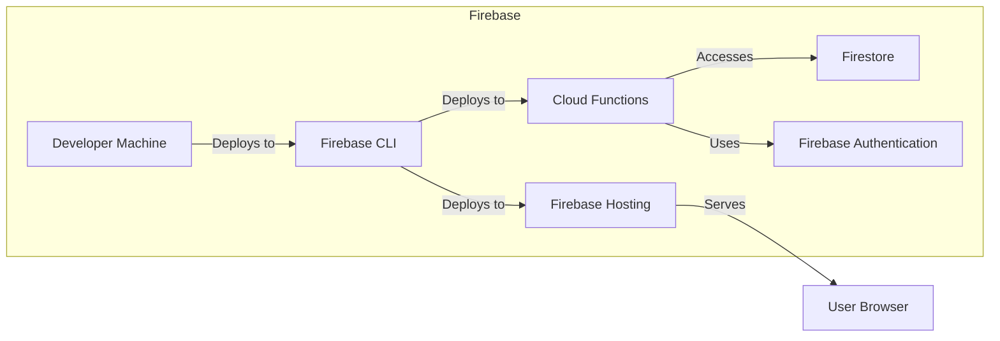
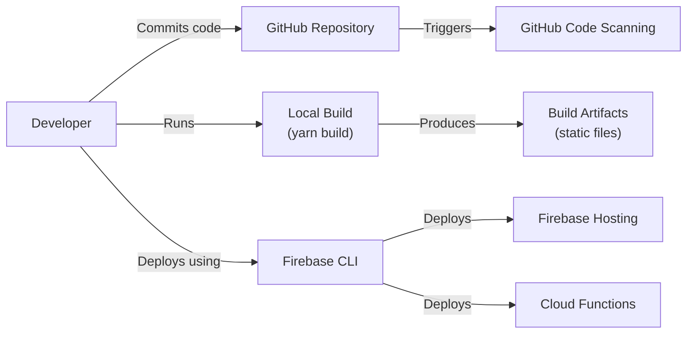

Okay, let's dive into designing a comprehensive document for the Maybe Finance project, suitable for threat modeling.

# BUSINESS POSTURE

Maybe Finance appears to be a relatively new platform (based on the repository's age and activity) focused on personal finance management, investment tracking, and potentially automated investing.  The core value proposition seems to be simplifying and streamlining personal finance for users, likely targeting individuals who are comfortable with technology but may not be deeply experienced investors.

Business Priorities:

*   User Acquisition and Growth: Attracting a substantial user base is crucial for a new platform.
*   Data Accuracy and Reliability:  Providing accurate financial information and reliable investment tracking is paramount to build trust.
*   User Trust and Security:  Handling sensitive financial data requires a strong emphasis on security and privacy to gain and maintain user trust.
*   Compliance:  Adhering to relevant financial regulations (which will vary by jurisdiction) is non-negotiable.
*   Scalability: The platform should be able to handle a growing number of users and transactions.
*   Feature Velocity:  Being able to quickly iterate and add new features is important in the competitive fintech space.

Business Risks:

*   Data Breach:  Unauthorized access to user financial data would be catastrophic, leading to reputational damage, legal issues, and loss of user trust.
*   Data Loss/Corruption:  Loss or corruption of user data due to system failures or errors would severely impact users and damage the platform's credibility.
*   Regulatory Non-Compliance:  Failure to comply with relevant financial regulations (e.g., KYC/AML, data privacy laws) could result in fines, legal action, and operational restrictions.
*   System Outages/Downtime:  Unavailability of the platform would disrupt users' access to their financial information and potentially impact their investment decisions.
*   Inaccurate Financial Calculations/Advice:  Errors in calculations or investment recommendations could lead to financial losses for users, damaging trust and potentially leading to legal liability.
*   Fraudulent Activity:  The platform could be targeted by fraudsters attempting to create fake accounts, manipulate transactions, or exploit vulnerabilities.
*   Integration Failures:  Problems with integrating with third-party financial institutions (banks, brokerages) could disrupt data synchronization and functionality.
*   Supply Chain Attacks: Compromise of third-party libraries or services used by the application.

# SECURITY POSTURE

Based on the provided GitHub repository, the following security controls and accepted risks are identified.  This is a preliminary assessment, and a deeper code review would be necessary for a complete picture.

Existing Security Controls:

*   security control: Dependency Management: The project uses `yarn` for dependency management, suggesting some awareness of managing third-party libraries. (package.json, yarn.lock)
*   security control: Code Scanning: GitHub Code Scanning is enabled.
*   security control: Frontend Framework: The use of React (a popular and well-maintained framework) is a positive, as it generally has a strong security community and best practices. (package.json)
*   security control: API Communication: The project appears to use HTTPS for API communication, which is essential for protecting data in transit. (implied, needs verification in code)
*   security control: Environment Variables: The use of `.env` files suggests an awareness of separating configuration from code, which is good practice. (presence of .env.example)
*   security control: Authentication: The project uses Firebase Authentication.

Accepted Risks:

*   accepted risk: Limited Visibility into Backend Security: The repository primarily focuses on the frontend.  The security posture of the backend (Firebase, in this case) is largely dependent on the Firebase configuration and server-side rules, which are not fully visible in the repository.
*   accepted risk: Third-Party API Dependence: The platform relies on third-party APIs (Plaid, potentially others) for financial data.  The security of these integrations is crucial, but the project has limited control over the security practices of these external providers.
*   accepted risk: Potential for Frontend Vulnerabilities: While React itself is generally secure, the specific implementation could introduce vulnerabilities like Cross-Site Scripting (XSS) or Cross-Site Request Forgery (CSRF) if not carefully coded.
*   accepted risk: Limited Information on Data Encryption at Rest:  While Firebase offers encryption at rest, the specific configuration and key management practices are not visible in the repository.
*   accepted risk: Lack of Explicit Authorization Logic: The repository doesn't provide much detail on how authorization (access control) is implemented, particularly for different user roles or data access permissions.

Recommended Security Controls (High Priority):

*   security control: Implement Comprehensive Security Rules: Thoroughly define and test Firebase security rules to ensure proper data access control and prevent unauthorized access.
*   security control: Enable Multi-Factor Authentication (MFA): Offer or require MFA for user accounts to add an extra layer of security.
*   security control: Implement Robust Input Validation:  Strictly validate all user inputs on both the frontend and backend (Firebase functions) to prevent injection attacks and ensure data integrity.
*   security control: Conduct Regular Security Audits and Penetration Testing:  Perform periodic security assessments to identify and address potential vulnerabilities.
*   security control: Implement a Content Security Policy (CSP):  Use CSP headers to mitigate the risk of XSS attacks.
*   security control: Monitor API Usage and Implement Rate Limiting:  Track API usage to detect anomalies and prevent abuse. Implement rate limiting to protect against denial-of-service attacks.
*   security control: Implement a Web Application Firewall (WAF): Consider using a WAF to protect against common web attacks.
*   security control: Establish a Secure Software Development Lifecycle (SSDLC):  Formalize security practices throughout the development process, including secure coding guidelines, code reviews, and security testing.
*   security control: Implement logging and monitoring: Implement comprehensive logging and monitoring to detect and respond to security incidents.

Security Requirements:

*   Authentication:
    *   Users must be securely authenticated before accessing any sensitive data or functionality.
    *   Support for strong passwords and password complexity requirements.
    *   Protection against brute-force attacks (e.g., account lockout).
    *   Secure session management (e.g., using secure, HTTP-only cookies).
    *   Support for MFA.

*   Authorization:
    *   Implement role-based access control (RBAC) to restrict access to data and functionality based on user roles.
    *   Ensure that users can only access their own financial data.
    *   Implement granular permissions for different actions (e.g., viewing, editing, deleting).

*   Input Validation:
    *   Validate all user inputs on both the frontend and backend (Firebase functions).
    *   Use a whitelist approach to allow only known-good input.
    *   Sanitize inputs to prevent injection attacks (e.g., XSS, SQL injection).

*   Cryptography:
    *   Use strong, industry-standard encryption algorithms (e.g., AES-256) for data at rest and in transit.
    *   Securely manage encryption keys.
    *   Use HTTPS for all communication.
    *   Properly handle and store sensitive data like API keys and secrets.

# DESIGN

## C4 CONTEXT

C4 Context Element Descriptions:

*   Element:
    *   Name: User
    *   Type: Person
    *   Description: An individual using the Maybe platform to manage their personal finances.
    *   Responsibilities:
        *   Creating an account.
        *   Linking financial accounts.
        *   Viewing financial data.
        *   Setting financial goals.
        *   Tracking investments.
        *   Potentially using automated investment features.
    *   Security controls:
        *   Authentication (Firebase Authentication).
        *   Multi-Factor Authentication (recommended).
        *   Strong password requirements.

*   Element:
    *   Name: Maybe Application
    *   Type: Software System
    *   Description: The core application providing the personal finance management functionality.
    *   Responsibilities:
        *   Providing the user interface.
        *   Handling user authentication and authorization.
        *   Communicating with Firebase and third-party APIs.
        *   Processing and displaying financial data.
        *   Implementing investment tracking and potentially automated investment features.
    *   Security controls:
        *   Input validation.
        *   Content Security Policy (recommended).
        *   Secure coding practices.
        *   Regular security audits (recommended).

*   Element:
    *   Name: Firebase
    *   Type: Software System
    *   Description: Google's Firebase platform, used for backend services (database, authentication, cloud functions).
    *   Responsibilities:
        *   Storing user data.
        *   Handling user authentication.
        *   Executing server-side logic (cloud functions).
    *   Security controls:
        *   Firebase Authentication.
        *   Firebase Security Rules (critical).
        *   Data encryption at rest (Firebase default).
        *   Data encryption in transit (Firebase default).

*   Element:
    *   Name: Plaid
    *   Type: Software System
    *   Description: A third-party API for connecting to financial institutions.
    *   Responsibilities:
        *   Providing a secure connection to user bank accounts and brokerages.
        *   Aggregating financial data.
    *   Security controls:
        *   Plaid's internal security controls (not directly controllable by Maybe).
        *   Secure API communication (HTTPS).

*   Element:
    *   Name: Third-Party APIs (e.g., Brokerages)
    *   Type: Software System
    *   Description: External APIs of financial institutions (banks, brokerages) that provide user data.
    *   Responsibilities:
        *   Providing access to user account data.
    *   Security controls:
        *   Security controls of the respective financial institutions (not directly controllable by Maybe).
        *   Secure API communication (HTTPS).

## C4 CONTAINER

C4 Container Element Descriptions:

*   Element:
    *   Name: User
    *   Type: Person
    *   Description: An individual using the Maybe platform.
    *   Responsibilities: (Same as in Context Diagram)
    *   Security controls: (Same as in Context Diagram)

*   Element:
    *   Name: Web Application (React)
    *   Type: Web Application
    *   Description: The frontend of the Maybe application, built with React.
    *   Responsibilities:
        *   Rendering the user interface.
        *   Handling user interactions.
        *   Making API calls to Firebase and Plaid.
    *   Security controls:
        *   Input validation (frontend).
        *   Content Security Policy (recommended).
        *   Secure coding practices (e.g., preventing XSS).

*   Element:
    *   Name: Firebase API (Cloud Functions)
    *   Type: API
    *   Description: Serverless functions hosted on Firebase that handle backend logic.
    *   Responsibilities:
        *   Processing data.
        *   Performing calculations.
        *   Interacting with the Firebase database.
        *   Potentially interacting with other third-party APIs.
    *   Security controls:
        *   Input validation (backend).
        *   Firebase Security Rules (enforcement).
        *   Secure coding practices.

*   Element:
    *   Name: Firebase Database (Firestore)
    *   Type: Database
    *   Description:  NoSQL database used to store user data.
    *   Responsibilities:
        *   Storing user data, financial data, and application data.
    *   Security controls:
        *   Firebase Security Rules (data access control).
        *   Data encryption at rest (Firebase default).

*   Element:
    *   Name: Firebase Authentication
    *   Type: API
    *   Description: Firebase's authentication service.
    *   Responsibilities:
        *   Handling user registration and login.
        *   Managing user sessions.
    *   Security controls:
        *   Firebase Authentication's built-in security features.
        *   Multi-Factor Authentication (recommended).

*   Element:
    *   Name: Plaid API
    *   Type: API
    *   Description:  API for connecting to financial institutions.
    *   Responsibilities: (Same as in Context Diagram)
    *   Security controls: (Same as in Context Diagram)

*   Element:
    *   Name: Third-Party APIs
    *   Type: API
    *   Description: External APIs of financial institutions.
    *   Responsibilities: (Same as in Context Diagram)
    *   Security controls: (Same as in Context Diagram)

## DEPLOYMENT

Possible Deployment Solutions:

1.  Firebase Hosting: Deploy the React web application to Firebase Hosting. This is the most likely and straightforward option given the use of Firebase.
2.  Netlify/Vercel: Deploy the React web application to a static hosting provider like Netlify or Vercel. This is also a common choice for React applications.
3.  Cloud Provider (AWS, GCP, Azure): Deploy the React web application to a cloud provider's static website hosting service (e.g., AWS S3 + CloudFront, Google Cloud Storage + Cloud CDN, Azure Blob Storage + CDN). This offers more control and scalability but is more complex.

Chosen Solution (for detailed description): Firebase Hosting

Deployment Element Descriptions:

*   Element:
    *   Name: Developer Machine
    *   Type: Infrastructure
    *   Description: The developer's local machine used for development and deployment.
    *   Responsibilities:
        *   Running the development environment.
        *   Building the application.
        *   Deploying the application using the Firebase CLI.
    *   Security controls:
        *   Secure development environment (e.g., up-to-date operating system, antivirus).
        *   Secure storage of credentials (e.g., not committing API keys to the repository).

*   Element:
    *   Name: Firebase CLI
    *   Type: Tool
    *   Description: The command-line interface for interacting with Firebase.
    *   Responsibilities:
        *   Deploying the web application to Firebase Hosting.
        *   Deploying Cloud Functions.
        *   Managing Firebase resources.
    *   Security controls:
        *   Secure authentication to Firebase.

*   Element:
    *   Name: Firebase Hosting
    *   Type: Infrastructure
    *   Description: Firebase's hosting service for static web applications.
    *   Responsibilities:
        *   Serving the React web application to users.
    *   Security controls:
        *   HTTPS (automatic with Firebase Hosting).
        *   Content Delivery Network (CDN) for performance and security.

*   Element:
    *   Name: Cloud Functions
    *   Type: Infrastructure
    *   Description: Serverless functions hosted on Firebase.
    *   Responsibilities: (Same as in Container Diagram)
    *   Security controls: (Same as in Container Diagram)

*   Element:
    *   Name: Firestore
    *   Type: Infrastructure
    *   Description: NoSQL database hosted on Firebase.
    *   Responsibilities: (Same as in Container Diagram)
    *   Security controls: (Same as in Container Diagram)

*   Element:
    *   Name: Firebase Authentication
    *   Type: Infrastructure
    *   Description: Authentication service hosted on Firebase.
    *   Responsibilities: (Same as in Container Diagram)
    *   Security controls: (Same as in Container Diagram)
* Element:
    *   Name: User Browser
    *   Type: Infrastructure
    *   Description: Web browser used by user.
    *   Responsibilities: Accessing Maybe web application.
    *   Security controls: Browser security settings.

## BUILD

Build Process Description:

1.  Development: Developers write code and commit it to the GitHub repository.
2.  Local Build: Developers run `yarn build` locally to create a production build of the React application. This typically involves:
    *   Transpiling code (e.g., using Babel).
    *   Bundling modules (e.g., using Webpack).
    *   Minifying code (reducing file size).
    *   Optimizing assets.
3.  Code Scanning: GitHub Code Scanning automatically analyzes the code for potential security vulnerabilities.
4.  Deployment: The developer uses the Firebase CLI (`firebase deploy`) to deploy the build artifacts to Firebase Hosting and Cloud Functions.

Security Controls in Build Process:

*   security control: Dependency Management: `yarn` helps manage dependencies and identify known vulnerabilities in third-party libraries.
*   security control: Code Scanning: GitHub Code Scanning provides automated security analysis.
*   security control: Secure Deployment: The Firebase CLI uses secure authentication to deploy the application.
*   security control: (Recommended) SAST: Integrate Static Application Security Testing (SAST) tools into the build process (e.g., SonarQube, ESLint with security plugins).
*   security control: (Recommended) SCA: Integrate Software Composition Analysis (SCA) tools to identify vulnerabilities in open-source dependencies (e.g., Snyk, Dependabot).
*   security control: (Recommended) CI/CD: Implement a Continuous Integration/Continuous Deployment (CI/CD) pipeline (e.g., using GitHub Actions) to automate the build, test, and deployment process, including security checks.

# RISK ASSESSMENT

Critical Business Processes to Protect:

*   User Account Management:  Ensuring the security and integrity of user accounts, including registration, login, and password management.
*   Financial Data Synchronization:  Securely connecting to and retrieving data from financial institutions.
*   Data Storage and Processing:  Protecting the confidentiality, integrity, and availability of user data stored in Firebase.
*   Investment Tracking and (Potential) Automated Investing:  Ensuring the accuracy and reliability of investment-related features.

Data to Protect and Sensitivity:

*   Personally Identifiable Information (PII):  Name, email address, potentially address, phone number (Sensitivity: High)
*   Financial Account Information:  Bank account numbers, brokerage account numbers, transaction history, investment holdings (Sensitivity: Extremely High)
*   Authentication Credentials:  Passwords, session tokens (Sensitivity: Extremely High)
*   API Keys and Secrets:  Credentials used to access third-party APIs (Sensitivity: Extremely High)
*   User Preferences and Settings:  Financial goals, risk tolerance, etc. (Sensitivity: Medium)

# QUESTIONS & ASSUMPTIONS

Questions:

*   What specific third-party APIs (besides Plaid) are being used?
*   What is the exact data model for storing user data in Firestore?
*   What are the specific Firebase security rules in place? (These are crucial for understanding data access control.)
*   What are the plans for handling user data deletion and data retention?
*   What are the compliance requirements (e.g., GDPR, CCPA, specific financial regulations)?
*   Are there any plans for implementing automated investing features? If so, what are the details?
*   What is the logging and monitoring strategy?
*   Is there a formal incident response plan?
*   What kind of load testing has been performed?
*   What are the plans for scaling the application?
*   Are there any plans to support multiple languages or regions?
*   What is the process for handling user support requests and bug reports?
*   What is the budget for security tools and services?

Assumptions:

*   BUSINESS POSTURE: The primary goal is to build a user-friendly personal finance platform that prioritizes user trust and data security. The company has a moderate risk appetite, balancing innovation with the need for robust security.
*   SECURITY POSTURE: Firebase Authentication is used for user authentication. HTTPS is used for all API communication. Basic dependency management is in place. The Firebase security rules are adequately configured (this needs verification).
*   DESIGN: The application uses a standard React frontend with a Firebase backend. Plaid is the primary API for connecting to financial institutions. The deployment is done via Firebase Hosting. The build process is relatively simple, using `yarn build`.