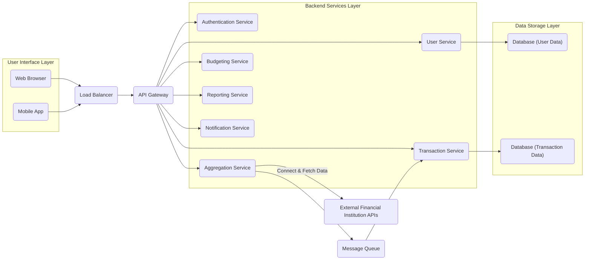

## Project Design Document: Maybe Finance

**Version:** 1.1
**Date:** October 26, 2023
**Author:** AI Software Architect

### 1. Project Overview

Maybe Finance is an open-source personal finance management application designed to empower users to effectively track their spending, manage budgets proactively, and gain actionable insights into their overall financial health. The project prioritizes user privacy and control by offering a transparent and customizable alternative to proprietary solutions. This document details the architectural design of the Maybe Finance application, focusing on its key components, their interactions, and the flow of data. This document serves as the foundational artifact for subsequent threat modeling exercises.

### 2. Goals and Objectives

*   To establish a secure and dependable platform for users to manage their personal financial data.
*   To seamlessly integrate with a wide range of financial institutions, enabling automated transaction data import.
*   To provide intuitive and powerful tools for budgeting, detailed spending analysis, and setting personalized financial goals.
*   To uphold the highest standards of user data privacy and security throughout the application lifecycle.
*   To develop a modular and extensible architecture that facilitates the incorporation of future features and integrations with ease.

### 3. Target Audience

*   Individuals seeking a robust and transparent open-source solution for managing their personal finances.
*   Users who prioritize the privacy and control of their sensitive financial information.
*   Software developers and enthusiasts interested in contributing to an impactful open-source finance project.

### 4. High-Level Architecture

The Maybe Finance application is structured using a layered, microservices-inspired architecture. This approach promotes modularity, independent scalability, and maintainability.

*   **User Interface Layer:**  Presents the user-facing components for interacting with the application. This includes a web browser interface for desktop users and potentially native mobile applications for iOS and Android.
*   **Load Balancer:**  Distributes incoming user traffic across multiple instances of the API Gateway, enhancing application availability, fault tolerance, and performance under load.
*   **API Gateway:**  Serves as the central entry point for all client requests, managing routing to specific backend services, enforcing authentication and authorization policies, and potentially implementing rate limiting and request transformation.
*   **Backend Services Layer:**  Comprises independent, self-contained services responsible for specific business functionalities.
    *   **Authentication Service:** Handles user authentication, authorization, session management, and potentially multi-factor authentication.
    *   **User Service:** Manages user accounts, profiles, preferences, and security settings.
    *   **Transaction Service:**  Responsible for storing, retrieving, processing, categorizing, and managing user transaction data.
    *   **Aggregation Service:** Connects to and interacts with external financial institution APIs to securely fetch user transaction data. This includes handling different API protocols and authentication methods.
    *   **Budgeting Service:** Provides functionalities for creating, managing, and tracking budgets, including setting limits, monitoring progress, and generating alerts.
    *   **Reporting Service:** Generates various financial reports, visualizations, and insights based on user data, enabling users to understand their financial patterns.
    *   **Notification Service:** Manages the delivery of notifications to users via various channels (e.g., email, push notifications) for events like budget alerts or transaction confirmations.
*   **Data Storage Layer:**  Persists application data.
    *   **Database (User Data):** Stores user account information, profiles, settings, and potentially encrypted credentials for external services.
    *   **Database (Transaction Data):** Stores detailed transaction records, including date, amount, description, category, and associated account information.
*   **Message Queue:** Facilitates asynchronous communication between services, enabling decoupled processing of tasks, such as handling large volumes of transaction data fetched from external APIs.
*   **External Financial Institution APIs:** Third-party APIs provided by banks, credit card companies, and other financial institutions to access user transaction data (with user consent).

### 5. Component Design

This section provides a more detailed breakdown of the responsibilities and key functionalities of each major component.

*   **User Interface (Web Browser & Mobile App):**
    *   Provides user authentication and secure session management.
    *   Displays account balances, detailed transaction history, and financial summaries.
    *   Enables users to create, edit, and manage budgets across various categories.
    *   Visualizes spending patterns, income vs. expenses, and other financial reports through interactive charts and graphs.
    *   Facilitates the secure connection and management of financial institution accounts.
    *   Allows users to manage their profile information, application settings, and notification preferences.

*   **API Gateway:**
    *   Dynamically routes incoming requests to the appropriate backend service based on the request path and headers.
    *   Enforces authentication and authorization policies by verifying access tokens provided by the Authentication Service.
    *   Implements rate limiting to protect backend services from abuse and excessive traffic.
    *   May handle request transformation and response aggregation for different client types.
    *   Provides a single point for security policies and monitoring.

*   **Authentication Service:**
    *   Handles user registration, login, and logout functionalities.
    *   Securely manages user credentials, including hashing and salting passwords before storage.
    *   Generates and validates secure access tokens (e.g., JWT - JSON Web Tokens) for authorized access to backend services.
    *   Supports industry-standard authentication protocols like OAuth 2.0 for secure integration with other services.
    *   Implements features for password reset and account recovery.
    *   Optionally supports multi-factor authentication (MFA) for enhanced security.
    *   Manages user session lifecycle and token revocation.

*   **User Service:**
    *   Provides CRUD (Create, Read, Update, Delete) operations for user accounts and profiles.
    *   Manages user preferences, such as currency settings, notification preferences, and default categories.
    *   Potentially manages user roles and permissions for future features or administrative functionalities.

*   **Transaction Service:**
    *   Provides secure storage and efficient retrieval of transaction data.
    *   Implements logic for automatically categorizing and tagging transactions based on descriptions or rules.
    *   Allows users to manually categorize and edit transaction details.
    *   Supports searching and filtering transactions based on various criteria (date, amount, description, category).
    *   Performs data validation and cleansing on incoming transaction data.

*   **Aggregation Service:**
    *   Manages user connections to various external financial institutions securely.
    *   Handles different authentication methods required by various financial institution APIs (e.g., OAuth, API Keys).
    *   Fetches transaction data from connected financial institutions using their respective APIs.
    *   Normalizes and standardizes transaction data received from different sources into a consistent format.
    *   Implements error handling and retry mechanisms for dealing with API failures and rate limits from external providers.
    *   Securely stores and manages user credentials or tokens required for accessing external APIs, potentially using encryption and secrets management solutions.

*   **Budgeting Service:**
    *   Allows users to define and manage budgets for different spending categories and time periods.
    *   Tracks user spending against defined budgets in real-time.
    *   Generates reports and visualizations showing budget progress and overspending/underspending.
    *   Sends notifications to users when they are approaching or exceeding their budget limits.

*   **Reporting Service:**
    *   Generates a variety of financial reports, including income vs. expenses, cash flow statements, net worth calculations, and spending breakdowns by category.
    *   Creates interactive data visualizations such as charts, graphs, and dashboards to present financial data effectively.
    *   Allows users to customize reports based on date ranges, categories, and other filters.

*   **Notification Service:**
    *   Handles the delivery of various types of notifications to users through different channels (e.g., email, push notifications).
    *   Supports customizable notification preferences for users to control the types and frequency of notifications they receive.
    *   Sends notifications for events such as budget alerts, new transactions, and security-related events.

*   **Database (User Data):**
    *   Stores sensitive user information, including login credentials (hashed and salted), profile details, personal settings, and potentially encrypted API keys or tokens for external services.
    *   Requires robust encryption at rest and in transit to protect sensitive data.

*   **Database (Transaction Data):**
    *   Stores detailed records of user transactions, including date, amount, description, category, merchant information, and associated account details.
    *   Potentially optimized for time-series data queries and analysis.

*   **Message Queue:**
    *   Enables asynchronous communication between services, particularly for tasks that may be time-consuming or involve external API calls.
    *   Improves system responsiveness and resilience by decoupling services. For example, the Aggregation Service can publish fetched transactions to the queue, and the Transaction Service can process them independently.

### 6. Data Flow

The following describes the typical data flow for several key user interactions within the Maybe Finance application:

*   **User Login:**
    1. The user submits their login credentials (username/email and password) through the User Interface (Web Browser or Mobile App).
    2. The User Interface sends the credentials to the API Gateway over a secure HTTPS connection.
    3. The API Gateway routes the request to the Authentication Service.
    4. The Authentication Service retrieves the user's stored credentials from the User Data Database.
    5. The Authentication Service verifies the provided password against the stored hash.
    6. Upon successful authentication, the Authentication Service generates a secure access token (e.g., JWT) and returns it to the API Gateway.
    7. The API Gateway returns the access token to the User Interface.
    8. Subsequent requests from the User Interface to other backend services include this access token in the authorization header for authentication and authorization.

*   **Fetching Transactions from a Financial Institution:**
    1. The user initiates the process of connecting to a financial institution through the User Interface.
    2. The User Interface sends a request to the API Gateway, including details of the financial institution.
    3. The API Gateway authenticates the request using the provided access token and routes it to the Aggregation Service.
    4. The Aggregation Service retrieves the user's securely stored credentials or tokens for the specified financial institution from the User Data Database.
    5. The Aggregation Service authenticates with the External Financial Institution API using the retrieved credentials.
    6. The External Financial Institution API returns transaction data to the Aggregation Service.
    7. The Aggregation Service normalizes and transforms the received data into a consistent internal format.
    8. The Aggregation Service publishes the processed transaction data to the Message Queue.
    9. The Transaction Service consumes the messages from the Message Queue.
    10. The Transaction Service stores the transaction data in the Transaction Data Database.
    11. The Transaction Service may trigger the Notification Service to send a notification to the user about new transactions.

*   **Viewing Transaction History:**
    1. The user requests to view their transaction history through the User Interface.
    2. The User Interface sends a request to the API Gateway, including the user's access token.
    3. The API Gateway authenticates the request and routes it to the Transaction Service.
    4. The Transaction Service queries the Transaction Data Database to retrieve the relevant transaction data for the user.
    5. The Transaction Service returns the transaction data to the API Gateway.
    6. The API Gateway sends the transaction data back to the User Interface for display.

### 7. Security Considerations (Detailed)

This section outlines key security considerations for the Maybe Finance application, providing a foundation for threat modeling activities.

*   **Authentication and Authorization:**
    *   **Strong Password Policies:** Enforce strong password requirements (length, complexity, character types) during user registration and password changes.
    *   **Secure Password Storage:** Store user passwords using strong, one-way hashing algorithms (e.g., Argon2, bcrypt) with unique salts for each user.
    *   **Robust Access Token Management:** Utilize secure and industry-standard access token mechanisms (e.g., JWT with short expiration times) to authorize access to protected resources. Implement token refresh mechanisms securely.
    *   **Role-Based Access Control (RBAC):** Implement RBAC to control access to specific functionalities and data based on user roles.
    *   **Protection Against Brute-Force Attacks:** Implement rate limiting and account lockout mechanisms to prevent brute-force attacks on login endpoints.
    *   **Credential Stuffing Prevention:** Employ techniques to detect and mitigate credential stuffing attacks.
    *   **Multi-Factor Authentication (MFA):** Offer and encourage users to enable MFA (e.g., TOTP, SMS verification) for an added layer of security.
    *   **Secure Session Management:** Implement secure session management practices to prevent session hijacking.

*   **Data Security:**
    *   **Encryption at Rest:** Encrypt sensitive data at rest in both the User Data and Transaction Data databases using appropriate encryption algorithms (e.g., AES-256).
    *   **Encryption in Transit:** Enforce HTTPS (TLS/SSL) for all communication between the client and the server, and between internal services, to protect data in transit.
    *   **Secure Storage of API Keys and Secrets:** Store API keys, database credentials, and other sensitive secrets securely using dedicated secrets management solutions (e.g., HashiCorp Vault, AWS Secrets Manager). Avoid storing secrets in code or configuration files.
    *   **Regular Security Audits and Vulnerability Scanning:** Conduct regular security audits and vulnerability scans (both static and dynamic analysis) to identify and address potential security weaknesses.
    *   **Data Minimization:** Collect and store only the necessary data required for the application's functionality.
    *   **Data Anonymization and Pseudonymization:** Consider anonymizing or pseudonymizing sensitive data where appropriate, especially for analytical purposes.

*   **API Security:**
    *   **Input Validation:** Implement robust input validation on all API endpoints to prevent injection attacks (e.g., SQL injection, cross-site scripting).
    *   **Output Encoding:** Encode output data properly to prevent cross-site scripting (XSS) vulnerabilities.
    *   **Rate Limiting:** Implement rate limiting on API endpoints to prevent denial-of-service (DoS) attacks and abuse.
    *   **Proper Error Handling:** Avoid exposing sensitive information in error messages.
    *   **Secure API Design:** Follow secure API design principles (e.g., OWASP API Security Top 10).
    *   **Authentication and Authorization for All Endpoints:** Ensure all API endpoints require proper authentication and authorization.

*   **Third-Party Integrations:**
    *   **Secure Handling of User Credentials:** Implement secure mechanisms for handling user credentials required for connecting to external financial institutions, such as using secure credential storage and retrieval practices.
    *   **Careful Evaluation of Third-Party APIs:** Thoroughly evaluate the security posture and reputation of third-party APIs before integration.
    *   **Least Privilege Principle:** Grant only the necessary permissions to third-party integrations.
    *   **Error Handling and Fallback Mechanisms:** Implement robust error handling and fallback mechanisms for dealing with failures or security issues in third-party APIs.

*   **Infrastructure Security:**
    *   **Secure Configuration of Servers and Network Infrastructure:** Follow security best practices for configuring servers, firewalls, and network devices.
    *   **Regular Security Patching and Updates:** Implement a process for regularly patching and updating operating systems, libraries, and application dependencies to address known vulnerabilities.
    *   **Intrusion Detection and Prevention Systems (IDPS):** Implement IDPS to monitor network traffic and system activity for malicious behavior.
    *   **Web Application Firewall (WAF):** Utilize a WAF to protect the application from common web attacks.

### 8. Technology Stack (Detailed)

*   **Programming Languages:** Python (for backend services due to its extensive libraries for data processing and API development), JavaScript/TypeScript (for frontend development, providing a rich user experience).
*   **Backend Framework:** Django REST Framework or Flask (Python) for building robust and scalable RESTful APIs.
*   **Frontend Framework:** React or Vue.js for building interactive and dynamic user interfaces.
*   **Databases:** PostgreSQL for relational data storage (user data and core application data) due to its reliability, features, and open-source nature. Redis for caching frequently accessed data to improve performance.
*   **Message Queue:** RabbitMQ or Kafka for reliable asynchronous message passing between services.
*   **API Gateway:** Kong or Tyk for managing API routing, authentication, and rate limiting. Alternatively, a cloud-native solution like AWS API Gateway or Google Cloud API Gateway.
*   **Cloud Provider:** AWS, Google Cloud, or Azure for hosting the application infrastructure, providing scalability and reliability.
*   **Containerization:** Docker for packaging applications and their dependencies into containers for consistent deployment.
*   **Orchestration:** Kubernetes for managing and scaling containerized applications.
*   **Secrets Management:** HashiCorp Vault or cloud-provider specific solutions (AWS Secrets Manager, Google Cloud Secret Manager) for securely managing sensitive credentials.

### 9. Deployment Architecture (Conceptual)

The Maybe Finance application will be deployed on a cloud platform utilizing containerization and orchestration for scalability, resilience, and ease of management.

*   **Containerized Microservices:** Each backend service will be packaged as a Docker container, ensuring consistent environments across development, testing, and production.
*   **Kubernetes Orchestration:** Kubernetes will manage the deployment, scaling, and health of the containerized services. This includes automated rollouts, rollbacks, and self-healing capabilities.
*   **Load Balancing:** A cloud-provided load balancer (e.g., AWS ELB, Google Cloud Load Balancing) will distribute incoming traffic across multiple instances of the API Gateway for high availability and performance.
*   **Managed Database Services:** Managed database services (e.g., AWS RDS for PostgreSQL, Google Cloud SQL) will be used for the User Data and Transaction Data databases, providing automated backups, scaling, and maintenance.
*   **Message Queue Service:** A managed message queue service (e.g., AWS SQS/SNS, Google Cloud Pub/Sub, or a self-hosted RabbitMQ cluster on Kubernetes) will facilitate asynchronous communication.
*   **Security Groups/Firewalls:** Cloud-provided security groups or firewalls will be configured to restrict network access to services based on the principle of least privilege.
*   **CI/CD Pipeline:** A Continuous Integration/Continuous Deployment (CI/CD) pipeline will automate the build, test, and deployment processes.

### 10. Future Considerations

*   **Advanced Analytics and Machine Learning:** Integrate machine learning models for predictive analysis of spending patterns, personalized financial recommendations, and fraud detection.
*   **Investment Tracking:** Expand the application's capabilities to allow users to track their investment portfolios, including stocks, bonds, and other assets.
*   **Mobile Application Development:** Develop native mobile applications for iOS and Android to provide a seamless mobile experience.
*   **Open Banking Integrations:** Leverage open banking APIs to expand connectivity with a wider range of financial institutions and potentially access more granular data.
*   **Community Features:** Explore the possibility of adding optional community features, such as forums or anonymized data sharing for benchmarking (with strict privacy controls and user consent).
*   **Financial Goal Setting and Tracking:** Enhance the budgeting features with more sophisticated goal-setting and progress tracking capabilities.

This improved design document provides a more detailed and comprehensive overview of the Maybe Finance project. It offers a solid foundation for understanding the system's architecture, components, data flow, and security considerations, making it a valuable resource for subsequent threat modeling and development activities.