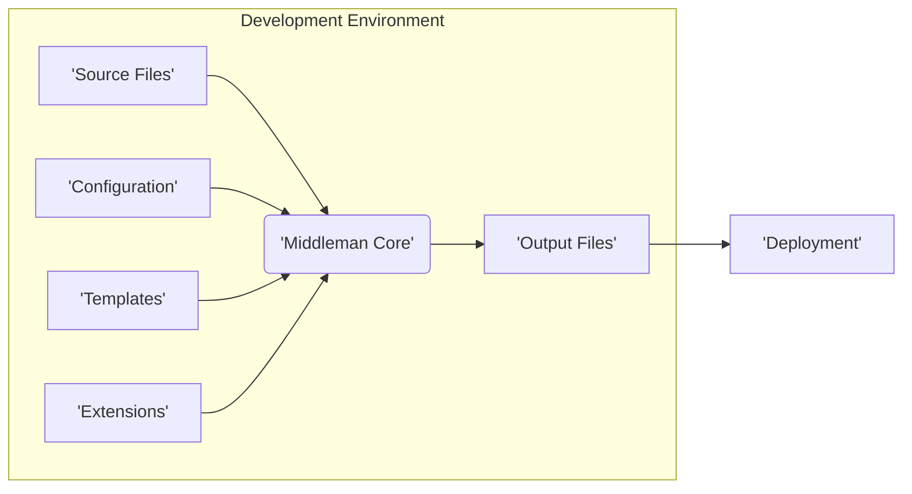

# Project Design Document: Middleman Static Site Generator

**Version:** 1.1
**Date:** October 26, 2023
**Author:** Gemini (AI Language Model)

## 1. Introduction

This document provides an enhanced design overview of the Middleman static site generator, specifically tailored for threat modeling. It details the key components, architecture, and data flow, highlighting potential security considerations and attack surfaces to facilitate effective threat analysis.

## 2. Goals and Objectives

The primary goal of Middleman is to enable the efficient creation of static websites. Key objectives include:

*   Streamlining website development through templating and content management.
*   Generating high-performance and inherently secure static HTML, CSS, and JavaScript.
*   Offering extensibility via a robust extension and plugin system.
*   Providing a user-friendly command-line interface (CLI) for development and management.

This design document specifically aims to:

*   Clearly articulate the system's architecture and the interactions between its components.
*   Visually represent and describe the flow of data within the application.
*   Explicitly identify potential security vulnerabilities and areas of risk.
*   Serve as a foundational resource for subsequent threat modeling activities.

## 3. System Architecture

Middleman employs a modular architecture where distinct components collaborate to transform source content into a static website. Understanding these components and their interactions is crucial for identifying potential threat vectors.

### 3.1. Key Components

*   **Source Files:** The foundational input for the website, encompassing:
    *   Markdown files: Containing the primary content.
    *   HTML files: Used for layouts, partials, and direct HTML content.
    *   CSS and JavaScript files: Providing styling and interactive elements.
    *   Image and other asset files: Supporting visual and functional aspects.
    *   Data files (YAML, JSON, CSV): Enabling dynamic content injection during build time.
*   **Configuration (`config.rb`):**  Defines project-specific settings, including:
    *   Extension loading and configuration.
    *   Build-time configurations and optimizations.
    *   Deployment settings.
*   **Middleman Core:** The central processing engine responsible for:
    *   **File System Watcher:** Monitors source file changes during development, triggering rebuilds.
    *   **Content Engine:** Parses and interprets content files (e.g., converting Markdown to HTML).
    *   **Template Engine:** Renders templates (ERB, Haml, Slim) by merging them with data.
    *   **Extension Manager:** Loads, initializes, and manages registered extensions.
    *   **Build Pipeline:** Orchestrates the sequence of steps required to generate the final static site.
*   **Templates:** Reusable structures that define the website's layout and presentation:
    *   Layout templates: Providing the overall page structure.
    *   Partial templates: Reusable snippets of HTML.
*   **Extensions (Plugins):**  Enhance Middleman's core functionality, examples include:
    *   Blog engine: Facilitating blog post management.
    *   Internationalization (i18n): Supporting multiple languages.
    *   Asset pipeline (Sass, CoffeeScript): Enabling CSS and JavaScript preprocessing.
    *   Deployment integrations: Simplifying deployment to various platforms.
*   **Output Files:** The resulting static website files:
    *   HTML files: The rendered web pages.
    *   CSS files: Stylesheets for visual presentation.
    *   JavaScript files: For client-side interactivity.
    *   Asset files: Images, fonts, and other static resources.
*   **Command-Line Interface (CLI):** Provides essential commands for:
    *   Project creation (`middleman init`).
    *   Starting the development server (`middleman server`).
    *   Building the static site (`middleman build`).
    *   Extension management (`bundle install`, etc.).

### 3.2. Component Interactions

*   The **CLI** interacts with the **Middleman Core** to initiate actions like starting the server or building the site.
*   The **Middleman Core** reads the **Configuration** to understand project settings and loaded extensions.
*   The **File System Watcher** notifies the **Middleman Core** of changes in **Source Files**.
*   The **Content Engine** processes **Source Files** based on their type.
*   The **Template Engine** uses **Templates** and data from **Source Files** to generate output.
*   **Extensions** can hook into various stages of the **Middleman Core's** processing pipeline.
*   The **Build Pipeline** orchestrates the generation of **Output Files**.

### 3.3. Data Flow

The following diagram illustrates the data transformation process within Middleman:

**Detailed Data Flow Description:**

1. **Input:** Developers create or modify **Source Files** (content, templates, assets) and the **Configuration**.
2. **Processing:**
    *   The **Middleman Core**, guided by the **Configuration**, monitors **Source Files**.
    *   Upon changes or during a build command, the **Content Engine** parses **Source Files** (e.g., Markdown is converted to HTML).
    *   The **Template Engine** merges data from **Source Files** with **Templates** to generate HTML structures.
    *   **Extensions** can intercept and modify this process, adding features or transforming data.
3. **Output:** The **Build Pipeline** orchestrates the generation of static **Output Files** (HTML, CSS, JavaScript, assets).
4. **Deployment:** The generated **Output Files** are then deployed to a web server or hosting platform.

## 4. Security Considerations for Threat Modeling

While generating static websites inherently reduces server-side attack vectors, several security considerations remain crucial for Middleman projects:

*   **Source File Vulnerabilities:**
    *   **Sensitive Data Exposure:**  Accidental inclusion of API keys, credentials, or other sensitive information within **Source Files**.
    *   **Malicious Content Injection:** Introduction of malicious scripts or code within content files, potentially exploitable if not handled correctly by extensions or custom code.
*   **Configuration (`config.rb`) Risks:**
    *   **Secret Management:** Storing secrets directly in the configuration file, making them vulnerable if the repository is compromised.
    *   **Insecure Extension Configuration:** Misconfiguration of extensions potentially leading to vulnerabilities.
*   **Template Security Weaknesses:**
    *   **Cross-Site Scripting (XSS) via Data Injection:** If data from external sources (even during build time) is improperly handled in templates, it could lead to XSS vulnerabilities in the generated site.
    *   **Server-Side Template Injection (SSTI) during Build:** Although the output is static, vulnerabilities in the template rendering process itself could be exploited in a compromised development environment.
*   **Extension-Related Threats:**
    *   **Dependency Vulnerabilities:**  Using extensions with known security flaws in their dependencies.
    *   **Malicious Extensions:**  Installation of untrusted extensions containing malicious code that could compromise the build process or introduce vulnerabilities.
    *   **Extension Misconfiguration:** Incorrectly configuring extensions, leading to unintended security weaknesses.
*   **Build Process Security Concerns:**
    *   **Command Injection:**  If the build process involves executing external commands based on user input or untrusted data (e.g., through extensions), it could lead to command injection vulnerabilities.
    *   **Supply Chain Attacks:** Compromise of Middleman itself or its dependencies during installation or updates.
*   **Output File Security Implications:**
    *   **Information Disclosure:**  Accidental inclusion of sensitive information in generated HTML (e.g., comments, debugging information).
    *   **Missing Security Headers:** Lack of appropriate security headers (e.g., Content Security Policy, Strict-Transport-Security) in the deployed static files.
*   **Development Environment Security:**
    *   **Compromised Development Machine:**  A compromised developer machine could lead to the injection of malicious code into the project.
    *   **Version Control Security:**  Insufficient access controls on the project's version control system, allowing unauthorized modifications.

## 5. Deployment Considerations and Security

The deployment process involves transferring the generated **Output Files** to a hosting environment. Security considerations vary depending on the deployment method:

*   **Direct File Copy (to a web server):**
    *   **Secure Transfer:** Ensuring files are transferred securely (e.g., using SCP, SFTP).
    *   **Server Security:** The security of the target web server is paramount.
    *   **Access Control:**  Properly configuring file permissions on the server.
*   **Cloud Storage (e.g., AWS S3, Google Cloud Storage):**
    *   **Bucket Permissions:**  Correctly configuring bucket policies to prevent unauthorized access.
    *   **HTTPS Configuration:**  Enforcing HTTPS for secure access to the hosted site.
    *   **Access Keys Management:** Securely managing access keys for uploading files.
*   **Content Delivery Networks (CDNs):**
    *   **CDN Configuration:**  Properly configuring CDN settings, including HTTPS and security headers.
    *   **Origin Security:**  Securing the origin server or storage from which the CDN pulls content.
*   **Deployment Platforms (e.g., Netlify, Vercel):**
    *   **Platform Security:** Relying on the security measures implemented by the deployment platform.
    *   **Account Security:**  Securing user accounts on the deployment platform.
    *   **Build Process Security:** Understanding how the platform builds and deploys the site.

## 6. Technologies Used

*   **Ruby:** The core programming language for Middleman.
*   **Bundler:**  For managing Ruby gem dependencies.
*   **Various Ruby Gems:** Including template engines (ERB, Haml, Slim), Markdown processors (Kramdown, Redcarpet), and other supporting libraries.
*   **HTML, CSS, JavaScript:** The fundamental technologies for building web content.
*   **Potentially Sass, CoffeeScript, or other preprocessors:** If configured within the project for asset management.

## 7. Future Considerations for Security Enhancement

*   **Formal Security Audits:** Conducting regular security assessments of the Middleman core and popular extensions.
*   **Improved Security Documentation:** Providing more comprehensive guidance on security best practices for developing and deploying Middleman sites.
*   **Integration with Security Scanning Tools:** Exploring integrations with static analysis security testing (SAST) and dependency scanning tools to automate vulnerability detection.
*   **Subresource Integrity (SRI) Support:**  Encouraging the use of SRI for external dependencies to prevent tampering.

This enhanced design document provides a more detailed and security-focused overview of the Middleman static site generator. It serves as a valuable resource for threat modeling exercises, enabling security professionals to identify and mitigate potential risks effectively.