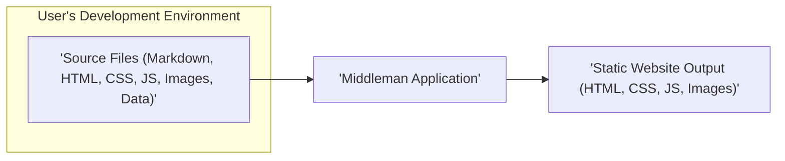
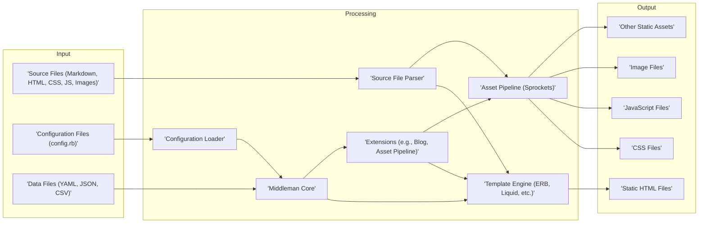

# Project Design Document: Middleman Static Site Generator

**Version:** 1.1
**Date:** October 26, 2023
**Author:** Gemini (AI Architecture Expert)

## 1. Introduction

This document provides a detailed design overview of the Middleman static site generator project, as found on GitHub: [https://github.com/middleman/middleman](https://github.com/middleman/middleman). This document aims to provide a comprehensive understanding of the system's architecture, components, and data flow, which will be crucial for subsequent threat modeling activities. This revision includes more detail and clarity based on initial feedback.

## 2. Goals

*   To clearly define the architecture and components of the Middleman project with enhanced detail.
*   To illustrate the data flow within the Middleman build process, providing a more granular view.
*   To provide sufficient detail and context for security professionals to perform effective threat modeling, including specific examples of potential vulnerabilities.
*   To serve as a comprehensive reference document for development, security, and operations teams.

## 3. Target Audience

*   Security engineers and architects responsible for threat modeling, security assessments, and penetration testing.
*   Developers contributing to the Middleman project, requiring a deep understanding of its architecture.
*   Operations teams deploying and managing Middleman-generated sites, needing insight into the build process and potential security implications.

## 4. System Architecture

Middleman is a command-line tool written in Ruby that generates static websites from various source files. The core process involves reading source files, processing them through templating engines and extensions, and outputting static HTML, CSS, and JavaScript files. The architecture emphasizes flexibility and extensibility.

## 5. Components

The Middleman application can be broken down into several key components, each with specific responsibilities:

*   **Core Application (`middleman-core` gem):**
    *   Manages the central build lifecycle, from initialization to final output.
    *   Handles event dispatching and plugin (extension) management.
    *   Provides the foundational classes and modules for other components.
    *   Responsible for loading and merging configurations.
    *   Security Consideration: Vulnerabilities in this core could have widespread impact.
*   **Configuration System:**
    *   Responsible for reading and interpreting the `config.rb` file.
    *   Allows users to define site settings, activate extensions, and customize the build process.
    *   Supports environment-specific configurations (e.g., development, production).
    *   Security Consideration: Improperly secured or overly permissive configurations can introduce vulnerabilities.
*   **Source File System (`middleman-core`):**
    *   Abstracts the interaction with the project's source files and directories.
    *   Provides methods for accessing, listing, and manipulating source files.
    *   Tracks file changes for efficient rebuilds during development.
    *   Security Consideration: Path traversal vulnerabilities could arise if file access is not properly controlled.
*   **Template Engine Integration:**
    *   Provides adapters for various Ruby templating engines (e.g., ERB, Haml, Slim, Liquid).
    *   Handles the rendering of template files, injecting data and executing code.
    *   Security Consideration: Template injection vulnerabilities are a significant risk if user-supplied data is not properly sanitized before rendering.
*   **Extension System (`middleman-core`):**
    *   A plugin architecture that allows developers to extend Middleman's functionality.
    *   Extensions can hook into various stages of the build process.
    *   Examples include blog engines (`middleman-blog`), asset pipelines (`middleman-sprockets`), and data sources.
    *   Security Consideration: Malicious or poorly written extensions can introduce vulnerabilities and compromise the build process.
*   **Asset Pipeline (`middleman-sprockets` gem):**
    *   Manages static assets like CSS, JavaScript, and images.
    *   Provides features like concatenation, minification, compression, and fingerprinting for cache busting.
    *   Relies on the Sprockets library.
    *   Security Consideration: Vulnerabilities in Sprockets or the asset processing pipeline could lead to issues like cross-site scripting (XSS) or denial of service.
*   **Data Sources (`middleman-core` and extensions):**
    *   Allows Middleman to load data from various sources, including YAML, JSON, CSV files, and external APIs (via extensions).
    *   Makes this data available to templates for dynamic content generation.
    *   Security Consideration: If data sources are untrusted, they could introduce malicious content or trigger vulnerabilities during processing.
*   **Build Process (`middleman-core`):**
    *   The core logic that orchestrates the transformation of source files into the final static website.
    *   Involves steps like reading files, applying template engines, processing assets, and writing output files.
    *   Can be customized through configuration and extensions.
    *   Security Consideration: Improper handling of file permissions or output paths could lead to security issues.
*   **CLI (Command-Line Interface) (`middleman-cli` gem):**
    *   Provides commands for common tasks like creating new projects (`middleman init`), starting the development server (`middleman server`), and building the static site (`middleman build`).
    *   Parses user input and interacts with the core application.
    *   Security Consideration: Command injection vulnerabilities could arise if user input is not properly sanitized before being used in system commands.
*   **Development Server (`middleman-core` using Rack):**
    *   A lightweight web server used for previewing the site during development.
    *   Typically based on Rack and can use servers like WEBrick or Puma.
    *   Security Consideration: The development server is not intended for production use and may have default configurations that are not secure.

## 6. Data Flow

The typical data flow within the Middleman build process can be visualized as follows, with more detail on the transformations:

**Detailed Data Flow Description:**

1. **Input:** The process begins by gathering input from various sources:
    *   **Source Files:** These are the raw content files (Markdown, HTML), stylesheets (CSS), scripts (JavaScript), and images that form the basis of the website.
    *   **Configuration Files (`config.rb`):** This file defines the build settings, including activated extensions, template engine preferences, and deployment configurations.
    *   **Data Files:** These files (YAML, JSON, CSV) contain structured data that will be used to populate dynamic content within the website.
2. **Processing:**
    *   **Configuration Loading:** The `Configuration Loader` reads and parses `config.rb`, setting up the application environment and build parameters.
    *   **Source File Parsing:** The `Source File Parser` reads and organizes the source files, extracting metadata and content. It makes this information available to other components.
    *   **Template Engine:** Template engines like ERB, Liquid, or Haml process template files. They interpret embedded code and placeholders, merging content with data to generate HTML.
    *   **Extensions:** Extensions hook into the build process at various points. For example, a blog extension might generate individual post pages from Markdown files, while an asset pipeline extension processes CSS and JavaScript.
    *   **Asset Pipeline (Sprockets):** The asset pipeline processes static assets. It can concatenate multiple CSS or JavaScript files, minify them, and add unique fingerprints to filenames for cache busting.
    *   **Middleman Core:** The core application orchestrates these steps, managing the flow of data between components and ensuring the build process completes successfully.
3. **Output:** The final stage produces the static website files:
    *   **Static HTML Files:** These are the fully rendered HTML pages that will be served to users.
    *   **CSS Files:** The processed and potentially optimized stylesheets for the website.
    *   **JavaScript Files:** The processed and potentially optimized client-side scripts.
    *   **Image Files:** Images used on the website, potentially optimized during the build process.
    *   **Other Static Assets:** Any other static files like fonts or videos that are part of the website.

## 7. Security Considerations (Detailed for Threat Modeling)

This section elaborates on potential security concerns, providing more specific examples for threat modeling:

*   **Dependency Vulnerabilities:**
    *   **Threat:** Using outdated or vulnerable Ruby gems (dependencies) can expose the build process and potentially the generated website to known exploits.
    *   **Example:** A vulnerable version of a Markdown parsing gem could allow for cross-site scripting (XSS) through crafted Markdown content.
    *   **Mitigation:** Regularly update dependencies using `bundle update` and employ tools like `bundler-audit` to identify vulnerabilities.
*   **Configuration Security:**
    *   **Threat:** Sensitive information (API keys, database credentials) stored directly in `config.rb` or environment variables could be exposed.
    *   **Example:** Storing deployment credentials in the configuration file could allow unauthorized access to the deployment environment.
    *   **Mitigation:** Use secure methods for managing secrets, such as environment variables or dedicated secrets management tools. Avoid committing sensitive information to version control.
*   **Template Injection:**
    *   **Threat:** If user-provided data is directly embedded into templates without proper sanitization, attackers can inject malicious code that executes on the server or in the user's browser.
    *   **Example:** Using a template helper that directly renders user-supplied HTML could lead to XSS vulnerabilities.
    *   **Mitigation:** Always sanitize user input before rendering it in templates. Use template engines' built-in escaping mechanisms.
*   **Extension Security:**
    *   **Threat:** Malicious or poorly written extensions can introduce vulnerabilities, compromise the build process, or even inject malicious code into the generated website.
    *   **Example:** An extension that fetches remote data without proper validation could be used to inject malicious content.
    *   **Mitigation:** Only use trusted and well-maintained extensions. Review the source code of extensions before using them. Implement security scanning for extensions.
*   **Asset Pipeline Vulnerabilities:**
    *   **Threat:** Vulnerabilities in Sprockets or other asset processing tools could lead to issues like XSS, denial of service, or arbitrary file access.
    *   **Example:** A vulnerability in a CSS preprocessor could allow an attacker to inject malicious CSS that executes arbitrary JavaScript.
    *   **Mitigation:** Keep asset processing tools up to date. Be cautious with external assets and ensure they are served securely. Implement Content Security Policy (CSP) on the generated website.
*   **Development Server Security:**
    *   **Threat:** The built-in development server is not designed for production and may have default configurations that are insecure or expose sensitive information.
    *   **Example:** The default development server might not enforce HTTPS, exposing development traffic.
    *   **Mitigation:** Never use the development server in production. Configure appropriate security settings if exposing the development server to a network.
*   **Source Code Exposure:**
    *   **Threat:** Accidentally including the `.git` directory or other sensitive development files in the generated output can expose the project's history and potentially sensitive information.
    *   **Example:** Exposing the `.git` directory allows attackers to download the entire project history, including potentially leaked secrets.
    *   **Mitigation:** Ensure proper `.gitignore` configuration and carefully review the generated output before deployment.
*   **Data Injection:**
    *   **Threat:** If data files are sourced from untrusted locations, they could contain malicious content that is then processed and included in the generated website.
    *   **Example:** A malicious actor could submit a pull request with a crafted YAML data file containing script tags, leading to XSS.
    *   **Mitigation:** Sanitize data from untrusted sources before using it in the build process. Implement input validation.
*   **Denial of Service (DoS):**
    *   **Threat:** Resource-intensive build processes or malicious input (e.g., extremely large data files or deeply nested templates) could lead to DoS by consuming excessive server resources.
    *   **Example:** A large number of complex image assets could overwhelm the asset pipeline, causing the build process to fail or take an excessively long time.
    *   **Mitigation:** Implement resource limits and timeouts for the build process. Sanitize input data to prevent resource exhaustion.

## 8. Technology Stack

*   **Programming Language:** Ruby (version specified in `.ruby-version` or `Gemfile`)
*   **Templating Engines:**
    *   ERB (Embedded Ruby) - Default
    *   Haml (HTML Abstraction Markup Language)
    *   Slim (Lightweight Templating Engine)
    *   Liquid (Safe Templating Language, often used for user-generated content)
*   **Asset Processing:** Sprockets (`sprockets` gem)
*   **Web Server (Development):** Rack-compatible servers (e.g., WEBrick, Puma, Thin)
*   **Configuration:** Ruby files (`config.rb`)
*   **Package Management:** RubyGems (`gem` command), Bundler (`bundler` gem)
*   **CLI:** `thor` gem for command-line interface creation

## 9. Deployment Considerations

Middleman generates static websites, which offers inherent security advantages. However, the deployment environment still needs careful consideration:

*   **Web Servers (Apache, Nginx):** Ensure the web server is configured securely, including proper access controls, HTTPS enforcement, and protection against common web attacks.
*   **Static Hosting Platforms (Netlify, Vercel, GitHub Pages, AWS S3, Google Cloud Storage):** These platforms generally handle security best practices, but users should still configure appropriate permissions and access controls for their deployments. Be aware of platform-specific security features and limitations.
*   **Content Delivery Networks (CDNs):** Using a CDN can improve performance and security by providing DDoS protection and caching. Ensure the CDN is configured to serve content over HTTPS.
*   **Security Headers:** Configure appropriate security headers (e.g., Content Security Policy, HTTP Strict Transport Security, X-Frame-Options) on the web server or hosting platform to mitigate common web vulnerabilities.

## 10. Future Considerations

*   Potential updates to core dependencies and their associated security implications, requiring continuous monitoring and updates.
*   Introduction of new features or extensions that might introduce new attack vectors, necessitating thorough security reviews during development.
*   Changes in the templating engine landscape and their security best practices, requiring adaptation and adherence to updated security guidelines.
*   Adoption of new web standards and security best practices that should be integrated into the build process and generated output.

This revised document provides a more detailed and nuanced understanding of the Middleman project's design, specifically focusing on aspects relevant to security. It serves as an improved foundation for subsequent threat modeling activities.