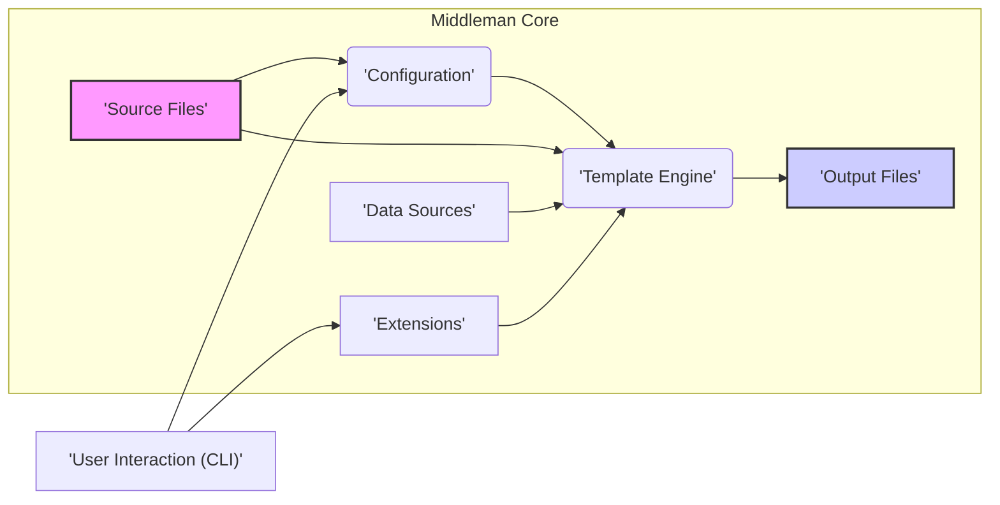
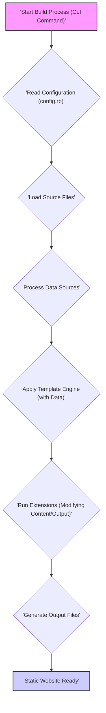

# Project Design Document: Middleman Static Site Generator

**Version:** 1.1
**Date:** October 26, 2023
**Author:** AI Software Architect

## 1. Introduction

This document provides a detailed design overview of the Middleman static site generator project. It outlines the system's architecture, key components, data flow, and security considerations. This document is specifically intended to serve as a foundation for subsequent threat modeling activities, enabling security analysts to identify potential vulnerabilities and attack vectors.

## 2. Goals and Objectives

*   To provide a clear and comprehensive understanding of the Middleman architecture and its functionalities.
*   To identify and describe the key components of the Middleman system and their interactions.
*   To illustrate the flow of data through the system during the site generation process.
*   To explicitly highlight potential security considerations and areas of concern relevant for effective threat modeling.
*   To serve as a living document that can be referenced and updated throughout the project lifecycle for development and security analysis.

## 3. System Overview

Middleman is a static site generator implemented in Ruby. It transforms source files, written in various markup languages and formats, into a collection of static HTML, CSS, JavaScript, and asset files. This generated output represents the final website, ready for deployment to any standard web server or hosting platform. The core function of Middleman is to automate the process of building static websites, offering features like templating, data management, and extensibility.

## 4. System Architecture

The following diagram illustrates the high-level architecture of the Middleman core:

### 4.1. Key Components

*   **Source Files:** These are the foundational files containing the website's content and structure.
    *   Markdown files (`.md`) for textual content.
    *   HTML files (`.html`) for direct markup.
    *   CSS files (`.css`, `.scss`, `.sass`) for styling.
    *   JavaScript files (`.js`) for client-side interactivity.
    *   Image files (`.jpg`, `.png`, `.gif`, etc.) and other static assets.
    *   Layout files defining the overall page structure.
    *   Partial files for reusable content snippets.
*   **Configuration:** The `config.rb` file defines the settings and behavior of the Middleman build process.
    *   Template engine selection and configuration.
    *   Specification of data sources and their locations.
    *   Activation and configuration of extensions.
    *   Definition of build settings, such as the output directory.
    *   Deployment configurations for various platforms.
    *   Custom helper functions and logic.
*   **Template Engine:** Middleman utilizes template engines to embed dynamic content and logic within static templates.
    *   Processes layout files to create the basic HTML structure.
    *   Renders page templates, combining content with layouts and data.
    *   Evaluates embedded code (e.g., Ruby in ERB) to generate dynamic content during the build.
    *   Supports various template languages like ERB, Haml, and Slim.
*   **Data Sources:** Middleman can load data from external sources to be used within templates, enabling dynamic content generation.
    *   YAML files located in the `data/` directory.
    *   JSON files located in the `data/` directory.
    *   Programmatically defined data within the `config.rb` file.
    *   Data provided by extensions.
*   **Extensions:** Extensions enhance Middleman's core functionality by adding new features and modifying the build process.
    *   Blog engine extensions for managing blog posts.
    *   Image optimization extensions for compressing images.
    *   Asset pipeline extensions for managing CSS and JavaScript.
    *   Internationalization (i18n) extensions for supporting multiple languages.
    *   Custom extensions developed by users.
*   **Output Files:** These are the final static files generated by Middleman, representing the complete website.
    *   HTML files representing the website's pages.
    *   CSS files for styling the HTML.
    *   JavaScript files for client-side functionality.
    *   Optimized images and other static assets.
*   **User Interaction (CLI):** Users interact with Middleman through its command-line interface.
    *   Commands for creating new projects (`middleman init`).
    *   Commands for starting a local development server (`middleman server`).
    *   Commands for building the static site (`middleman build`).
    *   Commands for deploying the site (`middleman deploy`).
    *   Commands for managing extensions and other tasks.

## 5. Data Flow

The process of generating a static site with Middleman involves the following sequence of steps:

1. **Start Build Process (CLI Command):** The user initiates the build process by executing a Middleman CLI command, such as `middleman build`.
2. **Read Configuration (`config.rb`):** Middleman parses the `config.rb` file to load project settings, including template engine configurations, data source locations, and enabled extensions.
3. **Load Source Files:** Middleman reads all source files from the project's source directory, including Markdown, HTML, CSS, JavaScript, and asset files.
4. **Process Data Sources:** Data from configured data sources (YAML, JSON files, or programmatically defined data) is loaded and made available for use within the template rendering process.
5. **Apply Template Engine (with Data):** The selected template engine processes the source files. Layout templates define the overall structure, and page templates combine content with layouts and data. Embedded code within templates is evaluated to generate dynamic content.
6. **Run Extensions (Modifying Content/Output):** Enabled extensions are executed, potentially modifying the content, metadata, or the output generation process. This can include tasks like image optimization, asset minification, or adding custom features.
7. **Generate Output Files:** The final HTML, CSS, JavaScript, and asset files are generated and written to the specified output directory (typically `build`).
8. **Static Website Ready:** The generated static website is complete and ready for deployment to a web server or hosting platform.

## 6. Security Considerations

This section outlines potential security considerations relevant for threat modeling, categorized for clarity.

### 6.1. Input Handling and Validation

*   **Source Files:** Malicious code (e.g., JavaScript within Markdown or HTML) could be injected into source files. If not properly handled during the rendering process, this could lead to Cross-Site Scripting (XSS) vulnerabilities in the generated website.
*   **Configuration (`config.rb`):** While less direct, a compromised development environment could lead to the injection of malicious code within the `config.rb` file, potentially executing arbitrary code during the build process.
*   **Data Sources:** Data loaded from external sources (YAML, JSON) could contain malicious scripts or unexpected data structures that could cause errors or vulnerabilities during template rendering if not properly validated and sanitized.

### 6.2. Template Engine Security

*   **Template Injection:** If user-controlled data is directly embedded into templates without proper escaping or sanitization, it could lead to template injection vulnerabilities. This could allow attackers to execute arbitrary code on the server during the build process, potentially compromising the build environment.

### 6.3. Dependency Management and Supply Chain

*   **Gem Vulnerabilities:** Middleman relies on RubyGems for managing dependencies. Vulnerabilities in these dependencies could be exploited if not regularly updated and managed. This represents a supply chain risk.
*   **Malicious Gems:**  The risk of using compromised or malicious RubyGems exists, which could introduce vulnerabilities or backdoors into the build process.

### 6.4. Development Server Security

*   **Exposure of Development Server:** The built-in development server is intended for local development and may not have the same security hardening as production web servers. Exposing it to the public internet could create security risks.

### 6.5. Output Security

*   **Cross-Site Scripting (XSS):** Even though Middleman generates static sites, the content within those sites can still be vulnerable to XSS if user-provided content or data from external sources is incorporated without proper sanitization during the build process.

### 6.6. Build Process Security

*   **Compromised Build Environment:** If the environment where the Middleman build process runs is compromised, attackers could inject malicious code into the generated website, potentially without directly modifying the source files.

### 6.7. Extension Security

*   **Untrusted Extensions:** Using third-party extensions from untrusted sources introduces a risk of malicious code or vulnerabilities being introduced into the build process.

## 7. Deployment Considerations

While Middleman generates static sites, the deployment process introduces its own set of security considerations:

*   **Insecure Transfer Protocols:** Deploying the generated files using insecure protocols like plain FTP can expose the website content and credentials. Secure protocols like SFTP or SCP should be used.
*   **Web Server Security:** The security configuration of the web server hosting the generated static site is critical. This includes proper access controls, security headers, and regular security updates.
*   **Access Control and Permissions:**  Incorrectly configured access controls on the deployment server can allow unauthorized modifications to the deployed website.
*   **Secrets Management:**  Deployment processes often involve secrets (e.g., API keys, database credentials). Securely managing and storing these secrets is crucial.

## 8. Technologies Used

*   **Ruby:** The primary programming language for Middleman.
*   **RubyGems:** The package manager for managing dependencies.
*   **Tilt:** A gem providing a common interface to multiple Ruby template engines.
*   **Various Template Engines:** Including ERB, Haml, Slim, Liquid, and Markdown.
*   **Thor:** A toolkit for building command-line interfaces, used for the Middleman CLI.

## 9. Future Considerations

*   **Regular Security Audits:** Conducting regular security audits of the Middleman codebase and its core dependencies is crucial for identifying and addressing potential vulnerabilities.
*   **Built-in Input Sanitization:** Exploring the possibility of incorporating built-in input sanitization features to mitigate XSS risks in generated content.
*   **Subresource Integrity (SRI) Guidance:** Providing clearer guidance and mechanisms for implementing SRI for external resources in generated HTML to protect against CDN compromises.
*   **Content Security Policy (CSP) Support:** Enhancing support and providing best practices for implementing CSP in generated websites to improve client-side security.
*   **Dependency Vulnerability Scanning:** Integrating or recommending tools for automated scanning of dependencies for known vulnerabilities.
*   **Secure Defaults:**  Reviewing and potentially adjusting default configurations to promote more secure practices.

This improved design document provides a more detailed and structured overview of the Middleman static site generator, with a strong focus on security considerations relevant for threat modeling. The enhanced descriptions of components, data flow, and potential vulnerabilities aim to provide a solid foundation for identifying and mitigating security risks associated with the project.