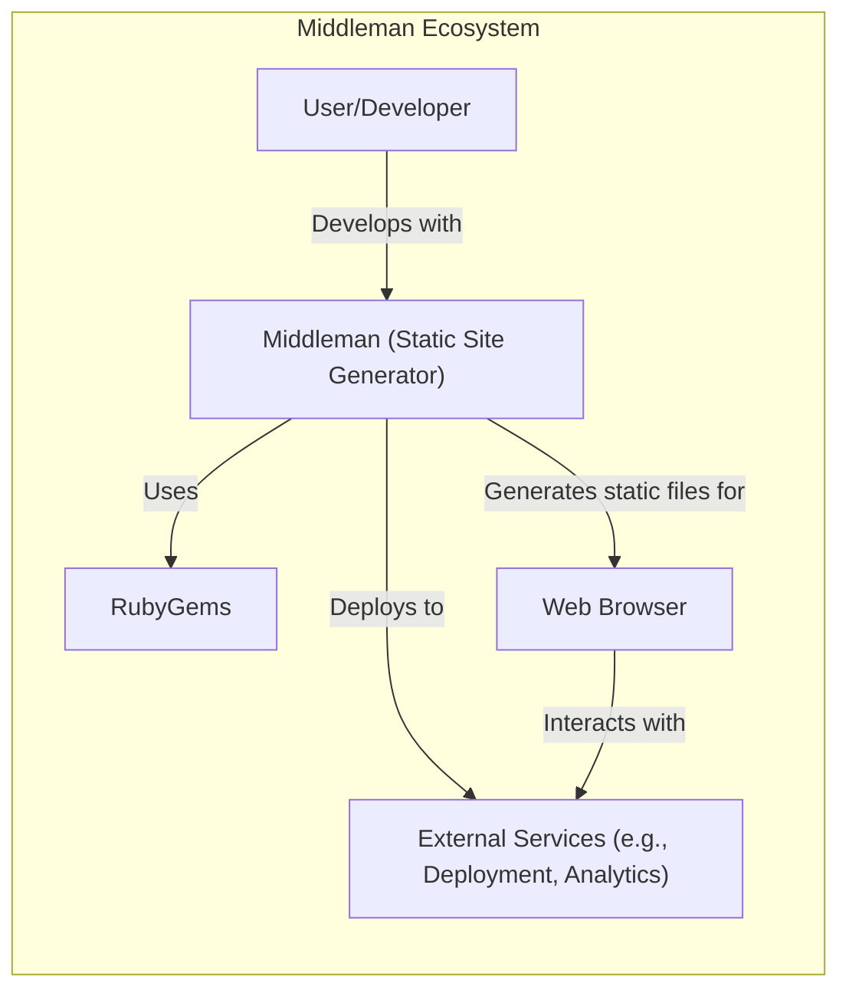
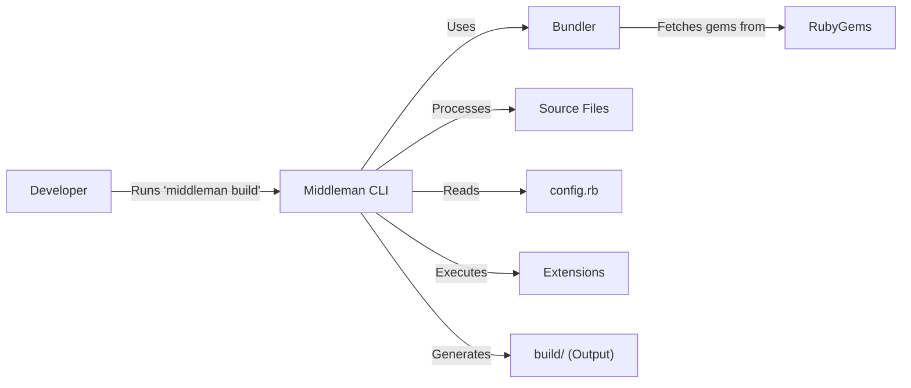

Okay, let's create a design document for the Middleman static site generator project, focusing on aspects relevant for threat modeling.

# BUSINESS POSTURE

Middleman is a popular open-source static site generator.  It's used by a wide range of users, from individual developers building personal blogs to companies creating documentation sites and marketing pages.  The primary business goals and priorities are:

*   Ease of Use:  Middleman should be easy to install, configure, and use, even for users with limited command-line experience.  A smooth developer experience is paramount.
*   Flexibility and Extensibility:  The framework should be adaptable to various project needs, allowing users to customize templates, add extensions, and integrate with other tools.
*   Performance:  Generated websites should be fast and efficient, leveraging the benefits of static site generation.
*   Community and Maintainability:  A healthy open-source community is crucial for ongoing development, bug fixes, and support.  The codebase should be maintainable and well-documented.
*   Reliability: The build process should consistently produce expected output, minimizing the risk of broken builds or unexpected behavior.

Based on these priorities, the most important business risks are:

*   Security vulnerabilities in Middleman itself or its dependencies that could lead to website compromise (e.g., XSS, data leaks).
*   Difficulties in using or extending Middleman, leading to user frustration and abandonment.
*   Performance issues in the generated sites, negatively impacting user experience and SEO.
*   Lack of community support or maintainer activity, leading to stagnation and unaddressed bugs.
*   Inconsistent or unreliable build processes, causing deployment issues.
*   Supply chain attacks, where compromised dependencies are introduced into the Middleman ecosystem.

# SECURITY POSTURE

Middleman, as a static site generator, inherently reduces the attack surface compared to dynamic web applications.  However, security considerations remain crucial.

Existing security controls:

*   security control: Dependency Management: Middleman uses RubyGems and Bundler for dependency management.  `Gemfile` and `Gemfile.lock` define project dependencies and their versions. (Described in the project's README and contribution guidelines).
*   security control: Static Site Generation: By generating static HTML files, Middleman eliminates many common web application vulnerabilities associated with server-side code execution (e.g., SQL injection, remote code execution). (Fundamental to Middleman's design).
*   security control: Community Vetting: As an open-source project, Middleman benefits from community scrutiny of the codebase.  Users and contributors can identify and report potential security issues. (Implicit in the open-source nature of the project).
*   security control: Limited Server-Side Functionality: Middleman itself does not run as a persistent server. It's a command-line tool that generates static files. This limits the attack surface. (Fundamental to Middleman's design).

Accepted risks:

*   accepted risk: User-Provided Content Vulnerabilities: Middleman users are responsible for the security of their own content (templates, Markdown files, etc.).  Middleman does not automatically sanitize user-provided content, so XSS vulnerabilities are possible if users are not careful.
*   accepted risk: Third-Party Extension Risks: Users can install third-party extensions, which may introduce security vulnerabilities. Middleman does not audit or vet third-party extensions.
*   accepted risk: Dependency Vulnerabilities: While Bundler helps manage dependencies, vulnerabilities in those dependencies can still affect Middleman.  Regular updates are necessary.
*   accepted risk: Local Development Environment Security: Middleman's security relies in part on the security of the user's local development environment.

Recommended security controls (high priority):

*   security control: Implement a regular security audit process for the Middleman codebase and its core dependencies.
*   security control: Provide clear security guidelines and best practices for users, particularly regarding content sanitization and the use of third-party extensions.
*   security control: Integrate automated dependency vulnerability scanning into the development workflow (e.g., using tools like Bundler-Audit or Dependabot).
*   security control: Consider implementing a Content Security Policy (CSP) configuration option to help mitigate XSS risks in generated sites.

Security Requirements:

*   Authentication: Not directly applicable to Middleman itself, as it's a static site generator. Authentication would be handled by external services if needed (e.g., for protected areas of a generated site).
*   Authorization: Not directly applicable to Middleman itself. Authorization, if needed, would be handled externally.
*   Input Validation: Middleman should validate its own configuration files and command-line inputs to prevent unexpected behavior or errors. User-provided content (templates, Markdown) is the responsibility of the user, but Middleman should provide guidance on secure content handling.
*   Cryptography: Middleman should use secure cryptographic practices where necessary (e.g., for handling sensitive configuration data, if applicable). HTTPS should be strongly encouraged for deployed sites.

# DESIGN

## C4 CONTEXT



Element Descriptions:

*   Element:
    *   Name: User/Developer
    *   Type: Person
    *   Description: The person who uses Middleman to create and manage static websites.
    *   Responsibilities: Writes content, configures Middleman, develops templates, manages deployment.
    *   Security controls: Responsible for securing their own development environment and the content they create.

*   Element:
    *   Name: Middleman (Static Site Generator)
    *   Type: Software System
    *   Description: The core Middleman application, a command-line tool written in Ruby.
    *   Responsibilities: Processes source files, generates static HTML/CSS/JS, manages extensions, provides a local development server.
    *   Security controls: Dependency management via Bundler, static site generation (inherently reduces attack surface).

*   Element:
    *   Name: External Services (e.g., Deployment, Analytics)
    *   Type: Software System
    *   Description: Third-party services used for deploying the generated website (e.g., Netlify, AWS S3, GitHub Pages) and for site analytics (e.g., Google Analytics).
    *   Responsibilities: Hosting the static website, providing analytics data.
    *   Security controls: Managed by the respective service providers. Middleman users should choose reputable providers with strong security practices.

*   Element:
    *   Name: RubyGems
    *   Type: Software System
    *   Description: The package manager for the Ruby programming language.
    *   Responsibilities: Providing and managing Ruby libraries (gems) used by Middleman.
    *   Security controls: RubyGems itself has security measures, but users should be aware of potential vulnerabilities in individual gems.

*   Element:
    *   Name: Web Browser
    *   Type: Software System
    *   Description: The user's web browser, used to view the generated website.
    *   Responsibilities: Rendering HTML, CSS, and JavaScript.
    *   Security controls: Browser security features (e.g., sandboxing, same-origin policy).

## C4 CONTAINER

```mermaid
graph LR
    subgraph Middleman (Static Site Generator)
        CLI["Command Line Interface"]
        Core["Core Functionality (Processing Engine)"]
        Extensions["Extension API"]
        Config["Configuration (config.rb)"]
        SourceFiles["Source Files (Templates, Markdown, etc.)"]
        BuildOutput["Build Output (HTML, CSS, JS)"]

        CLI -- Interacts with --> Core
        Core -- Uses --> Extensions
        Core -- Reads --> Config
        Core -- Processes --> SourceFiles
        Core -- Generates --> BuildOutput
        Extensions -- Modifies --> Core
    end

```

Element Descriptions:

*   Element:
    *   Name: Command Line Interface
    *   Type: Container
    *   Description: The entry point for users to interact with Middleman (e.g., `middleman build`, `middleman server`).
    *   Responsibilities: Parsing command-line arguments, invoking core functionality.
    *   Security controls: Input validation of command-line arguments.

*   Element:
    *   Name: Core Functionality (Processing Engine)
    *   Type: Container
    *   Description: The main logic of Middleman, responsible for processing source files and generating the static output.
    *   Responsibilities: Reading configuration, loading extensions, processing templates, rendering content, managing the build process.
    *   Security controls: Internal logic should be designed to handle errors gracefully and prevent unexpected behavior.

*   Element:
    *   Name: Extension API
    *   Type: Container
    *   Description: The API that allows users to extend Middleman's functionality with custom code.
    *   Responsibilities: Providing hooks and interfaces for extending Middleman.
    *   Security controls: Extensions are the responsibility of the user, but the API should be designed to minimize the risk of extensions causing harm.

*   Element:
    *   Name: Configuration (config.rb)
    *   Type: Container
    *   Description: The main configuration file for a Middleman project.
    *   Responsibilities: Defining project settings, build options, extension configurations.
    *   Security controls: Middleman should validate the configuration file to prevent errors. Sensitive data should be handled securely.

*   Element:
    *   Name: Source Files (Templates, Markdown, etc.)
    *   Type: Container
    *   Description: The user-provided source files that make up the website content.
    *   Responsibilities: Containing the content and structure of the website.
    *   Security controls: Users are responsible for the security of their source files (e.g., preventing XSS in templates).

*   Element:
    *   Name: Build Output (HTML, CSS, JS)
    *   Type: Container
    *   Description: The generated static files that are deployed to a web server.
    *   Responsibilities: Representing the final website content.
    *   Security controls: The generated output should be free of vulnerabilities introduced by Middleman itself.

## DEPLOYMENT

Middleman generates static files, which can be deployed to a variety of hosting environments. Common deployment solutions include:

1.  **Static Site Hosts:** Netlify, Vercel, AWS Amplify, GitHub Pages, Cloudflare Pages. These platforms are specifically designed for hosting static sites and offer features like automatic deployments, CDN integration, and HTTPS.
2.  **Cloud Storage Services:** AWS S3, Google Cloud Storage, Azure Blob Storage. These services can be configured to serve static websites directly.
3.  **Traditional Web Servers:** Apache, Nginx. Static files can be copied to a web server's document root.
4.  **Containerized Deployment:** Docker. While Middleman itself doesn't require a container for execution, the generated output *could* be served from a containerized web server.

We'll describe deployment to **Netlify** as a representative example:

```mermaid
graph LR
    subgraph Deployment (Netlify)
        LocalMachine["Local Machine (Developer)"]
        GitRepo["Git Repository (GitHub, GitLab, Bitbucket)"]
        Netlify["Netlify Platform"]
        CDN["Netlify CDN"]
        WebBrowser["Web Browser"]

        LocalMachine -- Pushes code to --> GitRepo
        GitRepo -- Triggers build on --> Netlify
        Netlify -- Builds and deploys to --> CDN
        WebBrowser -- Requests site from --> CDN
    end
```

Element Descriptions:

*   Element:
    *   Name: Local Machine (Developer)
    *   Type: Node
    *   Description: The developer's computer where Middleman is run.
    *   Responsibilities: Running Middleman commands, managing source files, committing code to Git.
    *   Security controls: The developer's machine should be secured with appropriate measures (e.g., firewall, antivirus).

*   Element:
    *   Name: Git Repository (GitHub, GitLab, Bitbucket)
    *   Type: Node
    *   Description: A version control repository hosting the Middleman project's source code.
    *   Responsibilities: Storing the project's code, tracking changes, triggering deployments (via webhooks).
    *   Security controls: Repository access controls, branch protection rules.

*   Element:
    *   Name: Netlify Platform
    *   Type: Node
    *   Description: The Netlify platform, which handles the build and deployment process.
    *   Responsibilities: Cloning the Git repository, running the Middleman build command, deploying the output to the CDN.
    *   Security controls: Netlify's internal security measures, HTTPS for deployments.

*   Element:
    *   Name: Netlify CDN
    *   Type: Node
    *   Description: Netlify's Content Delivery Network, which distributes the static website content globally.
    *   Responsibilities: Serving website content to users with low latency.
    *   Security controls: CDN security features (e.g., DDoS protection, HTTPS).

*   Element:
    *   Name: Web Browser
    *   Type: Node
    *   Description: The user's web browser.
    *   Responsibilities: Requesting and rendering the website content.
    *   Security controls: Browser security features.

## BUILD

The build process for a Middleman project typically involves the following steps:

1.  **Developer initiates build:** The developer runs the `middleman build` command on their local machine.
2.  **Dependencies are resolved:** Bundler checks the `Gemfile` and `Gemfile.lock` to ensure all required Ruby gems are installed.
3.  **Configuration is loaded:** Middleman reads the `config.rb` file to determine project settings.
4.  **Source files are processed:** Middleman processes templates (e.g., ERB, Haml), Markdown files, and other assets.
5.  **Extensions are executed:** Any registered Middleman extensions are run, potentially modifying the build process.
6.  **Static files are generated:** Middleman generates the final HTML, CSS, JavaScript, and other static assets in the `build` directory.
7.  **Output is ready for deployment:** The contents of the `build` directory can be deployed to a web server or static site hosting platform.



Security Controls in the Build Process:

*   security control: Dependency Management (Bundler): Bundler helps ensure that the correct versions of dependencies are used, reducing the risk of introducing vulnerabilities through outdated or incompatible gems.
*   security control: Automated Build (CI/CD): Integrating the build process with a CI/CD system (e.g., GitHub Actions, Travis CI, CircleCI) allows for automated builds and testing on every code change. This can help catch errors and vulnerabilities early.
*   security control: Static Analysis (Linters, SAST): Incorporating linters (e.g., RuboCop for Ruby code) and static application security testing (SAST) tools into the build process can help identify potential code quality and security issues.  This is *not* built-in to Middleman, but is a recommended practice.
*   security control: Dependency Vulnerability Scanning: Tools like Bundler-Audit or Dependabot can be integrated into the build process to automatically scan for known vulnerabilities in project dependencies. This is *not* built-in, but highly recommended.
*   security control: Supply Chain Security: While not directly controllable by Middleman, developers should be aware of the risks of supply chain attacks and choose dependencies carefully. Using signed gems and verifying gem integrity can help mitigate this risk.

# RISK ASSESSMENT

*   **Critical Business Processes:** The critical business process is the ability to reliably build and deploy static websites. This includes the ease of use for developers, the performance of the generated sites, and the ongoing maintainability of the Middleman project itself.

*   **Data to Protect and Sensitivity:**
    *   **Source Code (Templates, Markdown, etc.):** Sensitivity varies depending on the content. Public-facing website content is generally low sensitivity, but private repositories or drafts may contain confidential information.
    *   **Configuration Files (config.rb):** May contain API keys or other secrets. Medium sensitivity. Should be protected and not committed to public repositories.
    *   **Generated Website Content (HTML, CSS, JS):** Generally low sensitivity, as it's intended to be publicly accessible. However, if the site contains protected areas or user-specific data, the sensitivity increases.
    *   **Middleman Project Dependencies:** Low direct sensitivity, but vulnerabilities in dependencies can have a high impact.
    *   **Developer Credentials (e.g., for deployment services):** High sensitivity. Should be protected using strong passwords and multi-factor authentication.

# QUESTIONS & ASSUMPTIONS

*   **Questions:**
    *   What specific deployment platforms are most commonly used by Middleman users? This would help prioritize security guidance for those platforms.
    *   What is the current level of security awareness among Middleman users and contributors? This would inform the need for security education and documentation.
    *   Are there any plans to add built-in security features to Middleman, such as automated dependency vulnerability scanning or CSP configuration?
    *   What is the process for reporting and addressing security vulnerabilities in Middleman?

*   **Assumptions:**
    *   **BUSINESS POSTURE:** We assume that Middleman's primary user base consists of developers and organizations building relatively simple static websites, documentation sites, and marketing pages. We assume a moderate risk appetite, balancing ease of use with security.
    *   **SECURITY POSTURE:** We assume that users are generally aware of basic web security concepts but may not be security experts. We assume that users are responsible for the security of their own content and the choice of third-party extensions.
    *   **DESIGN:** We assume that the core Middleman codebase is relatively well-maintained and that the community actively contributes to bug fixes and improvements. We assume that the build process is generally reliable but could benefit from additional security checks.