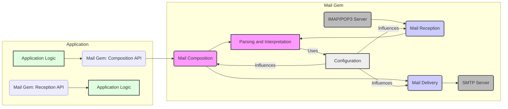
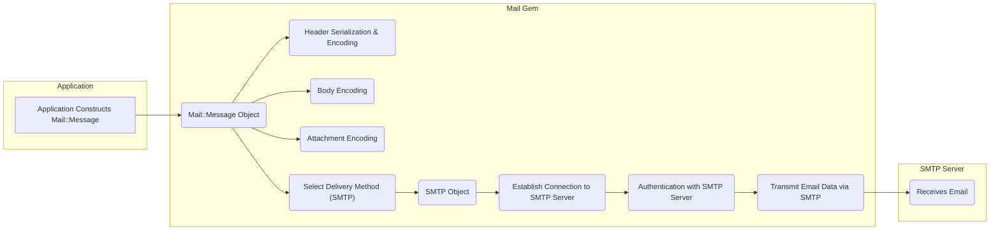
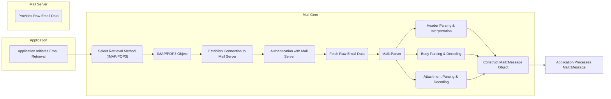

# Project Design Document: mail Ruby Gem

**Version:** 1.1
**Date:** October 26, 2023
**Author:** Gemini (AI Language Model)
**Project:** mail Ruby Gem (https://github.com/mikel/mail)

## 1. Introduction

This document provides an enhanced architectural design of the `mail` Ruby gem. This gem is a widely adopted library for handling email functionalities within Ruby applications. It encompasses capabilities for composing, delivering (sending), and retrieving emails, alongside robust parsing and interpretation of diverse email formats. This iteration builds upon the previous design, offering greater detail and clarity, particularly in areas relevant to security considerations for future threat modeling.

## 2. Goals and Objectives

The core goals of the `mail` gem are to:

*   Offer a straightforward and intuitive Application Programming Interface (API) for email creation and transmission.
*   Deliver robust parsing functionalities for a wide array of email formats and encodings, ensuring accurate interpretation.
*   Provide comprehensive support for standard email protocols, specifically SMTP for sending and IMAP/POP3 for receiving.
*   Maintain an extensible architecture that allows for customization and integration with other libraries.
*   Ensure broad compatibility across various versions of the Ruby programming language.

From a security standpoint, the key objectives are to facilitate:

*   Secure management of sensitive data, including email content, user credentials, and server authentication details.
*   Mitigation against common email-related security vulnerabilities, protecting applications utilizing the gem.
*   Establishment of secure communication channels with mail servers, safeguarding data in transit.

## 3. High-Level Architecture

The `mail` gem's architecture can be conceptually divided into the following key functional areas, highlighting the interaction with the encompassing application:

*   **Mail Composition (within Application):** The application utilizes the gem's API to construct email messages.
*   **Mail Delivery:**  The gem handles the process of transmitting composed emails to a designated mail server.
*   **Mail Reception:** The gem facilitates the retrieval of emails from a mail server.
*   **Parsing and Interpretation:** The gem is responsible for dissecting and understanding the structure and content of received emails.
*   **Configuration:** The gem's behavior is governed by configuration settings provided by the application.

## 4. Component Details

This section provides a more granular view of the key components within each functional area.

### 4.1. Mail Composition

*   **`Mail::Message` Object:** This central class encapsulates all aspects of an email message, including:
    *   Recipient addresses (`to`, `cc`, `bcc`)
    *   Sender information (`from`, `sender`, `reply_to`)
    *   Subject line
    *   Email body (plain text and/or HTML)
    *   Attachments (files and their metadata)
    *   Custom headers
*   **Header Management:**  Components dedicated to the creation, manipulation, and serialization of email headers. This includes:
    *   Handling various header formats (e.g., structured, unstructured).
    *   Encoding header values according to RFC specifications (e.g., MIME encoding).
    *   Providing methods to add, remove, and modify headers.
*   **Body Handling:**  Manages the email's content, supporting different content types:
    *   Plain text bodies with character encoding handling (e.g., UTF-8, ISO-8859-1).
    *   HTML bodies, potentially requiring sanitization by the application.
    *   Generation of the appropriate `Content-Type` header.
*   **Attachment Management:** Facilitates the inclusion of files as attachments:
    *   Reading file content.
    *   Encoding attachment content (typically Base64).
    *   Setting the correct `Content-Disposition` and `Content-Type` headers for attachments.
*   **Multipart Message Generation:**  Automatically creates multipart messages when an email contains:
    *   Both plain text and HTML versions of the body.
    *   Attachments alongside the body.
    *   Ensuring correct boundary markers and structure according to MIME standards.

### 4.2. Mail Delivery

*   **Delivery Methods Abstraction:** An interface that allows for different mechanisms of sending emails. The primary method is SMTP.
    *   **`Mail::SMTP` Class:** Implements the Simple Mail Transfer Protocol (SMTP) for email transmission.
        *   Establishing a TCP connection with the SMTP server on the specified port (default 25, 465 for SMTPS, 587 for submission).
        *   Initiating the SMTP handshake (e.g., `EHLO`).
        *   Handling authentication if required by the server.
        *   Transmitting the email data using SMTP commands (`MAIL FROM`, `RCPT TO`, `DATA`).
        *   Handling server responses and potential errors.
        *   Closing the connection.
*   **SMTP Interaction Logic:**  Manages the low-level communication with the SMTP server:
    *   Sending SMTP commands as defined in RFC 5321.
    *   Parsing server responses and status codes.
    *   Implementing retry mechanisms for transient errors.
*   **Authentication Mechanisms:** Supports various SMTP authentication schemes:
    *   `Plain`
    *   `Login`
    *   `CRAM-MD5`
    *   `Digest MD5`
    *   The gem relies on the application to provide the necessary credentials securely.
*   **TLS/SSL (STARTTLS) Support:** Enables secure communication with SMTP servers:
    *   Using implicit TLS on connection (SMTPS on port 465).
    *   Initiating TLS using the `STARTTLS` command on a standard SMTP connection.
    *   Leveraging Ruby's built-in `OpenSSL` library for encryption.

### 4.3. Mail Reception

*   **Retrieval Methods Abstraction:**  An interface for different protocols used to retrieve emails.
    *   **`Mail::IMAP` Class:** Implements the Internet Message Access Protocol (IMAP):
        *   Connecting to the IMAP server.
        *   Authenticating with provided credentials.
        *   Selecting mailboxes (e.g., INBOX).
        *   Fetching email messages or message metadata.
        *   Supporting various IMAP commands (e.g., `FETCH`, `STORE`, `UID`).
        *   Managing message flags (e.g., seen, deleted).
    *   **`Mail::POP3` Class:** Implements the Post Office Protocol version 3 (POP3):
        *   Connecting to the POP3 server.
        *   Authenticating with provided credentials.
        *   Retrieving emails, typically deleting them from the server after download.
        *   Supporting basic POP3 commands (e.g., `RETR`, `DELE`).
*   **Protocol Interaction Logic:** Handles the specifics of communicating with IMAP or POP3 servers:
    *   Sending protocol-specific commands.
    *   Parsing server responses.
    *   Handling different server capabilities and extensions.
*   **Authentication for Reception:** Supports authentication for IMAP and POP3:
    *   Typically using username and password.
    *   May support other authentication mechanisms depending on server capabilities.
*   **Message Fetching and Management:**
    *   Retrieving full email content or just headers.
    *   For IMAP, managing message states (read, unread, deleted, etc.).

### 4.4. Parsing and Interpretation

*   **`Mail::Parser` Class:** The core component responsible for converting raw email data (a string) into a `Mail::Message` object.
    *   Tokenizing the email data into headers, body, and attachments.
    *   Handling different email formats (e.g., singlepart, multipart).
*   **Header Parsing Logic:**  Extracts and interprets information from email headers:
    *   Parsing header names and values.
    *   Decoding encoded header values (e.g., quoted-printable, Base64).
    *   Handling folded headers (headers split across multiple lines).
    *   Populating the `Mail::Message` object's header attributes.
*   **Body Parsing Logic:** Decodes the email body content:
    *   Determining the character encoding.
    *   Decoding the body according to its encoding.
    *   For multipart messages, separating the different parts.
*   **Attachment Parsing Logic:** Identifies and extracts attachments:
    *   Detecting `Content-Disposition: attachment` headers.
    *   Decoding attachment content based on `Content-Transfer-Encoding`.
    *   Determining the attachment's MIME type from the `Content-Type` header.
    *   Making attachment content and metadata available in the `Mail::Message` object.
*   **MIME Type Handling:**  Interprets MIME types to understand the nature of different email parts (body, attachments).

### 4.5. Configuration

*   **Global Configuration Options:** Allow setting default behaviors for the gem:
    *   Default delivery method (e.g., SMTP).
    *   Default charset and content type.
    *   Settings for handling invalid or malformed emails.
*   **Delivery Method Specific Configuration:**  Provides ways to configure individual delivery methods:
    *   SMTP server address, port, authentication details.
    *   IMAP/POP3 server address, port, authentication details.
*   **Interceptors Mechanism:**  Allows registering custom code to be executed at specific points in the email lifecycle:
    *   **Delivery Interceptors:**  Executed before and after sending an email, allowing for logging, modification, or cancellation.
    *   **Retrieval Interceptors:** Potentially for acting on received emails.

## 5. Data Flow

The following diagrams illustrate the flow of data during email sending and receiving operations.

### 5.1. Sending Email

### 5.2. Receiving Email

## 6. Security Considerations

This section details potential security vulnerabilities and considerations relevant to the `mail` gem.

*   **Credential Security:**
    *   The `mail` gem relies on the application to securely store and provide SMTP/IMAP/POP3 credentials. Hardcoding credentials or storing them in easily accessible configuration files is a significant risk.
    *   Consider using environment variables or dedicated secrets management solutions.
*   **Transport Layer Security (TLS):**
    *   Failure to enforce or utilize TLS for SMTP, IMAP, and POP3 connections exposes email content and credentials to eavesdropping.
    *   Applications should be configured to always use TLS and verify server certificates.
*   **Email Parsing Vulnerabilities:**
    *   The parser could be vulnerable to exploits if it doesn't handle malformed or crafted emails correctly, potentially leading to denial-of-service or other unexpected behavior.
    *   Regularly update the `mail` gem to benefit from bug fixes and security patches.
*   **Header Injection Attacks:**
    *   If user-provided input is directly used in email headers without proper sanitization, attackers could inject malicious headers (e.g., adding additional recipients or modifying the sender address).
    *   Applications must carefully validate and sanitize any user input used in email composition.
*   **Attachment Security:**
    *   The `mail` gem itself doesn't inherently protect against malicious attachments. Applications need to implement their own safeguards, such as virus scanning.
    *   Be cautious when handling attachments from untrusted sources.
*   **Dependency Vulnerabilities:**
    *   The `mail` gem has dependencies on other libraries. Vulnerabilities in these dependencies could indirectly affect the security of applications using the gem.
    *   Keep dependencies up-to-date.
*   **Logging Sensitive Information:**
    *   Avoid logging sensitive information like email content or credentials. If logging is necessary, ensure it's done securely and access is restricted.
*   **Code Injection through Interceptors:**
    *   If interceptors are not carefully managed, they could introduce security vulnerabilities if malicious code is injected through them. Ensure that interceptor logic is trusted and secure.
*   **Denial of Service (DoS):**
    *   Applications using the `mail` gem should implement rate limiting or other mechanisms to prevent abuse that could lead to DoS attacks on mail servers.

## 7. Deployment Considerations

Secure deployment of applications using the `mail` gem involves:

*   **Secure Configuration Management:**  Storing SMTP/IMAP/POP3 settings and credentials securely, ideally using environment variables or dedicated secret stores. Avoid committing sensitive information to version control.
*   **Network Security:**  Ensuring that network traffic to and from mail servers is protected, typically through firewalls and appropriate network segmentation.
*   **TLS Configuration:**  Verifying that the application is configured to enforce TLS for all email communication.
*   **Regular Updates:** Keeping the `mail` gem and its dependencies updated to patch any known security vulnerabilities.
*   **Input Validation:**  Implementing robust input validation to prevent header injection and other attacks.
*   **Rate Limiting:**  Implementing mechanisms to prevent abuse of email sending functionality.

## 8. Future Considerations

Potential future enhancements to improve the security and functionality of the `mail` gem include:

*   **Improved Default Security Settings:**  Making TLS usage the default and providing clearer guidance on secure configuration practices.
*   **Enhanced Parser Security:**  Continuously improving the parser to be more resilient against malformed and malicious emails.
*   **Integration with Security Libraries:**  Exploring integration with libraries that can assist with input sanitization or vulnerability scanning.
*   **Support for Modern Authentication Protocols:**  Adding support for more modern and secure authentication mechanisms like OAuth 2.0 for SMTP/IMAP/POP3.
*   **Content Security Policy (CSP) for Emails:**  Potentially exploring ways to integrate or suggest CSP-like mechanisms for outgoing HTML emails.

This revised document provides a more detailed and security-focused design overview of the `mail` Ruby gem, intended to serve as a strong foundation for subsequent threat modeling exercises.