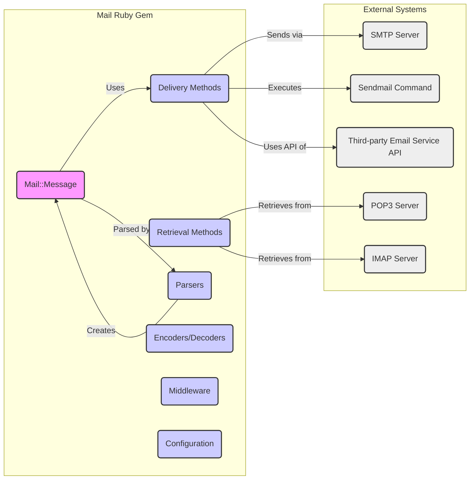
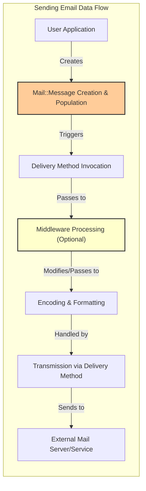
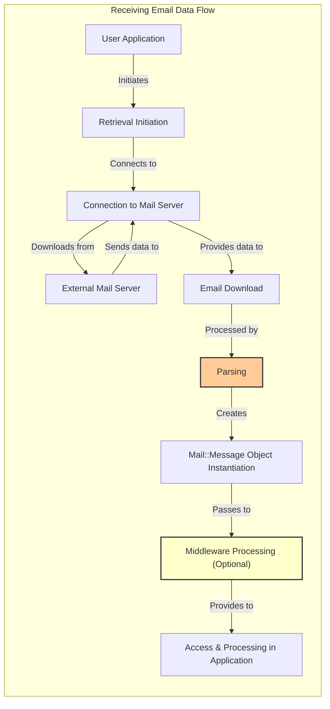

## Project Design Document: mail Ruby Gem (Improved)

**1. Introduction**

This document provides an enhanced design overview of the `mail` Ruby gem (available at [https://github.com/mikel/mail](https://github.com/mikel/mail)). Building upon the previous version, this iteration aims for greater clarity, detail, and a stronger focus on security considerations relevant for threat modeling. The goal is to provide a robust understanding of the gem's internal workings and potential attack surfaces.

**2. Goals**

*   Provide a highly detailed and accurate representation of the `mail` gem's architecture and components.
*   Elaborate on the data flow within the gem for both sending and receiving emails, highlighting potential security checkpoints.
*   Clearly define key functionalities and their interactions, with an emphasis on security implications.
*   Serve as a comprehensive foundation for identifying potential security vulnerabilities, attack vectors, and mitigation strategies during threat modeling.

**3. Overview**

The `mail` gem is a versatile Ruby library designed to simplify email handling. Its core functionalities include:

*   **Email Composition:**  Programmatically creating email messages with customizable headers, bodies (plain text and HTML), and attachments.
*   **Email Sending:**  Dispatching emails through various protocols and services, such as SMTP, Sendmail, and cloud-based email providers.
*   **Email Receiving:**  Retrieving and processing emails from mail servers using protocols like POP3 and IMAP.
*   **Email Parsing:**  Interpreting raw email data into structured `Mail::Message` objects, handling complex MIME structures and encodings.
*   **Attachment Management:**  Adding, extracting, and manipulating email attachments, including handling different content types and encodings.
*   **Protocol Abstraction:**  Shielding developers from the intricacies of underlying email protocols, providing a consistent and Ruby-friendly API.

**4. System Architecture**

The `mail` gem's architecture is modular, with distinct components responsible for specific aspects of email processing. Key components include:

*   **`Mail::Message`:** The central object representing an email. It holds all email attributes:
    *   Headers (e.g., `To`, `From`, `Subject`, `Cc`, `Bcc`, custom headers).
    *   Body (plain text, HTML, or multipart).
    *   Attachments (with content, filename, and MIME type).
    *   Encoding information.
*   **Delivery Methods:**  Modules responsible for transmitting emails:
    *   `Mail::SMTP`:  Utilizes the Simple Mail Transfer Protocol to send emails via SMTP servers, handling connection establishment, authentication (if required), and message delivery.
    *   `Mail::Sendmail`:  Leverages the local system's `sendmail` or a compatible command-line utility for email delivery.
    *   `Mail::FileDelivery`:  For development or testing, saves emails to files instead of sending them.
    *   Third-party delivery methods (e.g., for SendGrid, Mailgun) can be integrated.
*   **Retrieval Methods:** Modules for fetching emails from mail servers:
    *   `Mail::POP3`: Implements the Post Office Protocol version 3 for retrieving emails.
    *   `Mail::IMAP`: Implements the Internet Message Access Protocol for accessing and managing emails on a server.
*   **Parsers:** Components that convert raw email data into `Mail::Message` objects:
    *   Handles RFC 822 and MIME standards.
    *   Deconstructs headers, body parts, and attachments.
    *   Manages different content transfer encodings (e.g., Base64, Quoted-Printable).
*   **Encoders and Decoders:** Modules for handling email encoding and decoding:
    *   Encodes email content for transmission (e.g., converting binary data to Base64 for attachments).
    *   Decodes received email content.
*   **Middleware:** A mechanism to intercept and modify emails during sending and receiving:
    *   Allows for adding custom headers, logging, encryption, or spam filtering.
    *   Operates as a chain of responsibility.
*   **Configuration:**  Provides a way to customize the gem's behavior:
    *   Setting default delivery methods and their options (e.g., SMTP server details).
    *   Configuring interceptors and observers.
    *   Defining default charset and content type.

**5. Data Flow**

The flow of data within the `mail` gem differs significantly between sending and receiving emails. Understanding these flows is crucial for identifying potential data manipulation points.

**5.1. Sending Emails**

1. **Email Composition in Application:** The application code instantiates a `Mail::Message` object and populates its attributes (headers, body, attachments) based on application logic and potentially user input. **Security Note:** This is a critical point for input validation to prevent header and body injection attacks.
2. **Delivery Method Invocation:** The application triggers the sending process, specifying or relying on the configured delivery method (e.g., `mail.deliver!` using SMTP).
3. **Middleware Interception (Optional):** If configured, registered middleware components receive the `Mail::Message` object. Middleware can modify the message (e.g., adding tracking headers, applying encryption) or perform side effects (e.g., logging). **Security Note:** Malicious or poorly written middleware can introduce vulnerabilities.
4. **Encoding and Formatting:** The gem encodes the email content according to MIME standards and specified encodings (e.g., UTF-8 for text, Base64 for binary attachments). **Security Note:** Incorrect encoding handling could lead to information disclosure or rendering issues.
5. **Transmission via Delivery Method:**
    *   **SMTP:** The `Mail::SMTP` module establishes a connection to the specified SMTP server, performs authentication if required, and transmits the encoded email data using the SMTP protocol. **Security Note:**  Insecure TLS configuration or lack of authentication can expose credentials and email content.
    *   **Sendmail:** The `Mail::Sendmail` module executes the local `sendmail` command with the constructed email data as input. **Security Note:**  Vulnerabilities in the `sendmail` binary or incorrect command construction can be exploited.
    *   **Third-party APIs:**  Delivery methods for services like SendGrid interact with their respective APIs to send the email. **Security Note:** API key management and secure API communication are crucial.

**5.2. Receiving Emails**

1. **Retrieval Initiation in Application:** The application uses a retrieval method (e.g., `Mail::POP3.all`, `Mail::IMAP.search`) to initiate email retrieval.
2. **Connection to Mail Server:** The chosen retrieval method establishes a connection to the specified mail server (POP3 or IMAP), handling authentication. **Security Note:**  Insecure connection protocols or weak authentication can be exploited.
3. **Email Download:** The gem downloads raw email data from the mail server.
4. **Parsing:** The `Parsers` component processes the raw email data, interpreting headers, body parts, and attachments based on MIME standards. **Security Note:**  Vulnerabilities in the parser can be exploited with specially crafted emails.
5. **`Mail::Message` Object Instantiation:** A `Mail::Message` object is created from the parsed data, making the email's attributes accessible.
6. **Middleware Processing (Optional):**  Incoming middleware components can process the received `Mail::Message` object. **Security Note:** Middleware can be used for security checks (e.g., anti-virus scanning) but can also introduce vulnerabilities if not properly implemented.
7. **Access and Processing in Application:** The application code accesses and processes the received email content through the `Mail::Message` object. **Security Note:**  Care must be taken when rendering or interpreting email content to prevent XSS or other vulnerabilities.

**6. Key Functionalities and Interactions (with Security Implications)**

*   **Header Manipulation:** The gem allows programmatic access and modification of email headers. **Security Implication:**  Improper sanitization of header values can lead to header injection attacks, potentially allowing attackers to control email routing or inject malicious content.
*   **Body Handling:** Supports plain text and HTML bodies. **Security Implication:** Rendering HTML bodies without proper sanitization can lead to cross-site scripting (XSS) vulnerabilities.
*   **Attachment Processing:** Handles various attachment types and encodings. **Security Implication:**  Vulnerabilities in attachment parsing or handling can be exploited with malicious files. Lack of proper content type validation can lead to unexpected behavior.
*   **MIME Decoding:**  Parses MIME-encoded email content. **Security Implication:**  Complex MIME structures can be used to obfuscate malicious content or exploit parser vulnerabilities.
*   **Address Parsing:**  Parses email addresses. **Security Implication:**  Inconsistent or incorrect address parsing can lead to spoofing vulnerabilities or misdelivery of emails.
*   **Delivery Agent Communication:** Interacts with SMTP servers or the `sendmail` command. **Security Implication:**  Vulnerabilities in the underlying communication protocols or insecure configurations can be exploited.
*   **Retrieval Agent Communication:** Interacts with POP3 and IMAP servers. **Security Implication:**  Insecure connections or weak authentication can expose email content and credentials.

**7. Security Considerations (Detailed)**

This section expands on potential security concerns, providing more specific examples:

*   **Header Injection Attacks:** Attackers can inject arbitrary headers (e.g., `Bcc`, `Reply-To`) by manipulating input fields used to construct email headers. This can be used for spamming, phishing, or redirecting replies.
*   **Email Body Injection (XSS):** If user-controlled data is included in HTML email bodies without proper sanitization, attackers can inject malicious scripts that execute when the email is viewed in a vulnerable email client or webmail interface.
*   **Malicious Attachments:**  Attackers can send emails with attachments containing malware, exploits, or phishing links. Vulnerabilities in the gem's attachment parsing or handling could be exploited.
*   **SMTP Relay Abuse:** If the application using the `mail` gem is not properly secured, attackers might be able to use it as an open relay to send unsolicited emails.
*   **Credentials Exposure:**  Storing SMTP/POP3/IMAP credentials insecurely (e.g., in plain text configuration files) can lead to unauthorized access to email accounts.
*   **Man-in-the-Middle (MITM) Attacks:**  If TLS is not properly configured or enforced when communicating with mail servers, attackers can intercept and potentially modify email traffic.
*   **Denial of Service (DoS):**  Sending a large number of emails or emails with excessively large attachments could overwhelm the application or the mail server.
*   **Vulnerabilities in Dependencies:** Security flaws in libraries like `net-smtp`, `net-pop`, or `net-imap` could indirectly affect the `mail` gem.
*   **Insecure Defaults:**  Default configurations that do not enforce secure practices (e.g., not requiring TLS) can leave applications vulnerable.
*   **Middleware Vulnerabilities:**  Custom middleware components might contain security flaws that could be exploited.

**8. Dependencies**

The `mail` gem relies on several other Ruby gems for its functionality. Understanding these dependencies is crucial for assessing the overall attack surface:

*   `net-smtp`: Provides the underlying SMTP client implementation. **Security Note:** Vulnerabilities in `net-smtp` could directly impact the security of email sending.
*   `net-pop`: Provides the POP3 client implementation. **Security Note:** Vulnerabilities in `net-pop` could compromise email retrieval.
*   `net-imap`: Provides the IMAP client implementation. **Security Note:** Vulnerabilities in `net-imap` could compromise email retrieval and management.
*   `mime-types`: Used for determining the MIME type of files. **Security Note:** Incorrect MIME type detection could lead to security issues when handling attachments.
*   `addressable`: For parsing and normalizing URIs, potentially used in email headers. **Security Note:** Vulnerabilities in URI parsing could be exploited.
*   `treetop`: A parser generator used internally by the `mail` gem. **Security Note:** Vulnerabilities in the generated parsers could be exploited with crafted emails.

**9. Deployment Considerations**

Secure deployment of applications using the `mail` gem requires careful attention to several factors:

*   **Secure Credential Management:**  Store SMTP/POP3/IMAP credentials securely using environment variables, encrypted configuration files, or dedicated secrets management solutions. **Avoid hardcoding credentials.**
*   **Input Validation and Sanitization:**  Thoroughly validate and sanitize all user-provided input used to compose emails to prevent header and body injection attacks. Use appropriate escaping techniques when rendering email content.
*   **TLS Configuration:**  Ensure that TLS is enabled and properly configured for all communication with mail servers (SMTP, POP3, IMAP) to prevent MITM attacks. Enforce the use of secure cipher suites.
*   **Rate Limiting:** Implement rate limiting to prevent abuse and potential DoS attacks.
*   **Error Handling and Logging:** Implement robust error handling to prevent sensitive information from being leaked in error messages. Securely log relevant events for auditing and security monitoring. **Avoid logging sensitive data like email content or credentials.**
*   **Dependency Management:** Regularly update the `mail` gem and its dependencies to patch known security vulnerabilities. Use tools like `bundler-audit` to identify vulnerable dependencies.
*   **Security Audits:** Conduct regular security audits of the application and its use of the `mail` gem to identify potential vulnerabilities.

**10. Future Considerations**

Potential future developments in the `mail` gem that could have security implications include:

*   **Support for Modern Authentication Methods:**  Adopting more secure authentication mechanisms like OAuth 2.0 for SMTP, POP3, and IMAP.
*   **Improved Encryption and Signing:**  Integrating support for S/MIME or PGP for email encryption and digital signatures.
*   **Enhanced Parser Security:**  Strengthening the email parser to prevent vulnerabilities related to complex or malformed email structures.
*   **Sandboxing of Attachment Processing:**  Isolating the processing of attachments to mitigate the risk of malicious files.

This improved design document provides a more detailed and security-focused overview of the `mail` Ruby gem, serving as a stronger foundation for subsequent threat modeling activities.