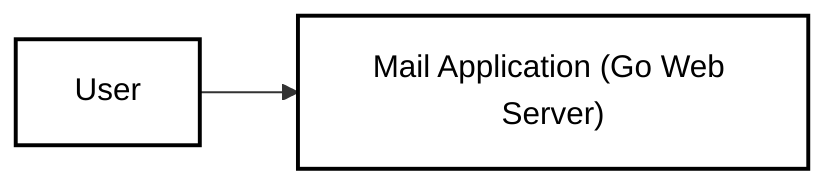
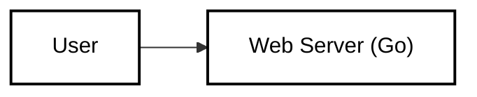
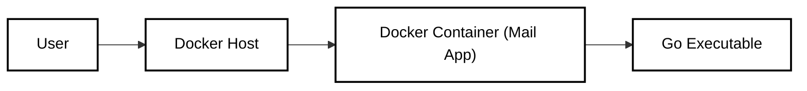
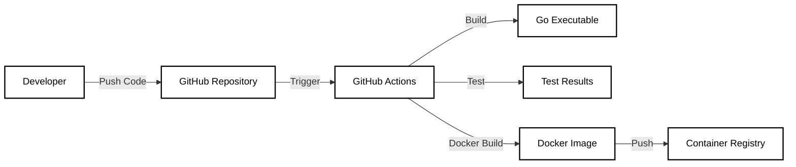

Okay, let's create a design document for the `mail` project (a simple Go web server) from the provided GitHub repository, keeping in mind the threat modeling context.

# BUSINESS POSTURE

Business Priorities and Goals:

*   Provide a simple, functional web application demonstrating basic Go web server capabilities.  This appears to be a learning/demonstration project rather than a production-ready application.
*   Offer a minimal, easily deployable example.
*   Potentially serve as a foundation for more complex web applications.

Most Important Business Risks:

*   Since this is likely a demonstration project, the primary risk is misrepresenting the security posture of the application.  If someone were to use this as a starting point for a production system *without* significant security enhancements, it would expose them to substantial risk.  It's crucial to clearly communicate the non-production-ready nature of the code.
*   Vulnerabilities in the application, even if a demo, could be exploited to compromise the host system or network it's running on, especially if deployed carelessly.
*   Lack of proper error handling and input validation could lead to unexpected behavior or crashes, hindering its usefulness as a learning tool.

# SECURITY POSTURE

Existing Security Controls:

*   security control: The code uses Go's built-in `net/http` package, which provides some inherent protection against certain web vulnerabilities (e.g., compared to writing a raw socket server). Implemented in Go standard library.
*   security control: The server listens on a specific port (8080), limiting exposure compared to listening on all interfaces. Described in `main.go`.

Accepted Risks:

*   accepted risk: The application lacks any form of authentication or authorization.  It's assumed that access control will be managed externally (e.g., by network firewalls) if necessary.
*   accepted risk: There is no input validation. The `/` endpoint simply returns a hardcoded string.  If the application were to handle user input, this would be a major vulnerability.
*   accepted risk: There is no error handling beyond the basic `log.Fatal(http.ListenAndServe(...))`.  More robust error handling would be needed for a production system.
*   accepted risk: The application does not use HTTPS. All communication is unencrypted.
*   accepted risk: No protection against common web vulnerabilities (XSS, CSRF, SQLi, etc.) is implemented, as the application doesn't handle user input or interact with a database.
*   accepted risk: No security headers (e.g., HSTS, Content Security Policy) are set.
*   accepted risk: Dependencies are not explicitly managed or scanned for vulnerabilities.
*   accepted risk: No logging or auditing is implemented.

Recommended Security Controls (High Priority):

*   security control: Implement HTTPS using TLS certificates. This is crucial for any web application, even for demonstration purposes, to protect against eavesdropping.
*   security control: Add basic security headers (e.g., HSTS, Content Security Policy, X-Frame-Options) to mitigate common web vulnerabilities.
*   security control: If the application is expanded to handle user input, implement robust input validation and sanitization.
*   security control: Implement proper error handling and logging.
*   security control: Use a dependency management tool (like Go Modules) and scan dependencies for known vulnerabilities.
*   security control: Consider adding a simple linter to the build process to catch potential security issues early.

Security Requirements:

*   Authentication:  Currently not required. If user-specific functionality is added, a secure authentication mechanism (e.g., OAuth 2.0, OpenID Connect) should be implemented.
*   Authorization: Currently not required. If roles or permissions are introduced, a robust authorization system should be implemented.
*   Input Validation:  Crucially important if the application is modified to accept user input.  All input should be validated against a strict whitelist of allowed characters and formats.
*   Cryptography:  HTTPS (TLS) should be used for all communication.  If sensitive data is stored or processed, appropriate encryption mechanisms should be used.

# DESIGN

## C4 CONTEXT

C4 Context Element List:

*   Element:
    *   Name: User
    *   Type: Person
    *   Description: A user interacting with the Mail Application via a web browser.
    *   Responsibilities: Accessing the web application's endpoints.
    *   Security controls: None (relies on the application's security controls).

*   Element:
    *   Name: Mail Application (Go Web Server)
    *   Type: Software System
    *   Description: A simple Go web server that responds to HTTP requests.
    *   Responsibilities: Serving a single endpoint ("/") that returns a "Hello, World!" message.
    *   Security controls: Basic security provided by the Go `net/http` package; listens on a specific port.

## C4 CONTAINER

C4 Container Element List:

*   Element:
    *   Name: User
    *   Type: Person
    *   Description: A user interacting with the Mail Application via a web browser.
    *   Responsibilities: Accessing the web application's endpoints.
    *   Security controls: None (relies on the application's security controls).

*   Element:
    *   Name: Web Server (Go)
    *   Type: Container (Go executable)
    *   Description: The Go web server built from `main.go`.
    *   Responsibilities: Handling HTTP requests and returning responses.
    *   Security controls: Basic security provided by the Go `net/http` package; listens on a specific port.

## DEPLOYMENT

Possible Deployment Solutions:

1.  Bare-metal server or Virtual Machine (VM): The Go executable can be directly deployed to a server and run as a process.
2.  Containerized deployment (Docker): The Go application can be packaged into a Docker container and deployed to any Docker-compatible environment (e.g., Kubernetes, Docker Swarm, cloud provider container services).
3.  Serverless deployment (e.g., AWS Lambda, Google Cloud Functions): While this example is a simple HTTP server, it could be adapted to fit a serverless model, although it's not the most natural fit.

Chosen Deployment Solution (Docker):

Deployment Element List:

*   Element:
    *   Name: User
    *   Type: Person
    *   Description: A user interacting with the deployed Mail Application.
    *   Responsibilities: Accessing the web application.
    *   Security controls: None (relies on the application and network security).

*   Element:
    *   Name: Docker Host
    *   Type: Infrastructure Node (Server/VM)
    *   Description: A server or VM running the Docker engine.
    *   Responsibilities: Hosting and running Docker containers.
    *   Security controls: Operating system security, firewall, potentially intrusion detection/prevention systems.

*   Element:
    *   Name: Docker Container (Mail App)
    *   Type: Container
    *   Description: A Docker container running the Go web server.
    *   Responsibilities: Isolating the Go application and its dependencies.
    *   Security controls: Container isolation, potentially restricted resource access (CPU, memory).

*   Element:
    *   Name: Go Executable
    *   Type: Application
    *   Description: The compiled Go web server binary.
    *   Responsibilities: Handling HTTP requests.
    *   Security controls: Basic security provided by the Go `net/http` package.

## BUILD

The build process is very simple for this project.  There's no explicit build system (like Makefiles or CI pipelines) defined in the repository.

Build Process (Manual):

1.  Developer writes Go code (`main.go`).
2.  Developer uses the Go compiler (`go build`) to create an executable.
3.  (Optional) Developer creates a Dockerfile to package the executable into a container.
4.  (Optional) Developer builds a Docker image using `docker build`.

Build Process (with GitHub Actions - Recommended):

Security Controls in Build Process:

*   security control: (Recommended) Use GitHub Actions (or similar CI/CD) to automate the build and testing process.
*   security control: (Recommended) Integrate a linter (e.g., `golangci-lint`) into the build process to catch potential code quality and security issues.
*   security control: (Recommended) Integrate a static analysis security testing (SAST) tool (e.g., `gosec`) to scan for potential vulnerabilities.
*   security control: (Recommended) If using Docker, use a minimal base image (e.g., `scratch` or `alpine`) to reduce the attack surface.
*   security control: (Recommended) Scan the Docker image for vulnerabilities using a container scanning tool (e.g., Trivy, Clair).
*   security control: (Recommended) Sign the Docker image to ensure its integrity.
*   security control: (Recommended) Use a secure container registry (e.g., Docker Hub with private repositories, AWS ECR, Google Container Registry) to store the built image.

# RISK ASSESSMENT

Critical Business Processes:

*   For this demo project, there are no *critical* business processes in the traditional sense.  The "process" is simply serving a static "Hello, World!" response.  If this were a real application, the critical processes would depend on its functionality (e.g., handling user data, processing payments, etc.).

Data to Protect and Sensitivity:

*   Currently, the application does not handle any user data or sensitive information.  If it were expanded, the data to protect would depend on the application's purpose.  Examples:
    *   Usernames, passwords, email addresses (highly sensitive)
    *   Personal information (PII) (highly sensitive)
    *   Financial data (highly sensitive)
    *   Application configuration data (potentially sensitive)
    *   Logs (potentially sensitive, depending on what's logged)

# QUESTIONS & ASSUMPTIONS

Questions:

*   What is the intended long-term purpose of this project?  Is it purely for demonstration, or will it be evolved into a more complex application?
*   What is the target deployment environment? (This influences the choice of deployment solution and security considerations.)
*   What level of traffic is expected? (This impacts scalability and performance requirements.)
*   Are there any specific compliance requirements (e.g., GDPR, HIPAA)?

Assumptions:

*   BUSINESS POSTURE: The project is primarily for learning and demonstration purposes.  It is not intended for production use without significant security enhancements.
*   SECURITY POSTURE:  The current security posture is very weak.  It's assumed that anyone using this code understands the risks and will implement appropriate security controls if they adapt it for a real-world application.
*   DESIGN: The design is extremely simple, reflecting the minimal functionality of the application.  It's assumed that the design will evolve significantly if the application's functionality is expanded.