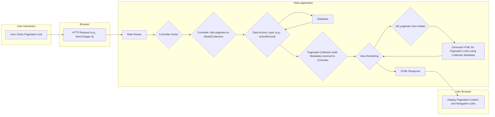

## Project Design Document: will_paginate Gem (Improved)

**1. Introduction**

This document provides an enhanced design overview of the `will_paginate` Ruby gem, a widely adopted pagination solution for Ruby on Rails and other Rack-based Ruby web applications. Located at [https://github.com/mislav/will_paginate](https://github.com/mislav/will_paginate), this gem streamlines the process of dividing large datasets into discrete, navigable pages. This detailed design aims to offer a robust understanding of the gem's internal workings, component interactions, and data flow, specifically tailored to facilitate thorough threat modeling.

**2. Goals and Objectives**

The core objectives of the `will_paginate` gem are:

* **Simplified Pagination API:** To offer a straightforward and developer-friendly interface for implementing pagination in Ruby web applications.
* **Flexible Presentation:** To provide extensive customization options for the visual presentation and behavior of pagination controls.
* **Seamless ORM Integration:** To integrate effortlessly with popular Ruby Object-Relational Mappers (ORMs) such as ActiveRecord, and other data mapping libraries.
* **Performance Efficiency:** To handle pagination of large datasets efficiently, minimizing performance overhead.
* **Comprehensive Documentation:** To be accompanied by clear and comprehensive documentation, making it easy for developers to understand and use.

**3. Scope**

This design document focuses specifically on the internal architecture, functionality, and configuration of the `will_paginate` gem itself. It explicitly excludes:

* **Consumer Applications:** The specific Ruby on Rails or Rack applications that integrate and utilize the `will_paginate` gem.
* **Underlying Data Stores:** The database systems or other data storage mechanisms employed by applications using the gem.
* **External Dependencies (Application Level):**  Libraries or gems used by applications alongside `will_paginate`, unless they are integral parts of the gem's implementation.
* **Application-Specific Security:** Security considerations of applications using `will_paginate` beyond the direct functionality and configuration of the gem.

**4. Architectural Overview**

`will_paginate` primarily operates within the Model-View-Controller (MVC) pattern prevalent in Ruby on Rails applications, with its core functionality spanning the view and controller layers. It offers helper methods for rendering pagination controls in views and methods for preparing data for pagination in controllers. The gem's architecture is designed around extending and wrapping collections of data to provide pagination metadata.

**5. Component Breakdown**

* **View Helpers:**
    * **Purpose:** These are the primary points of interaction for developers within their application's views (e.g., ERB, Haml, Slim).
    * **Functionality:** Responsible for generating the HTML markup for pagination links, including "Previous", "Next", and individual page numbers.
    * **Key Helpers:** `will_paginate` and `paginate`. `will_paginate` is often used for more direct control, while `paginate` provides a more conventional output.
    * **Input:** Accepts a paginated collection object as input.
    * **Customization:** Offers numerous options for customizing the appearance and behavior of the pagination links, such as link labels, CSS classes, and the number of displayed page links.

* **Controller Integration Methods:**
    * **Purpose:** Facilitate the preparation of data for pagination within controller actions.
    * **Key Method:** The `paginate` method, often invoked on ActiveRecord relations or other enumerable collections.
    * **Parameters:** Accepts parameters like `page` (current page number) and `per_page` (number of items per page) to determine the subset of data to retrieve. These parameters are typically derived from the HTTP request.
    * **Data Access Interaction:**  Interacts with the underlying data access layer (e.g., ActiveRecord) to execute database queries with appropriate `LIMIT` and `OFFSET` clauses, efficiently retrieving only the data for the requested page.

* **Collection Extension/Wrapper (`WillPaginate::Collection`):**
    * **Purpose:** When `paginate` is called, it often wraps or extends the original collection object (e.g., an `ActiveRecord::Relation`).
    * **Metadata Storage:** This extended collection object holds essential metadata about the pagination state.
        * `current_page`:  The currently displayed page number.
        * `per_page`: The configured number of items to display per page.
        * `total_entries`: The total number of items in the original, unpaginated collection.
        * `total_pages`: The calculated total number of pages based on `total_entries` and `per_page`.
    * **Information Source:** This metadata is subsequently used by the view helpers to accurately generate the pagination links.

* **Configuration Options:**
    * **Purpose:** Allow developers to customize the global or per-call behavior of `will_paginate`.
    * **Setting Scope:** Can be set globally within an initializer or passed as options directly to the view helpers.
    * **Examples:**
        * `per_page`:  Sets the default number of items displayed per page (e.g., `WillPaginate.per_page = 30`).
        * `inner_window`:  Determines the number of page links displayed around the current page number.
        * `outer_window`:  Specifies the number of page links displayed at the beginning and end of the pagination range.
        * `previous_label`, `next_label`:  Customizes the text displayed for the "Previous" and "Next" links.
        * `param_name`:  Changes the name of the query parameter used to specify the current page (default is `page`). **Security Note:** Modifying this can have implications for predictable URL patterns.

**6. Data Flow**

**Detailed Data Flow Description:**

1. **User Interaction:** A user interacts with the pagination controls on a webpage, typically by clicking on a specific page number or the "Previous" or "Next" link.
2. **HTTP Request:** This interaction triggers an HTTP request from the user's browser to the server. The request URL will typically include a query parameter indicating the desired page number (e.g., `?page=3`).
3. **Rails Router:** The Rails router within the application intercepts the incoming HTTP request and routes it to the appropriate controller action based on the defined routes.
4. **Controller Action:** The designated controller action receives the request, including the pagination parameters extracted from the URL (e.g., `params[:page]`).
5. **Controller calls `paginate`:** Inside the controller action, the `paginate` method is invoked on a collection of data (often an `ActiveRecord::Relation`). This method utilizes the provided pagination parameters (like `params[:page]`) to determine the specific subset of data to be retrieved for the current page.
6. **Data Access Layer:** The `paginate` method interacts with the underlying data access layer (e.g., ActiveRecord). It constructs and executes a database query, incorporating `LIMIT` and `OFFSET` clauses to fetch only the records relevant to the requested page.
7. **Database:** The database system executes the query and returns the corresponding subset of data.
8. **Paginated Collection Returned:** The data access layer returns the paginated subset of data to the controller. This data is often wrapped in a `WillPaginate::Collection` object, which also contains the pagination metadata (current page, total pages, etc.).
9. **View Rendering:** The controller action passes the paginated collection (including the metadata) to the view for rendering.
10. **`will_paginate` View Helper:** Within the view template, the `will_paginate` helper method is called, with the paginated collection object passed as an argument.
11. **Generate HTML for Pagination Links:** The `will_paginate` helper uses the pagination metadata contained within the collection object to dynamically generate the HTML markup for the pagination links. This includes calculating the visible page numbers, "Previous" and "Next" links, and applying any configured styling or labels.
12. **HTML Response:** The view is rendered, incorporating the generated pagination links, and a complete HTML response is sent back to the user's browser.
13. **Display Paginated Content:** The user's browser receives the HTML response and displays the paginated content along with the navigation links, allowing the user to navigate to other pages.

**7. Security Considerations (for Threat Modeling)**

The following security considerations are crucial when assessing the potential threats associated with the `will_paginate` gem:

* **Unvalidated Page Parameter:**
    * **Threat:** Users can directly manipulate the `page` parameter in the URL to request arbitrary page numbers. Without proper validation, this could lead to unexpected behavior, errors, or potentially expose internal application logic.
    * **Mitigation:** Implement robust server-side validation to ensure the `page` parameter is a positive integer within a valid range (e.g., not exceeding the `total_pages`). Handle out-of-range requests gracefully, such as redirecting to the first or last page or displaying an error message.

* **Unvalidated `per_page` Parameter (If Exposed):**
    * **Threat:** If the application allows users to control the number of items displayed per page (via a `per_page` parameter), malicious users could request extremely large values. This could lead to excessive database queries, memory exhaustion, and ultimately a denial-of-service (DoS) condition.
    * **Mitigation:** If exposing a `per_page` parameter, enforce strict validation and limits on the allowed values. Define a reasonable maximum value and reject requests exceeding this limit.

* **Information Disclosure through Pagination Logic:**
    * **Threat:**  Errors or misconfigurations in the pagination logic could inadvertently expose more data than intended. For example, incorrect `OFFSET` calculations could lead to overlapping data being displayed on different pages or revealing data from beyond the intended dataset.
    * **Mitigation:** Thoroughly test the pagination implementation with various data sizes and edge cases. Review the generated database queries to ensure they correctly implement the intended pagination logic and do not inadvertently retrieve or expose sensitive information.

* **Indirect SQL Injection via Parameter Manipulation (Less Likely with ORMs):**
    * **Threat:** While `will_paginate` typically works with ORMs that provide protection against direct SQL injection, vulnerabilities could arise if custom SQL queries are used in conjunction with pagination logic and user-supplied parameters are not properly sanitized.
    * **Mitigation:**  Adhere to secure coding practices when constructing database queries. Utilize parameterized queries or ORM features that automatically handle input sanitization. Avoid directly embedding user-supplied values into raw SQL strings.

* **Denial of Service (DoS) through Resource Exhaustion:**
    * **Threat:**  Attackers could repeatedly request pages with very high numbers or excessively large `per_page` values (if allowed), potentially overwhelming server resources (CPU, memory, database connections).
    * **Mitigation:** Implement rate limiting to restrict the number of requests from a single IP address within a given timeframe. Monitor server resource usage and implement appropriate safeguards to prevent resource exhaustion.

* **Cross-Site Scripting (XSS) in Custom Pagination Link Generation (If Implemented):**
    * **Threat:** If the application implements custom logic for generating pagination links and incorporates user-supplied data without proper output encoding, it could be vulnerable to XSS attacks.
    * **Mitigation:**  Ensure proper output encoding of any user-generated content that is incorporated into pagination links. However, this is less of a direct concern for the core `will_paginate` gem, which primarily generates standard pagination links.

**8. Technologies Used**

* **Ruby:** The primary programming language in which the gem is developed.
* **Rack:** A foundational interface between web servers and Ruby web frameworks.
* **Ruby on Rails (or other Rack-based Frameworks):** The primary environments where `will_paginate` is typically utilized.
* **ActiveRecord (or other ORMs/Data Mappers):**  Used for interacting with databases and retrieving data to be paginated.
* **HTML:** The markup language used to render the pagination links in the user interface.

**9. Deployment**

`will_paginate` is deployed as a standard Ruby gem within a Ruby on Rails or other compatible Rack-based application. It is added as a dependency to the application's `Gemfile` and installed using the Bundler dependency management tool (`bundle install`). No separate deployment process is required for the gem itself.

**10. Future Considerations (Potential Enhancements)**

* **Enhanced Accessibility Features:**  Further improvements to the accessibility of generated pagination links, including the use of appropriate ARIA attributes and semantic HTML.
* **Improved AJAX Integration:**  More streamlined and built-in support for updating paginated content via AJAX without full page reloads.
* **More Granular Link Customization:**  Increased flexibility in customizing the rendering of individual pagination links, potentially through block helpers or template customization options.
* **Performance Optimizations for Very Large Datasets:** Continued efforts to optimize database queries and data retrieval for scenarios involving extremely large datasets.
